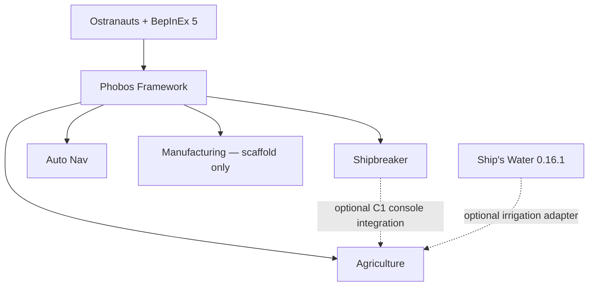

# Phobos Ostranauts

Community mods for making a ship a home: navigation, salvage, recycling,
shipboard farming and the machinery that keeps a crew going in hostile space.

**Welcome! This is an experimental development project, not a stable mod pack.**
There are currently no published installable GitHub releases. **Code → Download
ZIP** gives you source files, not ready-to-play mods. Start with
[getting started](docs/getting-started.md) before installing anything.

## Choose your starting point

- **New player:** [Getting started](docs/getting-started.md) →
  [installation](docs/installing-mods.md) → [player guide](docs/player-guide.md).
- **Already playing:** [Troubleshooting and help](SUPPORT.md),
  [equipment and prices](docs/equipment-economy.md), or
  [known limits](docs/getting-started.md#what-to-expect).
- **Mod author or contributor:** [Contributing](CONTRIBUTING.md),
  [building from source](docs/building.md), and [Framework API](docs/framework-author-guide.md).
- **Curious about the plans:** [Documentation library](docs/README.md) and
  [long-term direction](docs/project-direction.md).

## The mods

These are source/prepared-package versions as of **25 September 2026**, not
published-release or installed-version claims. Current build baseline:
**Ostranauts 1.0.1.5 / BepInEx 5.4.23.5**; other versions are unverified.

| Mod | Version | What it does | Status / guide |
| --- | --- | --- | --- |
| **Phobos Framework** | 0.17.0 | Shared construction, inventory, controls and saved state | Required by content mods; [author guide](docs/framework-author-guide.md) |
| **Phobos Shipbreaker** | 0.15.0 | Detached-wall processing, metal recovery, material routing, industrial console and electric furnace | Experimental; [player guide](docs/player-guide.md), [furnace](docs/furnace-player-guide.md) |
| **Phobos Auto Nav** | 0.10.1 | Polaris navigation module with approach, braking and separate RCS docking | Earlier guidance has owner-reported gameplay success; current features need evaluation; [guide](docs/auto-navigate-adaptation.md) |
| **Phobos Agriculture** | 0.3.0 | Potato/lettuce cultivation, visible growth and galley cooking | First gameplay candidate; [guide](docs/agriculture-player-guide.md) |
| **Phobos Manufacturing** | 0.0.1 | Research and buildable scaffold for future machining | **No operational machinery yet**; [scope](docs/manufacturing-implementation.md) |

Approach Assist is a historical pulse-only prototype, excluded from the default
installation. Medical systems, asteroid life-support processing and external
hull cutting remain proposals. A successful build is not an in-game test.

Solid arrows show required runtime foundations; dotted arrows show optional
integrations. Pick the content you want. Auto Navigate, Ostranauts Crafting
Framework and Salvage Workshop are not required. Keep providers your other mods
or saved content still need.

## Help shape the project

Questions, bug reports, documentation fixes and translations are welcome. You do
not need to write code to contribute. Use
[Issues](https://github.com/phobos-dthorga/phobos-ostranauts/issues/new/choose)
and read [support guidance](SUPPORT.md) before sharing logs. Please be patient
and kind; this is a small community project with no guaranteed response time.

## Credits and reuse

Independent community project by **Phobos A. D'thorga (phobosgekko)**.
[Ostranauts](https://bluebottlegames.com/games/ostranauts) is developed by
**Blue Bottle Games** and published by **Kitfox Games**. This project is not
affiliated with or endorsed by them.

Original Phobos work is covered by [LICENSE](LICENSE), with the exclusions
stated there. Auto Nav includes guidance adapted from **Gravy / mrkmg's
[Auto Navigate](https://steamcommunity.com/sharedfiles/filedetails/?id=3745533691)**;
its upstream reuse terms remain unverified and those portions are **not covered
by our MIT grant**. Credit is not a claim of permission. Read
[third-party notices](THIRD_PARTY_NOTICES.md) before redistributing.

Framework retains attribution to **Ostranauts Crafting Framework contributors**
and their [MIT notice](mods/PhobosFramework/licenses/CraftingFramework-MIT.md).
[Phobos Scope](https://github.com/phobos-dthorga/phobos-scope) supplies the opt-in
recorder. [Artwork records](assets) disclose AI assistance, retained masters and
export steps. Game binaries, saves and extracted artwork are not included.
Research attribution and gameplay simplifications appear beside the relevant
claims; no research institution endorses these mods.
