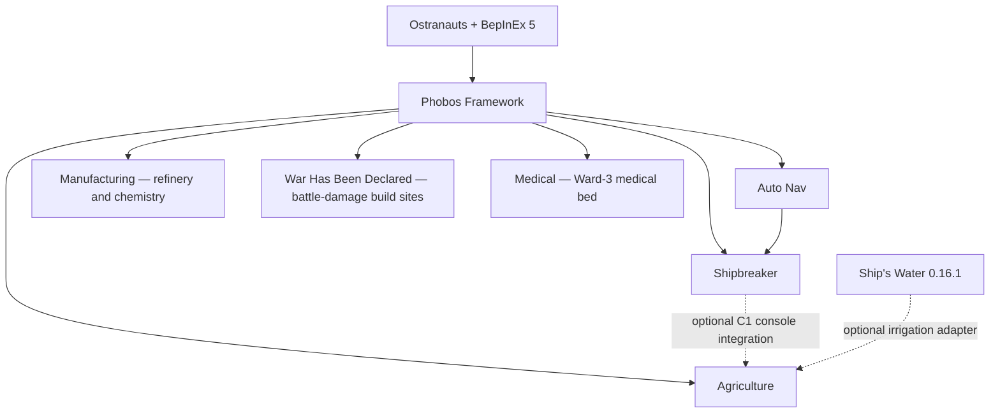

# Phobos Ostranauts

Auto Nav 0.18.0 adds [local obstacle avoidance and explicit departure](docs/auto-nav-departure.md).
Shipbreaker 0.24.0 adds [powered G4 reclamation with automatic release, traversal
and recapture](docs/shipbreaker-reclamation.md), requiring Framework 0.24.0.
Existing equipment identities and artwork are retained. Owner gameplay evaluation
is separate from the automated checks.

[Per-mod equipment and item references](docs/item-references.md) cover use, acquisition, prices, repair and salvage.

Community mods for making a ship a home: navigation, salvage, recycling,
shipboard farming and the machinery that keeps a crew going in hostile space.

**Welcome! This is an experimental development project, not a stable mod pack.**
The mods are being prepared for the Steam Workshop; no Workshop item or installable
GitHub release is published yet. **Code → Download ZIP** gives you source files,
not ready-to-play mods. Start with
[getting started](docs/getting-started.md) before installing anything.

## Choose your starting point

- **New player:** [Getting started](docs/getting-started.md) →
  [installation](docs/installing-mods.md) → [player guide](docs/player-guide.md).
- **Already playing:** [Troubleshooting and help](SUPPORT.md),
  [equipment and prices](docs/equipment-economy.md), or
  [known limits](docs/getting-started.md#what-to-expect).
- **Mod author or contributor:** [Contributing](CONTRIBUTING.md),
  [building from source](docs/development/building.md), and [Framework API](docs/development/framework-author-guide.md).
- **Curious about the plans:** [Documentation library](docs/README.md) and
  [long-term direction](docs/development/project-direction.md).

## The mods

These are source/prepared-package versions as of **25 September 2026**, not
published-release or installed-version claims. Current build baseline:
**Ostranauts 1.0.1.5 / BepInEx 5.4.23.5**; other versions are unverified.

| Mod | Version | What it does | Status / guide |
| --- | --- | --- | --- |
| **Phobos Framework** | 0.118.0 | Shared construction, inventory, controls and saved state | Required by content mods; [author guide](docs/development/framework-author-guide.md) |
| **Phobos Shipbreaker** | 0.83.0 | Captured-wall reclamation and detached-wall processing, metal recovery, material routing, industrial console and electric furnace | Experimental; [player guide](docs/player-guide.md), [furnace](docs/furnace-player-guide.md) |
| **Phobos Auto Nav** | 0.34.0 | Shared Polaris hub: N1 navigation/docking, N2 pursuit and N3 limited volleys/optional aiming | Earlier guidance has owner-reported gameplay success; current features need evaluation; [guide](docs/development/auto-navigate-adaptation.md) |
| **Phobos Agriculture** | 0.63.0 | Potato/lettuce cultivation, visible growth, nutrient-solution piping and galley cooking | First gameplay candidate; [guide](docs/agriculture-player-guide.md) |
| **Phobos Manufacturing** | 0.56.1 | Fennmark V4 refinery, X2 water electrolysis processor, K2 Sabatier reactor, Tolvane AX-2 ammonia cracker, Lixivar LC-3 leach unit and SA-3 acid plant, Oxsmith EC-4 rock electrolysis cell and CR-4 carbothermal reactor, gas and acid stores in three sizes, L2 canister filling station, A2 cabin air regulator and P1 RCS manifold: mined ore into water, metal stock, oxygen, ammonia, fertiliser salts, sulfuric acid, cabin air, bottled gas and thruster propellant | Requires Framework 0.116.0; water from an S3 or R3; [player guide](docs/manufacturing-player-guide.md) |
| **Phobos' War Has Been Declared** | 0.3.0 | Battle stations log parts destroyed on your ships; standing down lays the game's own build sites where they stood, filtered by player-editable rebuild schematics | Requires Framework 0.104.0; no items; [player guide](docs/war-declared-player-guide.md) |
| **Phobos Medical** | 0.5.0 | Halewright Ward-3 medical bed: lay an unconscious casualty in it, let the injured rest awake, or sleep; powered care with the game's own medical-rest healing, stopping when the power does | Requires Framework 0.111.0; uses the vanilla bed's art for now; [player guide](docs/medical-player-guide.md) |
| **Phobos Spacer Stories** | 0.2.0 | Data-only story collection: company histories, TV news and adverts, crew talk, loading lore, encyclopedia articles and nine correspondence chains with archive files on data cards | Requires Framework 0.114.0; held for in-game review; [authoring record](docs/development/spacer-stories-authoring.md) |

Approach Assist has been retired and removed; its prototype remains in Git history. Phobos Medical's monitor, medic care and autodoc, and asteroid life-support processing, remain proposals.
External hull cutting is bounded to supported ordinary walls; broader structural
processing remains proposed. A successful build is not an in-game test.

```mermaid
flowchart TD
    Game["Ostranauts + BepInEx 5"] --> Framework["Phobos Framework"]
    Framework --> Shipbreaker["Shipbreaker"]
    Framework --> AutoNav["Auto Nav"]
    AutoNav --> Shipbreaker
    Framework --> Agriculture["Agriculture"]
    Framework --> Manufacturing["Manufacturing — refinery and chemistry"]
    Framework --> WarDeclared["War Has Been Declared — battle-damage build sites"]
    Framework --> Medical["Medical — Ward-3 medical bed"]
    Shipbreaker -. "optional C1 console integration" .-> Agriculture
    Water["Ship's Water 0.16.1"] -. "optional irrigation adapter" .-> Agriculture
```

Solid arrows show required runtime foundations; dotted arrows show optional
integrations. Pick the content you want. Auto Navigate, Ostranauts Crafting
Framework and Salvage Workshop are not required. Keep providers your other mods
or saved content still need.

## Help shape the project

Questions, bug reports, documentation fixes and translations are welcome. You do
not need to write code to contribute. Use
[Issues](https://github.com/phobos-dthorga/phobos-ostranauts/issues/new/choose)
and read [support guidance](SUPPORT.md) before sharing logs. Please be patient
and kind; this is a small community project with no guaranteed response time.

## Credits and reuse

Independent community project by **Phobos A. D'thorga (phobosgekko)**.
[Ostranauts](https://bluebottlegames.com/games/ostranauts) is developed by
**Blue Bottle Games** and published by **Kitfox Games**. This project is not
affiliated with or endorsed by them.

Original Phobos work is covered by [LICENSE](LICENSE), with the exclusions
stated there. Auto Nav includes guidance adapted from **Gravy / mrkmg's
[Auto Navigate](https://steamcommunity.com/sharedfiles/filedetails/?id=3745533691)**;
its upstream reuse terms remain unverified and those portions are **not covered
by our MIT grant**. Credit is not a claim of permission. Read
[third-party notices](THIRD_PARTY_NOTICES.md) before redistributing.

Framework retains attribution to **Ostranauts Crafting Framework contributors**
and their [MIT notice](mods/PhobosFramework/licenses/CraftingFramework-MIT.md).
[Phobos Scope](https://github.com/phobos-dthorga/phobos-scope) supplies the opt-in
recorder. [Artwork records](assets) disclose AI assistance, retained masters and
export steps. Game binaries, saves and extracted artwork are not included.
Research attribution and gameplay simplifications appear beside the relevant
claims; no research institution endorses these mods.
