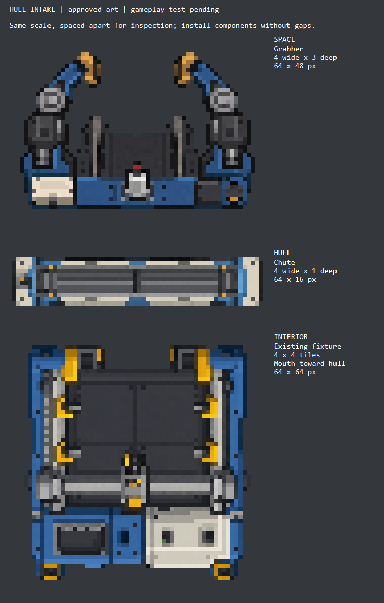

# Hull chute and exterior grabber concepts

**Visual direction approved by the owner on 24 September 2026.** Preserve these
intact designs when deriving production forms. Approval concerns appearance;
mounting and transfer behaviour now have a 0.3.0 implementation awaiting gameplay testing.

24 September 2026. Original concepts generated with ChatGPT's built-in Imagegen
tool for the owner's hull-intake proposal. Shipbreaker 0.3.0 packages mechanical
exports of these approved masters. This is not a claim of verified in-game operation.

| Component | Proposed footprint | Master | Scale preview |
| --- | --- | --- | --- |
| Hull chute | Four wide along hull, one deep | [1254 x 1254 RGBA](source/PhobosHullChute-concept-v1.png) | [64 x 16](previews/HullChute-v1-world.png) |
| Exterior grabber | Four wide, three deep (recommended) | [1448 x 1086 RGBA](source/PhobosExteriorGrabber-concept-v1.png) | [64 x 48](previews/ExteriorGrabber-v1-world.png) |

The chute is a closed shutter and mounting collar with simple end actuators.
The grabber has two static clamp arms, large hinges, a dark captive bed and a small
central cutting head; the cream service cover and blue frame relate it to the
existing fixture. Electrical conduit is separate. The grabber's central head is
drawn as an idle welder-like laser unit, not a permanent flame or animated beam.

The masters and the actual-size pixel reductions were visually inspected. Arms,
head and chute remain distinguishable at those sizes; fasteners and vent details
simplify substantially. The comparison enlarges each world pixel eight times,
without smoothing, and rotates the existing fixture 180 degrees so its loading
mouth faces the proposed chute. Components are spaced apart for inspection; this
is not a verified assembly screenshot or exact socket alignment.

## Reproduce and limits

Run `scripts/export-hull-intake-concepts.ps1`. It checks master SHA-256 hashes from
[sources.json](sources.json), exports two rectangular previews and their eightfold
enlargements, and composes the comparison using our existing fixture sprite.
Without arguments it changes only previews. `-Runtime` also exports six files into
the mod: a colour texture, flat technical normal map and padded 256 x 256 portrait
per component. The build calls this mode. Neither mode modifies installed files or saves.

The chute's square master is cropped to the recorded central 1254 x 314 region
before nearest-neighbour reduction. This removes surrounding empty canvas and
35 faint generated alpha specks (all below 128); no pixels with alpha >=128 lie
outside that crop. Its painted silhouette is shallower than the full one-tile
canvas. The grabber uses its complete 4:3 canvas. Generated alpha within both
regions is retained in preview-only mode. Runtime mode thresholds alpha at 128,
retains RGB and uses nearest-neighbour scaling. Installed/loose/damaged definitions
currently share each approved static assembly; native damage tint and names identify
damage. Bespoke damage/transport forms remain future art work. Flat normals avoid
inventing geometry from paint brightness.

## Provenance

Exact prompts are in [prompts.md](prompts.md). Each component was generated in one
built-in Imagegen call from its written brief, with no image input. The brief was
informed by the project's approved original sprites and the equipment study.
Unmodified masters are preserved here; mechanical previews do not repaint RGB.
Native towing-brace definitions were read only as mounting research; no game
texture, assembly or decompiled source is included in these assets.

Original project artwork and mechanical derivatives fall within the repository's
MIT scope. No exclusive rights in generated imagery or rights over Ostranauts
artwork are claimed.

See the [design and implementation boundaries](../../docs/shipbreaker-hull-intake.md).
