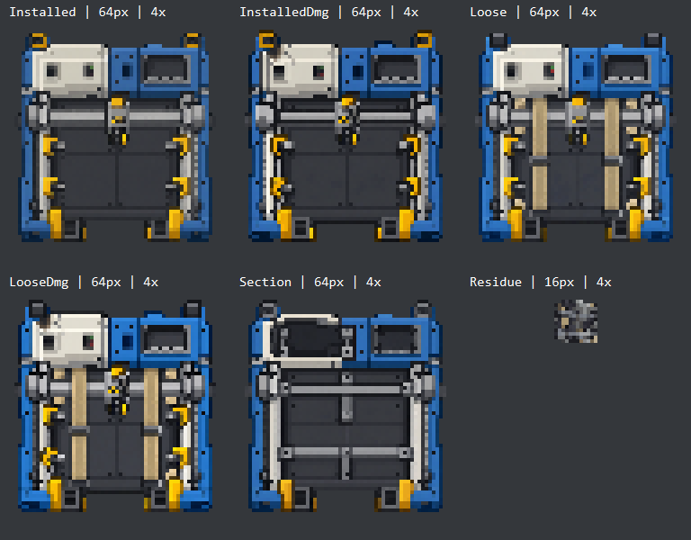

# Phobos Shipbreaker artwork

## Production set — 24 September 2026, Shipbreaker 0.1.4

The approved v2 installed master now supplies the game's intact colour texture.
Imagegen produced matching damaged, transport, damaged-transport, unfinished
section and residue masters. See [exact derivation prompts](production-prompts.md)
and [source filenames, sizes and SHA-256 hashes](sources.json). Only the installed
v2 direction has explicit owner visual approval; the remaining authorised forms
were reviewed at exported size and await the owner's normal in-game inspection.

The four fixture states and 80 kg section use 64 × 64 world PNGs, preserving the
4 × 4 footprint. The 13 kg residue uses 16 × 16, matching the inherited one-tile
bounds. Every form has a same-size normal map and a 256 × 256 portrait enlarged
from the actual world pixels. The output inventory is still 8 × 8; it is not a
second external machine. The feed attachment's native `Blank` image is invisible
and requires no additional sprite. Conduit remains separately placed equipment.

`scripts/export-shipbreaker-art.ps1` verifies every master hash, samples the full
square canvas with nearest-neighbour filtering, and thresholds alpha at 128.
Material becomes opaque and the outline transparent, without repainting RGB.
No state is independently cropped or recentered. The original master and approved
concept previews remain unchanged. Run this script to reproduce all 18 files in
`mods/PhobosShipbreaker/images/phobos/shipbreaker/`; the build runs it too.

Normals are original technical shader data from a restrained geometric height
field: low bed, frame, rails, casing and gantry, with matching broad differences
for transport and unfinished forms. Residue receives only a modest outline bevel.
They do not convert paint brightness into relief, and are not measured 3D geometry.
The PNG green channel follows the inspected game's `NormalPNGtoDXTnm` inversion.
Normal intensity, rotation and appearance alongside game lighting still need an
in-game look; a successful build cannot establish those results.

The colour images deliberately contain no live text. Tiny painted indicators,
socket caps and transport restraints are static visual details, without new state
or mass accounting. The residue's binding strips represent its retained material,
not a newly manufactured container. Material recipes, saved IDs, physical sizes
and processing behaviour remain unchanged. Normal native damage/repair changes
the existing machine states; damaged shader references are explicitly paired.
Section/residue have no dedicated damaged variant and use `blank` damage input.

### Verification recorded for 0.1.4

- Clean build against the local Ostranauts 1.0.1.4 references; 3,773 existing
  offline processing/dependency checks passed. The removed placeholder dependency
  reduces the prior check count by one.
- All 18 packaged PNGs match their exports. Dimensions, binary alpha, normal-vector
  lengths and exact nearest-neighbour portraits were checked. Intact material RGB
  matches the approved 64-pixel preview; opacity is the deliberate export change.
- Installed/damaged silhouettes overlap by 97.24%; loose/damaged by 98.80%.
  Major bounds are shared, with up to one pixel of top-edge variation. No independent
  recentering or rescaling is applied to hide those generated differences.
- 47 multi-mod and 23 legacy installer checks passed on synthetic folders.
  The new missing-normal preflight prevents a partial multi-mod installation;
  interruption recovery now checks the actual file manifest instead of an old count.
- The real-installation preview found the required providers and proposed the
  Shipbreaker-only 24-file update. No installation or gameplay test was performed;
  Ostranauts was running. The owner retains control of the game.

## Pixel-art revision v2 — approved visual direction

The owner approved the pixelated v2 appearance on 23 September 2026 after seeing
the 64 × 64 export enlarged without smoothing ("This looks GOOD."). Preserve
that layout, palette and pixel scale when deriving the remaining states. Keep
the v2 master and previews unchanged as the visual reference.

The owner liked v1's design and requested much more pixelation to match the game.
Imagegen edited that concept using the fusion-core screenshot as a style
reference. V2 keeps the bed, four clamps, gantry/head, service cover, collection
recess and separate rear sockets, with coarser edges and simpler surface detail.
The original v1 remains unchanged. See the [exact edit prompt](prompts.md).

| File | Purpose | Dimensions |
| --- | --- | --- |
| [V2 master](source/PhobosShipbreakerInstalled-concept-v2.png) | Unmodified Imagegen edit with transparency | 1254 × 1254 RGBA |
| [V2 64-pixel preview](previews/PhobosShipbreakerInstalled-concept-v2-64.png) | Nearest-neighbour reduction without smoothing | 64 × 64 RGBA |
| [V2 enlarged preview](previews/PhobosShipbreakerInstalled-concept-v2-64-zoom.png) | That same 64-pixel image enlarged eight times | 512 × 512 RGBA |

V2 master SHA-256:
`AEF03A9CBB28501B24BF40DD424DFA769398388308E859C8ECE5AF0AF0ED79EE`.

Both the generated edit and enlarged scale preview were visually inspected.
The generated master is still a large raster image, not a verified exact 64-pixel
lattice; the preview is the actual 64 × 64 export. Its broad shapes remain clear,
while small vents and socket contacts simplify considerably. Partial alpha remains
in the generated material pixels and needs review before final game use.
At concept approval, normal/damage inputs and remaining states were outstanding.
The production set above resolves the exports and code references; installation
and in-game appearance remain unverified.

Run `scripts/export-shipbreaker-concept.ps1 -Version v2` to reproduce its previews.
V2 is now the default and uses nearest-neighbour sampling in both directions;
the historical v1 reduction retains its original bicubic method.

## First intact concept — 23 September 2026

Original project concept generated with ChatGPT's built-in Imagegen tool from
the written brief in [prompts.md](prompts.md). The brief incorporates the
[equipment study and six owner screenshots](../../docs/ship-equipment-art-study.md).
No game sprite was extracted, composited or supplied as an image-path input to
this generation. The screenshots remain local research references.

This is **concept v1**, not the owner-approved pixelated revision or an
in-game-tested appearance. Runtime placeholders were still in use at this stage.

| File | Purpose | Dimensions |
| --- | --- | --- |
| [Unmodified master](source/PhobosShipbreakerInstalled-concept-v1.png) | First intact, empty fixture concept with transparent background | 1254 × 1254 RGBA |
| [64-pixel preview](previews/PhobosShipbreakerInstalled-concept-v1-64.png) | Mechanical scale check using the full square canvas | 64 × 64 RGBA |
| [Enlarged scale preview](previews/PhobosShipbreakerInstalled-concept-v1-64-zoom.png) | Same 64-pixel preview enlarged eight times without smoothing | 512 × 512 RGBA |

Master SHA-256:
`BC0E97FFC967DC81F506A0CA066B7361788723C823FA202517F2B114439335D1`.

The design shows a dark working bed, guide rails, four yellow clamps, one
transverse gantry/head, an off-white service enclosure, a smaller collection
recess and two unconnected rear sockets. The front edge has an access recess.
The machine's outline fits a square canvas; its internal components do not alter
the planned 4 × 4 footprint or the output inventory capacity. There is no external
conduit loop: the ship's conduit remains separately built infrastructure.

## V1 scale inspection and remaining work

The master and 64-pixel preview were visually inspected. The bed, service cover,
clamps and gantry remain recognisable when reduced. Fine vents, individual socket
contacts and small fasteners become much less distinct; the large master is not
evidence that those details will be readable during play. The preview is a
downsampled concept rather than a hand-tuned final pixel sprite.

The concept contains more baked shading and surface variation than the flattest
reactor housing in the references. Evaluate that finish alongside the intended
normal map before final export; avoid adding a second excessive layer of relief.
Transparency is present, including partial edge/interior alpha from generation;
final opacity and outlines also need review against actual floors.

Outstanding at the v1 stage: the finished colour/normal/damage inputs, matching loose form,
unfinished assembly section, residue appearance and inspection portraits. Resolve
the intact design before deriving these matching states. The generated concept
does not include live indicator behaviour or a new electrical system.

Recreate the v1 scale previews with `scripts/export-shipbreaker-concept.ps1 -Version v1`
from the repository root on Windows with PowerShell 7. It verifies the source
hash, preserves the master, downsamples the full canvas and enlarges that result
with nearest-neighbour filtering. These are mechanical exports with no repainting,
background replacement or generated normal data. The script writes only these
concept previews, not mod packages or game directories.

## Provenance

The generated master and mechanical derivatives are Phobos-created project art
within the repository's MIT scope. No exclusivity in generated imagery or rights
over Ostranauts artwork are claimed. The exact generation prompt and built-in
tool provenance are retained alongside the master for future revisions.
