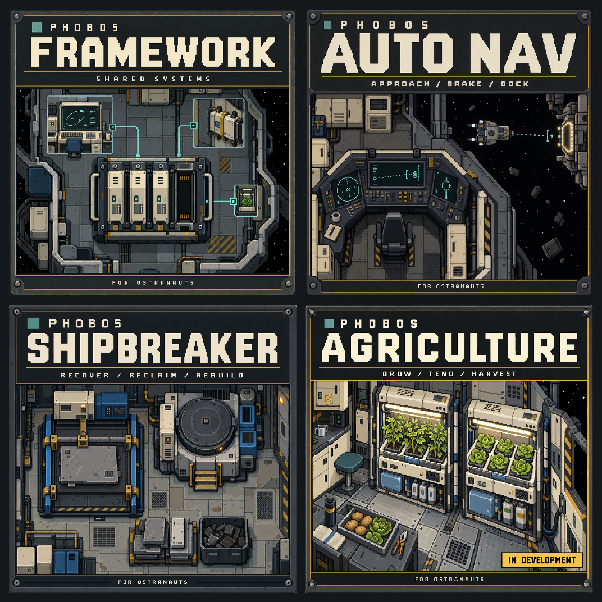

# Workshop preview artwork

Four coordinated cover illustrations for Phobos Framework, Auto Nav,
Shipbreaker and Agriculture. These are promotional illustrations, not gameplay
screenshots or a claim of release readiness. Approach Assist and Phobos Scope
are deliberately outside this set, as selected by the owner on 25 September 2026.

The design connects each mod to the project's ambition of longer habitation in
hostile space: shared dependable systems, careful navigation, material recovery
and cultivation. It does not promise unlimited resources or perfect recycling.

| Mod | Workshop preview | Small preview | Cover meaning |
| --- | --- | --- | --- |
| Phobos Framework | [512px](previews/PhobosFramework-512.png) | [256px](previews/PhobosFramework-256.png) | Shared systems; the backplane is a software metaphor, not a new machine. |
| Phobos Auto Nav | [512px](previews/PhobosAutoNav-512.png) | [256px](previews/PhobosAutoNav-256.png) | Controlled approach, braking and docking. |
| Phobos Shipbreaker | [512px](previews/PhobosShipbreaker-512.png) | [256px](previews/PhobosShipbreaker-256.png) | Detached-panel processing, electrical casting, recovered materials and retained waste. |
| Phobos Agriculture | [512px](previews/PhobosAgriculture-512.png) | [256px](previews/PhobosAgriculture-256.png) | Potato and lettuce cultivation; explicitly marked **in development**. |

## Files and branches

The unchanged high-resolution generated masters live **only on the separate
`codex/workshop-art-masters` branch**, in `assets/workshop/masters/`. Do not merge
that branch into `main`. Normal development branches retain the smaller exports,
this documentation, the exact generation prompts and the export manifest.

Run `pwsh -File scripts/export-workshop-art.ps1` on Windows to regenerate the
previews directly from the pinned master commit. The script reads Git objects
without checking out or copying large originals onto the working branch. It
checks source hashes, resolution and output sizes. A clone without the master
commit first needs `git fetch origin codex/workshop-art-masters`.
Use `-VerifyOnly` to compare committed exports against freshly resized pinned
masters without writing files. [The manifest](exports.json) identifies the exact
master commit; [the prompt record](prompts.json) contains the four complete prompts.
All returned masters are **1254 x 1254**, preserved unchanged. The requested 2048
dimensions were not honoured by the generator; the actual results still exceed
2x the largest delivered per-mod preview on each axis.

`previews/` contains square PNGs at 512 and 256 pixels. Use the 512-pixel file for
each Workshop listing; the 256-pixel file is a compact alternative and thumbnail
check. Square sizing and a conservative 1,000,000-byte upload budget are our
delivery choices, not a claim that Valve mandates these dimensions or this exact
limit. [Valve's Steamworks `SetItemPreview` documentation](https://partner.steamgames.com/doc/api/ISteamUGC#SetItemPreview)
supports PNG, JPG and GIF previews. Actual submission remains an owner publishing
step; this work does not upload or publish a Workshop listing.

## Style and provenance

[Blue Bottle Games' Ostranauts](https://store.steampowered.com/app/1022980/Ostranauts/)
is the visual and setting reference: overhead ship spaces, legible machinery,
restrained industrial colour and physical controls. The project's
[equipment art study](../../docs/ship-equipment-art-study.md) and existing original
Phobos equipment inform the descriptions. Blue Bottle Games owns the game and
its artwork; no affiliation or endorsement is implied. No extracted game texture,
game screenshot, third-party mod sprite or official logo was supplied to the
generator or included in these covers.

These complex cover compositions use ChatGPT's built-in image generation under
the [asset policy's complex-art provision](../../docs/asset-generation-policy.md).
PixelLab remains preferred for simple pixel assets. Its allowance was checked,
but no PixelLab generation or credit purchase was made for this set. The built-in
tool does not disclose a model revision, seed or per-image price; none is invented.
Exact prompts, result identifiers and hashes are retained with this asset family.
Generated imagery is original commissioned project artwork, subject to applicable
[OpenAI terms](https://openai.com/policies/terms-of-use/); that provenance is not
an independent guarantee of exclusive rights. No new licence is assigned here.

Only mechanical nearest-neighbour resizing is applied to the masters. Typography
is baked into this English-language promotional artwork, separate from the live
localized in-game interfaces. Future translated covers need separately reviewed
artwork. No runtime equipment artwork, identifiers or gameplay has changed.
