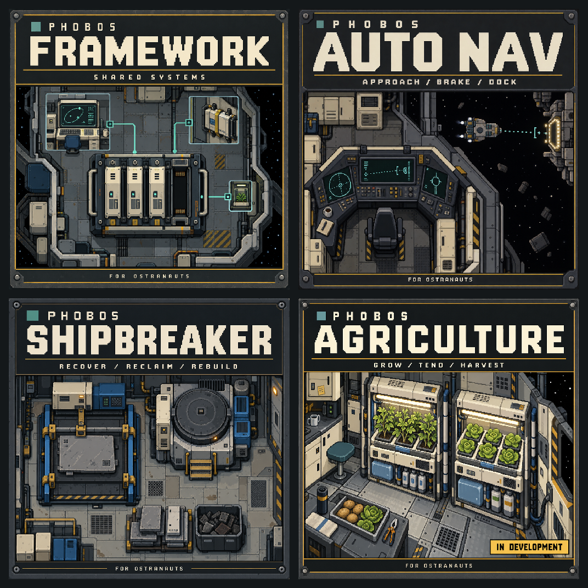

# Workshop preview artwork

Six coordinated cover illustrations for Phobos Framework, Auto Nav,
Shipbreaker, Agriculture, Manufacturing and War Has Been Declared. These are promotional illustrations,
not gameplay screenshots or a claim of release readiness. Approach Assist and Phobos Scope
are deliberately outside this set, as selected by the owner on 25 September 2026.
The owner approved the set and requested native-menu integration on the same day.

The design connects each mod to the project's ambition of longer habitation in
hostile space: shared dependable systems, careful navigation, material recovery
and cultivation. It does not promise unlimited resources or perfect recycling.

| Mod | Workshop preview | Small preview | Cover meaning |
| --- | --- | --- | --- |
| Phobos Framework | [512px](previews/PhobosFramework-512.png) | [256px](previews/PhobosFramework-256.png) | Shared systems; the backplane is a software metaphor, not a new machine. |
| Phobos Auto Nav | [512px](previews/PhobosAutoNav-512.png) | [256px](previews/PhobosAutoNav-256.png) | Controlled approach, braking and docking. |
| Phobos Shipbreaker | [512px](previews/PhobosShipbreaker-512.png) | [256px](previews/PhobosShipbreaker-256.png) | Detached-panel processing, electrical casting, recovered materials and retained waste. |
| Phobos Agriculture | [512px](previews/PhobosAgriculture-512.png) | [256px](previews/PhobosAgriculture-256.png) | Potato and lettuce cultivation; explicitly marked **in development**. |
| Phobos Manufacturing | [512px](previews/PhobosManufacturing-512.png) | [256px](previews/PhobosManufacturing-256.png) | Volatiles refinery, water-splitting cell and hydrogen store; composed cover (see below). |
| Phobos' War Has Been Declared | [512px](previews/PhobosWarDeclared-512.png) | [256px](previews/PhobosWarDeclared-256.png) | A torn hull with pale-blue build sites laid where parts were lost and two crew carrying a panel; composed cover (see below). An illustration of the idea, not a screenshot. |

## Files and branches

The unchanged high-resolution generated masters live **only on the separate
`codex/workshop-art-masters` branch**, in `assets/workshop/masters/`. Do not merge
that branch into `main`. Normal development branches retain the smaller exports,
this documentation, the exact generation prompts and the export manifest.

Run `pwsh -File scripts/export-workshop-art.ps1` on Windows to regenerate the
previews directly from the pinned master commit. The script reads Git objects
without checking out or copying large originals onto the working branch. It
checks source hashes, resolution and output sizes. A clone without the master
commit first needs `git fetch origin codex/workshop-art-masters`.
Use `-VerifyOnly` to compare committed exports against freshly resized pinned
masters without writing files. [The manifest](exports.json) identifies the exact
master commit; [the prompt record](prompts.json) contains the four complete prompts.
All returned masters are **1254 x 1254**, preserved unchanged. The requested 2048
dimensions were not honoured by the generator; the actual results still exceed
2x the largest delivered per-mod preview on each axis.

`previews/` contains square PNGs at 512 and 256 pixels. Use the 512-pixel file for
each Workshop listing; the 256-pixel file is a compact alternative and thumbnail
check. Square sizing and a conservative 1,000,000-byte upload budget are our
delivery choices, not a claim that Valve mandates these dimensions or this exact
limit. [Valve's Steamworks `SetItemPreview` documentation](https://partner.steamgames.com/doc/api/ISteamUGC#SetItemPreview)
supports PNG, JPG and GIF previews. Actual submission remains an owner publishing
step; this work does not upload or publish a Workshop listing.

## Style and provenance

[Blue Bottle Games' Ostranauts](https://store.steampowered.com/app/1022980/Ostranauts/)
is the visual and setting reference: overhead ship spaces, legible machinery,
restrained industrial colour and physical controls. The project's
[equipment art study](../../docs/development/ship-equipment-art-study.md) and existing original
Phobos equipment inform the descriptions. Blue Bottle Games owns the game and
its artwork; no affiliation or endorsement is implied. No extracted game texture,
game screenshot, third-party mod sprite or official logo was supplied to the
generator or included in these covers.

These complex cover compositions use ChatGPT's built-in image generation under
the [asset policy's complex-art provision](../../docs/development/asset-generation-policy.md).
PixelLab remains preferred for simple pixel assets. Its allowance was checked,
but no PixelLab generation or credit purchase was made for this set. The built-in
tool does not disclose a model revision, seed or per-image price; none is invented.
Exact prompts, result identifiers and hashes are retained with this asset family.
Generated imagery is original commissioned project artwork, subject to applicable
[OpenAI terms](https://openai.com/policies/terms-of-use/); that provenance is not
an independent guarantee of exclusive rights. No new licence is assigned here.

Only mechanical nearest-neighbour resizing is applied to the masters. Typography
is baked into this English-language promotional artwork, separate from the live
localized in-game interfaces. Future translated covers need separately reviewed
artwork. No runtime equipment artwork, identifiers or gameplay has changed.

## Manufacturing: a composed cover

Manufacturing arrived after the original set, so its cover was assembled rather
than generated whole. On **29 September 2026** PixelLab's `create_image_pro`
produced one 244 x 170 scene ([retained unchanged](sources/PhobosManufacturing-scene.png),
20 generations from the subscription allowance, no credit purchase). Its style
image was the committed Shipbreaker cover; its design references were the mod's
own V4, X2 and H2 world sprites. The first pilot was accepted: its palette and
pixel density match the set. The tanks show some curvature, acceptable for
promotional art (the overhead-only rule governs world sprites, not covers).

`python scripts/compose-workshop-cover.py` doubles the scene with nearest-neighbour
sampling, places it in the Shipbreaker cover's frame (border, PHOBOS label and
footer), and draws the title and subtitle from original pixel glyphs in the script.
No font file or game asset is involved. [The composition record](composed.json)
holds the prompt, seed, provider IDs, source hashes and layout. Use `--check` to
verify committed exports without writing. The script writes both preview sizes and
`mods/PhobosManufacturing/preview.png`. PixelLab output is subject to
[PixelLab's terms of service](https://pixellab.ai/termsofservice).

## War Has Been Declared: a composed cover

On **29 September 2026** PixelLab's `create_image_pro` produced one 244 x 170 scene
([retained unchanged](sources/PhobosWarDeclared-scene.png), 20 generations from the
subscription allowance, no credit purchase). Its style image was the committed
Shipbreaker cover. The mod adds no items, so no design references were supplied.
The first pilot was accepted: its palette and pixel density match the set. The
pale-blue outlines stand for the game's own build sites, which the game draws at
half strength. The crew show slight three-quarter perspective, acceptable for
promotional art (the overhead-only rule governs world sprites, not covers).

`python scripts/compose-workshop-cover.py` composes it exactly as for Manufacturing;
[the composition record](composed.json) holds the prompt, seed, provider IDs and
layout, and the glyph tables gained the letters this title and subtitle need.
The same script writes `mods/PhobosWarDeclared/preview.png`, and the player guide
shows the 512px cover (packaged guides carry a copy in `images/`).

A second generation, a three-panel storyboard (intact, after the fight, build sites
laid) for the player guide, was **not selected**: it drew the build sites as a
cracked-glass overlay, which would misrepresent the game's build sites. It cost 40
generations and was not retried. Its request and reason are in `composed.json`
under `rejected`; the image lives only on the `codex/rejected-artwork` branch (see
[the archive record](../rejected-artwork-archive.md)).

## Native-menu integration

The exporter (and, for Manufacturing, the composer) also writes each 512px cover
to `mods/<ModId>/preview.png`.
Existing package builders copy the native folder, and the shared packaging helper
checks that the cover matches its committed derivative. Packages include separate
artwork provenance and exact prompts. Ordinary package builds do not fetch masters.

Local inspection of **Blue Bottle Games' Ostranauts 1.0.1.5** confirms that
`GUIModRow.SetupImage` loads a nonempty `strPreviewURL` first; otherwise it loads
the mod directory's `preview.png`, using point filtering. `SteamWorkshopManager`
uses that same local filename for `SteamUGC.SetItemPreview`. This is observed
native code, not an in-game visual test. Reference: [the game's official listing](https://store.steampowered.com/app/1022980/Ostranauts/).
Research copies of game code remain local and are not packaged or committed.
No new metadata URL, runtime patch or Workshop ID is required for these local mods.

After closing the game, `scripts/install-mods.ps1 -PreviewsOnly` applies only the
selected installed mods' covers from prepared packages. It preserves DLLs, native
definitions and the existing load order, including disabled entries. It uses the
normal installer backups and hash verification. The mode refuses an uninstalled
mod rather than creating an incomplete mod directory. Agriculture's cover ships
with its complete package whenever that package is deliberately installed.
