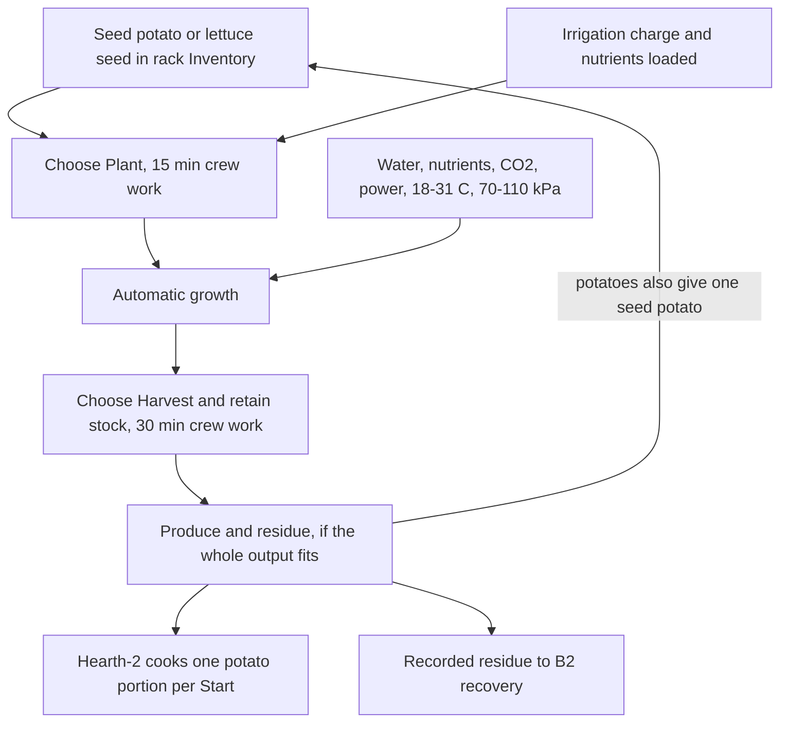

# Phobos Agriculture

Grow a meal between salvage runs. Firstlight-4 grows potatoes, lettuce, dwarf
wheat, dwarf tomatoes or soybeans; Hearth-2 cooks potatoes, bakes wheat into
flatbread and turns soybeans into stew. Keep the plants supplied with
water, nutrients, light and suitable cabin air. Four trays share one crop cycle.

Use the [current package versions](player-guide.md) and [dependency requirements](installing-mods.md). These are development packages;
the complete loop and Unity layout still need in-game evaluation.

Start with the rack and cooker below. Add [W2 irrigation](agriculture-water-conduits.md),
[W2 feeding](fluid-network-operations.md#one-nutrient-fed-with-the-water), [B2 recovery](agriculture-nutrient-production.md)
or a [water silo and nutrient hopper](agriculture-bulk-storage.md) when needed. A W2 can serve
up to eight linked racks. Irrigation conduit joins a W2 or rack it runs under or right
beside, and a W2 within one tile of a rack needs no pipe at all. For replacement lettuce seed, choose the separate
[seed crop](agriculture-seed-production.md).

See [controls](control-panel-guide.md) for Apply/Discard and choosing stores,
[crew orders](crew-automation.md) for help with routine work, and
[suppliers](solar-system-economy.md) and [stock lots](development/merchant-stock.md) for shopping.
Optional [completion alerts](shared-completion-cues.md) tell you when a meal or
crop is ready; they do not harvest it. The [changelog](../mods/PhobosAgriculture/CHANGELOG.md)
keeps the version history and [artwork notes](development/artwork-completion.md) cover the sprites.

## Equipment and supplies

**Verdemorrow Agronomics** supplies this agricultural family: **Firstlight-4**
cultivation racks, **Hearth-2** galley cookers, **Continuance** seed potatoes and
seed packets, and **Groundwork** formulated nutrients. Harvested produce and
retained materials also carry the Verdemorrow brand. Full names begin with
`Phobos' Verdemorrow`; the [brand register](development/equipment-branding.md) lists them.

Buy equipment, planting stock and formulated nutrients from the supply kiosk,
fixer or suitable general trader after stock refresh. Availability is additive
and probabilistic. Agriculture **0.6.2** also adds seeds/food to eligible native
fridge contents and seeds, nutrients, irrigation charges, treatment cartridges
and loose pipes to locked-crate contents (also used by bulk-cargo loot). These
are future native rolls, not retroactive refills. See [loot chances and settings](development/agriculture-loot.md).
Alternatively, use Framework construction at an ordinary
Bar/Dining Table, with the required screwdriver and soldering tools:

| Equipment | Construction inputs | Work / base price |
| --- | --- | --- |
| Phobos' Verdemorrow Firstlight-4 Cultivation Rack | 48 steel scrap, 24 aluminium scrap, 12 small mechanical parts, 4 small electrical parts | 60 minutes / 700 cr |
| Phobos' Verdemorrow Hearth-2 Galley Cooker | 6 steel scrap, 4 aluminium scrap, 2 small mechanical parts, 2 small electrical parts | 20 minutes / 150 cr |

Install the **4 × 4 rack** and **2 × 2 cooker** on cabin floors and connect their
power points. Keep room temperature at **18–31 °C** and pressure at **70–110 kPa**
for growth. The crops are taken to be engineered ones, at home in a ship's rooms at
about 25 °C or a little above. These are gameplay limits chosen for this mod, not
universal plant tolerances, and since Agriculture 0.55.0 they are data: see
[growing room and stress](editing-data-files.md#growing-room-and-stress) to change
them or give one crop its own room.

Every page of a rack's or W2's Control Panel ends with a **Next:** line naming the
one thing it is waiting for: air, power, water, nutrients, seed or Start. When a
crop crew order is switched on, a rack that is empty or ripe shows where that order
stands instead: who is working on it, what it is waiting for, or why it stopped. For a
pipe-fed rack the quickest route is to link it to a W2 on the Supplies page. Linking
switches the rack's water intake on and starts the W2's pump; both can still be
switched off at their own panels. A rack also needs nutrients: 40 g packets loaded
by hand, or a W2 with nutrients aboard, which feeds them with the water.

**There is one nutrient for every crop** (Agriculture 0.55.0). The 40 g packet, the
500 g bulk charge and bulk in a nutrient hopper are the same stuff in three sizes, and
nothing is chosen or matched. To feed piped racks, put any Groundwork nutrients in
the W2's Inventory, or set a nutrient hopper within one tile of it. The W2 takes
them by itself, running or linked, and keeps each rack topped up. If the racks are
already full of plain water, the pump recirculates their water to carry the nutrients
in, and the panel says so.
The rack needs atmospheric CO₂. Lamps consume electricity and warm the cabin;
ventilation and cooling remain ship responsibilities.

### Misting in a hot room

A room hotter than a crop's ceiling (31 °C by default) stops it growing, and after two
hours it starts losing health. If cooling the room is not an option yet, choose **Mist to
cool crop** on the rack's panel (**Stop misting** turns it off; it is off until you switch
it on). While the room is too hot, the rack mists the crop with water from its own
reservoir:

- **Up to 4 °C above the ceiling,** the crop is held within its limits: it keeps growing
  and takes no heat damage. This costs about **0.15 kg of water an hour for each degree**,
  so holding off 4 °C uses about 0.6 kg an hour, or 14 kg a day. A pipe-fed rack is refilled
  by its W2 as usual.
- **Hotter than that,** misting runs at full rate and can't hold the crop in its limits:
  growth stops, but the crop loses health at **half** the usual rate.
- **The last 2 kg of the reservoir is kept** for the crop to grow on; misting stops at that
  reserve, and the panel tells you to refill.
- **It only helps with heat.** Misting does nothing for a cold room, the wrong pressure or a
  room without air.

The misted water evaporates, so it also cools the room a little: each kilogram takes
2.45 MJ out of the air, the same as the rack's own spare vapour. A misting rack at full rate
is a small evaporative cooler of about 0.4 kW, less the machine heat share you have set. The
water then goes to a water tank the rack is linked to, or is lost if there is none, because
the game's air holds no humidity. The panel's misting line shows what it is doing: off, not
needed, holding the crop some degrees below the room, at full rate, or out of water.

The 4 °C limit, the water rate, the reserve and the damage share are authored for play, not
measured plant physiology. All four are in the crops data file and can be changed, per crop
for the limit (see [growing room and stress](editing-data-files.md#growing-room-and-stress)).

### Carbon dioxide and spare water

**Enriched air grows crops faster** (Agriculture 0.43.0). Every crop grows more per
hour and per kWh in a room with more carbon dioxide, up to about 25% faster around
0.10 to 0.15 kPa. It takes the same water, nutrients and light per kilogram, so the
cycle is simply shorter. Above that it slows again, back to the ordinary rate by
0.5 kPa. Below ordinary cabin air nothing changes, but a room with no CO₂ at all still
stops growth. The rack's panel shows the room's CO₂ and the factor it gives. An
**A2 cabin air regulator** set to **0.10 kPa** (Phobos Manufacturing) holds a grow
room near the best point.

| Room CO₂ | Growth |
| --- | --- |
| 0.04 kPa or less (ordinary air) | x1.00 |
| 0.05 kPa | x1.03 |
| 0.10 kPa | x1.20 |
| 0.15 kPa | x1.25 |
| 0.20 kPa | x1.15 |
| 0.50 kPa | x1.00 |
| 1.0 kPa and above | x0.85 |

The figures follow NASA and Utah State University crop-chamber work on wheat and
soybean; the curve itself is a gameplay choice. Crew start to suffer from CO₂ well
before plants do, which is why the A2 never goes past 0.25 kPa.

**Spare condensate goes to a tank.** A rack condenses its plants' water back into its
own reservoir. When the reservoir is full, the surplus used to be lost; since 0.43.0
it goes to a Rivetline water tank the rack touches or shares a process-water line
with. Without such a tank, it is lost as before.

## Living rack visuals

Firstlight-4 now shows potatoes or lettuce in its four trays: sprout, young,
mature, harvest-ready, wilted or dead. These four pictures represent **one crop
cohort**, not four separately plantable slots or four times the yield. The local
panel shows the same composed rack. Growth and health drive the artwork; pausing
the lamps leaves the plants visible. Successful harvesting/clearing empties the
trays. A protected unreadable state shows the base rack; consult its panel warning.
When the panel says a machine or tank is protected because of an interrupted
transfer or a mass that no longer matches its records, **Accept contents as they
are** (on the panel, the C1 console or `phobosagriculture accept <id>` in F3)
closes the journals and sets the item's mass back to what the records say.
Unreadable records still need repair (since 0.17.0).

The rack has a new sage-green and cream housing. Hearth-2 now includes matching
galley furniture beneath its separate electric stove insert. The fittings are
part of each machine's housing; the counter is not another buildable object.
The footprints remain 4 × 4 and 2 × 2. Appearance refreshes within about two real
seconds while the ship is loaded; it does not advance growth or resume automation.
Lettuce's harvest-ready image depicts food leaves, not seed production.

## First crop

One crop runs like this. Planting and harvesting are crew work you choose;
growth runs by itself while the rack's needs are met.

1. Put one **Continuance 0.2 kg seed potato** or one **Continuance 5 g lettuce seed packet** in the rack's
   normal Inventory. Stacked supplies are fine: the game stacks matching items
   dropped into a machine, and each action takes one unit from the stack
   (since 0.17.0). A planting, loading, harvest or drain action that cannot
   succeed is refused when it is offered, with the reason, rather than after
   the walk.
2. Put a **Groundwork 5 kg irrigation charge** (50 cr base) and nutrient packets
   in the rack. Choose **Load 5 kg irrigation charge / Load nutrients**; each action
   takes ten seconds. The charge needs 5 kg free reservoir capacity and is consumed
   whole. One charge covers the initial ideal potato cycle or three lettuce cycles,
   with leftover water retained. Native 0.25 kg water rations remain an expensive
   fallback through **Load one water ration**. Reservoir limits remain 20 kg water
   and 0.5 kg nutrients; a nutrient packet holds 40 g. Charges are root-water
   commodities, not drinkable items; packaging mass is abstracted.
3. Choose **Plant**. Fifteen minutes of local crew work consumes the stock and
   starts automatic cultivation. The panel shows crop progress, health, retained
   quantities, cabin readings and their compartment source.
4. Keep water, nutrients, CO₂, power and cabin conditions available. You can leave
   the panel closed. Pausing lamps does **not** freeze respiration or stress.
5. At readiness, choose **Harvest and retain stock**. Thirty minutes of crew work
   produces physical cargo only if the complete output fits the rack inventory
   (4 x 3 cells since Agriculture 0.37.0; portions arrive as stacks of ten).
   Remove cargo and replant. Full storage keeps the crop intact; harvest again
   after making room.

| Ideal complete cycle | Potatoes | Lettuce | Dwarf wheat | Dwarf tomato | Soybean | Fibre flax | Sugar beet |
| --- | --- | --- | --- | --- | --- | --- | --- |
| Duration | 96 game hours | 48 game hours | 84 game hours | 64 game hours to first ripe | 90 game hours | 90 game hours | 140 game hours |
| Active electrical demand | 0.75 kW | 0.40 kW | 1.20 kW | 0.70 kW | 0.65 kW | 0.90 kW | 0.80 kW |
| Cycle energy | 72 kWh | 19.2 kWh | 100.8 kWh | 44.8 kWh to first ripe | 58.5 kWh | 81 kWh | 112 kWh |
| Water / nutrients | 4.624 kg / 40 g | 1.2658 kg / 5 g | 1.165 kg / 45 g | 4.962 kg / 25 g | 0.774 kg / 24 g | 1.375 kg / 35 g | 5.862 kg / 50 g |
| Immediate ideal harvest | ten 0.4 kg raw portions, one 0.2 kg seed potato, 0.8 kg residues | four 0.25 kg edible portions, 0.2 kg residues | one 0.4 kg grain portion, one 50 g seed wheat packet, 0.95 kg straw residue | fourteen 0.25 kg tomato portions, one seed packet, 1.5 kg vine residue (or up to three picks first) | one 0.25 kg bean portion, one seed packet, 0.62 kg straw residue | four 0.25 kg flax straw bundles, one seed packet, 0.59 kg residue | nine 0.5 kg sugar beets, one seed packet, 1.48 kg residue |

Delays and respiration reduce biomass, and damage reduces edible output. Whole
portion rounding can reduce a delayed harvest by one portion; the remainder stays
in residue, never disappears. Food lettuce gives no replacement seed. Select
**Plant lettuce for seed** on an empty rack for the separate 96-hour reproductive
cycle: four seed packets and retained residue at full health, with no food leaves.

The Hearth-2 cooks **one 0.4 kg portion per Start**, at 2 kW for 90 seconds at full
supply. Load raw potatoes, start, then collect the cooked portion. Partial supply
slows cooking. Removing the selected input suspends the cycle; return that exact
portion or Cancel before using another. Cancellation discards cooking progress,
not the food. Cooked potatoes reduce native food debt by five units; lettuce by
one. These values, yields and accelerated growth are gameplay choices.

## Dwarf wheat and flatbread

Wheat (Agriculture 0.41.0) is the slow, light-hungry crop that keeps. Plant one
**Continuance 50 g seed wheat** packet with **Plant seed wheat**. A healthy harvest gives one 0.4 kg portion of
**wheat grain**, gives your seed packet back, and leaves about 0.95 kg of straw as
recorded residue for the B2 bench. Grain keeps indefinitely.

To bake, put a grain portion and one 0.25 kg **water ration** in the Hearth-2 and
choose **Start**. Ten minutes at 2 kW makes one 0.65 kg **flatbread**, which
relieves hunger like the game's own prepared meals (nine units). If the water ration
is gone when the baking finishes, the cooker stops with the bread nearly done; add
water and choose Start to finish it. A crew cooking order fetches grain and a water
ration, and keeps the crew's drinking reserve.

Wheat's figures follow the ratios NASA Kennedy Space Center's crop chamber found
against potato: a slightly shorter cycle, the most light, and far less of the plant
edible. The hours, yields and food values are gameplay choices; see the
[crop expansion record](development/agriculture-crop-expansion.md) for the sources.

## Water and central controls

With **Valtora's [Ship's Water](https://steamcommunity.com/sharedfiles/filedetails/?id=3757331189)
0.16.1** loaded, Enable optional ship-water supply draws finite potable water from
installed tanks that touch the rack or W2 (within one tile) or share its
process-water line (the INSTALL menu's **Process Water Line**, not the Irrigation
Conduit, which only carries water and nutrients out of a W2 to its racks). The line joins a tank, a rack or a W2 when it runs under it or
right beside it, on any side (since Framework 0.69.0). A tank elsewhere aboard does
not count (since Agriculture 0.32.0): lay process-water line so it touches both, or
move the tank, and the machine
says so while none is in reach. Powered pumping preserves the configured crew
reserve (10 L by default), counted over every drinking tank aboard. Docked ships are separate.
Other provider versions fall back to manual supply pending contract review.
Its water quantities use the provider's litre accounting; we leave its native
vessel-mass policy unchanged. Agriculture's own contents contribute native mass.
The adapter's gameplay compatibility is still unverified.

With Shipbreaker 0.14.0, the C1 console discovers agriculture equipment and exposes
the same checked Start/Pause/receiving commands. Physical loading, planting and
harvesting stay local. Auto Nav operates independently; shortages affect plants
without Agriculture commanding flight.

Local F3 equivalents: `phobosagriculture list`, then
`phobosagriculture status <full object ID>`. Replace `status` with `start`, `pause`,
`receive`, `pause-receive`, `plant-potato`, `plant-lettuce`, `plant-lettuce-seed`, `load-water`,
`load-nutrients`, `harvest`, `clear`, `drain` or cooker `cancel`.
F3 uses ordinary access and resource checks.

## Interruptions and maintenance

Reload keeps crop identity, health, material, growth, growth rate set at planting and the bound
cooking portion. **Cultivation, cooking and receiving that were running when you saved carry on by themselves; anything stopped stays stopped, and a failed check leaves it stopped with the reason shown** (see [machines carry on after a reload](player-guide.md#machines-carry-on-after-a-reload)). No growth is added for time outside the running simulation. Loaded, stopped or damaged plants still
respire and deteriorate; unloaded ship time is not simulated in this candidate.
Continuous shortages have a two-hour grace, then progressive stress. Restoring
conditions stops further stress but does not magically restore lost health.

Clear failed crops into retained residue; Drain unloads water plus unused nutrients
as recorded non-potable process solution eligible for W2 treatment. Older unrecorded crop residue has no recovery recipe. New recorded residue can
be processed at [B2](agriculture-nutrient-production.md). Empty the inventory and stored liquids/nutrients before uninstalling/dismantling; cancel cooking
progress first. Use **Maintenance** to identify retained contents, active work, protected transfers or a silo link that blocks removal. Ordinary repair/Restore use native maintenance. Dismantling returns a bounded mix of native parts/materials and retained housing
waste; see the condition-specific recovery bills below.

Since 0.17.0 the game leads in four more places. Machines have a real power
state: every installed appliance draws 20 W idle, so the game's own power
display, the crew console and the panel show whether it is connected. Tanks and
machines follow the game's destructibility: a filled tank that is destroyed or
detached loses its water (logged), and refusals happen only when maintenance
work is offered. Meals and lettuce keep their authored food values through the
game's own eating actions; food made before 0.17.0 eats with the vanilla values.
Transpired water condenses back into the rack's reservoir while it has room, so
a crop uses that much less water; the game's air has no water vapour to receive it.

Configuration: `GrowthDurationMultiplier` (0.5–2, captured when planting; total
cycle energy unchanged) and `CrewReserveLitres` (live). No saved identity, footprint
or recipe mass changes when these preferences change.

## Research and next steps

NASA's Ray Wheeler motivates the staple-plus-vegetable crop pair in
[NASA's crop research](https://www.nasa.gov/science-research/nasa-plant-researchers-explore-question-of-deep-space-food-crops/).
His [life-support overview](https://ntrs.nasa.gov/citations/20205008786) explains
why productive area and lighting matter. Our compact racks and short cycles are
not NASA yields. [ESA's MELiSSA concept](https://www.esa.int/Enabling_Support/Space_Engineering_Technology/Melissa/Closed_Loop_Concept)
informs later recovery stages; indefinite habitation is an ambition, not a feature
of this first mod. Neither institution endorses the project.

See [implementation and owner checks](development/agriculture-implementation.md),
[research](development/agriculture-research.md) and [roadmap](development/agriculture-roadmap.md).

Build with `scripts/build-agriculture.ps1 -OstranautsPath <local game folder>`.
After exiting the game, use `scripts/install-mods.ps1 -Mods Agriculture -WhatIf`,
then the same selection without `-WhatIf` when ready. It includes Framework.
Select `Agriculture,Shipbreaker` to include the prepared C1 integration update.
Use `-VerifyOnly` afterwards. See [installation](installing-mods.md).

## Economy and maintenance (0.3.0)

Prices here are base prices chosen for the mod before native condition, merchant and market
adjustments. Firstlight-4 is 700 cr (875 pristine, 140 broken); Hearth-2 is 150 cr
(187.50 pristine, 30 broken). Construction bills and assembly times are unchanged.
Continuance lettuce seed is 5 cr per sowing. Nutrients are 6 cr per 40 g (150 cr/kg)
since Agriculture 0.52.0; Hearth flatbread is 200 cr and soybean stew 190 cr.
See the [native economic evidence](development/agriculture-economy-evidence.md) for comparisons.

For every machine, including the W2 and B2 since 0.19.0, the fixer can
offer worn equipment and VORB scrap stock can offer refurbished or broken units.
Existing pristine supply/fixer/Halvorson offers remain. Offers are
probabilistic and do not refresh existing inventories. Native supply and VORB
buyers accept empty loose Agriculture goods; the generic fixer and Halvorson
buyer filters do not. Being a seller does not guarantee buying the item back.
Small planting supplies can occasionally occur in the native fridge contents
pool, including derelicts; that shared pool is not exclusive to salvage.

| Service | Firstlight-4 | Hearth-2 |
| --- | --- | --- |
| Repair bill | 2 small mechanical + 1 small electrical + 2 aluminium; 26.70 cr, 3.5 kg | 1 small mechanical + 1 aluminium; 6.10 cr, 1.5 kg |
| Repair work, unmodified | 28.8 minutes | 14.4 minutes |
| Intact dismantling | 12 kg steel + 8 kg aluminium + 2 mechanical parts (1 kg) + 59 kg waste | 2 kg steel + 1 kg aluminium + 9 kg waste |
| Broken dismantling | 4 kg steel + 2 kg aluminium + 74 kg waste | 1 kg aluminium + 11 kg waste |

Native tools and skill modifiers apply. Framework returns the actual consumed
repair material as spent waste. Restore remains native in-place wear removal,
with no material bill and no pristine bonus. Clear crops, drain solution and
empty cargo before dismantling or uninstalling. Waste has no recovery recipe.

Ideal consumed inputs with Groundwork water cost 106.24 cr per potato cycle
(excluding reusable seed) and 25.158 cr per lettuce cycle including fresh seed.
Whole-charge purchase costs, electricity, crew work, losses and equipment are
additional considerations. Nominal cooked potato output is 350 cr and lettuce
32 cr before condition/trade modifiers: these are not guaranteed trading profits.
Accelerated growth, yield and prices are gameplay choices, not NASA/ESA results.

Owner gameplay checks: buy a worn/broken machine, repair and Restore it; compare
actual offers; dismantle empty intact/broken units; load a charge with less than
5 kg space (it must remain untouched), then with enough space; reload and verify
water is retained once. Check absent Ship's Water, full output inventory and
queued work whose supply is removed before completion. Offline native checks do
not establish merchant availability or crew interaction behavior in a running game.

For the authorized next development direction, see [nutrient recovery and workup research](development/agriculture-nutrient-recovery.md). It describes proposed production and W2 consumable changes, not additional controls available in this build.

## Nutrient production and gradual dosing

Agriculture 0.9.0 adds the Groundwork B2 bench, recorded crop-residue recovery,
finite makeup salts and selected physical W2 charges. Optional Ship’s Water
Recycler attachments retain wet rejects without inventing nutrients. Follow the
[nutrient-production guide](agriculture-nutrient-production.md) for controls,
recipe budgets, compatibility, save behavior and owner gameplay checks.

## Crew standing orders

See [crew automation, specialities and time-skips](crew-automation.md) for default-disabled orders, native duty/AutoTask rules, approved stores, training, saved stops and supported onboard work. Industrial batches, exterior missions and crew-launched flight require explicit Resume. Gameplay and UI checks remain owner-run.

## Dwarf tomatoes: picking

Tomatoes (Agriculture 0.42.0) are picked, not just harvested. Plant one
**Continuance tomato seeds** packet. When the fruit ripens (the rack's tomatoes turn
red), you have a choice:

- **Pick ripe fruit** (fifteen minutes) takes three 0.25 kg portions and leaves the
  plant growing. The fruit turns green again and ripens in about ten hours at full
  health. A plant gives three picks; the panel shows how many are left.
- **Harvest crop** takes all the remaining fruit, saves a seed packet from it and
  ends the planting. You can harvest at any ripe moment, picked or not.

Picking costs the plant the same water, nutrient and light per kilogram as its first
fruit did; it simply keeps fresh food coming before you replant. A crew order for
tomatoes picks while the plant allows and then harvests. Tomatoes are eaten fresh,
a light food like lettuce.

## Soybeans and stew

Soybeans (Agriculture 0.42.0) are the protein crop. Plant one **Continuance soybean
seeds** packet; a healthy harvest after 90 hours gives one 0.25 kg portion of dry
**soybeans**, gives the packet back, and leaves about 0.62 kg of straw for the B2
bench. Beans keep.

Since Agriculture 0.44.0 the B2's **straw press** dries crop residue and spent
biomass into 1 kg straw bales, sending the steam to a water tank it reaches. A
Phobos Manufacturing V4 burns a bale into carbon dioxide for a grow room or chars
four into a carbon stock; see [straw press](agriculture-nutrient-production.md#straw-press-agriculture-0440).

Cook a bean portion and one 0.25 kg water ration in the Hearth-2 for fifteen minutes
to make a 0.5 kg bowl of **soybean stew**: eight units of hunger relief and more
satiety than bread, from all that protein. As with bread, the cooker stops and waits
if the water ration is gone when the cooking finishes.

Tomato and soybean figures follow the ratios NASA's crop chamber found; the hours,
picks, yields and food values are gameplay choices. See the
[crop expansion record](development/agriculture-crop-expansion.md).

## Fibre flax and cloth

Flax (Agriculture 0.45.0) is grown for its stems, not to eat. Sow one 10 g
**Continuance flax seed** packet; a healthy harvest after 90 hours gives four 0.25 kg
bundles of **flax straw**, gives the packet back, and leaves 0.59 kg of residue.

Put a bundle in a **Groundwork B2** and choose **Prepare flax scutching**, then
**Start**. A few minutes at 0.5 kW turn one bundle into two **clean scrap cloth**
(the game's own, 25 g each) and 0.2 kg of woody shives as recorded residue.
Clean cloth is what bed and medical-bed repairs take, and what buffing uses during
a weapon Restore, so a flax rack keeps those repairs going far from a station. Load
the shives into the B2's [straw press](agriculture-nutrient-production.md#straw-press-agriculture-0440)
with the rest of your crop waste. A crew order **Scutch flax into cloth** keeps the
bench working and loads the shives into the press as they come.

Flax straw is not sold: buying bundles to turn into cloth would just be trading.
Linseed oil and edible linseed are not in this version.

## Sugar beet and sugar

Sugar beet (Agriculture 0.46.0) is the slow, thirsty crop that feeds a sweet tooth and,
with Phobos Manufacturing, a still. Sow one 20 g **Continuance sugar beet seed** packet;
a healthy harvest after 140 hours gives nine 0.5 kg **sugar beets**, gives the packet
back, and leaves 1.48 kg of leaves and crowns as residue.

Put a beet in a **Groundwork B2** and choose **Prepare sugar extraction**, then
**Start**. About eighteen minutes at 0.5 kW give one 70 g packet of **beet sugar**
and 0.43 kg of wet pulp as recorded residue for the
[straw press](agriculture-nutrient-production.md#straw-press-agriculture-0440).
Sugar is a small food: a little hunger relief and a lift, not a meal. A crew order
**Extract sugar from beets** keeps the bench working and loads the pulp into the press.

Beets and sugar are not sold: they are for your own galley and still. A fermenter
that turns beets or sugar into ethanol, and a bottler for spirit, are planned for
Phobos Manufacturing.
