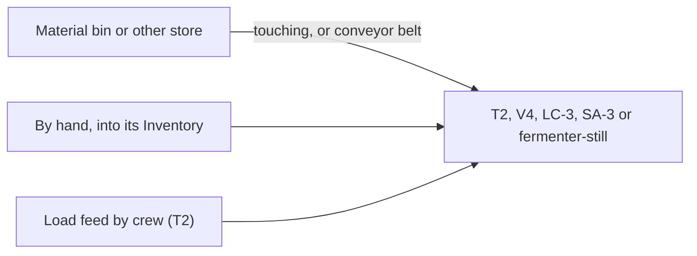
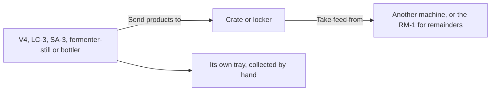
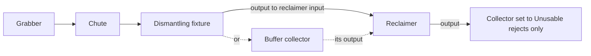

# Automatic material routing — 0.9.0

The later [F6 routing implementation](furnace-material-routing.md), Shipbreaker
0.17.0, adds aluminium feed and released casting collection through separate
logical ports. Existing residue filters and saved ports keep their meaning.

The transport contract below remains current. UI names in the 0.9.0 walkthrough
describe the earlier fallback panels. For 0.10.0 local and central controls, use
the [industrial console player guide](industrial-console-player-guide.md).

Prepared Framework **0.9.0**, Shipbreaker **0.9.0**, Auto Nav **0.3.0**.
Built and checked offline against installed Ostranauts **1.0.1.5**. Gameplay
verification remains with the owner. Since Shipbreaker 0.56.0 every route needs
a conveyor belt between the two machines, or the two within one tile; see below.

## Belts (Shipbreaker 0.56.0)

Items never cross open floor. A route runs along **Phobos' Rivetline Conveyor
Belt** (a Framework supply, 24 cr a segment in lots of 128), or between equipment
whose footprints touch or have one tile between them.

1. Buy belt at the K-Leg supply kiosk or fixer, San Diego Halvorson or the Venus
   scrap kiosk, and lay it through **INSTALL > MISC** on intact floor, tile by tile.
2. Run it from beside the sender to beside the receiver. A belt tile on or next to
   a machine's footprint joins it; for a residue collector use its inboard tiles,
   and for the F6 the amber front-corner marker of the input or output.
3. Link and start the route as before. The route status says whether it runs *by
   conveyor belt* or *touching*.

Belts share tiles with pipe and line, in the lowest lane, and hold nothing: each
item still moves straight from one machine to the other in one checked transfer,
powered and paid for by the machine that sends or receives it. A belt cut, damaged
or taken up stops the route within a couple of seconds; mend it and resume.

**After updating (manual step).** Routes laid over bare floor in earlier versions
stop with *These do not touch and no conveyor belt joins them*. Their pairs,
filters and cargo are kept: lay belt between the two, or move them within one
tile, then start the route again. Laying belt cannot be done for you, because it
would mean free material.

**Stores.** A belt joins a storage container on any side of it (0.57.0), not only
at the tile where crew use it.

**Watching it move.** While a belt route sends an item, a small copy of it rides
the belt from sender to receiver (Framework 0.62.0). It is only a display: the item
stays in the sender until it arrives. Turn it off with the Framework setting
`Belts/ShowMovingItems`.

**Reload.** A route that was running when you saved resumes by itself after a
reload, like the crew's standing orders; a route that was paused stays paused.
Processing that was running carries on too (Shipbreaker 0.77.0); see
[machines carry on after a reload](player-guide.md#machines-carry-on-after-a-reload).

## Feed stores for the T2 and the Manufacturing machines (optional)

Loading by hand always works. If you would rather not, a T2 thaw unit, a V4
refinery, an LC-3, an SA-3 or a fermenter-still can keep itself fed from **one
store you choose** (Shipbreaker 0.73.0, Manufacturing 0.42.0):

1. Put a store where the machine can reach it: a Rivetline material bin or any
   ordinary unlocked container, installed **within one tile** of the machine, or
   joined to it by **conveyor belt** laid from beside one to beside the other.
2. Open the machine's **Control Panel** > **Connections** and choose the store
   under **Take feed from**. The sheet lists stores aboard that are out of reach
   and says why. Apply.
3. Fill the store and press **Start** on the machine once.



While it is started and powered, the machine takes what it can use from the
store when its own inventory holds none: one ice block at a time for the T2, one
exact charge for the others. Anything it cannot use stays in the store. The
choice is saved and holds across a reload; a machine that was started when you
saved carries on after a reload. If the store is moved, locked or its belt is cut, the
status line says so and the machine carries on with whatever you load by hand.
Choose **No store** to clear it. The pull is not metered separately: it rides on
the machine's own power.

## Product stores for the Manufacturing machines (optional)

Collecting by hand always works. If you would rather not, a V4 refinery, an LC-3,
an SA-3, a fermenter-still or a Corker-2 bottler can send what it makes to **one
store you choose** (Manufacturing 0.49.0):

1. Put an ordinary unlocked container (a crate or locker) within one tile of the
   machine, or join the two with conveyor belt.
2. Open the machine's **Control Panel** > **Connections** and choose it under
   **Send products to**. Apply.



While it is started and powered, the machine moves finished items from its tray
to the store, one a second, so a full tray no longer stops it. If the store is
full, locked, moved or its belt is cut, the items stay in the tray and the status
line says why. Choose **No store** to clear it.

Three things to know:

- **Material bins take only ore, rock and ice.** Use a crate or locker for
  products and remainders; a bin will refuse them and they will stay in the tray.
- **A store can feed the next machine.** Name the same crate under **Take feed
  from** on another machine, or on an RM-1 feeder to grind remainders into
  reaction mass, and the chain runs by itself.
- **It sends anything in its tray that it can make.** A few items are both a
  product and a feed (nickel-iron ingots and carbon stock in the V4). If you
  load those by hand while a product store is set, press **Start** straight away
  or the machine will send them on.

## Connect the equipment

The simplest chain runs grabber, chute, dismantling fixture, reclaimer, then a
residue collector for the rejects. A buffer collector may sit between the
fixture and the reclaimer:



Alternatively, retain an existing fixture → collector pair and use that collector
as a buffer: its separate output can feed the reclaimer. A second collector can
receive the reclaimer's rejects. Each port has one partner; receiving and sending
ports on the same machine are independent. There is no broadcast or automatic
nearest-machine selection.

1. Open the reclaimer's **Control Panel → Input routing**. Select the fixture or
   buffer collector with **Link**. The filter is **Identified feed only**.
2. Stand beside the reclaimer and press **Start transfers**. This powers receipt
   of eligible packets; it does not start processing them.
3. In the reclaimer Control Panel, press **Start / resume reclaimer**. An empty
   armed queue waits for arriving feed. With `Processing/ContinueQueue=true`, it
   keeps processing subsequent arrivals until paused or blocked.
4. Open **Output routing** and link a collector. At that collector's **Input
   routing**, choose **Unusable rejects only**, then **Start transfers**.

For the buffered variant, use the first collector's **Output routing** to link
the reclaimer. Start incoming transfers at each receiving machine. The fixture's
F9 **Output routing** opens the same controls from its end. The original processor
Control Panel artwork was not included in 0.9.0. Version 0.10.0 implements the
[industrial console and equipment panels](industrial-console-player-guide.md),
including a shared faceplate and checked same-ship commands.

Linking is allowed beside either endpoint. Starting, pausing and changing a
receiver's filter require access to that receiver. All console actions use the
same service and checks. Collector **Inventory** remains its finite cargo space;
reclaimer **Input routing → Inventory** opens its private feed, while ordinary
reclaimer Inventory remains products.

## Eligibility and backpressure

| Receiving port | Available filters |
| --- | --- |
| Reclaimer feed | Identified R2 residue only |
| Collector | All three residue types; identified feed only; terminal rejects only; legacy residue only |

Old links and port names retain their meaning. A collector without a saved filter
keeps its existing three-type acceptance. A reclaimer without a saved filter
accepts identified feed only. Explicit filters survive unlinking and save/reload.
Changing a filter pauses that receiving route and resets its short transfer
timer. It never changes or removes cargo already held. Unknown, future or
incompatible saved filters block transfer until the player selects a valid one.

Every route checks the full IDs, reciprocal pair token, same loaded ship,
installation, damage, locks, receiver switch/signal state, the belt or touching
equipment between them, exact item identity/mass (a stack is taken one unit at a
time, each at its own mass, since 0.57.0), absence of contents, and destination capacity. Collector sources also retain their hull-mount checks.
Routes do not cross ships, bare space, EVA floor or cargo webbing. Native
electrical conduit is separate.

The item remains in the sender for the complete transfer interval. Only a checked
move of that same object completes delivery; there is no intermediate virtual
inventory or duplicate cargo. Full receivers wait with the item and partial
transfer work retained. Missing/changed endpoints or a broken route pause;
restore the route and explicitly resume. The reclaimer holds at most four
13 kg packets including its active input, and the collector retains four slots
and its 52 kg limit. Processing still pauses when its product tray is blocked.

Useful metal stays in product inventories for hauling, maintenance or sale, unless
you choose a [storage output](#storage-outputs-for-ordinary-products).
Legacy unclassified residue cannot enter the reclaimer, and terminal rejects
cannot yield another recovery pass. Nothing is ejected or destroyed by routing.

## Storage outputs for ordinary products

Shipbreaker 0.33.0 gives each D4 and R4 one storage output. It moves ordinary
products from the product tray into **one storage container you choose**, so a long
reclamation run does not stop merely because the tray filled.

| Machine | Storage output carries | Existing routes it leaves alone |
|---|---|---|
| D4 | Small mechanical parts, aluminium, carbon fibre and steel scrap | Identified or legacy residue |
| R4 | Steel scrap | Aluminium to the F6; rejects to a collector |

1. Place an ordinary storage container on the same ship, within one tile of the
   machine or at the end of a conveyor belt from it. It must be unlocked and have a limited capacity. People,
   machine trays and Phobos equipment cannot be chosen. Material bins are not
   listed either: they take only mined material, never these products.
2. Open the machine's **Routing** page and choose **Storage output**, or use the
   F3 commands below.
3. Choose **Start unloading to storage**. Unloading is a separate permission from
   processing and from any receiving route.

Each item takes the feeder time and adds the feeder power to the sending machine,
which pays for it: 2 powered seconds and 2 kW at the default settings. R4 unloading
energy joins its existing room-heat accounting. Items move one at a time by full ID;
since 0.56.0 a stack in the tray is taken one unit at a time, each unit checked at
its own mass. Products with something inside them stay in the tray; empty them by hand. The container's own grid decides what fits. When
it is full, products wait in the tray and unloading continues once there is space.
Nothing is created, merged, dropped or destroyed. Several machines may choose the
same container; the choice is saved on each machine, not on the container.

Unloading that was running resumes by itself after a reload (0.56.0). It pauses
when the container, the machine or the belt between them changes; choose **Start
unloading to storage** again. A long unobserved interval
is not a fault: like a native machine, unloading catches up, bounded by the
electricity actually received (0.34.0). Clearing the
**Storage output** choice forgets it without moving anything. An unreadable saved
choice is kept until you clear it.

```text
phobosroute stores <full D4/R4 ID>
phobosroute store <full D4/R4 ID> <full storage ID>
phobosroute unload <full D4/R4 ID>
phobosroute pause-unload <full D4/R4 ID>
phobosroute unstore <full D4/R4 ID>
```

## Power, time and controls

Default reclaimer feeding takes **2 powered seconds per packet** and adds
**2 kW** to that appliance while receiving. Idle plus feeding requests 2.1 kW;
processing plus feeding requests 14 kW at default settings. Total actual supplied
energy follows the existing native room-heating path, including partial brownouts.
Processing and feeding gain no work during a brownout. Adding feed demand does
not accelerate processing. Cooling failure pauses receiving and processing at the reclaimer. A separate
collector can still remove its stored output.

Collector receiving uses the current code default of 5 seconds / 2 kW total
operating demand (`CollectorRules.CycleSeconds`); an existing saved
`Collector/TransferSeconds` setting takes precedence. Earlier prose stated two
seconds, which is the reclaimer feed default rather than the collector default.
Sending stored output does not add a second sender-side power charge. Short
native power ticks can overrun a transfer's final fraction; all delivered
reclaimer energy still becomes heat. A long unobserved interval (a time-skip or
a reload gap) catches up like a native machine, bounded by the electricity
actually received; earlier versions paused with a time-gap notice (0.34.0).

Shipbreaker settings, read at startup:

| Section/key | Default | Bounds |
| --- | ---: | --- |
| `Routing/FeedSeconds` | 2 | 1–60 seconds |
| `Routing/FeedKilowatts` | 2 | 0.1–100 kW additional demand |
| `Routing/ContinueFeeding` | true | Keep receiving after each packet |

These are separate from `Processing/ContinueQueue` and the existing collector
settings. Pausing processing does not implicitly empty or disable its input
route; use **Pause** in Input routing when you also want to stop deliveries.
After reload, saved jobs, pairs, filters and physical cargo survive. Transfer routes
that were running resume by themselves (0.56.0), and so does processing that was
running (0.77.0); paused ones stay paused. Transfer clocks reset; saved processing work and recipe contracts retain
their meaning.

```text
phobosroute status
phobosroute link <full sender ID> <full receiver ID>
phobosroute filter <full receiver ID> <all|feed|rejects|legacy>
phobosroute start <full receiver ID>
phobosroute pause <full receiver ID>
phobosroute controls <full object ID> <send|receive>
phobosroute unlink <full object ID> <send|receive>
```

Use full IDs from status. The direction is mandatory when unlinking a dual-port
machine, so clearing its input cannot accidentally sever its output. Existing
`phoboscollector` commands remain available; use `phobosroute` for both directions.
Routing never starts processing: use the reclaimer panel or `phobosreclaimer start`.

## Shared ownership and verification

Framework supplies persistent exact-ID `SavedPortFilter` records, alongside the
existing reciprocal pairing, finite transfer and clock helpers, and since Framework
0.61.0 the conveyor belt network (`BeltNetwork`) and the unit transfer that takes
one unit from a stack (`UnitItemTransfer`).
Filters live in `PhobosMaterialFilter.<port>`; pairs keep
`PhobosMaterialPort.<port>`. Neither writes native signal settings. Content owns
eligible equipment, filter choices, physical routes, power and gameplay controls.
There is one transfer service for collectors and reclaimer input; belts only decide
whether a route exists. This is not a scheduler, and items never ride a belt.

Offline checks cover separate input/output pairs, native saved filter round trips,
legacy defaults, malformed/foreign records, incompatible filters, safe unlink,
full IDs, additive energy/heat and unchanged native definitions. Existing transfer
checks cover blocked placement, rollback and duplicate delivery. Owner gameplay
checks should focus on the new connected chain, backpressure, independent pause,
filters and save/reload; established basic conduit behaviour needs no separate test.

## Game update observed

The developer's [1.0.1.5 announcement](https://store.steampowered.com/news/app/1022980/view/703280393464317006)
describes fixes to PDA work-order duty categories, residual planetary gravity
after native autopilot, and several ship layouts. The public Steam news API
provided the announcement text when the rendered page was unavailable.

Local Steam build is **25401711**. The installed Unity metadata and assembly
identify **1.0.1.5**; Assembly-CSharp SHA-256 is
`91b50f45cacd64de39b9bcc30ec7b4542f3e3976ac3bc5589b346976a262425e`.
This matches the assembly previously used for 0.8.0 checks: the earlier 1.0.1.4
label followed owner screenshots, not a fresh binary version check. Current
package metadata now reflects the installed 1.0.1.5 baseline. The power hooks and
native property-map save schema remain available in these files. Patch notes
alone do not establish gameplay compatibility or validate our Auto Nav controller.
