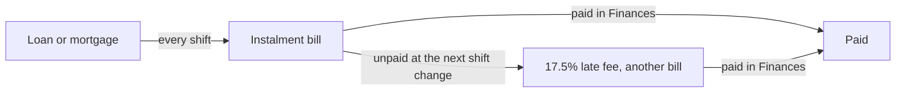

# Phobos Banking: player guide

Phobos Banking adds a **CREDIT** app to your PDA. It shows what you owe, read
straight from your own ledger, and takes you to the game's Finances window to pay.
Version 0.1.0 is a held draft: checked offline, not yet seen in play.

## Opening it

1. Open the PDA's home screen.
2. Tap **CREDIT**. The PDA closes and the Credit panel opens, the way the game's
   own Roster and Duties apps open their windows.
3. **Close** returns you to the game. **Overview** shows the totals again after
   you have looked at one debt; **Back** returns to the list on a narrow screen.

The F3 console does the same through `phobosbank`:

| Command | What it does |
| --- | --- |
| `phobosbank debts` | Lists your cash and every debt as text. |
| `phobosbank open` | Opens the Credit panel. |
| `phobosbank finances` | Opens the game's Finances window. |

The app is on the home screen. The quick bar under it is your own list in the
game's settings, and mods cannot add to it.

## What the panel shows

The list on the left holds three groups.

**Loans and mortgages.** The starting mortgage from Ogiso's Bank, mortgages on
ships bought through a broker, and fines, which the game books as debts repaid in
instalments. Select one for its lender, the balance still to repay, the next
instalment, how many instalments are left and when it was taken out.

**Bills to pay.** One-off charges waiting in your ledger: each loan's instalment,
docking fees, late fees and other bills. Late ones are listed first and marked.
Select one for the amount, when it was raised and the late fee the next shift
change will add if it stays unpaid.

**Regular charges.** Charges set up to repeat every hour, shift, day, month or
year, such as crew wages. Each raises a bill when it falls due. This group starts
folded; click its heading to open it.

With nothing selected, the **Overview** shows your cash on hand, the total left to
repay on your loans, what the next instalments come to, the bills waiting and how
many of them are late.

**Open Finances** opens the game's Finances window, where you pay. The panel
itself never pays, charges or lends anything.

## How the game's debts work

These are the game's own rules; the panel only reads them.

- A loan sends its instalment to your ledger as a bill at every shift change.
- A bill still unpaid at a shift change gains a late fee of 17.5% of it, and the
  fee is a bill of its own. Overdue instalments are marked as such.
- The game works each instalment out from the balance still owed and the
  instalments left. It adds no interest to the balance, so every instalment you
  pay comes straight off it and the next one is a little smaller. When a loan's
  term has run out the whole remaining balance falls due at once.
- Selling a mortgaged ship repays its lender from the sale first.

## Saves and removal

Nothing is saved. Remove the mod and the CREDIT app goes; your ledger is the
game's own and stays exactly as it was.

## Coming later

Lenders of our own, financing at the ship broker and local lenders with their own
stories are planned for later versions. None of them is in 0.1.0. The research and
plan are in [PDA apps and a banking mod](development/pda-apps-and-banking-research.md).

## Requirements

Ostranauts 1.0.1.5, BepInEx 5 and Phobos Framework 0.126.0 or newer. See
[installing the mods](installing-mods.md).
