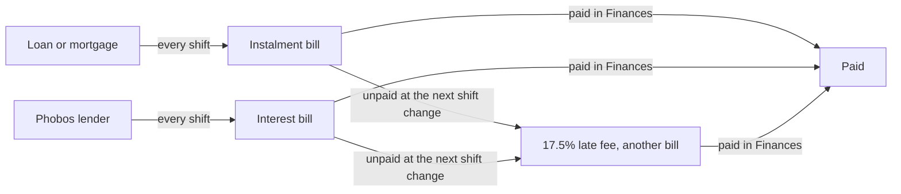

# Phobos Banking: player guide

Phobos Banking adds a **CREDIT** app to your PDA. It shows what you owe, read
straight from your own ledger, lets you borrow from lenders where you are, and
finances a ship or an apartment at the broker, gives you a credit line you can draw on
anywhere, and takes you to the game's Finances window to pay. Version 0.6.0 is a held
draft: the debts screen has been seen in play, but borrowing, broker financing, the
lender stories and the credit line have not.

## Opening it

1. Open the PDA's home screen.
2. Tap **CREDIT**. The PDA closes and the Credit panel opens, the way the game's
   own Roster and Duties apps open their windows.
3. **Your debts** shows what you owe; **Lenders** shows who lends. **Close** returns
   you to the game; **Back** returns to the list on a narrow screen.

The F3 console does the same through `phobosbank`:

| Command | What it does |
| --- | --- |
| `phobosbank debts` | Lists your cash and every debt as text. |
| `phobosbank lenders` | Lists every lender: where it trades, its rate, what it would lend you now, or why not. |
| `phobosbank borrow <lender> <amount>` | Takes a cash loan, as the panel's Borrow button does (for example `phobosbank borrow corvane-mutual 20000`). |
| `phobosbank loans` | Lists your loans from Phobos lenders: borrowed, still owed, rate and interest billed so far. |
| `phobosbank approve <lender> ship` or `home` | Asks a lender to pre-approve a ship or apartment purchase at a broker. |
| `phobosbank withdraw` | Drops your pre-approval; brokers are back to their own terms. |
| `phobosbank line` | Shows the credit line: opened or not, what you owe, what is available and the least due this shift. |
| `phobosbank openline` | Opens your credit line, from anywhere. |
| `phobosbank draw <amount>` | Draws cash on your credit line, from anywhere (for example `phobosbank draw 2000`). |
| `phobosbank open` | Opens the Credit panel. |
| `phobosbank finances` | Opens the game's Finances window. |

The app is on the home screen. The quick bar under it is your own list in the
game's settings, and mods cannot add to it.

## Your debts

The list on the left holds three groups.

**Loans and mortgages.** The starting mortgage from Ogiso's Bank, mortgages on
ships bought through a broker, fines, which the game books as debts repaid in
instalments, and loans from Phobos lenders. Select one for its lender, the balance
still to repay, the next instalment, how many instalments are left and when it was
taken out; a Phobos lender's loan also shows its interest rate and the interest
billed so far.

**Bills to pay.** One-off charges waiting in your ledger: each loan's instalment,
a Phobos lender's interest, docking fees, late fees and other bills. Late ones are
listed first and marked. Select one for the amount, when it was raised and the late
fee the next shift change will add if it stays unpaid.

**Regular charges.** Charges set up to repeat every hour, shift, day, month or
year, such as crew wages. Each raises a bill when it falls due. This group starts
folded; click its heading to open it.

With nothing selected, the overview shows your cash on hand, the total left to
repay on your loans, what the next instalments come to, the bills waiting and how
many of them are late.

**Open Finances** opens the game's Finances window, where you pay.

## Borrowing

Press **Lenders**. Lenders that will lend to you where you are come first, under
**Lending here**; the rest are folded under **Elsewhere**, each with the one thing
in the way: you are not near its home, it wants better standing with a faction,
you already have as many loans with it as it allows, or you owe it as much as it
lends one customer.

Select a lender for its terms:

- **Who they are**: accredited (registered, cheaper, choosier) or not, where they
  trade, and their own pitch.
- **Interest**: a share of what you still owe, billed at each shift change, and what
  a whole loan would cost in interest if you paid every instalment on time.
- **How much**: the smallest loan and the most you may owe them at once, and what you
  owe them now.
- **What for**: cash, ship purchases at a ship broker, or apartments from a real-estate
  broker, and the least you pay down for a purchase.

Choose an amount with the stepper, check the first instalment and the interest
estimate under it, then press **Borrow** and confirm. The money is paid into your
account at once.

The shipped lenders (agent choices for the owner to review):

| Lender | Where | Who may borrow | Interest a shift | Loans | A whole loan's interest, paid on time |
| --- | --- | --- | --- | --- | --- |
| Corvane Mutual | Around OKLG | Anyone OKLGCorp does not dislike | 0.025% | 5,000 to 250,000, two at once | about 6.7% |
| Halcyon Bond | Around Port Yangshan, Mars | Those warm with the Xinhua administration | 0.02% | 20,000 to 500,000, two at once | about 5.4% |
| Aerie Savings Union | Around Long Beach Terminal, Venus | Anyone | 0.03% | 5,000 to 300,000, one at a time | about 8.1% |
| Stillwater Advances (unregistered) | Around Port Independence, Ganymede | Anyone | 0.08% | 2,000 to 60,000, two at once; ships from 25% down | about 21.5% |
| The Narrow Ledger (unregistered) | Docked at Corsair's Hollow, Ceres | Anyone who finds the counter | 0.15% | 1,000 to 30,000, three at once | about 40% |

You can add lenders of your own or change these: see
[Adding a lender](editing-data-files.md#adding-a-lender).

## A credit line you can use anywhere

**Orrery Credit** is a credit line you open and draw on from your PDA, wherever you are
(owner choice, 7 October 2026). It costs more than a lender's counter, and says so: a fee
on every draw and a higher rate on what you owe. Its terms are agent choices for the owner
to review:

| Limit | Interest a shift | Fee on each draw | Smallest draw |
| --- | --- | --- | --- |
| 25,000 | 0.06% | 3%, added to what you owe | 500 |

1. Press **Credit line**, then **Open a credit line**. Opening costs nothing.
2. Choose an amount and press **Draw**. The panel shows the fee, what you will owe and the
   least you can pay each shift before you confirm. The money is paid in at once.
3. Repay in the Finances window. Each shift the line raises one instalment, the least you
   can pay, plus its interest. To pay off more, select that instalment and use **Prepay**.
4. Draw again whenever you like, up to the limit. Each draw spreads the whole balance over
   a fresh term, as the game's own Prepay does, so the least you pay each shift follows the
   new balance.

When the balance is paid off, interest stops, and the line stays open for next time.
Anything unpaid at a shift change gains the game's usual 17.5% late fee; nothing else
happens.

## Financing a ship or an apartment

The game's brokers sell used ships, and on Venus apartments, on their own mortgage
with at least half paid down. A lender can finance the purchase instead, with less
paid down:

1. At the lender's home, open **Lenders**, select the lender and press **Pre-approve a
   ship purchase** (or **Pre-approve an apartment**). It stands for one game day, for up
   to what the lender would lend you now.
2. At a broker where that lender trades, buy as usual. The purchase window's down
   payment now goes as low as the lender allows (Corvane Mutual 35%, Halcyon Bond 30%,
   Aerie Savings Union 40% for apartments), or higher if the price is more than the
   lender approved. The crew log says the terms when the window opens.
3. Confirm. The mortgage the broker writes becomes the lender's, with its interest
   billed at each shift change as on any of its loans. Selling the ship later repays
   the lender from the sale first, as the game does for any mortgaged ship.

The broker's own terms apply, and the crew log says why, when you have no
pre-approval, when it is for the other kind of purchase, when the lender does not
trade here or no longer lends to you, for a special offer (the broker finances those
itself, from nothing down) and when the price is too small for one of the lender's
loans. Paying in full uses nothing, and the pre-approval stays. **Withdraw
pre-approval** drops it.

### How a loan works

- The loan is a mortgage line in your ledger with the lender as creditor. The game
  raises its instalments, on the same schedule as any station mortgage: the first as
  you borrow, then one at every shift change, each a little smaller.
- The lender's interest is a separate bill at each shift change: its rate on what you
  still owe. A long time-skip bills every shift it crossed, as one line.
- Pay instalments and interest in the Finances window. Anything left unpaid at a
  shift change gains the game's 17.5% late fee, as any bill does. Paying early through
  the Finances window's prepay lowers what you owe, and with it the interest.
- When the loan is paid off, interest stops and the crew log says so.
- The lender's terms are fixed when you borrow: a later change to the lenders file
  never changes a loan you already have.

## How the game's debts work

These are the game's own rules; the panel only reads them.

- A loan sends its instalment to your ledger as a bill at every shift change.
- A bill still unpaid at a shift change gains a late fee of 17.5% of it, and the
  fee is a bill of its own. Overdue instalments are marked as such.
- The game works each instalment out from the balance still owed and the
  instalments left. It adds no interest to the balance, so every instalment you
  pay comes straight off it and the next one is a little smaller. When a loan's
  term has run out the whole remaining balance falls due at once.
- Selling a mortgaged ship repays its lender from the sale first.
- Not paying has only the game's own consequences: late fees, and the debt standing
  in the Finances window. Phobos lenders do not repossess anything.

Unregistered lenders lend to anyone, faster and dearer. Not paying them has the same
consequences as any lender: the game's late fee. Their letters may sound colder.

## Letters from your lenders

Each lender has an officer who writes when you borrow, when a bill turns late, when it
has been late for three game days, and when you pay a loan off. Letters arrive wherever
you are, in the crew log and the Letters window (click the goal they bring, or F3
`phobosframework story letters`). A late letter asks you to reply. Your answer only advances the story; it does not pay or defer the bill. Pay through Finances, and the late fee
still applies. Paying a Corvane Mutual loan off adds two standing with OKLGCorp.

Each lender also has a local advert, station news and small talk. An encyclopedia entry
covers credit by the shift.

## For story writers

Each lender leaves story flags a story pack can react to: `bank-<lender>-borrowed`
once you have borrowed from it, `bank-<lender>-repaid` once a loan from it is repaid,
`bank-<lender>-late` while any of its bills is late and `bank-<lender>-late-long` once
the oldest has been late for three game days. On each of those events Phobos Banking
starts the story arc `bank-<lender>-<event>` (`borrowed`, `late`, `late-long`, `repaid`)
if a story pack has one. The rules are in the
[stories handoff](development/banking-stories-handoff.md) and
[writing story content](writing-story-content.md).

## Saves and removal

Your ledger is the game's own. The loans you take from Phobos lenders are also kept in
one small Phobos record on your character: lender, terms and how far interest has been
billed. Remove the mod and the CREDIT app goes; the loans stay in your ledger as
ordinary mortgages owed to the lender's name, and no more interest is billed.

## Requirements

Ostranauts 1.0.1.5, BepInEx 5 and Phobos Framework 0.127.0 or newer. See
[installing the mods](installing-mods.md).
