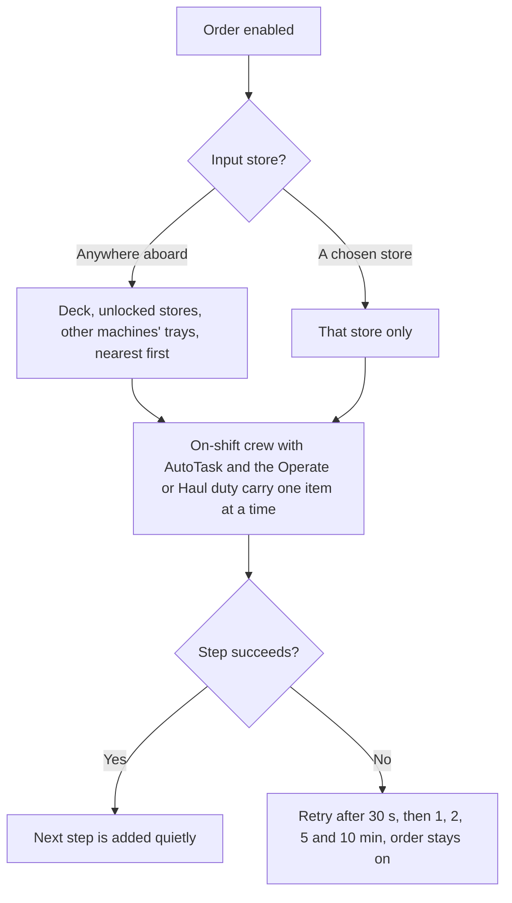
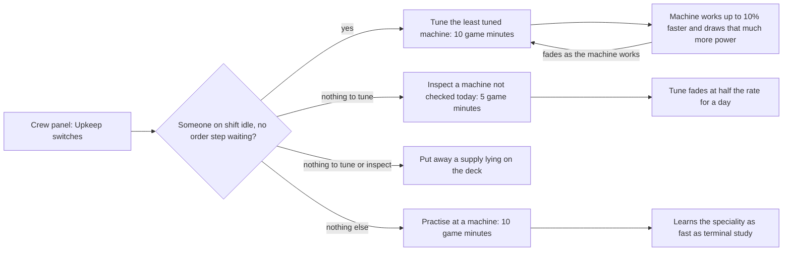
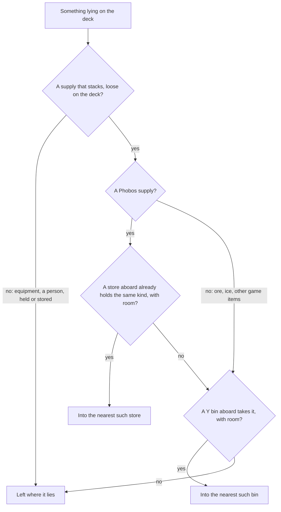
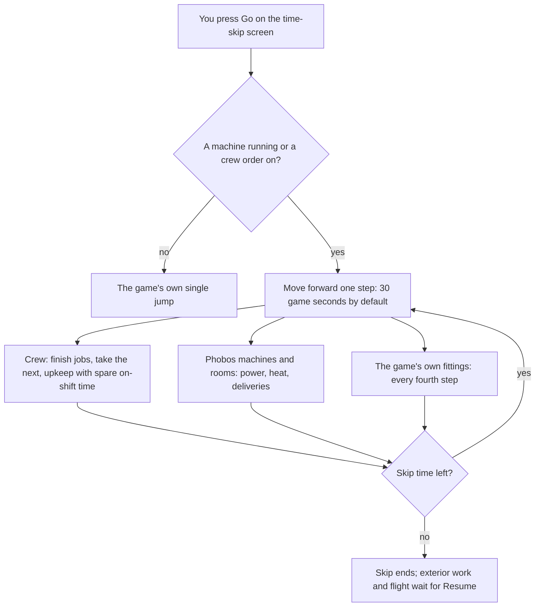

# Crew standing orders, training and time-skips

The current console redesign uses compact views and checked drafts. See the
[control-panel guide](control-panel-guide.md) for Apply/Discard, storage selection,
ship picking, training and the separate Unity validation checklist.

Prepared in Framework 0.25.0, Agriculture 0.12.0, Shipbreaker 0.25.0 and
Auto Nav 0.19.0. These are unpublished development candidates. Automated
checks do not establish in-game behaviour or UI fit.

The owner's subsequent game report exposed repeated `CrewWork.Poll` null
exceptions. Framework 0.25.1 uses Blue Bottle Games' company crew roster
(`JsonCompany.GetCrewMembers`), as the native time-skip screen does; the older
`CrewSim.aCrew` field is not populated in the inspected 1.0.1.5 code. Work discovery,
controls and skip preview share the correction. Auto Nav 0.19.1 also fixes its
departure check through this service, retaining a block for unresolved or away crew.
These are code-inspection findings, with owner-observed exceptions; successful
live operation after the fix still needs owner confirmation.

Agriculture 0.12.1 fixes a separate logged `Protected dosing binding` fault and
the related idle/recovery workup save format. Absent selections use explicit
markers accepted by the saved-state wrapper, while exact input IDs and paid
energy remain intact. Restart and reload after installing. Transient session
faults are revalidated; genuinely corrupt, future or foreign saved records remain
protected. No automatic save repair or cargo replacement is performed.

## Giving work to the crew

Open **Crew standing orders and training** from the roster, an equipment
panel, the C1 console or the Auto Nav hub's details page. Since Framework
0.116.0 a machine's right-click **Maintenance** sheet also shows its order and
its upkeep, with **Open standing orders** and **Open upkeep switches** buttons
that open this panel on that machine's order or on the Upkeep tab. Orders begin
disabled. Choose the equipment's crop/process, target stock, source store
and destination store, then Apply and Enable / Resume. Turn on AutoTask and enable the native
Operate or Haul duty for the intended worker. Native repair, construction,
restoration and demolition remain native tasks; this feature does not replace them.

The input store may be **Anywhere aboard** (Framework 0.38.0): crew then take
supplies from the deck, unlocked stores and other machines' product trays on
the same ship, nearest first, the way the game's own PDA Reload job searches.
Items lying on the deck are carried like items in a store, in ordinary play
and during a time-skip. On the Shipbreaker D4, R4 and F6, right-click
**Load feed by crew (on/off)** switches such an order on (anywhere aboard, no
practical stock limit) or off without opening the panel; a store already
chosen in the panel is kept. Shipbreaker 0.35.0. Manufacturing's charge
machines and the RM-1 feeder have the same switch since Manufacturing 0.56.0.

Crew never take from someone's hands, a locked container, or anything that is
not really a store: a ship weapon's magazine, a battery charger, a scrubber's
filter holder, a nav console's module slot, a toilet or another mod's bottle
pump (Framework 0.116.0). The same rule keeps those out of every store picker.
It is Framework's `stores` data pack, so equipment from other mods can be added
([editing data files](editing-data-files.md#what-counts-as-a-store)).

This is how an enabled order finds its supplies and what happens when a step
fails.

Crew work only during their work shift. Any crew member the game admits may
take a step, as with a painted job. Needs are the game's business: hunger,
thirst, tiredness and pain do not block a step, because the crew's own pledges
send them to eat, drink or rest first. Unconsciousness, combat, emergencies,
access restrictions and direct queued orders still take precedence. (Since
Framework 0.36.0. Earlier versions refused work for crew who were merely not
rested, sated or slaked, and only your own character could ever take a task.)
Agriculture, Cooking and Industry permissions initially
allow eligible crew; Exterior permission starts off. Change permissions per
person under Crew & Training, then Apply. Turning off AutoTask or a duty cancels that worker's
generated work without deleting cargo.

Crew travel to the equipment and carry supplies one item at a time. Selecting
a portrait does not make that person the worker. The job reserves its equipment,
inputs and output space, then checks them again before finishing. Tasks from
other mods remain available.

Enabling an order announces one task to the crew, as painting a job does: the
game then interrupts study for everyone on shift, once. Later steps of the same
order are added quietly, so a crew member already studying finishes that session
before taking the work. A step that fails (a machine that cannot start, a full
store) is retried after 30 seconds, then 1, 2, 5 and 10 minutes; the order stays
enabled, its status shows the wait and the reason, and the worker is free for
native tasks, study and rest in between. Since Framework 0.35.0.

Stock targets count output units in the equipment and its approved destination.
Industrial processors count their recipe products, excluding unrelated cargo.
A complete recipe or crop harvest can exceed the target; recipes are never
split or their yields changed. Hauling uses only the selected stores and real
items. Missing supplies, inaccessible routes, insufficient carrying capacity
and full destinations leave the work pending.

## Supported equipment

| Equipment | Standing work |
| --- | --- |
| Firstlight-4 | Chosen potato, lettuce or lettuce-seed cohort; finite water/nutrient replenishment; harvest and replant; move produce/residue and surplus planting stock |
| Hearth-2 | Bring raw potatoes, start cooking and store portions |
| Groundwork B2 | Bring characterized residue or concentrate/makeup, prepare the selected workup, start it and store physical products/rejects |
| W2 | Finite stock replenishment, configured route operation, recorded-drainage recovery and its cartridge supply; existing route and solution settings remain authoritative |
| D4 / R4 | Supply valid loose feed (for the D4: ordinary walls of any make, floor grates, DuraWal, Whipple and aero panels, windows), start one checked batch and clear physical products to the approved store; Load feed by crew is the right-click shortcut |
| C2 collector | Enable its existing configured collection route and clear accepted cargo |
| Fennmark L2 | Bring loose suit O2 bottles below 90% from the approved store or anywhere aboard into the rack, start it in Fill mode, and take charged bottles to the approved store when one is chosen; Keep suit bottles charged is the right-click shortcut. Never from a suit, hands, a locked container or another L2 (Manufacturing 0.5.0) |
| V4, LC-3, SA-3, Copperhead-3, EC-4, CR-4 | Bring feed for one charge at a time from the approved store or anywhere aboard into the machine's inventory, start a paused machine when a whole charge is in, and take its products to the approved store when one is chosen; Load feed by crew is the right-click shortcut. Charges made of the machine's own products (V4 steel, pyrolysis, carbon burn) stay yours to start; an LC-3 needs a recipe chosen first; a machine that stopped for a fault is never restarted by crew. Never takes feed another of these machines is waiting on (Manufacturing 0.56.0) |
| RM-1 feeder | Keep two declared remainders waiting in its inventory, from the approved store or anywhere aboard; it grinds them by itself while it has power. Load feed by crew is the right-click shortcut (Manufacturing 0.56.0) |
| T2 thaw unit | Supply single blocks of water ice from the approved store or anywhere aboard, start thawing when the linked vessel has room, and clear gangue to the approved store; Load feed by crew is the right-click shortcut |
| F6 | Supply exact 1 kg pieces of the metal the selected recipe takes, replenish an already enabled managed coolant circuit, and perform an explicitly permitted seal/run/equalize/release sequence. While the furnace's own [repeat run](furnace-player-guide.md#repeat-batches) is on, crew keep supplying and clearing but leave the hot steps to it |
| G4 | Prepare and launch/resume the existing exact reclamation mission through its recorded capture, equipment and Auto Nav bindings |
| N1 / N2 at Polaris | Launch one explicitly permitted resume of an already recorded flight to the selected target |

Agriculture preserves a reserve unit of source planting stock and the configured
crew-water reserve when taking loose water rations. Rack-grown planting stock is
retained for replanting. Clearing dead/unwanted living crops and draining usable
solution each require their own explicit permission. Crew work follows the same growth, supply, power, cooling and machine safety
rules as manual work. Routine work does not invent a fertilizer recipe for wet rejects.

Drain is a one-shot order: after draining, its permission is consumed and the
standing order suspends, so replenishment cannot create a drain/refill loop.

Choose the water route, formulation, collector connections and coolant mode
through their existing controls first. Orders do not redesign those systems.
Repairs still need native tasks, tools and materials. Captured coolant is not
silently discarded or automatically drained.

Hot furnace batches need the hazardous-operation permission. G4 and flight
orders need both that permission and the exact recorded target. They consume
one launch permission; tracking loss, obstruction, stopping or completion cannot
start a new attempt without Resume. Existing ownership, EVA/access, pressure,
occupancy, sensors, capture and flight-authority checks remain in force. There is
no automatic target acquisition, purchase, sale, disposal or enlargement of a mission.
Changing the recorded equipment chain, flight settings or docking ports also
requires a fresh Enable/Resume; the stored permission cannot authorize a replacement.
Manufacturing's charge machines and the RM-1 take loading orders since
Manufacturing 0.56.0; its other machines (X2, K2, AX-2, Corker-2) take gas or
liquid from linked stores and need no hauling. Changing a charge machine's
recipe, preference or links on its Control Panel suspends an enabled order
until you Resume it, as for every machine, and Pause or Cancel on the panel
stops the order. An RM-1 order can take remainders another machine could use,
such as gangue an LC-3 would wash, when they lie loose or sit in an ordinary
store. What waits in the LC-3's own tray is left alone; to keep the rest, give
the RM-1 order its own input store in the Crew panel.

## Learnable specialities

Agriculture, Cooking and Industrial Processing have persistent progress visible
in the crew overview and a native character skill when qualified. Existing crew
start at zero. Novices remain eligible. A qualified available worker is preferred
over a novice at the same native duty priority; higher-priority duties still win.

The initial authored balance is 20 completed practical hours, 10 study hours, or
a proportional mixture. Qualification reduces relevant hands-on duration by 20%.
Skill by itself does not shorten crop growth or machine cycles, and nothing here
increases output, improves resource efficiency or awards credit for idle
machinery. Since Framework 0.111.0 crew can tune a machine so it works faster for
the same materials and electricity per job; see
[Upkeep on long hauls](#upkeep-on-long-hauls). Cancelled and failed
operations grant no training. Travel/hauling does not train a production speciality.
Existing engineering/EVA/piloting skills retain their native roles.

**Studying at a terminal (0.35.0).** Right-click a powered terminal and choose
Study Agriculture, Study Cooking or Study Industrial Processing. The session runs
exactly like studying a native skill: the same stages, tablet animation, side
interests and challenges; it stops when the crew member is already proficient,
would rather find meaning or company, or another crew member is using the
terminal; the work shift interrupts it; Stop cancels it; and a time-skip
continues it hour by hour. Each completed study step credits the speciality. The
terminal's existing actions, including those supplied by
[jossla's Study at Terminals](https://steamcommunity.com/sharedfiles/filedetails/?id=3788237703),
are kept. An unpowered, loose or damaged terminal is not study material, as in
the game. The earlier 15-minute study action is retired; a save that queued one
still loads.

**AutoTask crew study on their own.** The game picks study from each crew
member's AI history for needs such as privacy and self-respect. On load, the
vanilla construction-study entries are copied for each speciality into every
crew member's history and into the new-crew template, only where absent; the
game keeps learning from there. Nothing learned is overwritten or removed. A
crew member with AutoTask off, on a work shift with tasks available, asleep, in
combat or drafted does not study, as in the game.

**Finding out why nobody studies.** In the F3 console type `phobosframework crew`
(or `phobosframework crew Name`). It lists, per crew member, AutoTask, shift, the
current action and whether they can study; per terminal, whether the game admits
study there and how many are using it; whether Phobos study is in each crew
member's AI history; and each order's retry wait. It changes nothing.

These training thresholds and the duration factor are gameplay choices,
maintained with the [constants updater](development/updating-constants.md).

## Upkeep on long hauls

Standing orders run out on a long flight: the racks are planted, the charges are
loaded and the crew stand about. Upkeep gives idle crew four things to do:
**Tune machinery** and **Inspection rounds** (Framework 0.111.0), and
**Housekeeping** and **Practice at machines** (Framework 0.113.0). Each is a
switch for the whole crew, off until you choose it.

1. Open **Crew standing orders and training** (from the roster, an equipment
   panel, the C1 console or the Auto Nav hub) and choose the **Upkeep** tab.
2. Choose **Turn on** beside each kind of work you want; the footer says what
   it switched.
3. Leave the crew on shift with AutoTask on, as for standing orders.
   Housekeeping also needs the Haul duty.

Below the switches, the machines are in groups (Framework 0.117.0): **Needs
attention** lists a machine not tuned yet while tuning is on, one whose
inspection is due while rounds are on, or one whose record could not be read;
**Looked after** and **Inspection only** are folded. Choose a machine for its
tune and last inspection. **About** opens the encyclopedia's upkeep article,
which holds the full explanation of each switch. Since Framework 0.118.0 the
Upkeep tab counts the machines needing attention, "Upkeep (3)", and amber marks
what needs you across the Crew panel; see the
[control panel guide](control-panel-guide.md#finding-controls).

The F3 commands do the same: `phobosframework upkeep tune on` (or `off`), and
likewise `inspect`, `practice` and `tidy`; `phobosframework upkeep` lists the
switches, the settings and every machine's tune. They are optional; the panel
does everything.

Upkeep is the last thing crew do. A crew member takes an upkeep task only when
they are on shift and idle and no standing order has a step waiting. Among
upkeep, tuning and inspection come first, then housekeeping, then practice.

### Tune machinery

- **What crew do:** one session at a machine takes 10 game minutes and adds a
  fifth of a full tune, or three tenths for a crew member skilled at that
  machine. Skilled means the machine's own speciality (Industrial Processing,
  Agriculture, Cooking) or, for Manufacturing's machines, the game's mechanical
  engineering skill.
- **What you get:** a fully tuned machine works 10% faster. Charges, batches,
  thaws, cuts, cooking and crops finish sooner.
- **What it costs:** while it works, a tuned machine draws that much more power
  and gives off that much more heat. The electricity for each job is the same;
  it is spent sooner. Check your reactor and cooling have the margin.
- **What never changes:** what a job takes and what it gives. Recipes, yields and
  masses are untouched.
- **How it fades:** the tune wears off as the machine works, a full tune over 36
  hours of work. A machine standing idle keeps its tune.
- **How it is lost:** damage, or taking the machine off its mount, clears the
  tune.

A machine's panel shows its tune on the last line, such as
"Tune: +6% work rate and power draw, fading as it works."

### Inspection rounds

- **What crew do:** a 5 game-minute visit to each machine not inspected in the
  last 24 game hours.
- **What you get:** an inspected machine's tune fades at half the rate while the
  inspection is good. If the machine is waiting for something, or is more than
  half worn, the crew member says so in the crew log. A machine in good order
  gets no log line.
- Phobos machines take no wear from running, so an inspection does not slow
  wear: damage still comes only from the game's own fire, combat and accidents.

### Housekeeping

- **What crew do:** carry supplies lying loose on the deck to a store, one
  item at a time, as a standing order hauls.
- **Where things go:** a Phobos supply goes to the nearest store that already
  holds the same kind of item. If there is none, it goes to a Rivetline Y bin
  that takes it. Anything else (mined ore and ice, for example) goes only into a
  Y bin that takes it. The crew never sort the game's own clutter into your
  lockers.

- **What is left alone:** anything in someone's hands, in a container, a
  machine's tray or a bed's drawer; equipment waiting to be installed (only
  supplies that stack are moved); items another job is carrying; and anything
  with no store it fits. Nothing is ever put into a machine.
- **Who does it:** crew on shift with the Haul duty who are allowed industrial
  work in their crew settings. Hauling does not train a speciality.

### Practice at machines

- **What crew do:** a crew member not yet skilled at a machine practises at it
  for 10 game minutes.
- **What you get:** they learn the machine's speciality as fast as studying at
  a terminal: about 60 sessions, or 10 hours, from nothing to skilled. The
  machine is not changed.
- **Which machines:** those whose speciality is a Phobos one: Industrial
  Processing (Shipbreaker's machines), Agriculture and Cooking. Manufacturing and
  Medical equipment is worked with the game's own skills, which are learned the
  game's own way.
- **Who does it:** only crew who are not yet skilled and are allowed that kind
  of work. In play, one crew member practises a speciality on a ship at a time.

### Which machines

| Mod | Tuned and inspected | Inspected only |
| --- | --- | --- |
| Phobos Shipbreaker | D4, R4, T2, ML-2 | F6 furnace |
| Phobos Manufacturing | Charge machines, X2, K2, AX-2, Corker-2, RM-1, L2 | A2 regulator |
| Phobos Agriculture | Firstlight-4 racks, Hearth-2, B2, W2 | |
| Phobos Medical | | Ward-3 bed, Vigil-2 monitor |

Stores, silos, pipes and belts take no upkeep. A patient never inspects the bed
they lie in.

### Settings

In Framework's config file (`BepInEx/config`), section `Upkeep`:

| Setting | Default | Range | What it does |
| --- | --- | --- | --- |
| `InspectionMinutes` | 5 | 1 to 30 | Game minutes to inspect one machine |
| `TuningMinutes` | 10 | 2 to 60 | Game minutes for one tuning session |
| `MaxTuningGain` | 0.10 | 0 to 0.25 | How much faster a fully tuned machine works; 0 turns the benefit off |
| `TuneFadeHours` | 36 | 6 to 240 | Hours of work for a full tune to fade to none |

The practice session's length and the other figures are in the `upkeep` data
file; see
[Tuning crew upkeep](editing-data-files.md#tuning-crew-upkeep). All of them are
authored game balance.

### During a time-skip

Upkeep does not slow a skip and does not take crew from the game's own repairs.
Each skipped step, the on-shift time of crew with AutoTask on is spent on upkeep
directly, in the same order as in play, with walking counted by distance. Running
machines fade their tune through their ordinary stepped work, so a long haul
settles to a steady tune rather than a full one.

## Time-skip

**Machines keep working through a skip** (Framework 0.99.0). Whenever a machine is
running or a crew order is on, the skip moves forward in steps, so machines draw
power, warm their rooms and deliver their products much as in ordinary play, and
crew carry out their orders. You need no crew order for machines to work. With
nothing running and no order on, the skip is the game's own single jump.

**The step is 30 game seconds by default** (Framework 0.112.0). The game freezes
while a skip runs, and each step takes about the same real time whatever its
length, so the step decides how long you wait. Before 0.112.0 a skip with crew
orders on moved one second at a time: on the owner's PC that was about 14 ms per
skipped second, roughly five minutes for a six-hour skip.

To change the step, close the game and set `StepSeconds` under `[TimeSkip]` in
`BepInEx/config/phobosgekko.ostranauts.framework.cfg`, from 1 to 60.

| Step | Wait | What you give up |
| --- | --- | --- |
| 1 | Longest: the behaviour before 0.112.0 | Nothing; the most faithful |
| 30 (default) | Short | A little crew and machine time, see below |
| 60 | Shortest | More of the same; heavy machines may stall |

What a longer step costs:

- Crew take their next job only when a step ends. Seconds left over from a job
  start the next one, so little crew time is lost.
- A machine that finishes a batch partway through a step may wait for the next
  step before starting another.
- Each MHD generator is topped up once a step. On its own it can feed about
  240 kW at 30 seconds and 120 kW at 60. Batteries wired to the load supply too, and
  the reactor keeps charging them as in play.
- A machine checks each step's heat against its room. A long step puts more heat
  in at once, so a busy machine in a small room can wait for cooler air the whole
  skip. If that happens, lower the step.

The game's own powered fittings (lights, doors, life support) take their power
every fourth step, from the same supply as the machines; Phobos machines,
crew-ordered equipment and rooms every step.

**The ship's air is paused in a skip.** The game runs its breathing, air
scrubbers, coolers, heaters and the air through open doors only between frames,
and a skip runs inside one frame. A room with Phobos machines therefore only gains
heat during a skip, and a grow room only loses CO2. Agriculture (0.65.0) gives off
no room heat in a skip and lets a crop short of CO2 wait unharmed, unless you turn
on its own setting; see [time skips](agriculture-player-guide.md#time-skips).
Other mods' machines still heat their rooms.

The native time-skip screen retains its collision warnings, roster display and
Go control. Its Phobos estimate (Framework 0.117.0) gives each crew member one
line for the hours ahead and puts the enabled orders in **Will run**, **Waits**
(with the reason) and **Paused for the skip**. This is a read-only indication, not a guaranteed production
forecast: later shortages, heat, damage, route changes or crew needs may stop work.

During a managed skip, the native world clock advances in steps of the chosen
length, split at the hour so the roster's shifts apply. A crew job finishes with
the step it ends in. Native power consumption and received-power callbacks
advance existing machine services. The game charges a battery by a fixed share
of what it lacks at each power step, not each second, so the reactor and battery
chargers take every step in one-second slices; before 0.112.0 machine-only skips
charged batteries at a tenth of the usual rate. Finite water,
nutrients, coolant, gas/heat headroom and output space still limit production.
Normal power update epochs are settled so the following ordinary frame cannot
charge those same seconds again.

Each worker has one budget. Travel is conservatively charged from a checked
native path at an authored two seconds per tile, with a return via the worker's
starting position for a pickup. Handling and productive interaction time are
also charged. The character is not teleported; skipped carrying is a checked
transfer of the exact physical unit after the time budget has been spent.
Ordinary play uses actual walking and carrying.

The existing native abstract rest/personal-care/context effects, risk/event rolls,
fuel, payroll and end-of-skip condition handling remain native. A native active
context from the frozen native preview or an existing direct action reserves that worker instead of allowing
simultaneous Phobos labour. The game's own repair allowance is kept and scaled
by the share of on-shift crew time that Phobos jobs left free (Framework
0.36.0; earlier versions replaced it with a much smaller count). Phobos does
not simulate additional meals, sleep sessions or
Common Sense errands behind that abstraction. Queued native actions retain their
native catch-up behaviour.

Native preview rest hours are reserved in full. A partial-hour roster boundary
can therefore defer work until both the preview's work allowance and the actual
roster permit it; the coordinator never borrows those native rest minutes.

Exterior missions and automatic manoeuvres suspend before every skip, including
skips with no onboard standing orders. They require explicit Resume afterwards.
Unsupported phases remain pending. Interrupted crew steps receive no completion
or training credit; physical items and completed machine progress remain. Faults
suspend affected work. A six-hour skip is not permission to bypass a batch,
cooling or input limit.

## Saving and optional compatibility

Standing orders, permissions, exact bindings, training and stop reasons are saved
in Framework's versioned object maps. Routine Agriculture and collector orders
can revalidate after load; each has a resume-after-loading option. Shipbreaker
loading orders on the D4, R4 and a non-hazardous F6 order carry on after loading
like a painted job (owner decision, 29 September 2026); hazardous F6 orders,
exterior missions and crew-launched flights require Resume. A manual
Stop is sticky. Unknown or corrupt saved records are retained and blocked.
Transient task claims and reservations are rebuilt from the saved intent.

Integration with [LOGUSS's Common Sense modules](https://steamcommunity.com/sharedfiles/filedetails/?id=3789049955)
uses the game's native task system. Common Sense is optional, and no module is
replaced or required. Hauling/storage ordering, sleep and firefighting remain
owned by their existing providers. Local inspection covered Behavior 0.12.6,
SalvageStorage 0.12.14, Manifest 0.12.10, Firefighting 0.12.6 and Finances 0.12.6;
this is interface evidence, not an in-game compatibility certification.

The engine basis is the locally installed 1.0.1.5 game by
[Blue Bottle Games](https://store.steampowered.com/app/1022980/Ostranauts/):
WorkManager claiming/duty order, native pickup and path checks, and GUIFFWD's
single clock boundary and abstract effects. Game code and third-party mod
binaries are not redistributed. The training and travel balances above are
our authored simplifications, not findings endorsed by those authors.

## Verification and owner checks

Automated coverage includes default-disabled and protected orders, manual stops
and reload policies, atomic competing reservations, combined practice/study
thresholds, one/six-hour budgets, real hour boundaries, native method/field
contracts, additive terminal actions and preserved native replies. The existing
material, fluid, power, furnace, reclamation and persistence suites remain part
of the affected builds. See the repository's build output for actual run results.

On 26 September 2026, both affected build scripts completed against local
Ostranauts 1.0.1.5 / BepInEx 5.4.23.5 with no compiler warnings or errors:

| Automated suite | Result |
| --- | --- |
| Framework public assembly/recovery | 8,639 checks passed |
| Native definition/registration contracts | 9,972 checks passed |
| Agriculture | 800 checks passed |
| Shipbreaker processing/material contracts | 8,378 checks passed |
| Reclamation, saved-grid loading, shared observations | 32, 15 and 31 checks passed |
| Auto Nav | Numerical guidance, torch, docking/industrial, sensor, manual-override and fire-control suites passed |
| Repository maintenance | All 59 Python tests passed |

Counts describe assertions in offline suites, including existing regressions;
they are not counts of live crew scenarios. No Unity/game session was controlled
or used to claim gameplay validation.

The 0.25.1/0.12.1/0.19.1 corrective builds subsequently passed 8,639 Framework
checks, 17 roster checks with native boundary doubles, 824 Agriculture checks
and 9,973 native definition/API checks, plus the existing Auto Nav suites.
The roster checks reproduce an absent legacy crew list alongside valid, missing,
destroyed and partially loaded members, including stricter departure admission.
Agriculture tests exercise idle, recovery and formulation through the actual
saved-state wrapper, preserving input IDs, paid energy and protected records.
These tests confirm the corrected code paths offline, not live Unity behaviour.

Gameplay validation remains owner-run. Check these on a copy of an ordinary save:

- AutoTask off/on, disabled duties, role permissions, shift changes, sleep,
  hunger, thirst, injury, emergencies and manual takeover.
- Two workers competing for one machine or store, blocked doors/routes, full
  hands/stores, stacked supplies, interrupted pickup and cancellation.
- Every supported production chain, seed/water reserves, output targets,
  coolant service and furnace interlocks; occupied exterior work areas and
  changed targets must block.
- Partial/shared power, rising room heat, depleted fluids and material totals
  before/after one- and six-hour skips; no repeated output, energy or training
  on the next ordinary frame.
- Save/reload with active, suspended and manually stopped orders; native
  terminal study and repair tasks; Common Sense present, absent and disabled.
- With a rack order enabled, a crew member who starts studying at a terminal
  keeps studying while hauling steps come and go; a fresh Enable interrupts once.
- Study Agriculture from a terminal's menu: stages, animation, Stop, the
  work-shift interruption and progress in Crew & Training; a one-hour skip while
  studying credits an hour. Later, an idle AutoTask crew member with unmet
  privacy or self-respect needs picks Phobos study by themselves.
- A machine that cannot start shows the retry wait on its order and the worker
  goes idle; PDA uninstall/repair painting on a terminal still works;
  `phobosframework crew` explains any blocker and names who could take each
  step right now.
- An NPC crew member with AutoTask on takes a rack or tray order; a thirsty or
  tired crew member keeps working until the game's own pledge sends them to
  drink or rest; two orders that feed one tray both run.
- A six-hour skip repairs about as much as the unmodded game; with heavy
  Phobos work it repairs proportionally less. Training progress keeps rising
  after many sessions.
- Cancelling a dismantle or repair finish with cargo present leaves no stuck
  task in the crew task list. Escape while picking a store closes the picker
  first, then the panel; pause and time-scale keys work while picking.
- Roster/equipment/time-skip controls at the owner's UI scale. Native component
  checks do not verify Unity layout, pathfinding or live patch interoperability.

Use the guarded installer and installed-file verification while the game is
closed. These candidates have not been published to Steam.

## Jobs the ML-2 queues

The mining laser's two crew settings are not Phobos standing orders. They queue the
game's own Haul and Mine jobs on what the laser leaves on a moored rock or hull, so
the game's duties (Haul, Demolish), tools and haul zones apply, and the PDA cancels
them. See [crew jobs](shipbreaker-mining-laser.md#crew-jobs).
