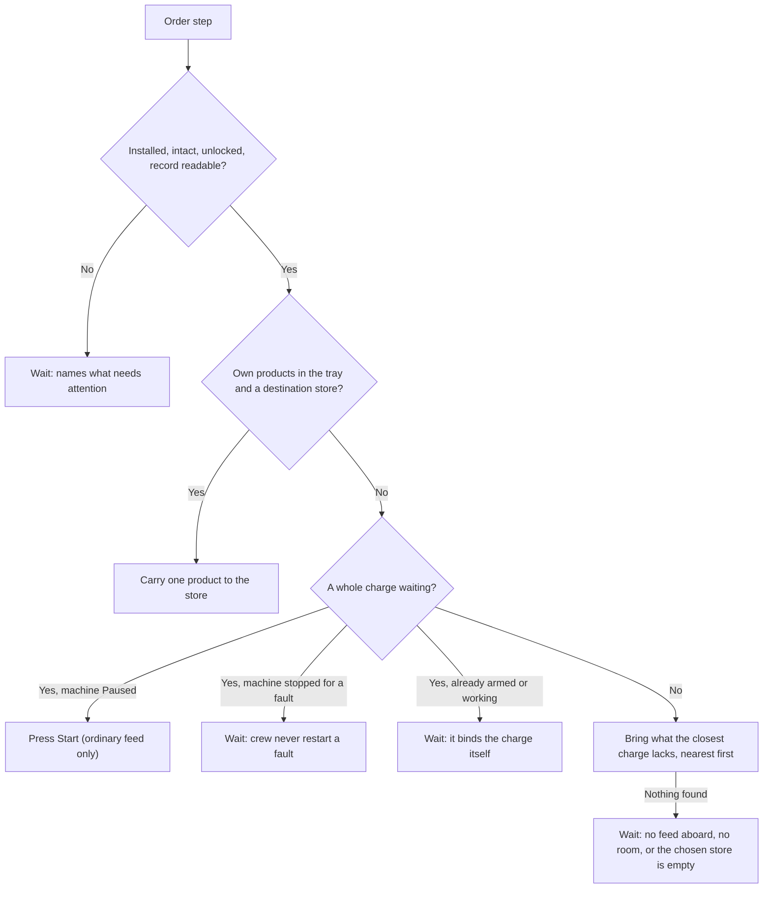

# Store filter, Manufacturing crew loading and the Maintenance sheet

Framework 0.116.0 and Manufacturing 0.56.0, prepared 6 October 2026. Not yet seen
in the game; the owner checks are in the
[Manufacturing guide](../manufacturing-player-guide.md#owner-checks-game-closed-scriptsinstall-modsps1--mods-shipbreakermanufacturing).

## What prompted it

The owner's screenshots of a Fennmark V4 refinery (6 October 2026) showed:

- **Store pickers offered things that are not stores.** Take feed from and Send products
  to offered the ship's CIWS turret. The list of stores aboard but not offered was padded
  with a toilet, the Testudo safe pump and racks. Cause: `CrewWork.IsStore` accepted any
  root object with an unlocked native container, and the turret's 20 mm magazine is one.
- **The V4's panel had no Standing orders section.** Nothing was removed. The shared panel
  shows that button only for equipment with a registered crew provider, and Manufacturing
  had registered one only for the L2. The owner most likely remembered the industrial
  panel of the D4, R4 and F6, which always shows it.
- **The owner asked for a right-click Maintenance entry** in place of Maintenance
  information, to hold standing orders and upkeep.

## Owner choices (6 October 2026)

- Add Manufacturing feed orders and the Maintenance sheet, rather than the sheet alone.
- Apply the store filter everywhere stores are listed, not only in the two pickers.
- Filter the obvious things (weapons first); the owner accepts that other mods' equipment
  cannot all be anticipated.

## What was built

### The stores data pack (Framework)

`mods/PhobosFramework/framework/stores.json` is a rule built from the game's own names, so
it is a data pack with a validator (`StoreSchema`, `scripts/validate-data-packs.py`), a JSON
Schema and a [guide section](../editing-data-files.md#what-counts-as-a-store).

- **`excludeConditions`.** `IsShipWeapon` is on all 27 of the game's installed weapon
  containers (read from `condowners_ship_combat.json`, game build 1.0.1.5); the list also
  holds chargers, scrubbers, nav consoles, sinks, toilets, the Water Recycler mod and
  Testudo's safe pump.
- **`excludeContainers`.** Single-purpose container rules such as `TIsFitAmmo*`, filter,
  nav-module, liquid and bottle slots.
- **`requireInteraction: Inventory`.** A container the player cannot open from its menu
  (the toilet, the coffee machine, kiosks, a cargo lift) is not a store.

`CrewWork.IsStore` applies the rule, which covers the pickers, crew-order stores,
housekeeping and Shipbreaker's storage picker. `CrewLogistics.Available` refuses to take
from anything sealed (a weapon, charger, filter holder or pump slot). The verdict is cached
per definition id.

The native check confirms that the game's racks, bins, fridge and secret compartment stay
stores, and that every installed Phobos container does too. The exception is the legacy
NoNewCargo compartments of the radiator, thermal port and A2, which take nothing new; they
were already useless as stores.

### Load feed by crew (Manufacturing)

`FeedCrewProvider` serves the six charge machines and the RM-1, modelled on Shipbreaker's
loading order and the L2's bottle order. The pure plan is `Core/CrewFeedRules`.

The candidate charges are what the machine could bind as it stands: the LC-3's selected
recipe, or the available recipes whose drawn commodities have a linked store.

### The Maintenance sheet (Framework)

`MaintenanceInformation.Register` keeps its signature and every mod's interaction id. Only
the title changes, to Maintenance. An installed machine with a crew provider or an upkeep
family gets three sections:

- **Standing orders**, with a button to the Crew panel on that order.
- **Upkeep**, with a button to the Upkeep tab.
- **Removal and repair.**

Everything else keeps the removal notes alone. `ItemInformation` gained sections and
link buttons and rereads its text once a second. The buttons only call `CrewPanel.Show`,
and a refusal is shown with `CrewPanel.Unavailable`'s reason. The ProviderPanel's own
Standing orders button stays.

## Agent defaults (owner may revise)

- **Crew press Start only on a Paused machine with a whole charge waiting.** They never
  restart a machine that stopped for a fault; the player looks first.
- **Crew never make a charge of the machine's own products.** Steel, pyrolysis and carbon
  burn stay the player's Start, matching the machine's own rule that it never repeats one
  by itself. The crew's Start passes `ownProducts: false`.
- **One charge at a time.** Crew bring nothing more once a whole charge waits.
- **The RM-1 keeps two remainders waiting.** That is half its four cells, so a hand still
  has room.
- **Never take feed another of these machines would take from its own tray**, so two V4s
  do not swap ore back and forth.
- **Equipment with these orders still counts as a store** (`ICrewStoreEquipment`). An LC-3
  may keep sending residue to a V4, and any machine its remainders to an RM-1.
- **The L2's provider now implements `ICrewSkipProvider`.** Before, a crew provider
  without it made the time-skip leave the machine unstepped
  (`CrewSkip.Advance`); this release would otherwise have introduced the same gap to every
  charge machine. The L2 change is a fix carried in this feature release.
- **The filter includes liquid containers** (`TIsFitContainerLiquid`: the game's water
  tanks and sinks). Ship's Water and process water reach machines through lines, never as
  stores.

## Saved structures

- **Framework crew-order record.** Written on these machines only once an order is set;
  the format is unchanged. No record reads as the default disabled order. Recipe ids
  `load-feed` and `load-remainders` and the interaction `PhobosManufacturingFeedOrder` are
  stable.
- **No new saved state** for the store rule or the sheet. A saved feed or product store
  that the rule now excludes stays recorded; the machine stops using it and says so.

## Known limits and risks

- **Other mods' equipment** is filtered only by the listed names or a missing Inventory
  entry. Players can extend the pack.
- **An RM-1 order can take loose remainders another machine could use.** Remainders
  waiting in an LC-3's tray are safe.
- **A panel change suspends an enabled order** until Resume, as for every machine.
- **Not seen in the game.** Hauling into a machine's own tray, Start by crew, the skip
  stepping and the sheet's layout need the owner's checks.
