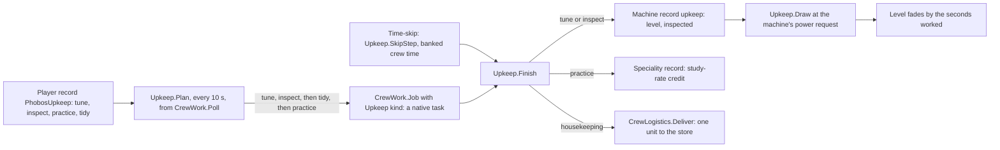

# Crew upkeep on long hauls

Design record for Framework 0.111.0 and the matching Shipbreaker 0.82.0,
Manufacturing 0.55.0, Agriculture 0.63.0 and Medical 0.5.0 releases (Set A), and
Framework 0.113.0 with Shipbreaker 0.83.0 (Set B: housekeeping and practice). The player
guide is [Upkeep on long hauls](../crew-automation.md#upkeep-on-long-hauls).

Status on 6 October 2026: built and checked offline. Nothing here has been seen
in the game yet.

## The request

Owner, 6 October 2026: give crew useful work on long-haul flights, when there is
little to do. Crew tune Phobos machines for a small efficiency gain each time,
coded to be cheap to run. Further ideas were invited.

## Decisions

| Decision | Whose | Value |
| --- | --- | --- |
| Benefit of a tune | Owner | Faster work, up to about 10%; yields and mass balance never change |
| How a tune lasts | Owner | Fades with the machine's running hours; idle machines keep it |
| Further ideas taken up | Owner | Inspection rounds, practice at machines, housekeeping |
| Inspection length | Owner | 5 game minutes, a player setting |
| "Make a few settings modifiable" | Owner direction, agent choice of which | `InspectionMinutes`, `TuningMinutes`, `MaxTuningGain`, `TuneFadeHours` |
| Setting defaults and ranges other than the inspection length | Agent default | See the guide's settings table |
| Session step 0.2, skilled 0.3 | Agent default | `upkeep` pack |
| Inspection good for 24 game hours; inspected fade share 0.5 | Agent default | `upkeep` pack |
| Planner every 10 real seconds, two tasks a pass, unclaimed tasks withdrawn after 60 s | Agent default | Code constants in `Upkeep` |
| Skill for Manufacturing machines: the game's `SkillEngMechanical` | Agent default | Manufacturing has no speciality of its own |
| Skill for Medical inspections: the game's `SkillMedicalTrauma` | Agent default | |

All figures are authored balance, not measurements.

## Three things that differ from the approved plan

**1. A tuned machine draws more power.** The plan said the rate "multiplies
progress only" and that energy per job stays the same. Those two cannot both
hold: most Phobos machines count progress by the electricity they receive, so
more progress for the same draw would make each job cheaper in electricity. To
keep the owner's "same electricity per job", a tuned machine asks the game for
more power while it works (`Upkeep.Draw`), gives off that much more heat, and
its seconds count for that much more. Energy per job is unchanged; power while
working rises by up to 10%. The guide, panel line and changelogs say so. The
owner may prefer the other reading (same power, cheaper jobs); it is a one-line
change per service.

**2. Inspection does not slow wear.** The offer to the owner said an inspected
machine "wears more slowly". Phobos machines take no wear from running: damage
comes only from the game's own fire, combat and accidents. Inspection instead
halves the fade of the tune while it is good, and reports in the crew log what
the machine is waiting for or that it is more than half worn.

**3. Two machines are inspected only.**

- The F6 furnace: the plan tuned its melt hold time. The hold is 60 seconds
  (`FurnaceRules.HoldSeconds`), so a full tune would gain six seconds a melt, not
  worth touching the hot-batch physics for.
- The A2 regulator: it holds a set point and has no work rate to raise.

## How it works

Set A (0.111.0) had only the tune and inspect path; Set B (0.113.0) added
`Upkeep.Finish` with the practice and housekeeping branches.

- **One ship-wide order.** A machine has one crew order and one provider, so a
  tune order per machine would clash with existing orders. Upkeep jobs are
  `CrewWork.Job` records with no provider; `CrewWork.Allowed` checks the upkeep
  switch instead of a machine's order.
- **Lowest priority.** The planner runs only when a switch is on, after the
  standing-order steps, and offers at most one task per idle on-shift crew
  member.
- **The effect.** Each service calls `Upkeep.Draw(co, ref amountKWh, seconds)`
  where it asks for power, only while working. It returns the rate
  (`1 + MaxTuningGain x family share x level`), scales the request and fades the
  level by `seconds / TuneFadeHours`, at the inspected share while an inspection
  is good. The service scales its heat check and any progress counted in seconds
  by the same rate.
- **Records.** The level is cached and written only when it moves a whole
  percent or reaches none, so a running machine does not save every step.
- **Loss.** A mode switch to a damaged or loose form clears the tune.
- **Time-skip.** `Upkeep.SkipStep` banks on-shift crew time not held by an order
  and spends it on sessions, charging the walk by tile distance. It does not
  change the skip's stepping or `RepairShare`.

## Where each mod hooks in

| Mod | Site | Note |
| --- | --- | --- |
| Manufacturing | `BeginPower` of the processor, Sabatier, cracker, filler, bottler and feeder; `ChargeMachine` | Charge progress uses `elapsed x tune` |
| Shipbreaker | `PowerPatch.Prefix` for the D4 and R4; `ThawService.BeginPower`; `LaserService.BeginPower` | D4 progress is `elapsed x tune`; the laser counts work by energy received |
| Agriculture | `Service.Requested`; `CropState.Step(..., tune)`; the W2's delivery budget | Cooker and bench count work by energy received |
| Medical | Registration only | The bed excludes its patient |

## Saved structures

| Structure | Where | Migration |
| --- | --- | --- |
| Upkeep switches | New Phobos record `PhobosUpkeep` on the player | None: missing means off |
| Machine upkeep | New Phobos record `upkeep` on a tuned or inspected machine | None: missing means untuned |

## Checks

- Framework rule checks (`UpkeepChecks`): rate, fade, inspected share, session
  steps, planning order, record round trip and old records, skip sessions,
  settings clamps and pack refusals.
- Agriculture: a rate of 1 grows exactly as before; 1.1 ripens wheat in 1/1.1 of
  the time on the same energy with the same biomass, water and nutrients; a tune
  without the extra power grows nothing extra.
- The `upkeep` pack has the game loader's validator, the offline checker, a JSON
  Schema and Python tests.
- Not covered by a test: the Manufacturing and Shipbreaker services at a rate
  above 1 (their power steps need the game's `Powered`), the planner against a
  live crew, and the panel tab. These need play.

## For the owner to try

1. Switch on Tune machinery; idle on-shift crew walk to machines and tune them.
2. A tuned machine's panel shows the gain, and its power draw rises with it.
3. A time-skip on a long haul keeps machines tuned without slowing the skip.
4. Inspection lines appear only for machines that need attention.
5. Switching both off stops new upkeep tasks at once.

## Set B: housekeeping and practice (Framework 0.113.0)

Built on 6 October 2026 at the owner's go-ahead, after the time-skip
performance fix (Framework 0.112.0) changed skips to 30-second steps. Checked
offline only.

### Decisions

| Decision | Whose | Value |
| --- | --- | --- |
| Housekeeping and practice, each its own switch, off by default | Owner choice (plan) | Upkeep tab, F3 |
| Order among upkeep | Agent choice | Tune and inspect, then housekeeping, then practice. The plan put practice after tuning and inspection; housekeeping goes before practice because practice never runs out while anyone is unskilled, and would starve housekeeping |
| What housekeeping moves | Agent choice | Stack heads lying loose on the deck that stack (nStackLimit above 1), so equipment waiting to be installed stays put |
| Where it goes | Plan, widened by agent choice | A Phobos supply: the nearest store already holding its kind, else a registered tidy store. The plan named only Phobos supplies; any other item (native mined ore and ice) may go only into a registered tidy store, which is what the Y bins are for |
| Which stores | Agent choice | The game's own unlocked containers, and Phobos stores only when registered as tidy stores, so nothing goes into a machine tray, a Ward-3 drawer or a tank rack |
| Who hauls | Agent choice | The Haul duty and the Industry role, as Shipbreaker's hauls; hauling trains no speciality (existing rule) |
| Practice rate | Agent default | The terminal study rate: 10 minutes a session, about 60 sessions to qualify |
| Practice scope | Engine limit | Only Phobos specialities (Industrial Processing, Agriculture, Cooking); Manufacturing and Medical use the game's own skills, which Phobos cannot credit |
| One practice job per ship and speciality at a time | Agent default | Keeps practice from crowding the task list |

### How it works

- **Kinds.** `UpkeepKind` gains Practice and Housekeeping (appended, so saved
  meaning is unchanged). The switch record gains `practice` and `tidy` fields.
- **Practice** is an ordinary upkeep job at a machine. `Upkeep.Suits` admits
  only crew not yet skilled, and practice skips the "skilled crew first" rule.
  The session takes its full length and credits the speciality with
  `study: true`.
- **Housekeeping** is an upkeep job built like a standing order's haul: the
  task targets the store, the game's PickupItem runs first, and
  `CrewLogistics.Deliver` makes the move. Its reservations are the item and
  room in the store only, like any haul.
- **Planning.** The planner reads only the ships' top-level objects for loose
  items (`Ship.GetCOs` without nested objects), at most 16 a pass. A deck with
  nothing to tidy is read again after a minute.
- **Skips.** `SkipJob` follows the same order. Housekeeping reads each ship's
  deck once and uses the moves up; an empty deck is read again after a game
  hour, and a stack is read again after each move. An item that fails to move
  is skipped for the rest of the skip.
- **Hooks for other mods.** `Upkeep.RegisterTidyStore` (Shipbreaker names its Y
  bins) and `Upkeep.RegisterUnavailable` (offered to Medical for a resting
  patient; Medical does not use it yet).

### Saved structures

| Structure | Change | Migration |
| --- | --- | --- |
| Upkeep switches on the player | Two new fields, `practice` and `tidy` | None: a missing field reads as off |
| Crew speciality progress | Practice adds to it as study does | None |

### Checks

- Framework rule checks: old switch records, the four switches round-tripping,
  the priority order, the store choice (same kind first, nearest, tidy stores
  only for other items, nothing that does not fit, stable ties) and the
  practiceMinutes refusals.
- Not covered by a test: the planner against a live crew and deck, the haul in
  play, and practice admission. These need play.

### For the owner to try

1. Drop a few Phobos supplies (ingots, seed) on the deck near a locker already
   holding some, switch on Housekeeping, and watch a crew member put them away.
2. Leave mined ore on the deck beside a Y bin; it should go into the bin.
3. Switch on Practice with an unskilled crew member and a Shipbreaker or
   Agriculture machine aboard; their progress should rise in the crew overview.
4. Time-skip with both on and check the deck and the progress afterwards.

Performance at 16x with upkeep on is still the case to capture (findings L71 and
L73).
