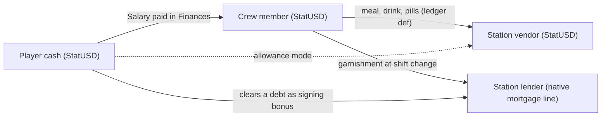

# Crew personal wallets: research and design record

Research record, 7 October 2026. The owner asked how hard it would be to give crew members
(the player's employees) personal wallets they spend on their own needs, such as food and
medication, with possible tie-ins to Phobos Exchange and Phobos Banking, and whether machines
weaker than the owner's could run such a mod smoothly. This is a research-and-record round:
nothing here is built, and nothing has been tried in play. The record collects what the game
already offers, a proposed design, the owner's decisions from the same day, the saved
structures, the performance budget, the engine questions to verify before any build, and
the agent's own recommendations and disagreements.

Labels used below: **Observed** is seen in the installed game's data files (1.0.1.5) or in the
local decompile kept in ignored `.local/research` (never redistributed; line numbers refer to
those files); **Agent proposal** is Claude's design for the owner to revise; **Owner** marks a
decision the owner took on 7 October 2026; **Unverified** is stated as such.

## The question and the short answer

The wallet itself is nearly free. The game already keeps a cash balance on every character,
seeds it when a person is generated, and saves it natively. What the game never does is let a
character other than the player use that balance, and what it never does for crew is hand them
the salary the player pays. So the real work is not money; it is behaviour. Making crew spend
is a crew-AI problem, and the game already has the two mechanisms needed: a data-only way for
any interaction to charge whoever performs it, and a free-will AI that picks openers by need
from objects on the ship and on docked stations.

Sizes compared to delivered rounds, never hours:

| Slice | Compared to | Why |
| --- | --- | --- |
| Payroll reaching the crew, with readouts | Smaller than Banking 0.6.0's prepayment fix plus one panel line | One ledger postfix, one name lookup, two read-only lines |
| Spending at stations | About Framework's `CrewStudy` plus one data-pack schema | Same seeding pattern; the largest cost is verifying docked targeting in play |
| Inherited crew debts and garnishment | About Banking 0.2.0's loans without the panel | A record per debtor, a shift-change pass inside the existing poll |
| Crew lending, finances affecting mood | A Framework-plus-content round like Exchange 0.2.1 | First Phobos write to vanilla mood conditions on crew; needs its own research |

## What the game offers (observed)

### Money is a condition, and NPCs already have it

- Currency is the condition `StatUSD` (`Ledger.CURRENCY`). Faction scrip is `StatCCREScrip` and
  `StatGalileanConfederacyScrip`. Any `CondOwner` can hold them, and the game saves them with
  the character.
- Generated NPCs receive money at spawn. The loot `PSPIAAddNPCBasic` (used by 82 person specs)
  runs `NPCAssignFundsStrata` and `NPCAssignFundsCareer`:

| Group | Starting funds, observed ranges |
| --- | --- |
| Any human (basic) | 100 to 600 |
| Permanent resident | 5,000 to 15,000 |
| Citizen | 50,000 to 150,000 |
| Technician | 5,000 to 20,000 |
| Bartender | 1,000 to 5,000 |
| Scientist | 10,000 to 200,000 |
| Manager | 75,000 to 500,000 |

- The player's own spawn loot `PSPIAAddPlayer` carries no such grant. Whether every hired crew
  member actually holds `StatUSD` (hire menus, people made by other mods) is **unverified**.

### Salaries leave the player and vanish

- Hiring (`Ostranauts.Social.Models.Hire`) sets `PaySalary`, `PaySigning` and `PayDeath`
  conditions on the new crew member, from `CONDBasePayPilot`, `CONDBasePayEng` or
  `CONDBasePayCrew`, and adds a native daily ledger line: payee the crew member's `strName`,
  payor the player's `strName`, description `Salary`, plus one-time Sign-on Bonus and Death Pay
  lines.
- Each day `Ledger.ProcessRepeatingOfType` (`Ledger.cs` lines 423 to 440) adds an unpaid
  one-time clone of the repeating line and credits money only when the payee is
  `CrewSim.coPlayer.strID`. A crew payee is never credited.
- The Finances window (`GUIFinance.Submit`) takes the amount off the player and calls
  `Ledger.PayLI` (lines 562 to 592), which only marks the line paid, adjusts a mortgage balance
  if the line was a mortgage instalment, and raises the refresh and paid events. Paid wages
  therefore disappear: the crew member's `StatUSD` never rises.
- Dismissal (`JsonCompany.DismissMember`, lines 108 to 128) removes unpaid Salary lines, and
  Death Pay pays the boss the crew member's `PayDeath` condition, never their wallet.
- Overdue bills get a 17.5% late fee (`Ledger.Skip`, line 451 onwards), filtered by the
  player's `strID` as payor. Salary lines carry the player's `strName` as payor, so whether
  they are ever late-penalised depends on whether the player's `strName` equals their `strID`
  (**unverified**; see the questions below).

### Any interaction can charge whoever performs it

- An interaction with `strLedgerDef` refuses when the actor (`objUs`) cannot pay
  (`Interaction.decompiled.cs` lines 1781 to 1792, failure text `IA_FAIL_MONEY`), unless the
  def carries `strPayorOverride`.
- Payment goes through `Ledger.AddLI(string, CondOwner payor, CondOwner payee)` (`Ledger.cs`
  lines 163 to 227): the payor is debited (line 213), the payee is credited when the payee
  string still names them (line 217; `bPayATC` or `strPSpecOrCtPayee` redirect the string and
  skip the credit), and a `LedgerLI` is always written (lines 221 to 226).
- An interaction can deliver goods to the actor: `strLootItmAddUs` adds items to `objUs`
  (lines 2616 to 2648, with overflow dropped nearby), and `LootCondsUs` applies conditions
  directly.
- 41 vanilla interactions carry a ledger def: fines, visas, clinic services (payee
  `TIsHealthKiosk`), permits, scrip, racing and plot payouts. None is an AI-usable opener, so
  no NPC spends money on their own in vanilla.

### Vendors sell to the player only

- Food carts and shops are `Trader` objects (`TraderOKLGFoodCart01`, `TraderOKLGFoodCart02`,
  the San Diego Future Foods inventory), configured by a `Trader` property map (stock loot,
  restock condition, currency, faction, discounts).
- Buying goes through `GUITradeKiosk`, which is `bHumanOnly`. In `GUITradeBase`, the buyer is
  `_coUser`, debited in `RecordTransaction` while the trader is credited, and bought items go
  into the buyer's inventory.
- NPC kiosk use (`ACTKioskUseNPC`) changes moods only, with no money, and its trigger
  `TIsNPCKioskUser` excludes player crew.

### How the crew AI chooses what to do

- Each AI turn (`CondOwner.decompiled.cs` around lines 3464 to 3530): pledges run first, from
  priority 11 down (AutotaskRestore 11, greetings 8, `AIEat` and `AIDrink` 7, faction fight 6,
  reply 5, recharge 4, hygiene 3). Otherwise, on the Work shift, `GetWork` runs the company's
  own quit check, then the game's task list, then automatic repairs; off shift, and when work
  finds nothing, `GetMove2` runs.
- `GetMove2` (lines 4354 to 4600) walks the character's needs in priority order and takes the
  openers from `mapIAHist[need]` whose learned average is below zero (they relieved that need
  before) and whose `CTTestUs` passes. Targets come from the character's own inventory plus
  `ship.GetCOs(CTTestThem, bSubObjects: false, bAllowDocked: true, bAllowLocked: false)`
  (lines 4503 and 4645). So objects on docked stations are candidates, the kiosk itself must
  carry the trigger (items inside it are not candidates), busy objects are skipped (line
  4521), and nothing in the pick checks a path or an airlock. `dictRecentlyTried` (line 4532)
  stops a failed target being retried at once. Line 4526 removes targets on the player's ships
  for non-crew only; player crew are not filtered off station objects.
- Eating (`PledgeEat` through `BasePledgeFindItem.FindItem`): own inventory first, then the
  current ship, then docked ships only in an emergency or, with shore leave, docked ships the
  character owns. No payment anywhere. Hired crew inherit the player's ship ownership, so crew
  eat free from ship stores on their own.
- Hunger and thirst are the bands `DcFood01` to `DcFood05` and `DcSatiety01` to `DcSatiety04`
  (`TIsHungry`, `TCanEatHungry`), pain is `StatPain` with its bands, and mood is the need
  stats (`StatSecurity`, `StatEsteem`, `StatAutonomy`, `StatContact`, `StatSelfRespect` and
  the rest) with `Dc` bands. There is no morale or loyalty stat.
- The vanilla `SeekDrug` openers sit in the `Abner` AI template under mood needs, not pain, so
  the AI may take a reachable pill for mood relief and never because it hurts.

### Quitting is the game's own

- On the Work shift, crew run `SeekSocialDeny` against the player; one reply is
  `SOCQuitStart`, gated by `TIsSOCQuitStart`: any of `DcAchievement05`, `DcSecurity05`,
  `DcEsteem05`, `DcSelfRespect05` or `DcAutonomy05`, and not `IsQuitCooldown`. The player may
  negotiate (the `Quit` model raises salary, signing bonus or death pay) or let them go;
  `Company.DismissMember` then clears the roster flags and unpaid Salary lines.
- Nothing in the game links unpaid wages, or any balance, to mood or quitting.

### What Phobos already has

- Framework `CrewStudy` is the only existing self-directed off-shift behaviour: it clones a
  vanilla opener, adds it to the target objects, and seeds `mapIAHist` entries in the `Abner`
  template (`SeedTemplate`) and in live crew (`WorldReady`), so the game's free-will AI picks
  it by need. This is the pattern for anything a crew member does for themselves.
- Framework `CrewWork` offers work on the Work shift, on the worker's own ship, and never
  checks needs ("needs are the game's business"). `Upkeep` kinds are a closed list. Neither
  reaches a station.
- Per-crew saved records already exist: `crew-skills` and `crew-roles` are `ObjectStateStore`
  records on the crew member (`PhobosState.<name>` in `mapGUIPropMaps`, values up to 512
  characters). The game saves them with the character and ignores them when the mod is gone.
- Banking reads the game's own ledger (loans are native mortgage lines, interest is a bill at
  each shift change from `Loans.Poll`, a five-second real-time poll that returns at once when
  the player has no loans), keeps its loan book on the player, opens the Finances window for
  payment, and sets story flags through `StoryFlags`.
- Exchange keeps the whole market and the player's holdings in one record on the player; its
  `TradeRules` core is owner-agnostic (a holding plus a cash figure), and its only link to
  Banking is Framework's `PlayerHoldings` registry, keyed by providing mod, which Banking's
  overview reads. No mod detects the other directly.
- Phobos Medical's `care` pack holds three treatments and no medicines; a patient never treats
  themselves (`CrewWorkOffer.ExcludedActor`). Vanilla pills and injector pens exist
  (`docs/health-treatments-and-drugs.md`).
- The story system binds nothing to one crew member: `requires.crewWith` tests whether any
  crew member has a condition, `[crew]` names a random member, and the `credits` test reads
  only the player. Letters name an authored `person`, not a live NPC.
- The Workshop survey (`mod-extension-survey.md`, 23 September 2026) lists no mod that adds
  crew wages, NPC spending or bars. Common Sense Finances auto-pays the player's bills through
  the same ledger; which call it uses is **unverified**.

## Design principle (agent proposal)

**The wallet is the crew member's own `StatUSD`.** No parallel balance, no new currency,
nothing to migrate, and nothing to clean up when the mod is removed: a crew member keeps
whatever they hold, as any NPC does today. Every money movement uses the game's own
`AddCondAmount` and its ledger, so the Finances window remains the one ledger and vanilla
precedence holds. Nothing ever lets the player collect a crew member's wallet: Death Pay stays
the game's own condition, and there is no "loot the body's purse".

Allowance mode (dotted) pays the vendor from the player's cash instead of the wallet.

## Owner decisions (7 October 2026)

| Question | Decision | Whose |
| --- | --- | --- |
| Wallet or allowance? | Wallets by default; a setting switches crew spending to an allowance from the captain's cash | Owner |
| Mess charge for ship food? | Dropped: it hands the player's own wages back for stores the player bought, reads as petty, and invites charging more than salary | Owner, agreeing with the agent |
| Does crew wealth change behaviour? | A setting, off by default for now | Owner |
| Crew lending to the captain, finances affecting mood | Revisited as the mod grows: planned later rounds, not parked | Owner |
| Back pay on dismissal? | None. Vanilla deletes unpaid Salary lines; keep that and say so in the guide | Owner |
| A meal bought at a station? | Replaces that day's ship meal: the purchase feeds them through the game's own satiety bands, so `PledgeEat` does not fire | Owner |
| First spending kinds | Food and drink at station carts and bars; painkillers at clinic kiosks; mood spending (drinks, kiosk use) | Owner |
| Allowance scope | One ship-wide setting with one spending cap per dock; a per-crew override is later work | Owner |
| Where it lives | A new content mod on Framework (working name Phobos Crew Finances, id `PhobosCrewFinances`, agent default for the owner to rename); shared services in Framework; Banking and Exchange tie-ins optional at runtime through Framework registries | Owner (mod), agent default (name) |
| Who spends | Player crew by default; all station NPCs behind a setting, off by default | Owner |
| Where the player reads it | A wallet column on each Crew panel row and a crew-pay line in Banking's overview, both read-only; payment stays in the game's Finances window | Owner |

Decisions still open: the mod's final display name; which stations get which vendors first;
the prices of the proof entries (authored balance, labelled as such).

## The slices (agent proposal)

### A. Payroll reaches the crew (Framework, surfaced in Banking and the Crew panel)

- A Harmony postfix on `Ledger.PayLI`. When the line just marked paid is a wage line (Salary,
  Sign-on Bonus; never Death Pay, which the game settles itself) and its payee resolves by
  name to exactly one living member of `CrewRoster.Members()`, credit that member's `StatUSD`
  and write a `RecordTransaction` line so Finances shows it. Two crew with one name, or no
  match, means do nothing and log; the money has already left the player, as today.
- Auto-paid repeating lines bypass `PayLI` (lines 435 to 440 credit the player directly), so
  only real payments count. The engine's one-boundary-per-jump behaviour on large time skips
  (`pda-apps-and-banking-research.md`) means wallets fill only as much as the player actually
  pays. That is honest, and the guide says so.
- No back pay on dismissal (owner): the vanilla deletion stands.
- Readouts: a wallet column on each Crew panel row, and a crew-pay line in Banking's overview
  (wages owed this shift, paid this month). Both read the ledger and `StatUSD`; neither moves
  money.
- Cost: none per tick. The postfix runs once per payment.

### A2. Unpaid wages matter without new money (Framework story flags)

- Inside Banking's existing poll, once per shift change: for each roster member, count unpaid
  Salary lines with `GetUnpaidLIs(member.strName, player, "Salary")` and set or clear a story
  flag such as `crew-unpaid-3` and `crew-unpaid-10`. Letters and small talk in story packs
  react through `requires` flags. No stat is written, so vanilla precedence holds; this is the
  wallet's first reason to exist before any spending ships.

### B. Personal spending at stations (Framework schema and services, content in packs)

- A schema-checked Framework data pack, working name `spending`, with one entry per purchase:
  - `id` and the opener name it becomes (prefixed `PhobosSpend`);
  - `vendor`: the trigger the kiosk or bar object itself must pass (`bSubObjects: false`
    means items inside a kiosk are never candidates);
  - `need`: the game's own band names the actor must be in (`DcFood03`, `DcSatiety01`,
    pain bands, mood bands), put into the opener's `CTTestUs` so the seed alone never makes
    crew buy at every dock;
  - `price` and `currency` as a Phobos ledger def, paid to the vendor object;
  - `effect`: a direct condition effect first (`LootCondsUs`: fed, watered, pain relieved,
    mood tick), with an item form (`strLootItmAddUs`, overflow dropped at the kiosk) as a later
    option;
  - `thread` or `place` as the story rules require, so vendors belong somewhere.
- A Framework seed service like `CrewStudy`: clone a vanilla opener, append it to every object
  that passes the vendor trigger, seed `mapIAHist` on the player's crew (and, with the owner's
  all-NPC setting on, the `Abner` template) with a negative average under the matching need.
- A Framework prefix on `Ledger.AddLI(string, CondOwner, CondOwner)`: when the payor is a
  non-player crew member (or, in allowance mode, when the purchase is ours), debit and credit
  directly and skip writing the ledger line. Otherwise every crew purchase accumulates in the
  save forever. Vanilla never creates such lines (no vanilla opener pays), so no vanilla
  behaviour changes.
- Owner decision: a bought meal feeds the crew member through the game's own bands, so
  `PledgeEat` does not fire for them that day. No extra code; the effect is the link, and it
  is the long-haul endurance connection the project's direction asks for.
- Shipped content: one proof entry per kind (a meal at a food cart, a drink at a bar, a
  painkiller at a clinic kiosk, one mood purchase), to show the wiring works. ChatGPT and
  players write the rest through a handoff document and the usual add-on namespace.
- Known limits to state in the guide: no path check in the AI's pick, so a kiosk behind a
  sealed hatch produces visible dithering until `dictRecentlyTried` gives up; station food is
  unlimited because a condition effect never touches the trader's stock; a crew member with an
  empty wallet simply never chooses the opener (the money gate refuses before the walk).

### B2. Allowance mode (owner: a setting; wallet is the default)

- With `CrewFinances/Mode` set to allowance, the `AddLI` prefix pays the vendor from the
  player's `StatUSD` and writes one ledger line per purchase so the bill is visible at once,
  up to one ship-wide cap per dock (`CrewFinances/AllowancePerDock`). The setting is read at
  purchase time; switching it moves no money. A per-crew override is a later-work row.

### C. Mess charge aboard (dropped)

Considered and rejected (owner, agreeing with the agent). It would move money the player paid
as wages back to the player for stores the player already bought. The hook would have been
cheap (the study credit already patches the same completion path), but the gameplay reads as
petty and invites charging more than the salary. Not even as an F3 experiment.

### D. Crew savings on Phobos Exchange (later, behind the behaviour setting)

- What it needs: holdings separated from market state in Exchange (today one record on the
  player), an owner-keyed `PlayerHoldings` provider, a per-crew holdings record
  (`PhobosState.PhobosExchangeCrew` on the member), and a monthly game-time step per crew
  member that reuses `MarketModel.Advance` and the stable-hash determinism, so a time jump is
  caught up exactly and nothing is rerolled.
- Why it waits: it gives the player nothing to see or do until crew wealth changes behaviour,
  and any payout to the player would be the loop the house-edge rule exists to prevent. Also
  the one slice that lets the Exchange's upward drift reach non-player money; it must stay
  under the same guard. Story value only (`exchange-<company>-<event>` flags, `crewWith`
  gates) until then.

### E1. Inherited crew debt and garnishment (Banking)

- Lenders local to stations (story places and people, pack data) can hand a hire an existing
  debt: one `ObjectStateStore` record on the member (lender, balance, rate, garnish share) and
  a native Mortgage line with the lender as payee and the crew member's `strName` as payor,
  so Finances can show it if the owner wants.
- Garnishment at shift change inside `Loans.Poll`: a share of the wallet moves to the lender,
  never more than the wallet holds. The player can clear a debt as a signing bonus through the
  Banking panel (service-checked, press twice). Letters from the lender through story packs.
- Removal: `Ledger.Skip` ignores non-player payors, so the line would sit in the save unseen;
  close it on the uninstall-guard load the way Banking closes loans.

### E2. Crew lending to the captain (owner direction: a later round, behind the behaviour setting)

- A crew member with savings offers a loan through Banking's lender model: the member's name
  as payee, interest bills at shift change, the loan book marking the lender as crew.
  Repayment and default are visible in Finances. On default, the member's `StatSecurity` or
  `StatEsteem` band drops so the game's own quit path can fire, and the vanilla `Quit`
  negotiation (raise pay, pay a bonus) becomes the player's way back.
- Rule: a crew loan is never cheaper than Banking's cheapest loan, or the Exchange guard
  ("borrowing to hold never pays") breaks.
- Research before building: this is the first Phobos write to vanilla mood conditions on
  crew. How the game's hourly mood ticks and Medical's reads interact with a written band
  must be read in the decompile and tried in play, and the `Quit` renegotiation must be seen
  firing for player crew in 1.0.1.5.

### F. Crew finances affecting mood and behaviour (owner direction: later rounds, behind the behaviour setting)

The ladder the owner can climb, each rung through the game's own need conditions and bands,
never a new morale stat:

1. Unpaid wages lower a need band (`StatSecurity`), feeding the native quit gate.
2. An empty wallet at a dock raises `StatSecurity` pressure; savings ease it.
3. Debt letters from lenders, and small talk that reacts through `crewWith` gates.
4. Crew lending (E2) and crew investing (D) once wealth is visible and has consequences.

### Settings (agent defaults for the owner to revise)

| Setting | Default | Meaning |
| --- | --- | --- |
| `CrewFinances/Mode` | wallet | `wallet` pays purchases from the crew member; `allowance` pays from the player's cash |
| `CrewFinances/AllowancePerDock` | authored figure | The most the crew may spend of the player's cash per dock in allowance mode |
| `CrewFinances/StationNpcsSpend` | off | Seeds the `Abner` template so every NPC may buy; measured before it ships on |
| `CrewFinances/WealthAffectsBehaviour` | off | Enables D, E2 and F behaviours once built |

All four are player preferences, not identities or balance, so they qualify as settings.

## Performance budget, and weaker machines

Everything above is event-driven. There is no per-frame work, no per-crew timer, and no
allocation outside an event:

| Path | When it runs | Cost shape |
| --- | --- | --- |
| Payroll credit (A) | Once per payment in Finances | One roster scan by name |
| Unpaid-wage flags (A2) | Once per shift change, inside Banking's existing 5 s poll (L92) | One `GetUnpaidLIs` per roster member |
| Purchase openers (B) | Only when the game's free-will AI evaluates a seeded crew member off shift | One more candidate opener per need, one trigger test per candidate vendor in reach |
| Payment prefix (B) | Once per purchase | Two `AddCondAmount` calls |
| Garnishment (E1) | Once per shift change, same poll | One record read per indebted member |
| Crew investing (D), if ever | Monthly game-time step, bounded catch-up like Exchange (L97, L99) | A few hundred steps at most per jump |

The one path that can grow is B's opener evaluation. The game already runs
`CondTrigger.Triggered` about 400,000 times a second and `GetMove2` builds its candidate list
from every object on the ship and its docked neighbours; one more opener for the player's
crew adds one trigger test per vendor object in reach, per idle crew member, per AI turn.
With the owner's all-NPC setting on, the same work runs for every idle NPC on a station, which
is the case to measure before it ships on.

Measurement plan at delivery: a recording at 16x fast-forward, docked at a large station, a
full crew off shift, with and without the all-NPC setting, written up as a finding (take the
next free code when the round is built and claim it with other sessions first; L100 and
L101 were already claimed by other work in October 2026) through
`scripts/audit-performance.py --refresh --finding`. Registered footprints:
`framework.spending.openers` (seeded opener count) and `crewfinances.debts` (debt records).
Fallback if the evaluation shows: gate the opener's `CTTestUs` on a docked state and a
per-crew real-time cadence so the vendor scan is not reached every turn.

The owner's PC (Ryzen 9 7950X3D, 64 GB) is the best case for every figure in this project;
nothing in this record has been timed, and the mods already measured take about 2 to 2.4% of
real time at 8x (L64). The design keeps the new work inside existing polls and the game's own
AI turn precisely so that a weaker machine sees no new timers.

## Saved structures and removal

| Structure | Where | Slice | If the mod is removed |
| --- | --- | --- | --- |
| `StatUSD` on crew | Native condition on the character | A, B | Stays; the game already saves it for every NPC |
| `RecordTransaction` lines for wages received | Native ledger | A | Stay, harmless history |
| Story flags `crew-unpaid-<n>` | `PhobosState.PhobosStory` on the player | A2 | Inert, like every other flag |
| `mapIAHist` entries naming `PhobosSpend*` openers | Native AI history on crew and the `Abner` template | B | Reuse `CrewStudy`'s in-play evidence that unknown opener names are harmless on load; confirm again at delivery |
| No ledger lines for purchases | Suppressed by the `AddLI` prefix | B | Nothing to clean |
| Allowance ledger lines | Native ledger | B2 | Stay, paid history |
| `PhobosState.PhobosCrewDebt` | On the indebted crew member | E1 | Inert record, like `crew-skills`; its mortgage line is closed on the uninstall-guard load |
| `PhobosState.PhobosExchangeCrew` | On the crew member | D (later) | Inert record |

No existing save needs migration for A, A2 or B: nothing is read that is not already there.

## Engine questions to verify before building

Answered from the decompile (line numbers above): an interaction's loot can go to the actor;
the free-will AI targets docked-station objects for non-pledge openers with no path check;
`PayLI` is not reached for auto-paid repeating lines; `GUIFinance` pays by the line's payee
string, which hiring sets to the crew member's name.

Still to verify, in the decompile or in play, before the first build:

1. Whether the player's `strName` equals their `strID` where the ledger filters by payor
   (`Ledger.Skip`, `ProcessRepeatingOfType`). If not, salary lines are never late-penalised
   today and the crew-pay readout must query by name.
2. Whether a docked, off-shift crew member actually walks to a station kiosk and completes a
   paid opener (the `bBusy` filter, airlock permission and shore leave are untested for our
   openers; `CrewStudy` evidence is same-ship).
3. Whether every hired crew member holds `StatUSD`, including people made by hire menus and
   by other mods.
4. Which call Common Sense Finances makes to pay a bill (`PayLI`, setting `fTimePaid`, or
   `RemoveLI`), before claiming that auto-paid wages reach the wallet.
5. Whether the `Quit` renegotiation fires for player crew in 1.0.1.5 (needed by E2 and F).
6. Whether a `Trader` kiosk object accepts being the payee of a ledger def (its `StatUSD`
   rising) without disturbing its own stock or restock logic.

## Recommendations and disagreements (agent)

- **Build A and A2 first.** They are honest, tiny, change no vanilla behaviour, and give the
  wallet a reason to exist before any spending ships. Crew who are paid, and whose unpaid
  wages the stories notice, are already a better world.
- **Build B second, with condition effects, and verify it in play before any menu content.**
  It is the only slice with visible gameplay, and its risk is entirely in the engine
  (questions 2, 3 and 6). Ship one proof entry per kind; let ChatGPT and players write the
  menus.
- **C is rightly dropped.**
- **E1 after B,** so lenders, letters and garnishment exist before crew can become lenders.
- **D, E2 and F are later rounds on the owner's direction,** behind the behaviour setting.
  The agent's reservation stands for the record: E2 and F are the first Phobos writes to the
  game's mood conditions on crew, and D is the one slice that lets the Exchange's drift reach
  non-player money. Both need their own research round, listed above, not a quiet extension
  of B.
- **Disagreement kept on record:** the all-NPC spending mode is the one piece that can cost a
  weaker machine something, because it turns one opener into work for every idle NPC in reach
  of a vendor. The owner's choice to keep it off by default and measure first is the right
  one; the agent would not ship it on by default even after measuring, unless the figure is a
  fraction of a millisecond per second.

## Proposed rounds

| Round | Contents | Versions touched |
| --- | --- | --- |
| 1 | Framework: `PayLI` postfix and the name resolver; Crew panel wallet column; story flag service. Banking: crew-pay overview line, unpaid-wage flags in `Loans.Poll`. New mod: identity, settings, guide | Framework minor, Banking minor, Crew Finances 0.1.0 |
| 2 | Framework: `spending` pack schema, validator, JSON Schema, seed service, `AddLI` prefix, allowance mode. Crew Finances: four proof entries, ChatGPT handoff, add-on example, the finding | Framework minor, Crew Finances minor |
| 3 | Banking: inherited debts, garnishment, clear-as-bonus, lender letters through story packs | Banking minor, Crew Finances minor |
| 4 and later | D, E2, F behind the behaviour setting, each with its own research record | As they come |

## Side finding (not fixed here)

`CrewSkip.ShiftWord` in `src/PhobosFramework/Crew/CrewSkip.cs` labels shift 0 as resting and
shift 1 as free time, while the game's company rules define 0 as Free and 1 as Sleep
(`CrewDiagnostics` has them the right way round). The time-skip preview may mislabel crew
rows. Worth a patch release of Framework on its own.

## Sources

Game (observed in the installed 1.0.1.5 data under `StreamingAssets/data`, and in the local
decompile kept in ignored `.local/research`, never redistributed):

- `ledgerdefs/ledgerdefs.json` (the 41 paid interactions and their defs), `pledges/pledges.json`,
  `interactions/interactions_pledges.json`, `interactions/interactions2.json` (`SOCQuit*`,
  `SOCHire*`), `condtrigs/condtrigs2.json` (`TIsSOCQuitStart`, `TIsNPCKioskUser`),
  `loot/loot.json` (`PSPIAAddNPCBasic`, `CONDGainFunds*`), `ai_training/ai_training.json`
  (the `Abner` template), `guipropmaps/guipropmaps.json` (food-cart traders).
- `.local/research/agriculture-bulk/Ledger.cs` and `LedgerLI.cs`;
  `.local/research/engine/Interaction.decompiled.cs`, `CondOwner.decompiled.cs`,
  `JsonCompany.decompiled.cs`, `JsonCompanyRules.decompiled.cs`;
  `.local/research/faction-scrip/GUITrade.cs`, `GUITradeBase.cs`, `Trader.cs`.

Phobos (this repository):

- `src/PhobosFramework/Crew/CrewStudy.cs`, `CrewWork.cs`, `Upkeep.cs`, `CrewSkip.cs`,
  `CrewSpecialities.cs`; `src/PhobosFramework/Persistence/ObjectStateStore.cs`;
  `src/PhobosFramework/Trading/PlayerHoldings.cs`; `src/PhobosFramework/Story/StoryArcs.Services.cs`.
- `src/PhobosBank/Loans.cs`, `Debts.cs`, `BrokerPatches.cs`; `src/PhobosExchange/Market.cs`,
  `Core/MarketModel.cs`, `Core/TradeRules.cs`.
- [PDA apps and banking research](pda-apps-and-banking-research.md),
  [share market and charts design](share-market-and-charts-design.md),
  [crew upkeep design](crew-upkeep-design.md), [story system design](story-system-design.md),
  [vanilla precedence audit](vanilla-precedence-audit.md),
  [faction kiosk stock](faction-kiosk-stock.md), [merchant stock](merchant-stock.md),
  [mod extension survey](mod-extension-survey.md), [performance audit](performance-audit.md)
  (findings L64, L92, L97, L99), [crew automation](../crew-automation.md),
  [health treatments and drugs](../health-treatments-and-drugs.md),
  [Banking player guide](../bank-player-guide.md).

No third-party research is cited; the design rests on the game's own mechanisms and this
project's earlier records.
