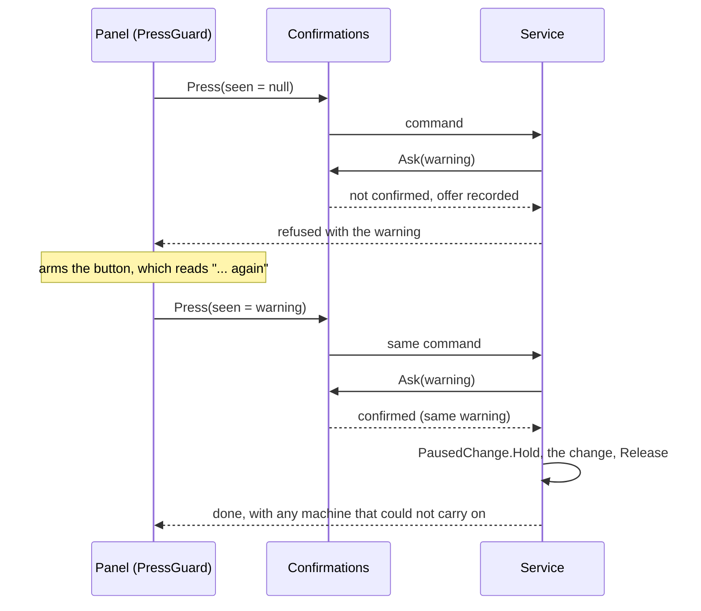

# Press twice to go ahead: panel override audit

Design record for the rule that a control panel never refuses a change only because
other steps must come first. Framework 0.125.0 delivers the shared mechanism;
Agriculture 0.66.0 is its first consumer. Manufacturing, Shipbreaker and Auto Nav
follow in their own rounds. Classification lives in
[`config/panel-override-audit.json`](../../config/panel-override-audit.json), and
`python scripts/audit-panel-overrides.py --check` enforces it.

## The rule (owner, 6 October 2026)

The owner reported two refusals on a Firstlight-4 rack's Water connection page:

- "One of these machines is already linked. Unlink it before choosing a new pair."
- "Pause both machines and their water intake first. Both must be working, unlocked
  and on your ship, with no saved-settings fault."

Owner direction: "can overrides be done just automatically on the player's part, no
questions needed? Even have them click the apply button twice if needed, with a
warning given on the first (that should actually be the expected modal for this
kind of thing henceforth, retroactively at that)." On reviewing the plan, the owner
set the scope: every control panel screen across all Phobos mods.

So, on every panel screen and F3 command, a change or button that needs other steps
first is never refused for that reason. Such steps include pausing machines or
intakes, removing an old link, applying a draft, stopping work and cancelling a
batch.

1. The first press warns in plain words what will be done, including any progress
   lost.
2. A second press on the same choice does it through the service, then lets the
   paused machines carry on.
3. Conditions the service cannot clear are still refused, with a reason that names
   the machine and what to do.

## How it works

- **One channel.** A service decides once. It works out the steps, then calls
  `Confirmations.Ask(warning, confirmed, out message)`. A panel runs each press
  through `Confirmations.Press` or a `PressGuard`, passing the warning the player saw
  on the first press.
- **No blind go-ahead.** A second press whose warning has changed, because something
  changed in between, is a new offer rather than a go-ahead.
- **F3.** A trailing `confirm` word confirms (`Confirmations.TakeWord`). The service
  receives the action with the `confirm:` prefix and strips it (`Confirmations.Split`).
- **Pausing for a change.** `PausedChange` holds only machines that were working. Its
  pause never ends a standing crew order. It resumes them last first, through each
  machine's own checks, and returns the reason for any that could not carry on.
- **Knobs and guarded switches.** These cannot take a second press, so they confirm
  through a `ChoiceCard` (`Confirmations.PressWithCard`) with the same warning.
- **Nothing is saved.** An offer lapses when another press, a changed selection,
  Discard, Back or closing the panel disarms it.

## Classes

| Class | Meaning |
| --- | --- |
| offered | The second press is in place |
| pending | A bookkeeping case (A) or one that loses progress (L), to be converted in the named round |
| refused | Stays a refusal: heat, contents, a fault, damage, another console, or a choice only the player makes |
| status | Matched the wording but is not a do-first refusal (a status line, a label, a requirement) |
| unused | No code uses the text; remove it in the named round |

The check scans the English catalogs of the mods listed in the record for texts and
keys that read like "do this first". Descriptions, help, settings, removal checks
and story text are skipped. Every match needs an entry or a key-pattern rule, and an
entry whose key no longer exists fails the check.

## Delivered in Framework 0.125.0 and Agriculture 0.66.0

- **Framework:**
  - `Confirmations`, `PressGuard` and `PausedChange`.
  - The second press in `ConfigurationSheet` (every settings Apply) and in
    `ProviderPanel` command buttons.
  - Crew panel **Resume** with unsaved changes now applies them on the second press;
    `Console.apply_first` used to refuse.
  - The silo's mixed refusal is split: `WaterTanks.not_ready` (the silo itself) and
    `WaterTanks.transfer_busy` (a transfer still running).
- **Agriculture, each with a second press:**
  - **Water links:**
    - linking a rack to a W2, including a rack already linked to another W2;
    - unlinking at a rack or at the W2;
    - choosing pipe-fed or manual water.
    The rack, the old W2 and the new W2 pause for the change and carry on; the old W2
    keeps feeding its other racks.
  - **W2 settings:** the W2's nutrient source, its water target and its silo link.
  - **Recycler capture link:** an old link on either end is replaced, and capture
    that was on carries on.
  - **B2 bench:** cancelling a workup or emptying the straw press while it works. The
    cancel used to fall through to the F3 help text.
  - **W2 recovery:** cancelling drainage recovery while it works.
  - **Hearth-2 cooker:** when a batch's portion has gone missing, the second press
    cancels the batch (the warning gives the share of cooking lost) and starts a new
    one. Putting the portion back instead keeps the batch.
- **Agriculture refusals reworded:** `water_pause` split into `water_not_ready` and
  `water_wrong_kind`, with the pausing made automatic. A full W2 (`water_bank_full`)
  and old-model line water (`line_drain`, `line_drain_named`) still refuse.
- **Agriculture keys removed:** `water_pause`, `press_pause`, `cancel_missing` and
  the unused `water_pair_help`.

## Agent choices (revisable by the owner)

- **Silent steps stay one press.** Steps that already happened without a refusal
  keep happening that way: a vessel link replacing the old one, a laser cooling
  unpair, a reserve pausing its W2s. A second press there would add friction the
  owner asked to remove. Their messages name the extra step; setting a silo reserve
  now names the W2s it paused.
- **Active Auto Nav flights.** Stopping an active flight to change it will be a
  second press whose warning says the ship coasts on its present course with thrust
  cut. This follows the owner's preference for offering risky actions with warnings
  rather than refusing them.
- **G4 moorings.** Releasing a G4 capture mooring to choose another target will be a
  second press with an unmoored warning, on the same grounds.
- **Collectors held by Shipbreaker.** A collector held by a Phobos Shipbreaker route
  stays refused from Agriculture's recycler, naming what holds it. Agriculture does
  not manage Shipbreaker's pairs.

## Rounds still to come

`python scripts/audit-panel-overrides.py --pending` lists them. At Agriculture 0.66.0:

- **Manufacturing:**
  - every `*.link_busy` (A: pause with the batch kept, change, resume);
  - `prefer_busy` and `select_busy` (L: cancel the batch, which returns its supplies);
  - `Content.feed_blocked` (L).
- **Shipbreaker:**
  - thaw, laser filter and laser cooling (A);
  - collector, furnace and laser pairs (the shared pairing refusal);
  - splitting the furnace's mixed refusals and `Capture.stop_rebind`;
  - the IndustrialPanel and furnace view hosts;
  - removing an unused key.
- **Auto Nav:**
  - docking, departure and return-fire (A);
  - unsaved-draft gating: its buttons are disabled today rather than refused;
  - the active-flight choice above;
  - splitting `Industrial.busy`, `Departure.hardware`, `Combat.unavailable` and
    `Preferences.captured`;
  - removing two unused keys and three uncalled methods.

## Verification and limits

- **Offline checks:**
  - Framework: `ConfirmationChecks` covers the parser, the decision rule, offer and
    re-offer, `PressGuard` arming and disarming, and `PausedChange`.
  - `tests/test_panel_overrides.py` covers the audit check.
- **Not unit-tested.** Agriculture's override paths act on game objects, so offline
  tests cannot construct them. They compile and are not otherwise exercised.
- **Owner checks in play:**
  - relink a rack to another W2: the rack keeps growing, its order stays on, and the
    old W2 keeps feeding its other racks;
  - change a W2's nutrient source while it pumps;
  - press Resume on the Crew panel with unsaved changes.
