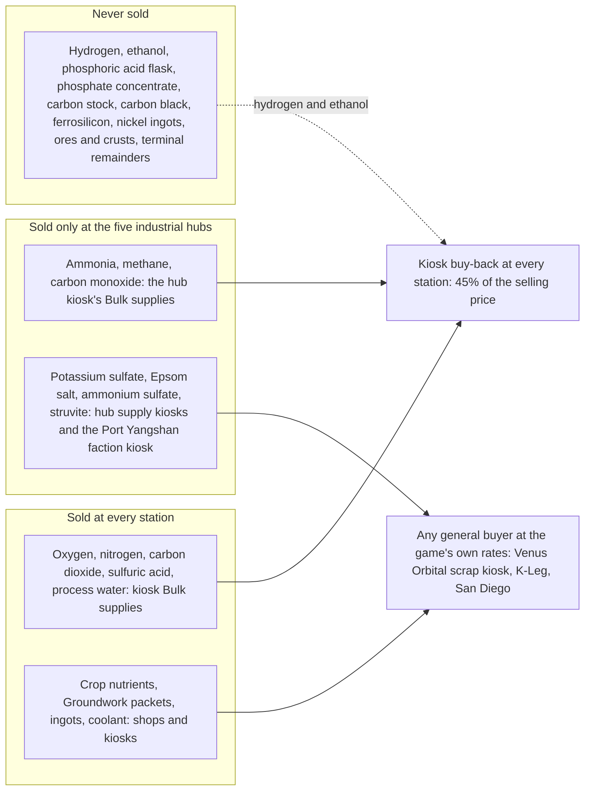

# Reagent sale at industrial hubs: research and design record

Research record, 8 October 2026. The owner asked to allow the sale of every chemical the
Phobos chains need, because making some reagents is a slow and painful process, and to balance
that by selling the ones that were previously locked away only at select ports, the stations
the game's own lore treats as industrial hubs. The same rule is to cover any chemical added
later. The owner also asked for suggestions on other areas of the mods that need balancing.
This is a research-and-record round: nothing here is built, and nothing has been tried in
play. The record collects what the game does, what our code already has, the classification
of every chemical and bulk commodity, the arithmetic behind each choice, the owner's decisions
from the same day, the implementation outline for the next round and a survey of other
balance seams.

Labels used below: **Observed** is seen in the installed game's data files (Ostranauts 1.0.1.5,
Blue Bottle Games) through the generated evidence this repository already keeps;
**Repository** is what our own code and data packs do today; **Agent proposal** is Claude's
design for the owner to revise; **Owner** marks a decision the owner took on 8 October 2026;
**Unverified** is stated as such.

## The question and the short answer

Selling a chemical at one station and not another is already how the game works: every
merchant is one native loot table at one station, and our stock code adds offers to those
tables by name. The two things missing are small. The economy data pack has no way to say
"this item sells only in these regions", and the refuelling kiosk's Bulk supplies view, which
sells gases and acid by the kilogram, appears at every kiosk without knowing which station it
stands on. Both gaps close with data-pack fields and two lookups, with no new world objects,
no new merchants and nothing saved.

The reagents that hurt are the fertiliser inputs. Ammonia has exactly one source, the ammonium
salt crust, which turns up on about one C-class mining pull in twenty and gives 955 g of
ammonia per crust through a V4 charge; there is no synthesis route. Potassium sulfate comes one
unit per evaporite crust, on about one pull in twenty. The crop-nutrients charge is the deepest
chain in the mods: three steps, four different mined ores, three charge machines and five
stores or tanks. Every chemical item Manufacturing makes is marked "Never sold by merchants".

## What the owner decided (8 October 2026)

1. **Owner:** the industrial hubs are the five stations whose own production maps make
   industrial products: Port Yangshan (MTRS) and Upsilon Docking (MVOL) at Mars, Long Beach
   Terminal (VNCA) and Venus Orbital (VORB) at Venus, and Cassini Spaceport (SVIR) at Titan.
   Zhonghuamen Terminal (BCRS) and Port Independence (JFTS) were offered as a Belt or Jovian
   outlet and declined for now.
2. **Owner:** hydrogen is not sold. Ammonia, methane and carbon monoxide are. The K2 water seam
   described below is recorded, not opened.
3. **Owner:** the phosphorus items (the phosphoric acid flask and the phosphate concentrate)
   stay unsold; phosphorus remains the nutrient that has to be mined.
4. **Owner:** record now, implement after review. This round writes the record, the standing
   rule in AGENTS.md and the index and ledger entries; the code and data changes wait for the
   owner to read this record.

## What the game does

**Observed.** The game's cargo market is one `ShipMarket` per station, with 19 named market
profiles. Each placed settlement's supply or scrap kiosk is its own inventory loot table, and a
category's price factor moves between about 0.2 and 1.8 with that station's surplus and demand
([economy guide](../solar-system-economy.md#prices-scarcity-and-useful-economic-limits)). The
production maps behind each profile and the kiosk capacities are in the
[generated regional evidence](solar-system-economy-evidence.md), read from Blue Bottle Games'
installed `market_actor_configs.json`, `production_maps.json`, loot and blueprint files. The
stations that produce industrial products, with the category capacity the game gives them:

| Code | Station | Production roles (native map identifiers, summarised) | Industrial capacity |
| --- | --- | --- | ---: |
| MTRS | Port Yangshan, Mars | Industrial products producer; metals to industrial products; food; fusion parts | 13,200 |
| SVIR | Cassini Spaceport, Titan | Metal to industrial products; control-systems consumer | 8,800 |
| VNCA | Long Beach Terminal, Venus | Metal to industrial products; industrial products to plastics | 3,300 |
| VORB | Venus Orbital | Metal to industrial products (scrap kiosk) | 3,300 |
| MVOL | Upsilon Docking, Deimos | Industrial products producer; science to industrial products; sensors, tools, fusion parts | 330 |
| BCRS | Zhonghuamen Terminal, Ceres (CCRE) | Ore, metal; industrial products to ore | 660 |
| JFTS | Port Independence, Ganymede | Industrial products to tools; suits | 1,320 |

The first five are the owner's hubs. K-Leg (OKLG), where most players start, consumes industrial
products (control systems, furniture, HVAC) and produces hulls and ore; it is the shipbreaking
hub, not a chemical one. Two profiles (MLAB, JPTN) have kiosk templates no blueprint places.

**Observed.** Regional supply kiosks sell without buying anything back (their buy list is the
game's never-true trigger); the Venus Orbital scrap kiosk buys any tradeable item, K-Leg's supply
kiosk anything without the high-salvage mark, the fixer intact high-salvage equipment
([economy coverage audit](economy-coverage-audit.md#what-the-game-does-with-trade)). The game
prices its gases per kilogram in one `GasPrices` table, which the refuelling kiosk charges:
oxygen 13.2, nitrogen 4.10, carbon dioxide 1.3, hydrogen 2.43, methane 2.2, ammonia 3.40,
carbon monoxide 1.1 and sulfuric acid 3.1 cr/kg.

## What our code already has, and the two gaps

**Repository.**

- `src/PhobosFramework/Trading/RegionalMarkets.cs` maps the 19 region codes to their native
  kiosk tables and adds one bounded lot per native roll (`PhobosRegional_<region>_<item>`).
  The codes are the stations' registration-id prefixes, except OFLT, the Flotilla, whose
  station id is OKLG_FLOT.
- The economy data pack (`src/PhobosFramework/Data/EconomyPack.cs`, `EconomyStock.cs`) carries
  per-region availability factors (`regions`), a `regional.items` table of loose commodities
  (Shipbreaker sells its ingots this way, in lots of 32), expanded merchants that carry
  everything at the floor chance, and the faction-kiosk tiers. **Gap one:** a regional item is
  offered in every region the pack lists; nothing says "only here".
- Bulk commodities (gases, acid, water, crop nutrients) sell through the refuelling kiosk's
  Bulk supplies view (`src/PhobosFramework/Trading/BulkSupplies.cs`,
  `VesselSupplyProvider.cs`). Manufacturing's provider (`src/PhobosManufacturing/StoreService.cs`)
  sells oxygen, nitrogen, carbon dioxide and sulfuric acid, and buys back every gas store and
  liquid tank at 45% of the station's selling price. **Gap two:** the view is added to every
  refuelling kiosk and its access check looks only at docking, ownership and reach, never at
  which station it is.
- Framework's story pack already holds the game's twelve regional stations and their
  twenty-nine parts by registration id, with names, bodies and factions
  (`mods/PhobosFramework/framework/story.json`, `src/PhobosFramework/Story/StoryPlaces.cs`),
  and Phobos Banking already gates its lenders by place (`src/PhobosBank/Loans.cs`, the
  `Lender.away` refusal). The hub gate can reuse the station lookup pattern and the place names.
- The value rules are enforced by native checks (`tests/PhobosNative.Tests/ManufacturingNativeChecks.cs`),
  which today also assert that no V4, LC-3 or SA-3 charge is fed from bought stock. That
  assertion is the one this change deliberately retires; the 1.25 x bought-stock rule replaces it.

## Classification

Every chemical item and bulk commodity the Phobos mods define, with its price, how it is made,
what consumes it, where it sells today and the decided status. Prices are base prices in
credits; bulk is per kilogram at the kiosk's own price.

| Commodity or item | Price | Made by | Consumed by | Today | Decided | Why |
| --- | ---: | --- | --- | --- | --- | --- |
| Oxygen (bulk) | 13.2/kg | X2 electrolysis, EC-4, CR-4 | SA-3 roast, carbon burn, A2, L2, RCS | every kiosk | **every station** | unchanged |
| Nitrogen (bulk) | 4.10/kg | AX-2 cracker | A2, L2, RCS | every kiosk | **every station** | unchanged |
| Carbon dioxide (bulk) | 1.3/kg | calcining, burns, fermenting | K2, A2 crop dosing | every kiosk | **every station** | unchanged |
| Sulfuric acid (bulk) | 3.1/kg | SA-3 roasting a sulfide nodule | olivine leach, crop nutrients, washes | every kiosk | **every station** | unchanged |
| Process water (bulk) | 10/kg | T2 thaw, many by-products | X2, leaches, roasts | every kiosk | **every station** | unchanged (Framework) |
| Crop nutrients (bulk) | 150/kg | LC-3 crop-nutrients charge | W2 dosing | every kiosk, into a hopper | **every station** | unchanged (Agriculture) |
| Ammonia (bulk) | 3.40/kg | V4 ammonium crust charge only | struvite, crop nutrients, AX-2, RCS | buy-back only | **industrial hubs** | the painful reagent: one mined source, no synthesis |
| Methane (bulk) | 2.2/kg | K2, T2 methane ice, straw char | pyrolysis, CR-4, RCS | buy-back only | **industrial hubs** | safe: its only item partner, carbon stock, stays unsold |
| Carbon monoxide (bulk) | 1.1/kg | CR-4 | K2 monoxide mode, RCS | buy-back only | **industrial hubs** | safe while hydrogen is ship-made |
| Hydrogen (bulk) | 2.43/kg | X2, pyrolysis, AX-2, ferrosilicon, CR-4 | K2, RCS | buy-back only | **never sold (owner)** | five routes aboard; the K2 water seam below |
| Ethanol (bulk) | 20/kg | Copperhead-3 from beets or sugar | Corker-2 bottler | buy-back only (owner, 4 October) | **never sold (owner)** | spirit arithmetic below |
| Potassium sulfate | 190 | LC-3 evaporite leach, one per crust | makeup packets, crop nutrients | never | **industrial hubs** | one unit per rare crust |
| Epsom salt | 13 | LC-3 olivine leach (32 a charge), regolith leach | struvite-acid, crop nutrients | never | **industrial hubs** | cheap, needs bought acid to make |
| Ammonium sulfate | 20 | LC-3 struvite-acid only | crop nutrients | never | **industrial hubs** | exists only through the flask route |
| Struvite | 125 | LC-3 from concentrate or the flask route | makeup packets, crop nutrients | never | **industrial hubs** | carries the phosphorus a buyer could not otherwise get, at a price |
| Phosphate concentrate | 110 | LC-3 evaporite leach, one per crust | struvite | never | **never sold (owner)** | phosphorus stays mined |
| Phosphoric acid flask | 300 | SA-3, one per sulfide nodule | struvite-acid | never | **never sold (owner)** | phosphorus stays mined; 1.28 x case below |
| Carbon stock | 38 | V4 carbides charge, straw char | nickel steel, pyrolysis bed | never | **never sold** | a chain product; pyrolysis loop below |
| Carbon black | 12 | V4 methane pyrolysis | carbon burn (CO2 supply) | never | **never sold** | a chain product |
| Ferrosilicon | 2 | EC-4 and CR-4 charges | ferrosilicon hydrogen charge | never | **never sold** | a by-product; buying it only loses |
| Nickel-iron and nickel steel ingots | 220, 260 | V4 iron and carburising charges | nickel steel, sale | never | **never sold** | the mined chain's own products |
| Ammonium salt crust, evaporite crust, sulfide nodule, clay hydrates | 150 to 180 | mining only | the charges above | never | **never sold** | AGENTS: ores and chunks are mined, never sold |
| Terminal remainders (twelve) | 0.01 | every charge | RM-1 reaction mass feeder | never | **never sold** | trash by design |

Agriculture's Groundwork packets, makeup salts, cartridges and seeds are sold everywhere today
and stay so; Medical, Auto Nav, Banking, Exchange, Spacer Stories and War Has Been Declared
define no chemicals.

## The arithmetic

The rules in force ([refining as a business](refining-business-and-interdependencies.md#the-rules-now-in-force)):
a business chain earns 1.5 to 2.5 x its ore; a supply chain keeps the game's gas prices; a
conversion fed only by bought stock earns at most 1.25 x those inputs; no gaining loop. Hub-sold
stock counts as bought from the day it is sold, so every charge that can be fed from it is held
to the quarter. Every figure below is at base prices with the gas prices above, water at 10 cr/kg
and the kiosk buy-back at 45%; none has been seen in play.

- **Crop nutrients from bought salts.** Potassium sulfate 190, struvite 125, Epsom salt 13 and
  ammonium sulfate 20, plus 252 g of ammonia (0.86) and 725 g of acid (2.25): 351.1 in. Out:
  2.771 kg of crop nutrients at 150 cr/kg, 415.7. **1.18 x.** Inside the rule. The chain stays
  worth running from mined crusts, and a buyer who skips the mining pays for it.
- **Makeup packets from bought salts.** 190 plus 2 x 125 in, 39 packets at 3 cr out: **0.27 x.**
  Loses, as the 5 October audit already recorded.
- **Struvite-acid from a bought flask.** Flask 300, three Epsom salt 39, 269 g of ammonia 0.91:
  339.9 in. Out: three struvite 375, three ammonium sulfate 60, 94 g of water 0.94: 435.9.
  **1.28 x.** Over the rule by a little; the flask therefore stays unsold (owner decision 3). With
  the flask unsold the charge is not fed from bought stock and the check does not apply.
- **Methane pyrolysis from bought methane and carbon stock.** Carbon stock 38 plus 4.007 kg of
  methane 8.82: 46.8 in. Out: four carbon black 48 plus 1.007 kg of hydrogen 2.45: 50.4.
  **1.08 x** at base, inside the rule; but under the native check's own loop convention (the
  product sold at San Diego's 1.2 x, the gas sold back at 45%) the loop returns 58.7 for 46.8
  bought. Carbon stock stays unsold, which closes it; carbon black with it.
- **Spirit from bought ethanol.** A 35 g serving of Alembrine spirit takes 12.1 g of ethanol
  (0.24 cr at 20 cr/kg) and 22.9 g of water (0.23 cr) and sells for 8 cr: about **17 x**. Selling
  ethanol at any price near its value would be a money printer through the Corker-2. The owner's
  4 October decision (buy-back only) stands, now with the figure.
- **The K2 water seam.** Bought hydrogen 125 g (0.30) and carbon dioxide 682 g (0.89): 1.19 in.
  Out per K2-hour: 248.7 g of methane (0.55) and 558 g of water, which at 10 cr/kg is 5.58:
  6.13, or 2.76 after the kiosk's 45% buy-back. A gaining loop of about **1.6 cr per K2-hour**,
  because our process water is worth more than the gases that make it. The same seam exists today
  for hydrogen made from bought water (water 11.25 in, oxygen 13.2 plus the hydrogen out, 1.2 x),
  which the native check already accepts as a supply step. Selling hydrogen would turn it into a
  bought-stock loop in letter if not in money. Owner decision 2: hydrogen stays unsold.
- **Ammonia into the AX-2.** 1 kg bought at 3.40 cracks to 822.5 g of nitrogen (3.37) and 177.5 g
  of hydrogen (0.43): 3.80 out, 1.71 back at the kiosk. Loses. Safe.
- **Carbon monoxide into the K2.** With ship-made hydrogen (1.125 kg of water at 11.25 for each
  125 g), 579 g of bought carbon monoxide (0.64) gives 332 g of methane, 372 g of water and a
  kilogram of oxygen worth 17.65 together, 7.9 back: loses. Safe while hydrogen is not sold.
- **Methane into the CR-4.** The carbothermal charges are already judged as loops by the native
  check (back less than the rock, with the methane valued at its price whether bought or made).
  Unchanged.
- **The ammonium crust itself.** A 10 kg crust worth 150 gives 955 g of ammonia (3.25), 505 g of
  water (5.05) and a 7.3 kg spent cake: a supply step, as recorded. Buying ammonia at a hub does
  not change that; it only means a ship without a crust can still make fertiliser, at the price
  the crust's rarity set.

## The standing rule

Added to AGENTS.md under Materials, chemistry and economy (owner, 8 October 2026):

> **Reagent sale.** Every reagent or bulk commodity a Phobos chain needs is sold somewhere. One
> that is otherwise only made aboard sells only at the industrial hubs (Framework's `industrial`
> market group: Port Yangshan, Upsilon Docking, Long Beach Terminal, Venus Orbital, Cassini
> Spaceport), declared in the owning mod's economy pack, at the game's own prices; the kiosk buys
> bulk back everywhere. Hub-sold stock counts as bought under the value rules, so a chain fed
> from it earns at most 1.25 x, and faction kiosks follow the item's market. Ores, crusts and
> nodules, chain products, the phosphorus items, hydrogen, ethanol and terminal remainders stay
> unsold; classify every new chemical in this record's table before it ships.

**Classifying a new chemical.** Before a new reagent or commodity ships, add its row to the
classification table above and answer, in order: is it an ore, crust or nodule (mined, never
sold)? A terminal remainder (never sold)? A chain product rather than an input (never sold)?
Does any charge fed only from it and other bought stock exceed 1.25 x, or does any loop through
the kiosk buy-back or a 1.2 x item sale repay its purchase (then never sold, or reprice)? Is it
already sold everywhere by the game or by us (leave it)? Otherwise it sells at the industrial
hubs: a `regional.items` row (or a `bulk` row) with `market: industrial`, a Neutral faction-kiosk
tier, the chemicals lot, and the native checks that prove the arithmetic.

## Implementation outline for the next round

Verified against the code in this session by a planning pass; recorded so the implementation
starts from facts. **Agent proposal** throughout; sizes are compared with delivered rounds, not
hours.

- **Nothing maps a merchant table or a ship to a region code today**, and the economy pack has
  no cross-pack references. Framework's economy pack loads before every content pack
  (`FrameworkLifecycle` through `ItemEconomy.Load`), so a Manufacturing `market` name can
  resolve against Framework's `markets` at load and in offline tests. The pack loader refuses
  unknown fields, so the C# classes, `scripts/validate-data-packs.py` whitelists and
  `scripts/write-json-schemas.py` must change together or Framework's own pack is refused.
- **Framework.** In `EconomyPack`: a `markets` table of named region groups (Framework ships
  `industrial` with the five codes in `mods/PhobosFramework/framework/economy.json`; a content
  pack or an add-on under its own prefix may add groups; a player file may retune by key), a
  `market` field on regional items only (an explicit offer already names its merchant), and a
  `bulk` table keyed by commodity ({sells, market, notes}). In `RegionalMarkets`:
  `RegionOf(merchantTable)` (the inverse of the supply tables, then the `ItmFactionKiosk<CODE>Inv`
  and `ItmSupplyKiosk<CODE>Inv` patterns, K-Leg's tables to OKLG, San Diego's traders to VNCA,
  the Flotilla to OFLT, Venus Orbital's to VORB, else null with a log line) and
  `StationRegion(regId)` (longest prefix over the 19 codes plus OKLG_FLOT to OFLT, with the
  story places used only for display names). `ApplyRegional` skips a restricted item at
  expanded merchants and regions outside its market (Venus Orbital is reached through the
  expanded Venus scrap kiosk, so no extra factor rule); `ApplyFactionKiosks` places a restricted
  item only at kiosks whose station is in its market. `BulkSupplyOffer` gains an optional
  region list beside its existing constructor, `BulkSupplies.SoldHere` is a pure function, and
  the station view lists only what is sold here plus a "Not sold at this station" list that
  names where each line is sold; buy-back lines stay everywhere. New text keys for the view and
  the validator messages join the language ledger.
- **Manufacturing.** `StoreService.GasOffers` reads the pack's `bulk` rows (code defaults when
  a row is absent; `LiquidFamily.StationSells` stays as the default, which an existing acid
  check asserts). The pack gains regional items for the four salts (lot `chemicals` of 20, the
  supplies floor, market `industrial`, Neutral kiosk tiers) and bulk rows: ammonia, methane and
  carbon monoxide sell at `industrial`; hydrogen and ethanol `sells: false` with the reason;
  the four everywhere commodities `sells: true`. Materials notes change for the salts; the
  concentrate and flask keep "Never sold" with the reason. A registered constant
  `Manufacturing.stockChemicals` joins the catalogue with the `merchant-stock.md` row pattern.
- **Checks.** `tests/PhobosFramework.Tests/DataPackChecks.cs` (markets, market and bulk
  validation, `RegionOf`, `StationRegion`, `SoldHere`); `tests/PhobosNative.Tests/RegionalEconomyChecks.cs`
  (restricted branches exist only in in-market tables and at in-market expanded merchants, and
  the native sell filter and the Venus buyer accept the salts); `tests/PhobosNative.Tests/FactionKioskChecks.cs`
  (today it asserts every sold item at all three kiosks; it becomes per kiosk by market, with a
  positive check at Port Yangshan); `tests/PhobosNative.Tests/ManufacturingNativeChecks.cs`
  (the crop-nutrients and makeup exceptions and the "no charge fed from bought stock" assertion
  become the 1.25 x rule plus "the only bought charge inputs are the hub-sold salts", and the
  store service's offers and buy-backs are listed); `tests/test_data_packs.py` validator cases.
- **Offline tooling.** `validate-data-packs.py` (whitelists, market groups, cross-pack `market`
  resolution against Framework's shipped pack, bulk keys), the regenerated
  `schemas/economy.schema.json`, and `audit-economy.py` counting bulk commodities with
  `sells: true` as bought in its loop test, then regenerating its tables.
- **Rules and guides in the same commit.** AGENTS.md's Selling rule gains "a hub-only item at
  the kiosks in its market" (done in this round); the refining rules, the economy guide (an
  Industrial hubs section), `merchant-stock.md` (the lot row), `faction-kiosk-stock.md`,
  `editing-data-files.md` and `publishing-an-add-on.md` (the new fields; an add-on may add a
  market group under its prefix), the Manufacturing player guide (its "No station sells
  ammonia, hydrogen or methane" line and the Selling section), `equipment-economy.md`, a dated
  addition to the economy coverage audit, the item-reference wording for the LC-3 salts in
  `config/item-reference.json` and the regenerated references, and the stale 1,500 cr/kg
  figures listed below.
- **Versions and saves.** The next free Framework and Manufacturing minor numbers, claimed with
  the other sessions first (0.133.0 is already taken by the performance round); the dependency
  minimum follows. Both Workshop pages sit within eleven bytes of the 7,500-byte limit and need
  trimming elsewhere before a line is added. Saves are unaffected: offers apply at native
  restocks and nothing new is saved.
- **Owner check after the build.** Dock at Port Yangshan and at K-Leg; open Bulk supplies at
  each (ammonia offered at the first, listed as not sold here with the hub names at the second);
  after a restock, look for the four salts at Port Yangshan's supply kiosk and faction kiosk and
  confirm they are absent from K-Leg's.

## Other balance seams found

Collected while reading for this record; each with its evidence and a one-line recommendation.
The owner answered each on 8 October 2026; the outcome follows each item.

- **Refining payback.** The LC-3 and SA-3 chains repay their 48,000 to 56,000 cr machines in
  about 300 to 740 machine-hours; an hour of LC-3 time earns about 150 cr
  ([refining record](refining-business-and-interdependencies.md), the payback table). The owner
  said this is for play to judge. Recommendation: leave it until the hub sale has been played,
  since bought salts change what the LC-3 is for. **Owner, 8 October 2026:** profits from
  refining, and perhaps manufacturing, must rise substantially: the band becomes 3 to 5 x the
  ore, carried by product prices, with every guard kept. A dated repricing proposal comes
  before the build, and the spirit reprice below joins it.
- **Epsom salt surplus.** An olivine charge makes 32 and about 4 are ever used; magnesia has no
  consumer, so the Epsom-to-acid idea waits (same record, idea 8). Recommendation: a hub buyer
  does not help a surplus; the consumer is the fix. **Owner:** research a consumer first; the
  candidates are in the refining record under idea 8 (a furnace refractory lining recommended).
- **Water above its gases.** Process water at 10 cr/kg is worth more than the hydrogen and
  carbon dioxide that make it, so any hydrogenation that yields water gains a little whenever
  its gases can be bought. Recommendation: keep hydrogen unsold (done) and write the K2 loop
  into the native checks as a bound, so a later price change cannot open it unseen. **Done:**
  the Manufacturing native checks now fail if the station ever sells every gas a K2 mode takes
  while that mode repays them, and say that hydrogen is not sold.
- **Stale nutrient figures.** Crop nutrients fell from 1,500 to 150 cr/kg on 5 October, but the
  old figure or its consequences remain in `docs/agriculture-item-reference.md` (the E2 hopper
  entry), `docs/manufacturing-item-reference.md` (the LC-3 salts group), a code comment in
  `src/PhobosAgriculture/Core/HopperRules.cs`, the crop-nutrients note in
  `mods/PhobosManufacturing/framework/process-recipes.json`, two passages of
  `manufacturing-refinery-and-chemistry.md` ("about 4,150 cr a charge") and
  `asteroid-feedstock-programme-status.md`. **Done** in Agriculture 0.66.2 and Manufacturing
  0.58.2 (owner, 8 October 2026: fix now as a patch); the design records keep their dated
  figures with a note beside them.
- **Fermenting sugar never pays.** A 10 cr sugar packet becomes about 4 cr of ethanol; beet mash
  is roughly even ([economy audit, 5 October](economy-audit-2026-10-05.md), finding 6). Flax and
  sugar beet still cost more in water and nutrients than their raw produce sells for.
  Recommendation: accept as flavour unless the owner wants a spirit price nearer the game's
  vodka, which would move the Corker-2 towards a business. **Owner:** reprice spirit near the
  game's vodka, inside the repricing proposal.
- **Engineering salvage.** After the 5 October cut the mods together add about 1,115 cr a find,
  and Manufacturing's 732 cr is the largest share (same audit, decision 2). Recommendation: no
  change; late-game machines found broken are the intended rare prize.
- **Agent-default prices.** The EC-4 at 96,000 and the CR-4 at 72,000 (both marked open to owner
  revision in `docs/equipment-economy.md`), and the regolith leach odds of 72/22/4/2
  (`regolith-programme.md`). Recommendation: judge in play with the oxygen-from-rock round.
  **Owner:** folded into the repricing proposal.
- **Banking rates.** Orrery Credit, the remote line usable anywhere, charges 0.06% a shift plus a
  3% draw fee and is described as dearer than the registered lenders, yet it is cheaper per
  shift than Stillwater Advances (0.08%), which is local and unregistered
  (`mods/PhobosBank/framework/lenders.json`). Recommendation: either raise Orrery or lower
  Stillwater at the balance pass the Banking record already defers, and say which is dearer.
  **Done:** Orrery Credit charges 0.10% a shift from Phobos Banking 0.8.1 (owner: raise Orrery
  above Stillwater).
- **Exchange.** The share-market design record calls for a simulated test that manipulating a
  station's cargo market cannot pay through the exchange; no such test exists yet.
  Recommendation: write it before the owner's gameplay checks, since it is cheap offline.
  **Investigated, 8 October 2026:** the test as specified would fail. On paper most drivers can
  be swung by flooding a station with its category's cheapest goods for far less than a capped
  holding could gain; the arithmetic and four options are in the
  [Exchange record](share-market-and-charts-design.md#manipulation-by-cargo-what-the-numbers-say-8-october-2026).
  An owner decision is needed before the guard is written.
- **Repair arbitrage and water ice.** Buying a broken machine, repairing it and selling it whole
  earns up to tens of thousands; thawing a 1,200 cr ice block yields 227 cr of water. Both follow
  the game's own valuations and were accepted on 29 September and 5 October. No change.

## Sources and status

- **Game data** (Blue Bottle Games, Ostranauts 1.0.1.5, read locally and never redistributed):
  market profiles, production maps, kiosk tables, `GasPrices`, merchant discount tables and
  station ids, through this repository's generated evidence
  ([regional economy](solar-system-economy-evidence.md), [vanilla economy audit](vanilla-economy-audit.md),
  [economy coverage audit](economy-coverage-audit.md)). The integration approach follows the
  documentation attributed in the [economy guide](../solar-system-economy.md#sources-and-verification).
- **This repository:** the recipes in `mods/PhobosManufacturing/framework/process-recipes.json`,
  the materials and economy packs, the bottler's serving figures in
  `src/PhobosManufacturing/Core/BottlerRules.cs`, the K2 and AX-2 cycle figures in
  `SabatierRules.cs`, `ProcessorRules.cs` and `CrackerRules.cs`, and the native checks named above.
- **Our own inference throughout:** the hub selection from production roles, every ratio, the
  reading of each loop, and the classification. Nothing in this record has been tested in play,
  and no institution or the game's developer endorses the balance.
