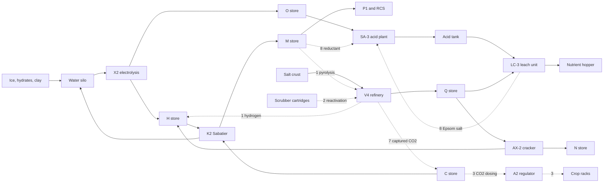

# Refining as a business, and reactors that depend on each other

Design record, **1 October 2026**. Proposals only: no price, recipe or code has
changed. The owner approves the price table and picks which ideas to build.
Nothing here is gameplay-validated.

## Owner directions this record answers

**Interdependencies (1 October 2026).** Explore where the existing chemical
reactors can depend on each other and gain further uses, instead of one use per
machine. New machines are allowed, ranked by value and cost, and chains may feed
the game's own consumables.

**Refining is a business (1 October 2026).** "I want refining to be a reasonably
profitable business venture from now on, retroactively at that." Decisions the
same day:

- **Target:** about double. Finished products sell for roughly 1.5 to 2.5 times
  the raw ore, before power, time and machine cost.
- **Sales route:** the refuelling kiosk buys bulk back from the ship's stores
  (water, gases, acid) at a set share of its selling price, so buy-and-resell never
  pays. Hydrogen, methane and ammonia gain prices. No trade-good packing.
- **Measure:** each product chain must be profitable overall. Low-yield survival
  charges (hydrates to water) stay supply, not business.

This supersedes the working guardrails of 30 September (sellable products within
1.5 x inputs) once the owner approves Part 1. Unchanged: mass conservation,
realistic sourced chemistry, native gas species only, terminal remainders, frozen
recipe revisions, the dismantling rule, links by touching or line, hazards through
the game's own machinery.

## How to read the numbers

- Prices are **base prices**. The game's merchants buy at 0.4 to 0.5 x base
  (kiosks), 0.5 to 0.9 x (fixer) and 1 to 1.2 x (San Diego), and apply the same
  multiplier to ore and to products ([vanilla economy audit](vanilla-economy-audit.md)).
  A ratio at base prices is therefore the ratio the player sees at any one buyer.
- Bulk commodities are valued at the kiosk's selling price: the game's own
  `GasPrices` table (oxygen 13.2, nitrogen 4.10, CO2 1.3, hydrogen 2.43, methane 2.2,
  ammonia 3.40, sulfuric acid 3.1 cr/kg, read from the installed 1.0.1.5 data) and
  our process water at 10 cr/kg.
- Every mass balance and ratio below was computed by a script and checked to the
  gram, with rounded atomic masses.

# Part 1: profitable refining

## The economy has three price levels

| Level | Examples (cr/kg) | Source |
| --- | --- | --- |
| Bulk gases and scrap | CO2 1.3, steel scrap 3.6, oxygen 13.2 | Game data |
| Ores | carbon ore 9.9, iron 22.5, water ice 48.6 | Game data |
| Finished consumables | LiOH cartridge 94, plastic 153, crop nutrients 1,500 | Game data; Agriculture |

Refining earns when it lifts ore into finished goods. A conversion that ends in
bulk gas or water ends below the ore it started from, at any honest yield. This
is why most chains lose today, and why the business has to sit in the items.

## Today's chains

| Chain | Ore | Products today | Ratio |
| --- | ---: | ---: | ---: |
| Meteoric iron → nickel-iron ingots | 450 | 82 | 0.18 |
| ... then carbon → steel ingots | 470 | 102 | 0.22 |
| Carbon ore → carbon stock | 99 | 62 | 0.63 |
| Evaporite crust → salts | 150 | 54 | 0.36 |
| Olivine + acid → Epsom salt | 180 | 224 | 1.24 |
| Sulfide nodule → acid + flask | 150 | 54 | 0.36 |
| F6: aluminium scrap → ingots | 22 | 51 | 2.33 |
| F6: steel scrap → ingots | 72 | 111 | 1.54 |
| F6: aluminium scrap → housing | 22 | 55 | 2.50 |

- The F6 chains are already in the band.
- Nothing buys bulk, so the gases, water and acid a ship makes cannot be sold.

## Proposed rule (replaces the 30 September guardrails)

1. **Business chains.** A chain from a mined feed to finished items is priced so
   the items are worth 1.5 to 2.5 x the ore at base prices.
2. **Supply chains.** A chain that ends in bulk water or gas is supply. It keeps
   the game's own gas prices and makes no profit claim.
3. **Kiosk buy-back.** The refuelling kiosk buys bulk from installed stores at
   **45%** of its selling price, inside the game's own kiosk range of 0.4 to 0.5.
4. **Bought stock.** A conversion fed only by station-bought inputs earns at most
   1.25 x (the existing quarter rule), so trading never beats mining.
5. **No free loops.** Reverse steps and dismantling lose value; no closed loop
   that returns its own inputs gains.
6. **Shared products.** A product made by two chains is priced so neither leaves
   the band; where that cannot hold, the chains get separate products.

## Proposed price table

| Item | Mass | Today | Proposed | Why |
| --- | ---: | ---: | ---: | --- |
| Nickel-iron ingot | 4 kg | 20 | 220 | Refined nickel alloy above its ore (22.5 cr/kg) |
| Nickel-alloy ingot (new) | 4 kg | — | 260 | The mined chain's own end product |
| Carbon stock | 1 kg | 10 | 38 | Puts carbon ore at 2.0 x |
| Potassium sulfate | 0.7 kg | 42 | 190 | Puts the crust at 2.0 x with the concentrate |
| Phosphate concentrate | 0.25 kg | 12 | 110 | Phosphorus is the scarce nutrient |
| Struvite | 0.43 kg | 17 | 125 | A small gain on its concentrate |
| Epsom salt | 0.432 kg | 7 | 13 | Puts olivine at 2.3 x |
| Ammonium sulfate | 0.232 kg | 8 | 20 | Keeps the acid-route step at 1.3 x |
| Phosphoric acid flask | 0.515 kg | 30 | 300 | Carries the nodule chain |
| Methane ice (native) | 24.84 kg | 20 | 100 | Its water alone is worth 199; see outliers |

Unchanged: steel and aluminium ingots, housings, makeup packets (Agriculture's
price by owner decision), every remainder, every native ore.

## Chains after the change

| Chain | Ore | Bought reagents | Products | Ratio to ore | Gain per charge | Machine payback |
| --- | ---: | ---: | ---: | ---: | ---: | --- |
| Iron → nickel-iron | 450 | 0 | 882 | 1.96 | 432 | 148 charges, 99 h |
| Iron + carbon → nickel alloy | 470 | 0 | 1,042 | 2.22 | 572 | 112 charges, 137 h |
| Carbon ore → carbon stock | 99 | 0 | 202 | 2.04 | 103 | 621 charges, 311 h |
| Evaporite crust → salts | 150 | 0 | 300 | 2.00 | 150 | 320 charges, 320 h |
| Olivine → Epsom salt | 180 | 122 | 416 | 2.31 | 114 | 421 charges, 421 h |
| Nodule → acid + flask | 150 | 99 | 324 | 2.16 | 76 | 742 charges, 742 h |

- "Bought reagents" are the acid, oxygen and water a charge draws, at kiosk
  prices. A ship that makes its own pays nothing for them.
- Payback is the machine's price divided by the gain, in charges and in hours of
  running. It is long for the small chains: at "about double", an hour of LC-3
  time earns 150 cr against a 48,000 cr machine.
- **This is the main thing for the owner to judge.** If payback should be shorter,
  the band has to rise for the small chains, or the machines get cheaper.

### Steps inside the fertiliser chain

| Step | Inputs | Outputs | Ratio |
| --- | ---: | ---: | ---: |
| Struvite | 112 | 125 | 1.11 |
| Acid-route struvite | 340 | 436 | 1.28 |
| Nickel-iron + carbon → alloy | 918 | 1,040 | 1.13 |
| Makeup packets | 440 | 1,170 | 2.66 |
| Crop nutrients into a hopper | 351 | 4,157 | 11.8 |

## Outliers that need an owner decision

- **Fertiliser is far above the band.** Agriculture prices nutrients at 750 to
  1,500 cr/kg, so the last step earns 2.7 x (packets) or 11.8 x (hopper nutrients)
  whatever the salts cost. Proposal: accept it as the prize at the end of a
  four-machine chain, sell makeup packets as items, and **do not** buy hopper
  nutrients back at the kiosk.
- **Water ice sells better raw.** A block is 1,200 cr and its 22.7 kg of water is
  worth 227. Doubling it would need process water at 106 cr/kg, which would break
  crop and electrolysis costs. Proposal: thawing stays supply.
- **Hydrates, clay and salt crust** yield 16, 20 and 8 cr of bulk from 150 to
  180 cr of ore. They are supply; the salt crust earns through fertiliser.
- **Methane ice is the opposite.** The game prices it at 20 cr while it holds
  199 cr of water. Proposal: 100 cr, which puts thawing at 2.05 x. This raises
  what a raw block sells for; it takes nothing from a save.
- **The steel ingot is shared.** The V4 makes it from mined iron and the F6 from
  72 cr of scrap. Pricing it for the mined chain would make scrap-to-ingot a
  money press. Proposal: a new V4 revision ends in a **nickel-alloy ingot** of
  its own; the plain steel ingot keeps its price and its F6 source. The old steel
  charge stays for saved jobs.

## Loop audit

| Loop | In | Out | Verdict |
| --- | ---: | ---: | --- |
| Buy any bulk, sell it back | 100% | 45% | Loses 55% |
| Buy water, electrolyse, sell O2 + H2 | 11.25 | 6.08 | Loses |
| Buy water + CO2, X2 then K2, sell all | 12.14 | 8.70 | Loses |
| Ingot back to four scrap | 25 | 14.4 | Loses |
| Buy steel scrap at a kiosk, sell ingots at San Diego | 1.0 | 1.54 | Exists today |
| Buy aluminium scrap, sell ingots at San Diego | 1.0 | 2.33 | Exists today |

- The two scrap loops are in the game now and earn about 30 to 40 cr a furnace
  charge. They break the 1.25 x rule for bought stock. The owner may leave them,
  since the F6 mostly melts salvage, or trim the aluminium ingot's price.
- No proposed price opens a new loop: every re-priced item starts from a mined
  feed that no merchant sells.

## What the retroactive change would touch (later, after approval)

- **Data packs:** the Manufacturing and Shipbreaker `materials.json` prices; one
  new material and one new V4 revision for the alloy ingot.
- **The kiosk:** a buy-back path beside the bulk sale. `IBulkSupplyProvider` only
  delivers today (`src/PhobosFramework/Trading/BulkSupplies.cs`).
- **Saved items:** an item keeps the price it was created with. An automatic,
  idempotent load-time refresh of the price stat is needed for Phobos materials,
  as `EquipmentSaveUpgrade` already does for equipment.
- **Native methane ice:** amended in place, as the withdrawn 0.45.0 correction
  was.
- **Checks to rewrite:** `ManufacturingNativeChecks`, `RefineryChecks`,
  `LeachChecks`, `AcidPlantChecks` and `SiloNativeChecks` assert the old
  guardrails.
- **Records:** [equipment economy](../equipment-economy.md), the item
  references, changelogs and the AGENTS.md "Refining value" section.

# Part 2: reactors that depend on each other

## Today's links and the proposed ones

Solid arrows exist today. Dotted arrows are proposals, numbered as below.

## Loose ends the ideas use

- **Methane has one use** (the RCS). The K2 and the T2 both make it.
- **V4 off-gas is lost to the room:** the carbon charge's 0.6 kg CO2 and 0.3 kg
  CO, and the ammonium charge's 1.235 kg CO2.
- **Epsom salt piles up:** an olivine charge makes 32 and about 4 are ever used.
- **Dead ends:** carbon stock and nickel-iron without Shipbreaker; ingots until
  the M4 mill; nine terminal remainders; silicates, regolith and six precious ores.
- **Racks** stop growing when the room has no CO2. A potato crop draws 12.8 g an
  hour; more CO2 prevents starvation but does not raise yield.
- **Bought consumables with no Phobos source:** LiOH scrubber cartridges (about
  one per crew member per day, 235 cr), EVA filters, W2 recovery cartridges, F6
  coolant charges.

## Engine constraints that set the cost

- The AX-2, K2 and X2 have no tray, no modes and a strict saved record. Solid
  products and recipe choice exist only in the charge machines (V4, LC-3, SA-3).
- A charge must bind at least one item, and the V4 cannot yet draw a gas.
- When two revisions take the same items the lowest wins, and nothing retires a
  frozen revision. Replacing a recipe needs a small supersession mechanism.
- No appliance generates power in the game data; supply comes from
  battery-pattern objects.

## First slice (no new machine, one shared enabling change)

**Enabling change:** V4 links for gases it draws, and a feed list that admits a
native condition. Cost S.

### 1. Methane pyrolysis in the V4

- **Links:** K2 or T2 → M store → V4 → H store and carbon stock.
- **Reaction:** CH4 → C + 2 H2, the thermal-black process (to cite). With the K2
  this is the Bosch reaction overall, CO2 + 2 H2 → C + 2 H2O (NASA Series-Bosch
  work, to cite).
- **Charge:** 1 carbon stock (seed) + 4.007 kg methane → 4 carbon stock +
  1.007 kg hydrogen. Absorbs about 5.2 kWh.
- **Why:** it closes the X2 oxygen loop. The Sabatier alone loses half its
  hydrogen as methane; this returns it. Methane and carbon stock both gain a use.
- **Earns:** 3 carbon stock (114 cr at the proposed price) from 9 cr of methane.
  Honest only if methane ice is re-priced (Part 1), or carbon stock made this way
  becomes the business end of the methane ice chain.
- **Hazard:** hydrogen held in the hearth burns by the H store rule on damage.
- **Cost:** S to M.

### 2. Cartridge reactivation in the V4

- **Links:** the game's CO2 scrubber and EVA suit → V4 → back.
- **Charge:** 4 spent cartridges (10 kg) → 3 ready (7.5 kg) + 1 exhausted
  sorbent remainder (2.5 kg). The EVA filter takes the same recipe.
- **Honesty:** the game's scrubber pumps the CO2 into a canister, so a spent
  cartridge holds none and the recipe releases none. Real lithium carbonate does
  not regenerate by heat alone, so this is an authored "reactivation" with a
  quarter lost each pass, not a chemistry claim.
- **Why:** cartridges are the ship's largest recurring purchase, about one per
  crew member per day. This cuts it by three quarters.
- **Earns:** saves 176 cr per crew-day. On paper it loses (the game prices spent
  and ready cartridges alike).
- **Cost:** S to M.

### 3. CO2 for grow rooms: A2 third gas, with a carbon burner

- **Links:** C store → A2 → racks → oxygen back to the room; carbon stock + O
  store → V4 → C store.
- **A2:** a third set point, 0.05, 0.1 or 0.2 kPa of CO2, under the game's 0.3 kPa
  warning band.
- **Burner charge:** 1 carbon stock + 2.664 kg oxygen → 3.664 kg CO2 to a C
  store, 9.1 kWh of heat. One charge feeds about three potato crops.
- **Why:** a scrubbed or crewless grow room starves its crops today.
- **Cost:** S to M. The A2's saved record needs a tolerant reader.

## Next tier

### 4. Regenerable CO2 scrubber with a catalytic oxidiser (new machine)

- **Links:** room air → C store → K2 and racks.
- **Works:** room CO2 moves into a C store by mass, for power and heat. The
  oxidiser turns CO and methane in the room into CO2 (CO + ½ O2 → CO2).
- **Sources:** NASA's ISS Carbon Dioxide Removal Assembly and trace contaminant
  control oxidiser (to cite).
- **Why:** the highest-value item here. It removes cartridges for good and makes
  the scrubber, Sabatier, electrolysis loop of the ISS real aboard.
- **Cost:** L.

### 5. Activated-carbon recovery cartridges

- **Links:** V4 → Agriculture's W2 drainage treatment.
- **Reaction:** steam activation, C + H2O → CO + H2 on half the carbon. 1 carbon
  stock + 0.75 kg water → 0.5 kg activated carbon (ten 50 g cartridges) + 1.166 kg
  CO + 0.084 kg hydrogen.
- **Earns:** 250 cr of cartridges from 38 cr of carbon. Above the band, like
  fertiliser, because Agriculture prices consumables high.
- **Hazard:** the CO goes to the afterburner (idea 7) or poisons the room.
- **Cost:** S to M.

### 6. Warm-gas RCS mode on the P1

- **Links:** N, H and O stores → RCS.
- **Works:** nitrogen carrying a few percent hydrogen and oxygen over a catalyst
  bed heats itself before the nozzle, about 1.8 x cold gas at 1,000 K (Tridyne,
  to cite). It fits the existing worth formula, which scales with √(T/M).
- **Why not methane and oxygen:** the game's cold-gas nozzles cannot honestly
  burn them.
- **Cost:** M.

### 7. V4 off-gas capture with an afterburner

- **Links:** V4 → C store → K2; O store → V4.
- **Works:** the carbon charge burns its CO with stored oxygen, 0.3 kg CO +
  0.171 kg O2 → 0.471 kg CO2, and stores 1.071 kg of CO2. The ammonium charge
  stores its 1.235 kg.
- **Why:** the K2 gets its CO2 from the ship's own chemistry, and the carbon
  charge stops poisoning the room.
- **Cost:** M. Needs the supersession mechanism.

### 8. Epsom salt back to acid in the SA-3

- **Links:** LC-3 → SA-3 → AT tank; M and O stores → SA-3.
- **Reaction:** 4 MgSO4·7H2O + CH4 + 2 O2 → 4 MgO + 4 H2SO4 + CO2 + 26 H2O.
  Reductive decomposition of magnesium sulfate is real (source needed).
- **Charge:** a 14-unit Epsom bag (6.048 kg) + 0.098 kg methane + 0.393 kg oxygen
  → 2.407 kg acid + 0.989 kg magnesia + 0.270 kg CO2 + 2.873 kg water.
- **Why:** it gives the SA-3 a second use, the Epsom surplus a destination, and
  returns two thirds of the acid an olivine charge used.
- **Open:** magnesia has no consumer. It is a terminal remainder unless the
  owner wants it as a refractory for furnace Restore.
- **Cost:** M. Needs supersession and a bagged Epsom product.

### 9. Water-gas hydrogen in the V4

- **Charge:** 1 carbon stock + 3.000 kg water → 3.664 kg CO2 + 0.336 kg
  hydrogen, absorbing about 4.1 kWh.
- **Why:** hydrogen at a quarter of the X2's electricity, with CO2 for the K2
  and no oxygen to store.
- **Cost:** S once idea 1's links exist.

### 10. Fuel-cell stack (new machine)

- **Works:** 1 kg hydrogen + 7.94 kg oxygen → 8.94 kg water + about 16.7 kWh
  (half the lower heating value). A 24 kg H store is about 400 kWh.
- **Source:** NASA Glenn regenerative fuel-cell work (to cite).
- **Why:** emergency power from the stores when the reactor is down.
- **Risk:** needs a native spike. The game has no generator, only battery-pattern
  objects, and its own recharge may fight ours.
- **Cost:** L.

### 11. Ammonia synthesis (new machine)

- **Reaction:** N2 + 3 H2 → 2 NH3. Per kilogram: 0.822 kg nitrogen + 0.178 kg
  hydrogen. A 150 to 250 bar loop, not the cracker run backwards.
- **Why:** fertiliser when no salt crust is found.
- **Caution:** station nitrogen would weaken the "made from mined feed" basis
  of the crop-nutrient price.
- **Cost:** L.

## Further ideas

| Idea | Balance | Note |
| --- | --- | --- |
| Dry-chemical extinguisher refill (LC-3) | Flask 0.515 kg + 0.0895 kg NH3 → 0.6045 kg monoammonium phosphate | The real ABC agent; needs a ruling on the vanilla item's mass |
| Waste-heat links | SA-3 releases 21.1 kWh a nodule | An exothermic machine touching an endothermic one spares the room |
| Ammonia heat loop to the radiator | No reaction | After the ISS external loops (to cite) |
| Steam-methane reforming | 1 kg CH4 + 2.246 kg water → 2.743 kg CO2 + 0.503 kg H2 | Lower rank than pyrolysis |
| Molten regolith electrolysis | 20 kg regolith → about 3.9 kg O2 + slag | New machine; NASA Kennedy work (to cite) |
| Sponge iron by hydrogen | 1 kg Fe2O3 + 0.038 kg H2 → 0.699 kg Fe + 0.338 kg water | Needs a non-terminal calcine from a new SA-3 revision |
| Acid and ammonia into Smoke | By mass | When both leak into one room |
| Extra nutrient carriers | Urea, monoammonium phosphate | Small benefit: Agriculture counts one nutrient figure |
| Ammonium sulfate back to ammonia and acid | 0.232 kg → 0.060 kg NH3 + 0.172 kg acid | Real but lossy |
| Disposal port | — | The honest end for terminal remainders ([research](material-disposal-port-research.md)) |

**Ingots** get their consumer from the planned M4 mill and its heat sinks: 68
native repair bills need one ([repair castings](furnace-repair-castings.md),
[Manufacturing research](manufacturing-research.md)).

## Dropped, with reasons

- **Chlorate oxygen candle:** the only salt source is a terminal cake with trona
  and fluoride, and the vanilla candle states more oxygen (3.44 kg) than its mass
  (1.8 kg), so an honest one cannot compete.
- **Anaerobic digester:** about 0.02 kg of methane per potato crop, and ESA's
  MELiSSA compartment I deliberately suppresses methane.
- **Catalyst charges from precious ores:** already rejected in the
  [programme status](asteroid-feedstock-programme-status.md) (no catalysts without
  real wear), unless the owner reopens it.
- **Trade-good packing:** the owner chose kiosk buy-back only.
- **CO2 extinguisher refill:** the vanilla extinguisher uses dry chemical.
- **Coolant blending:** the F6's fluid has no declared composition.
- **Rebalance revisions:** the ammonium sulfate surplus and the acid shortfall
  turned out not to be real once checked.

## Ranked list

| Rank | Idea | Cost | Depends on |
| ---: | --- | --- | --- |
| 1 | Methane pyrolysis in the V4 | S to M | Enabling change |
| 2 | Cartridge reactivation (with EVA filter) | S to M | Enabling change |
| 3 | A2 CO2 dosing + carbon burner | S to M | Enabling change |
| 4 | Regenerable scrubber + oxidiser | L | New machine, art |
| 5 | Activated-carbon cartridges | S to M | Idea 1's links |
| 6 | Warm-gas RCS mode | M | — |
| 7 | Off-gas capture + afterburner | M | Supersession |
| 8 | Epsom to acid in the SA-3 | M | Supersession |
| 9 | Water-gas hydrogen | S | Idea 1's links |
| 10 | Fuel-cell stack | L | Native spike |
| 11 | Ammonia synthesis | L | New machine |

# Decisions for the owner

1. **The price table, the 45% buy-back and the band.** In particular: is the
   payback of the small chains (300 to 740 machine-hours) acceptable?
2. **Fertiliser above the band:** accept it, and keep hopper nutrients out of
   the kiosk buy-back?
3. **Water ice, hydrates, clay and salt crust as supply:** agreed?
4. **Methane ice at 100 cr:** agreed?
5. **The nickel-alloy ingot** as the mined iron chain's own product?
6. **The two existing scrap loops:** leave or trim?
7. **Cartridge reactivation:** the wording, the 25% loss and the EVA filter.
8. **Magnesia:** terminal remainder, or a furnace refractory?
9. **Build the supersession mechanism?** Ideas 7 and 8, and the alloy ingot,
   depend on it.
10. **Which slice to build first,** and whether it waits for the recipe schema.

## Sources and their status

- **Game data** (Blue Bottle Games, Ostranauts 1.0.1.5, read locally): item
  prices and masses, `GasPrices`, merchant discount tables, scrubber and
  cartridge definitions, CO2 condition bands.
- **This repository:** recipes in `mods/PhobosManufacturing/framework/process-recipes.json`;
  compositions and reaction heats in the
  [refinery record](manufacturing-refinery-and-chemistry.md) and the
  [round-three design](feedstock-round-three-design.md).
- **To cite before use** (named from memory, not re-read this round): NASA
  Series-Bosch and Plasma Pyrolysis Assembly work; NASA ISS Carbon Dioxide
  Removal Assembly and trace contaminant control; NASA Glenn regenerative fuel
  cells; NASA Kennedy molten regolith electrolysis; Tridyne warm-gas thrusters;
  the thermal-black process; reductive decomposition of magnesium sulfate; ESA
  MELiSSA compartment I.
- Our own inference throughout: every price, every authored loss and every
  fit of real chemistry to a game machine. None of the named institutions
  endorses this mod.
