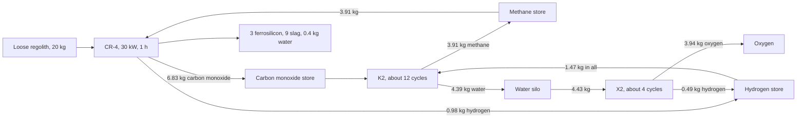

# Oxygen from rock: design record for the Oxsmith EC-4 and CR-4

Opened 5 October 2026 for sets 4 and 5 of the [regolith programme](regolith-programme.md).
The owner chose both routes to oxygen from the game's loose regolith, "maximum player
choice": molten regolith electrolysis (this record's first part, Manufacturing 0.52.0)
and carbothermal reduction with methane (the second part, set 5). The recipes' full
arithmetic is in the [refinery and chemistry record](manufacturing-refinery-and-chemistry.md);
this record holds what was checked, what is ours and why each choice was made.

Nothing here has been seen in the game. Offline checks are not gameplay validation.

## Part 1: the EC-4 Electrolysis Cell and ferrosilicon (set 4)

### What the sources say, and what they do not

**NASA Kennedy Space Center, molten regolith electrolysis.** L. Sibille (Southeastern
Universities Research Association, Swamp Works, NASA Kennedy Space Center), S. S.
Schreiner (Jet Propulsion Laboratory) and J. A. Dominguez (Florida Institute of
Technology), *Advanced Concepts for Molten Regolith Electrolysis: One-Step Oxygen and
Metals Production Anywhere on the Moon*, Developing a New Space Economy, 2019, abstract
5100 ([Universities Space Research Association host](https://www.hou.usra.edu/meetings/lunarisru2019/pdf/5100.pdf)).
Read for this record on 5 October 2026. It states that:

- the process was demonstrated "to produce raw feedstock materials and oxygen at high
  yield with lunar materials" under Kennedy's leadership in the 2000s;
- it is a one-step process: "direct electrochemical separation of molten metal oxides
  into oxygen and a glassy metallic product collected at opposite electrodes";
- melting the regolith, rather than dissolving it, "frees the technology from dependence
  on consumable components";
- it must run with the oxide mixture molten, and "sustained operation at temperatures
  in excess of 1600 C" is a containment problem, answered by a cold-walled cell whose
  pool is heated by its own current while the regolith at the walls stays granular.

The abstract gives **no yield in kilograms**, and none is quoted from it here.

**A yield to compare against.** NASA's lunar resource work reports, for the other route
(carbothermal reduction), an oxygen yield of more than 20 percent of the regolith's mass
(G. Sanders, *Progress Review: NASA Lunar ISRU*, NASA NTRS 20250003730; found by search
on 5 October 2026 and **not read in full**, so it is cited as a comparison only). The
same search returned a planning figure of 70 percent of the regolith's oxygen for
electrolysis, which would be about 28 percent of the rock's mass; its source was not
identified, so it is not cited.

**Reaction heats.** NIST-JANAF formation enthalpies at 298 K: FeO -272.0 kJ/mol, quartz
-910.9 kJ/mol, liquid water -285.83 kJ/mol. These are standard values, stated from the
tables rather than re-read this round.

**The silicol process.** E. R. Weaver, W. M. Berry, V. L. Bohnson and B. D. Gordon, *The
Ferrosilicon Process for the Generation of Hydrogen*, National Advisory Committee for
Aeronautics Report No. 40, 1920 ([NASA NTRS 19930091069](https://ntrs.nasa.gov/citations/19930091069)).
Its catalogue summary, read on 5 October 2026, describes hydrogen made by reacting
ferrosilicon with sodium hydroxide and water, used for military and naval balloons
because the generator is small and needs no power beyond stirring and pumping. The body
of the report was not read; the equation used below is the textbook one.

### What is ours

- **The lump's composition.** The game says only that regolith is broken rock. We author
  a chondrite-like lump: 2 percent bound water and half a percent of carbon dioxide (the
  V4 bake's figures), 5.457 kg of iron oxide and 5.045 kg of silica that the cell
  reduces, and 9 kg of oxides it does not. That is 21 percent iron by mass, which sits
  between carbon-rich and ordinary chondrites; no source sets it for the game's rock.
- **The yield.** 3.9 kg of oxygen from a 20 kg lump, 19.5 percent, follows from that
  composition and nothing else. It is below the comparison figure above on purpose.
- **Ferrosilicon as the metal.** Iron and silicon are the two oxides a molten silicate
  gives up first; magnesium, calcium and aluminium hold their oxygen harder and stay in
  the slag. A unit is 2.2 kg: 1.414 kg of iron and 0.786 kg of silicon.
- **Time and power.** One hour at 60 kW for a lump, forty minutes for a Silicates chunk.
  The reductions absorb 27.0 of a lump's 60 kWh; the other 55 percent is loss and warms
  the room (before the player's machine heat setting). Sixty kilowatts is two and a half
  V4s: this is a machine for a ship with a reactor to spare.
- **Lunar work applied to asteroid rock** is our extrapolation, as is fitting a
  cold-walled cell into a 4 x 4 shipboard machine. NASA has validated neither.

### The caustic soda the LC-3 does not have

The owner chose ferrosilicon with a use shipped in the same release: the LC-3 reacts it
with water into hydrogen, the silicol process. The real process consumes sodium
hydroxide: Si + 2 NaOH + H2O -> Na2SiO3 + 2 H2. No Phobos mod stores caustic soda, and
adding a bought reagent for one recipe would break the rule against commodities without
a wider use.

**Agent choice, open to owner revision:** the recipe is written as Si + 2 H2O -> SiO2 +
2 H2 and treats the caustic liquor as a standing charge inside the LC-3 that is
regenerated as the silicate drops out as silica. Mass and energy balance exactly on that
equation; what is simplified is that a real plant must keep buying soda. The recipe's
notes and the chemistry record say so in those words. If the owner would rather have
the soda as a real input, that is a new reagent and needs its own design note.

Worth knowing: the charge frees all of the water's hydrogen, the same 11.2 percent the
X2 does, for about a quarter of the electricity. What it costs is the oxygen, which
stays locked in the silica, and three ferrosilicon.

### Choices

| Question | Choice | Why |
| --- | --- | --- |
| Recipe selection | Automatic, from the feed | The two feeds are different items, so there is nothing to choose; an EC-4 exists to eat regolith, so it has no "leave it alone" setting |
| Links | Oxygen store and water vessel, both shown always | A lump always gives water; a cell with no oxygen store has nowhere to put its product, and oxygen is never vented into the room in bulk |
| Feed bin | Two cells | One charge at a time; lumps are 20 kg |
| Spoiling | None | A cold-walled cell that waits simply freezes and melts again; nothing is lost, unlike a V4 melt |
| Ignition source | Yes, while working | A molten pool beside a leaking fuel store is the V4's hazard exactly |
| Price | 96,000 cr, Trusted at the faction kiosks | Agent default from the programme record: half again the V4 |
| Slag | The existing refinery slag, 1 kg units | Same material, already a declared remainder; no new trash identity |
| Spent ferrosilicon | A new terminal remainder, 3.095 kg | Iron fines and silica are not slag; declared, so the RM-1 grinds it |

### Value

Both electrolysis charges are **supply**, as the approved plan records. The Silicates ore
(200 cr) is worth far more raw than its 2.6 kg of oxygen; the guides say so. Regolith is
different: a K-Leg prospector sells it, so the charge must not be a way to make money
from bought rock. Oxygen leaves a ship only through the kiosk's buy-back at 45 percent,
so the native value check judges each charge as a loop: oxygen and water at the
buy-back share, ferrosilicon at a generous 1.2 times its price, against the rock.

| | Regolith lump | Silicates chunk |
| --- | ---: | ---: |
| Rock | 35.00 cr | 200.00 cr |
| Oxygen sold back (13.2 cr/kg x 45%) | 23.17 cr | 15.44 cr |
| Water sold back (10 cr/kg x 45%) | 1.80 cr | none |
| Ferrosilicon at 1.2 x 2 cr | 7.20 cr | 4.80 cr |
| **Back** | **32.17 cr** | **20.24 cr** |

That fixes ferrosilicon at **2 cr a unit**, well below scrap steel by weight. It is a
by-product whose worth is the hydrogen it makes, and the record says so rather than
pretending it is metal stock. Its hydrogen charge has no finished product and makes no
profit claim.

### Saved structures

All new: the cell's record `ManufacturingElectrolysisCell`, its two link ports, the
LC-3's hydrogen port, leach revision 15 and the cell's revisions 1 and 2. Nothing saved
before 0.52.0 changes, so there is nothing to migrate. An LC-3 saved before gains its
hydrogen link unset.

### Artwork

The EC-4 takes the owner-approved Oxsmith master prepared on 5 October 2026
([handoff](oxsmith-art-handoff.md)), bound through the shared completion exporter with
no new generation. Ferrosilicon and spent ferrosilicon are recorded luminance recolours
of the aluminium ingot and the olivine leach cake. Damaged and loose forms share the
intact picture, as the other Manufacturing machines do.

### Owner checks

1. Install an EC-4 with its back to a wall row carrying power, touching an oxygen store
   and a water silo. Link both, load a lump of loose regolith, Start.
2. After an hour of game time: 3.9 kg more oxygen in the store, 0.4 kg more water, three
   ferrosilicon and nine slag in the tray, the room a little warmer and a trace of
   carbon dioxide in it.
3. Load Silicates ore: 2.6 kg of oxygen, two ferrosilicon, three slag in forty minutes.
4. On an LC-3, choose **hydrogen from ferrosilicon**, link a hydrogen store and a water
   silo, load three ferrosilicon, Start: 0.339 kg of hydrogen, three spent ferrosilicon.
5. Save while the cell works and reload: it carries on.

## Part 2: the carbothermal route (set 5, Manufacturing 0.53.0)

Three things ship together, built in this order: the Fennmark carbon monoxide stores, a
second mode on the K2, and the Oxsmith CR-4 Carbothermal Reactor.

### What the sources say, and what they do not

**NASA Carbothermal Reduction Demonstration (CaRD).** Project manager A. Paz; principal
investigators B. White, T. Colozza, N. Azim and D. O'Connor; NASA Johnson Space Center,
with a carbothermal reactor developed by Sierra Space and gas analysis by NASA Kennedy
Space Center ([NASA NTRS 20230003977](https://ntrs.nasa.gov/citations/20230003977),
project poster, 2023). Read for this record on 5 October 2026. It states that:

- a 2 kW laser heated lunar regolith simulant inside the reactor, in a thermal vacuum
  chamber at Johnson, building on a 2010 field demonstration that used a solar
  concentrator;
- "Oxygen is extracted from regolith in the form of carbon monoxide", and the downstream
  components that turn the carbon monoxide into oxygen gas are shared with Mars
  resource and life-support systems (its diagram shows a Sabatier reactor, a condenser
  and water electrolysis);
- the brassboard tests extracted between 10.77 and 15.79 g of oxygen per kWh delivered
  to the reactor, against 1.45 g/kWh in the 2010 field demonstration.

The poster gives **no yield per kilogram of regolith** and no reaction equations. The
figure of more than 20 percent oxygen by mass for carbothermal reduction comes from G.
Sanders, *Progress Review: NASA Lunar ISRU* (NASA NTRS 20250003730), found by search and
**not read in full**; it is quoted as a comparison only.

**Reaction heats.** NIST formation enthalpies at 298 K: FeO -272.04, quartz -910.86,
methane -74.87, carbon monoxide -110.53, carbon dioxide -393.51 and liquid water -285.83
kJ/mol. Standard values, stated from the tables rather than re-read this round.

### What is ours

- **The reactions as written.** FeO + CH4 -> Fe + CO + 2 H2 and SiO2 + 2 CH4 -> Si +
  2 CO + 4 H2: one methane per oxygen atom removed. A real reactor cracks methane on the
  melt and the carbon does the reducing; the sum is the same. Complete use of the methane
  fed, with none left as carbon in the slag, is an authored simplification.
- **The same rock, the same metal.** The CR-4 reduces exactly what the EC-4 does: the
  same authored lump, the same three ferrosilicon and nine slag, the same 3.9 kg of
  oxygen, here leaving as 6.83 kg of carbon monoxide. That is 19.5 percent of the lump,
  inside the comparison figure above. Giving the CR-4 a lower extraction would have
  needed a second ferrosilicon identity or slag in odd masses, and nothing read
  supports a lower figure.
- **By the poster's own measure the game's reactor is generous.** 3.9 kg of oxygen from
  30 kWh is 130 g/kWh, about eight times CaRD's best brassboard run. The charge still
  pays the full reaction enthalpy, 24.6 of its 30 kWh; what is authored away is the heat
  a real reactor loses. This is stated here so nobody reads the 30 kW as NASA's number.
- **Time and power.** One hour at 30 kW for a lump, forty minutes for a Silicates chunk:
  half the EC-4's draw.
- **The K2 doing both jobs.** CO + 3 H2 -> CH4 + H2O on the Sabatier catalyst is real
  chemistry (it is the classic methanation reaction); running both on one small reactor
  is our choice, as the owner decided.

### How the K2's second mode works

**The carbon source decides.** The K2 already lets the crew choose where its carbon
dioxide comes from. That same field now also lists carbon monoxide stores. With one
chosen, each cycle takes the same 0.125 kg of hydrogen and 0.579 kg of carbon monoxide
and makes 0.332 kg of methane and 0.372 kg of water. No separate mode switch: one fewer
thing to set wrong.

**Saved record.** Two optional fields, `co` and `used_co`, written only when they are
not zero. A K2 saved before 0.53.0, or one that never sees carbon monoxide, reads and
writes the ten fields it always did; a unit check holds that. The gas in the hold
decides which cycle is being finished, so a reload mid-cycle cannot change the reaction.
A part-filled hold of one gas is only ever finished from a source of the same gas; the
panel says so if the source is switched part way.

This amends the 29 September rule "keep the reactor's saved reactant/product holds and
its one-step conversion": the holds and the one-step conversion are kept, and one
reactant hold is added (owner decision, 5 October 2026).

**Damage.** A damaged K2 already dumps its gases into the room. Its carbon monoxide,
under 0.6 kg, goes the same way, as the game's own gas, with a line in the notice.

### The carbon monoxide stores

A seventh Fennmark gas family, model letter Z (Z2, Z3, Z4): the shared vessel at 80
percent of its ideal moles holds 300 kg, since carbon monoxide weighs what nitrogen
does. It is a game gas, so a damaged store leaks into the room, where the game's own
carbon monoxide poisoning applies; and it is a fuel, CO + 1/2 O2 -> CO2 at 283 kJ/mol,
so with oxygen and something to light it the contents burn through the same rule as
methane. Everything else is the shared store code: panel, pouring, venting, the gas
line, the right-click contents row (in the white the game uses for its own carbon
monoxide readings), kiosk buy-back at the game's 1.1 cr/kg, Friendly at the faction
kiosks. Stations do not sell it. The L2 does not bottle it (the game has no carbon
monoxide canister).

**A change from the plan, under a standing owner preference.** The plan said to keep
carbon monoxide out of the P1 RCS manifold. The manifold takes any gas store by
family, and the owner's rule is to offer a risky use with a warning rather than refuse
it (as with ammonia). So a P1 can burn stored carbon monoxide as cold gas, worth what
nitrogen is. Nothing was added to make that possible; excluding it would have needed a
special case. Open to owner revision.

### The loop, per regolith lump

Methane and hydrogen net to nothing; the water the X2 splits is the water the K2 made
(the 40 g difference is the X2's rounded cycle). What comes out is the oxygen.

| | EC-4 | CR-4 with a K2 and an X2 |
| --- | --- | --- |
| Oxygen from a lump | 3.9 kg | about 3.9 kg |
| Machine price | 96,000 cr | 72,000 cr, plus the K2, X2 and three stores if not aboard |
| Peak draw | 60 kW | 30 kW, then 1.2 kW and 6 kW |
| Electricity for a lump | 60 kWh | about 68 kWh (30 + 14 + 24) |
| Time for a lump | 1 hour | 1 hour in the reactor, then about 12 hours of one K2 |
| Reagents | none | 3.9 kg of methane on loan |
| Hazards | molten cell | molten bed, a store of poison that burns |

The honest summary for the guides: the CR-4 is not cheaper to run. It is cheaper to
buy and easier on a small reactor, it uses machines a water-recycling ship already has,
and it is slow.

### Value

Both CR-4 charges are supply, judged by the native check as loops like the EC-4's: a
lump and its methane cost 43.61 cr; carbon monoxide, hydrogen and water sold back at
the kiosk's 45 percent and ferrosilicon at 1.2 times its 2 cr return 13.45 cr.

### Saved structures

New: the reactor's record `ManufacturingCarbothermalReactor` and its five ports, the
carbon monoxide stores' records, journals and guards, and the reactor's revisions 1 and
2. Changed: the K2 record gains two optional fields, as above; automatic, nothing to
migrate, covered by a unit check on an old record.

### Artwork

The CR-4 takes its owner-approved master, bound through the completion exporter. The
three carbon monoxide stores are recorded recolours of the nitrogen stores, their domes
mapped onto signal red, the cylinder colour for a gas that burns. No generation.

### Owner checks

1. Install Z, M and H stores, a water silo, a K2, an X2 and a CR-4, touching or on gas
   and water line. Link the CR-4 to all four; put some methane in the M store.
2. Load a lump and Start: after an hour, 3.91 kg less methane, 6.83 kg of carbon
   monoxide, 0.98 kg more hydrogen, three ferrosilicon and nine slag.
3. On the K2, choose the Z store under **CO2 or carbon monoxide from** and Start: each
   cycle takes 0.579 kg of carbon monoxide and gives 0.332 kg of methane and 0.372 kg
   of water.
4. Switch the K2 back to a CO2 canister between cycles and confirm it runs as before.
5. Damage a Z store in an aired room: carbon monoxide readings rise and the crew are
   warned. Save and reload with each machine working.
