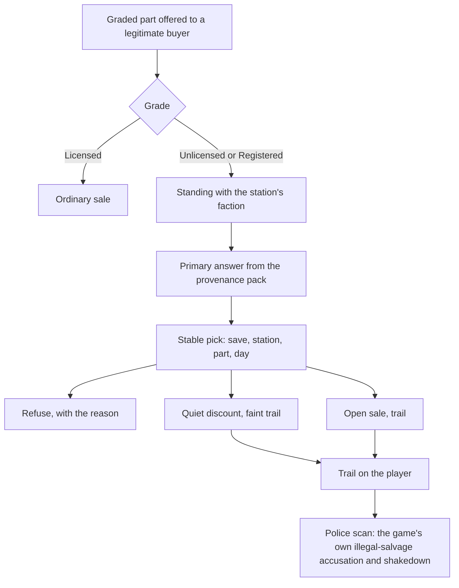

# Salvage hazards, provenance and scrapyard prices: research and design record

Research record, 8 October 2026. The owner picked three salvage ideas to take further: salvage
that is dangerous to handle carelessly, parts that remember the ship they were stripped from
(with fences and tag scrubbing), and scrapyard prices that answer to supply and demand. This is
a research-and-record round: nothing here is built, and nothing has been tried in play. The
record collects what the game already does, what our code already has, the owner's decisions
from the same day, the design for each idea, the saved structures it would touch and the engine
questions to answer before building.

Labels used below: **Observed** is seen in the installed game's data files (Ostranauts 1.0.1.5,
Blue Bottle Games) or the local decompile kept in ignored `.local/`; **Repository** is what our
own code and data packs do today; **Agent proposal** is Claude's design for the owner to revise;
**Agent default** is a starting figure the owner is expected to tune; **Owner** marks a decision
the owner took on 8 October 2026; **Unverified** is stated as such.

## The question and the short answer

The game already keeps most of what these ideas need, but in the wrong place for them. It knows
who owns every ship, sells a salvage permit, counts stripping fixtures in a law zone as a crime
and sends police to shake down illegal salvagers. What it does not do is remember anything on the
part itself: once a part is loose in the hold it is as clean as a new one, and every legitimate
buyer takes it. It also has no leaks, no unstable cells and no use for its own `IsRadioactive`
condition. And its supply-and-demand market covers only the cargo kiosks; the scrap kiosks,
supply kiosks and the fixer sit outside it.

So the design is three layers on the game's own machinery, all inside Phobos Shipbreaker:

- **Hazards (A):** a damaged part taken from a derelict may carry a hazard, fixed when it comes
  loose. Each hazard drives an effect the game already has (ammonia poisoning, sparks and fire,
  radiation) and has a crew job that makes it safe.
- **Provenance (B):** a part taken from a ship the player does not own carries a grade read from
  the game's own ownership and permit. A legitimate buyer refuses it, buys it quietly at a
  discount or buys it openly and leaves a trail for the police, by the player's standing with the
  station's faction plus a small fixed share of chance. Fences buy anything at a cut; a scrub can
  take the tag off, at a cost.
- **Prices (C):** first a short test in play. The likely build is small: report scrap sales into
  the game's own market so its existing supply and demand moves, and show what nearby yards pay.

## What the owner decided (8 October 2026)

- **Owner:** take three ideas forward: hazardous salvage, provenance with fences and scrubbing,
  and scrapyard prices that move. (Two other suggestions, finer breakdown of parts and a
  refurbishing bench, were not picked this round.)
- **Owner:** a legitimate buyer offered a tagged part should not have one fixed answer. Refusing,
  buying at a discount and buying openly while raising the police risk are all used, chosen by
  the game's own reputation system and a small amount of randomness.
- **Owner:** salvage hazards and provenance live inside Phobos Shipbreaker, not in a new mod.
- **Owner:** this design record comes first; building follows the owner's review.
- **Owner (noted in conversation):** the project already has its own coolant (Shipbreaker's
  furnace loop) and ammonia as a reagent (Manufacturing's ammonia stores and AX-2 cracker); reuse
  them rather than inventing new fluids.

## What the game does

### Ownership, permits and the crime system (Observed)

- Ownership is per ship, never per item. `CrewSim.system.GetShipOwner(regId)` names the owner,
  "UNREGISTERED" included; a derelict is `Ship.DMGStatus == Damage.Derelict`.
- The Ayotimiwa Ship Breaking Co. salvage permit is an item, `ItmDocumentPermitOKLG01` and its
  longer siblings, with `IsPermitOKLGSalvage` and an hours-left counter, sold for 24 hours
  ($5,000), 72 hours ($13,500), 7 days ($30,000) and 30 days ($120,000) (`interactions.json`).
  Its description: "Unexpired permits allow scavengers to salvage derelicts in the OKLG Boneyard
  without interference from Ayotimiwa Security." The triggers `CTPermitOKLGSalvageValid` and
  `...Expired` test it.
- When a police ship scans the player, `AIShipManager.NotifyTarget` sets
  `IsAccusingIllegalSalvage` if the player's ship is docked to a ship outside its owner's fleet,
  and transponder and stolen-ship accusations on a mismatch (local decompile, about line 1903).
  The boarding that follows is the `SOCPoliceShakedown*` family: admit, show a salvage licence,
  bribe, show real or fake credentials, name-drop. The illegal-salvage line names a fine of
  $15,000; how that fine is charged is **Unverified** (the payment loot found changes only mood).
- Uninstalling, dismantling and scrapping (`ACTUninstallTEMP`, `ACTDismantleTEMP`,
  `ACTScrapTEMP`) carry `"strCrime":"damage"`: a witnessed strip in a law zone raises the zone's
  warrant, which ends in a fine or prison (`crime/crime.json`, `loot_crime_*.json`).
- No item carries an owner, a stolen mark or a contraband mark. Selling a stripped part has no
  legal consequence; the only gate is which goods each buyer accepts.

### Buyers and prices (Observed)

- A sale price is `StatBasePrice` (or mass), times 1.25 if pristine, times a damage band (1,
  0.75, 0.5 or 0.25), plus any gas inside, times the market's supply-and-demand factor, then the
  trader's buy discount (`CondOwner.GetBasePrice`, `GUITrade`). The buy discounts are rolled
  ranges: kiosk 0.4 to 0.5, fixer 0.5 to 0.9, cargo kiosk 0.75 to 0.95.
- Who buys what: the OKLG supply kiosk refuses `IsSalvageValueHigh` goods, weapons and permits;
  the licensed OKLG kiosk needs a valid permit and buys back most items; the generic and Flotilla
  scrap kiosks buy only scrap, walls, floors, parts and hull patches; the Venus Orbital scrap
  kiosk buys almost anything; the OKLG fixer buys undamaged high-salvage parts from a rotating
  list. Our own `docs/development/economy-coverage-audit.md` and
  `docs/development/vanilla-economy-audit.md` hold the same picture.
- The market (`MarketManager`, one `ShipMarket` per station) prices a category at about 0.2 to
  1.8 times, from net demand and how full the station's stock is
  (`docs/solar-system-economy.md`). A trade moves stock through
  `MarketActor.ReportTransaction`, which reports only when the trader has a `strMarketConfig`.
  Only the 19 `*CargoKiosk` traders and the four cargo pods have one
  (`guipropmaps`, `market/Markets/market_actor_configs.json`). **So selling scrap at a scrap
  kiosk most likely moves no price at all.** Whether a scrap kiosk's price still reads the
  station market's factor is **Unverified**.

### The one fence (Observed)

The OKLG Fixer is the game's only black-market trader, reached through a social-combat
conversation that grants `OKLGFixerAccess` and `BlackMarketPlayerAccess`
(`interactions_fixer.json`). The character-creation salvage encounter mentions K-Leg's "many
fences"; none of them exists as a trader. Pirate and criminal factions do exist (`OKLGCrim`,
`VenusCrim`, `BeltPirates`).

### Hazard machinery (Observed)

- Ammonia, carbon monoxide, carbon dioxide, smoke and sulfuric acid have the game's own poisoning
  stages (`DcGasPp*`, `Dc*Poisoning01` to `07`).
- Damaged installed devices and conduits spark (`TIsSparkableDmgSys`); sparks and burnable
  tiles start the game's fires (`TIsFireStartable`, `TIsFireSpreadable`).
- Radiation is `StatRad` with `DcRad01` to `06` bands and the illnesses in
  `docs/health-reference.md`. A fusion reactor running on a failed ablative wall irradiates its
  crew. `IsRadioactive` is defined in `conditions_simple` and used nowhere. `IsCargoRad` marks
  radiation-shielded cargo pods.
- Items with `IsExplosive` already chain-detonate when hit; salvaged ordnance needs nothing new.
- There is no coolant, no leak condition, no unstable or contaminated mark, and no battery fire.

Candidate parts in the game's own catalogue: room coolers (`ItmCooler01`, its damaged form) and
fridges (`ItmFridge01`, damaged form); batteries and capacitors (`ItmBattery02`, `02b`, `02c`,
`03`, `04`, drill and welder batteries, `ItmCapacitor01`, all with damaged forms); and fusion
parts (ablative wall, cryo pump, field coils, laser array, MHD generator and the others, with
damaged and loose forms).

## What our code already has (Repository)

- **Shipbreaker capture** works only on an empty ship the player already owns; it "never
  fabricates salvage rights" (`src/PhobosShipbreaker/CaptureGeometry.cs`), and it stops the
  game's mooring call from clearing crime flags during capture. Shipbreaker's own products are
  therefore always clean.
- **Shipbreaker coolant** is a water-glycol service fluid, the `coolant` line commodity at 1,050
  kg per cubic metre, held by the F6 furnace reservoir and its conduit
  (`src/PhobosShipbreaker/Core/CoolantCharge.cs`).
- **Manufacturing ammonia** is stored liquefied in the Fennmark Q2 to Q4 stores and cracked by
  the AX-2; ammonia is never sold, only made (`docs/manufacturing-player-guide.md`). Native
  canisters take any room species through `NativeGasCanister.TryAdd`.
- **Hazard services in Framework:** `RoomGas` (native species only), `RoomHeat.DepositHazard`,
  `NativeDamage`, `NativeExplosions`, `PlayerNotices`, and the bulk vessel's leak policy.
- **Chance as data:** `Outcomes.Pick(weights, unitIds)` is a stable hash pick from an `outcomes`
  pack; a reload never rerolls it (`src/PhobosFramework/Data/OutcomePack.cs`).
- **Standing:** the story system reads the game's faction scores the way the FACTIONS app sums
  them, and changes them only through the game's own reputation call; the tiers are dislikes,
  neutral, warm (25), friendly (50), trusted (75) and honored (100)
  (`src/PhobosFramework/Story/StoryArcs.cs`, `docs/development/faction-kiosk-stock.md`). The
  reader is internal to the story system today.
- **Buyers:** `FactionKiosks` amends the game's tier triggers in place; the same pattern can
  amend a buyer's acceptance trigger without republishing it.
- **People and places:** story packs already hold 40 places (with their factions) and people with
  a home, a faction and `requires` gates; Banking's lenders are the closest template for a fence.
- **Item memory:** `CondOwner.ModeSwitch` carries conditions, the full ID and property maps into
  the replacement object (`docs/development/shipbreaker-autopilot-research.md`, E7), so a mark
  set on an installed part survives its uninstall. `ObjectStateStore` keeps versioned records in
  native property maps.
- **Gaps:** no provenance anywhere; no contamination; no public standing reader; no hook on the
  trade window's per-item price or acceptance; Shipbreaker's D4 and R4 take only wall and floor
  families, not equipment parts.

## A. Hazardous salvage (Agent proposal)

### When a part becomes hazardous

When a damaged part comes loose from a derelict (the game's own uninstall completing), Shipbreaker
looks the part up in a new `hazards` data pack. If the part has a hazard family, an
`Outcomes.Pick` over the save, the part's ID and the source ship's registration fixes whether it
carries the hazard, so a reload never changes the answer. Intact parts, parts from the player's
own ships and anything bought from a merchant stay clean. Odds are pack data per family
(**Agent default:** one in four damaged parts).

### The hazard families

| Family | Parts (pack data) | What it does | Making it safe |
| --- | --- | --- | --- |
| Charged refrigerant | Damaged room coolers and fridges | Holds ammonia refrigerant. In a pressurised room it leaks into the air through `RoomGas`, and the game's own ammonia poisoning follows. The leaked kilograms come out of the part's own mass. | A crew job recovers what is left into an empty native gas canister (`NativeGasCanister.TryAdd`), or vents it outside through an airlock. |
| Unstable cell | Damaged batteries and capacitors | While loose in a pressurised room it sparks now and then through the game's spark and fire machinery, more often if hit or dropped. | A crew job discharges it: the stored charge leaves as heat through `RoomHeat`, and the cell is stable from then on. |
| Activated reactor part | Damaged fusion parts | Gains the game's unused `IsRadioactive`. Whoever carries it slowly gains `StatRad`; a shielded cargo pod (`IsCargoRad`) blocks it. | Time: the activity falls with an authored half-life over days, and the mark clears below a threshold. |

**Chemistry and physics notes.** Ammonia (R-717) is a real refrigerant, widely used in
industrial refrigeration. NASA cools the International Space Station's pressurised modules and
external electrical systems with pumped ammonia loops, and a slow leak from one of them put the
crew at risk for years: D. T. Cowan, T. A. Bond and J. L. Metcalf, *The International Space
Station (ISS) Port 1 (P1) External Active Thermal Control System (EATCS) Ammonia Leak*, NASA
conference paper, 7 July 2019 ([NASA Technical Reports Server
20190029027](https://ntrs.nasa.gov/citations/20190029027)). The source supports ammonia as a
spacecraft coolant and leaks as a real operational hazard; the cabin leak model here is our own
authored simplification. The charge per unit is an **Agent default** placeholder of 0.5 kg; the owner, as a chemist, is
asked to set the charge and the leak rate. Neutron activation of reactor structures is real, but
the game does not state its fuel cycle (**Unverified**), and a single authored half-life is a
deliberate simplification of a mix of isotopes, to be labelled as such. The game models no cell
chemistry, so "unstable cell" is labelled as authored behaviour, not a thermal-runaway model.

Shipbreaker's own water-glycol coolant is not a room hazard (glycol is harmful if swallowed, not
as a vapour). If the owner names vanilla parts that should hold liquid coolant, a fourth family
can let a crew job drain that coolant into Shipbreaker's coolant handling and reuse it as furnace
top-up (open question below).

### Selling a hazardous part

A part still marked hazardous is refused by ordinary buyers through an in-place amendment of their
acceptance triggers (the `IsSalvageValueHigh` pattern), and the refusal says which hazard and
which crew job clears it. The fixer and fences may take it at their own cut. A part made safe
sells at its ordinary price.

### Rules it keeps

Native gas species only; mass conserved and journaled; warnings through `PlayerNotices`; never
blocks native destruction; hazards tick only for loose parts aboard the player's ships, on
`Cadence.RealTime`, and step through time skips. Making safe never yields more value than the
part's ordinary sale: the recovered ammonia is a few hundred grams of a commodity nobody sells,
and `scripts/audit-economy.py` must confirm no buy-damaged-drain-sell loop.

## B. Provenance: tags, fences and scrubbing (Agent proposal)

### The grade

When a part comes loose from a ship the player does not own (the game's own `GetShipOwner`),
Shipbreaker stamps it with a provenance grade and the source registration in its property map.
This reads the game's ownership; it is not a parallel claim system
(`docs/development/mod-extension-survey.md`).

| Grade | When | What it means |
| --- | --- | --- |
| Licensed | A derelict in the OKLG Boneyard while the player holds a valid permit | Clean. The permit finally shows on the part itself. |
| Unlicensed | A derelict anywhere without a valid permit | Warm: questions may be asked. |
| Registered | A ship that still has an owner | Hot: the tag names the owner. |

Parts from the player's own ships, and everything Shipbreaker's capture produces, carry no grade.

### How a legitimate buyer answers (owner direction, agent design)

For each graded part offered to a legitimate buyer, the buyer gives one of three answers:

- **Refuse:** no sale, and the reason is named ("this one carries a registered owner's tag").
- **Quiet discount:** "no questions asked", at a share of the price, leaving a short, faint trail.
- **Open sale:** full price, but the sale leaves a trail.

The answer comes from the player's standing with the station's faction (from the story places
pack) and the part's grade. A small fixed share of chance moves it to a neighbouring answer:
`Outcomes.Pick` over the save, the station, the part's ID and the game day. The same part at the
same buyer on the same day always gets the same answer, so a reload never changes it (peeking
ahead by reloading is accepted, as in Phobos Exchange). Nothing ever needs Honored: Honored
answers as Trusted.

**Agent default** table (primary answer; the chance share, default 15%, moves to a neighbour):

| Standing | Unlicensed | Registered |
| --- | --- | --- |
| Dislikes | Refuse | Refuse |
| Neutral | Quiet discount | Refuse |
| Warm | Quiet discount | Quiet discount |
| Friendly | Open sale | Quiet discount |
| Trusted (and Honored) | Open sale | Open sale |

**Agent defaults** for the rest: the quiet discount pays 60% of the buyer's price; a trail lasts
three game days, shorter at higher standing; the table, shares, discounts and trail lengths are
one `provenance` data pack with a validator.

### The trail and the police

A trail is a hidden player condition with an expiry. When a police ship scans the player while a
trail stands, a postfix on the game's scan sets the same `IsAccusingIllegalSalvage` the game
sets for illegal docking, decided by a stable pick over the save, the police ship and the hour.
From there the game's own shakedown runs: admit, show a permit, bribe, bluff or pay. Standing
changes, if any, go through the game's own faction scores and stay small.

### Fences

Fences are people in a data pack, modelled on Banking's lenders: a home place, a faction (for
example `OKLGCrim` or `VenusCrim`), `requires` gates (standing, flags, docked at) and a buying
share per grade. They buy any grade and any hazardous part, always below a licensed sale. The
OKLG Fixer is the game's anchor and stays as it is. Introductions are story arcs; all names,
letters and lines are creative content in packs, written by the usual handoff and extendable by
players' add-ons.

### Scrubbing

A crew job, or a paid service from a fence, removes the tag. The result is one frozen recipe per
outcome in an `outcomes` pack, weighted by the worker's skill: a clean scrub (grade removed, one
step more damage), a tampered tag (fences only from then on) or a ruined part (two steps more
damage). A scrubbed part plus the scrub's cost must always earn less than the same part sold
licensed; the economy audit proves it.

Melting a tagged part into stock would be the honest way to launder it, but Shipbreaker's D4 and
R4 take only wall and floor families today; an equipment-part feed is a separate, later design.

## C. Scrapyard prices (Agent proposal)

1. **Owner test in play** (no code): at a station with both a scrap kiosk and a cargo kiosk, note
   what each pays for one piece of steel scrap, sell twenty pieces one at a time at each, and
   note the price after every five. Check again the next game day.
2. If the scrap kiosk's price never moves (expected from the market configs above), add one
   postfix on the trade window's completed sale that reports scrap-kiosk, supply-kiosk and fixer
   sales into the station's market through the game's own `MarketManager.ReportTransaction`. The
   game's existing supply and demand, and its AI haulers, then do the rest. No invented scarcity
   state (`docs/solar-system-economy.md`).
3. A read-only **Yard rates** view on the PDA (Framework `PdaApps`) shows what nearby stations'
   markets would pay per category, read from the native market exactly as Phobos Exchange reads
   it, never written.

Because the market is saved natively, step 2 adds no saved state of its own.

## Saved structures and removal

- Item conditions: the provenance grade and the hazard marks (new `Phobos`-prefixed conditions);
  `IsRadioactive` is the game's own.
- Item property map: source registration, hazard state (for example ammonia kilograms left).
- Player condition: the trail and its expiry.
- No ship or station records; the market is the game's own.

**Engineering question (report, not a reason to shrink the design):** what the game does on load
with an item carrying a condition no loaded mod defines, if Shipbreaker is removed. This decides
whether removal needs a clean-up command.

## Engine questions to verify before building

1. Where the trade window decides a buyer accepts an item and sets its price, and whether a
   per-item answer and refusal reason can be hooked there without republishing triggers.
2. Whether a scrap kiosk's price reads the station market's factor at all, and the owner's test
   result for step C1.
3. The exact point where the game's uninstall completes on a derelict, so the stamp lands on the
   loose part (E7 says `ModeSwitch` carries the maps; confirm for damaged forms).
4. How the $15,000 illegal-salvage fine is actually charged, and whether the permit is honoured
   outside OKLG.
5. A stable per-item ID across save and load for the stable picks (the game's `strID` is the
   candidate).
6. The cost of ticking hazards on loose parts in a large hold, measured with Phobos Scope.

## Settings (Agent defaults)

Shipbreaker settings, documented in the player guide when built: hazards on or off; provenance on
or off; the hazard share per family; the trail length; the radiation half-life. Grades, answers,
fences and outcomes stay in data packs, not settings.

## Framework work this would need

- A public standing reader (lifting the story system's internal one), for Shipbreaker now and for
  any later mod that prices by reputation.
- A trade-window hook for per-item acceptance, price share and refusal reason, if engine question
  1 shows it is needed; Banking and Exchange are plausible later users.
- A place-to-faction lookup over the story places pack.

## Recommended rounds

1. **Owner:** the scrapyard test (C1). Settles whether C is a patch and a view, or only a view.
2. **Hazards (A):** self-contained, and it builds the buyer-refusal plumbing B needs.
3. **Provenance (B):** grades, buyer answers, trail and police, then fences, then scrubbing.
4. **Prices (C):** the transaction report and the Yard rates view.

## Open questions for the owner

1. The ammonia charge per cooler and fridge, and a believable leak rate (placeholder 0.5 kg).
2. Whether any vanilla parts should hold Shipbreaker's liquid coolant (a fourth hazard family).
3. The hazard share (placeholder one in four damaged parts) and the radiation half-life.
4. The standing table and the 15% chance share above.
5. Whether fences should also sell a scrubbing tool, and which invented brand makes it
   (`docs/development/equipment-branding.md`).

## Sources and status

- Game data and the local decompile (Ostranauts 1.0.1.5): `condowners.json`, `interactions.json`,
  `interactions_fixer.json`, `crime/crime.json`, `guipropmaps`,
  `market/Markets/market_actor_configs.json`, `conditions_simple.json`, `explosions.json`;
  `AIShipManager.NotifyTarget`, `MarketManager.ReportTransaction`,
  `MarketActor.ReportTransaction`, `CondOwner.GetBasePrice`.
- NASA: Cowan, Bond and Metcalf (2019), ISS P1 EATCS ammonia leak, conference paper,
  [NTRS 20190029027](https://ntrs.nasa.gov/citations/20190029027).
- Repository records: `shipbreaker-capture.md`, `shipbreaker-autopilot-research.md`,
  `mod-extension-survey.md`, `economy-coverage-audit.md`, `vanilla-economy-audit.md`,
  `faction-kiosk-stock.md`, `docs/solar-system-economy.md`, `share-market-and-charts-design.md`.
- Status: research and design only. Nothing is built, no version changes, nothing is tested in
  play. All figures marked Agent default await the owner.
