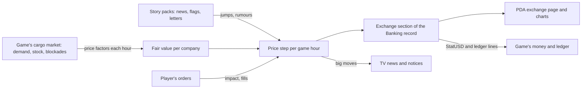

# A share market for Phobos Banking, and Framework charts: research and design

Research record, 7 October 2026. **Nothing here is built.** The owner asked whether a
third-party stock-market library could give Phobos Banking a believable share market
without writing one from scratch, and for a charting library that works in the game, for
the market and for other uses. This record collects what was checked, what the game already
offers, a proposed design, the pitfalls found so far and the decisions left to the owner.

Labels used below: **Observed** is seen in the installed game's data files or in the local
decompile used by the [banking research](pda-apps-and-banking-research.md) (kept in ignored
`.local`, never redistributed); **Read from source** is a third-party library's published
code, read but not run; **Agent proposal** is Claude's design for the owner to revise;
**Unverified** is stated as such. No part of the proposed market has been tested in play.

## Owner direction (7 October 2026)

- Add share-market features to Phobos Banking. A realistic market is wanted, which is why
  a library was asked about first.
- Give the person at the keyboard more to do, especially on long-haul trading routes, where
  the crew mostly runs itself.
- Make the world feel believable and alive, leaning on the setting's cyberpunk ubercorps.
- A charting library (or control) is needed for the market and will see other uses.

## Summary of recommendations

1. **No third-party market library fits** (see [What was checked](#third-party-libraries-what-was-checked)).
   The candidates price real financial instruments, connect to real exchanges, run as
   servers, or are written in Python or C++. Write a small market model in Banking instead:
   a few well-studied pieces of finance research reproduce how real prices behave, at a cost
   of a few hundred lines.
2. **Drive the market from the game's own economy.** The game already runs a cargo market
   with supply, demand, AI haulers and blockades at every station (see
   [The game's own cargo market](#the-games-own-cargo-market-observed)). Companies whose
   share price follows those real signals make the world feel alive in a way no library
   could, and they reward a player who travels and looks.
3. **Build a chart control in Framework** rather than adopting XCharts. Framework already
   draws custom lines on the game's UI (`Controls/PickerGraphic.cs`); XCharts cannot load its
   settings inside a mod without a fork (see [Charts](#charts)).
4. **Treat the market as a business with a house edge, not a money tap.** The project's
   economy rules forbid loops that create value from nothing; a market whose shares simply
   rise over time is one. See [Economy rules](#economy-rules-and-the-house-edge).

## What we can build on

### Our technical constraints (observed)

| Fact | Where seen | Consequence |
| --- | --- | --- |
| The game runs Unity 6 (UnityPlayer 6000.3.23) on Mono | `UnityPlayer.dll` file version | Libraries must load on Unity's Mono, not modern .NET |
| Our plugins target `netstandard2.1` | every mod `.csproj` | A library must offer netstandard2.0 or 2.1 builds, or be source we compile |
| The game ships `UnityEngine.UI`, TextMeshPro and `Newtonsoft.Json` | `Ostranauts_Data/Managed` | uGUI drawing and TMP text are available to us at no cost |
| This repository's own work is MIT licensed | `LICENSE` | MIT, BSD and Apache code is usable with a notice in `THIRD_PARTY_NOTICES.md`; GPL or LGPL code is not; Unity Asset Store packages cannot be redistributed in a public repository or Workshop item |

### The game's own cargo market (observed)

Blue Bottle Games' Ostranauts already keeps a living market behind its cargo kiosks. The
[solar-system economy record](../solar-system-economy.md) documents the pricing side; what
matters for a share market is:

- **Every station market is a `ShipMarket`** owned by `MarketManager`. Data lives in
  `data/market`: 19 named market profiles (`Markets/market_actor_configs.json`), production
  maps that turn inputs into outputs or consume goods per hour
  (`Production/production_maps.json`, for example Ceres's volatiles-to-water converter), and
  categories of goods (`CoCollections`, such as `AnyOres`, `AnyFood`, `AnyWeapons`).
- **Prices move with supply and demand.** `ShipMarket.CalculatePriceModifier` sums each
  category's net hourly demand from the production maps, clamps it to -0.8..+0.8
  (-0.8..+1.7 under a blockade, via the station's `DiscountBlockade` condition) and scales it
  by how full or empty the station's virtual inventory is. The result is a per-category
  price factor of about 0.2 to 1.8.
- **It runs on its own.** `MarketManager.UpdateMarket` runs production every 10 seconds of
  game time (`StarSystem.fEpoch`); AI cargo haulers are registered on trade routes between
  surplus and demand (`RegisterAICargoHauler`, `FindSupplyDemandMarketPairs`, which picks
  routes with `UnityEngine.Random`). Player sales and purchases are reported to it
  (`ReportTransaction`).
- **It is saved** (`MarketManager.GetJSONSave`, `JsonMarketSave`), so its state carries over
  between sessions without any work from us.
- **It can be read.** `MarketManager.GetSystemMarket()` returns every station's category
  price factors; `GetStationMarket(regId)` and `GetStatusForShip(regId)` return a station's
  report and a text description of what it produces and how full its stores are.

Not yet verified: whether production catches up correctly across a long native time jump
(`MarketActorConfig.RunProduction` is not in the local decompile), and which of the game's
own screens shows `GetStationMarket`.

**What this means:** the game already produces the signals a share price needs: a
shortage of ore at Mars, a blockade at a station, a glut of intoxicants. A mining company
whose price follows ore demand at its home stations is believable because it reacts to
things the player can see and even cause.

### The game's corporations (observed in the game's text)

The game's own writing calls Smartlink an "ubercorp". Companies named in its data, with
where each was seen:

| Company | Seen in | What it does, as written |
| --- | --- | --- |
| Smartlink | point-defence item descriptions | Weapons maker; "the ubercorp's rivals" dispute its claims |
| Ayotimiwa Corp. (Ayotimiwa Corporation) | K-Leg kiosk and refuel station descriptions | Runs K-Leg's shipbreaking, kiosks and refuelling with the OKLG Port Authority |
| Testudo | ship registry (24 entries), hardsuits, flooring, furniture | Shipbuilder (Dream, Rouncy, Mesa, Bulk Lifter) and fittings maker |
| Ryokka | ship registry (16 entries) | Shipbuilder |
| Mobile Space Systems | ship registry (8 entries) | Shipbuilder |
| Renske International | ship registry (4 entries) | Shipbuilder |
| The Green Energy Company | intoxicant descriptions, `IsGEC` brand condition | Intoxicants maker based in the Rosebud on Tharsis Landing |
| Brave New World, LLC | meat-product packaging | Food maker |
| Huoxing Mining Company, Troy Jupiter Group | game text, context not yet read | Unknown |
| Penumbra Group | an advert | Contract killers; probably not something to list |
| Ogiso's Register, Ogiso's Bank | ship registry and starting mortgages | Already referred to by Banking, never spoken for |

The banking research set the rule that we **refer to the game's institutions but never
speak for them**. Listing their shares and reporting news about them in a wire-service
voice is referring; writing their press releases would be speaking for them. Which of them
may be listed is an owner decision (below).

The game's own TV headlines (`data/headlines`, 43 static regional stories) and adverts are
unsaved flavour text; Framework's story system already mixes our news into that feed.

### Our own systems to reuse

- **Banking.** Money is the player's `StatUSD`; the ledger records transactions
  (`Ledger.RecordTransaction` writes a line but moves no money, so callers change `StatUSD`
  themselves). Banking saves its book as one record on the player (`PhobosState.PhobosBank`),
  hosts a full panel from its CREDIT PDA app (Framework `PdaApps`), and already fires story
  events and flags. Orrery Credit (0.6.0, held draft) set the precedent of a service usable
  from anywhere at a higher price.
- **Story system.** News and adverts share the TV feed, bulletins, places, people, threads,
  flags (`StoryFlags`), where the player is (`StoryLocation.DockedPlace`, `Near`) and the
  game's own day length (`GameClock`, 87,658.125 seconds). See the
  [story system design](story-system-design.md).
- **Time.** Time-skips step running work (`CrewSkip.Advance`) rather than handing it hours at
  once; `Cadence.RealTime` counts skipped seconds.
- **Data packs** for authored tables (player and add-on overridable), **stable-hash
  outcomes** (`Outcomes.Pick`: never rolled at runtime or rerolled), the **economy audit**
  (`scripts/audit-economy.py`) and **performance footprints** (`Performance.RegisterFootprint`).

## Third-party libraries: what was checked

### Market simulation

| Candidate | Licence | Verdict |
| --- | --- | --- |
| [QLNet](https://github.com/amaggiulli/qlnet), C# port of [QuantLib](https://www.quantlib.org) | BSD | Prices bonds, options and other real instruments from given inputs. It does not make a market move. |
| QuantLib with its C# bindings | BSD-style | Native C++ library behind a generated wrapper; a native DLL in a mod, for the same unsuitable job. |
| [StockSharp](https://feed.nuget.org/packages/StockSharp.Algo/5.0.231), QuantConnect Lean | not rechecked | Trading platforms for real exchanges; very large and built for modern .NET. Excluded on purpose and size, licences not rechecked. |
| [MemExchange](https://github.com/chironn/MemExchange) | MIT | A C# order-matching exchange, but it runs only as a server and client over NetMQ with Castle Windsor, Disruptor, Topshelf and others. |
| [ABIDES](https://arxiv.org/abs/1904.12066) (Byrd, Hybinette and Balch, 2019) | not checked | A high-fidelity agent-based market simulator for AI research, in Python. A reference, not a dependency. |
| [MAXE](https://arxiv.org/abs/2008.07871v2), [StockSim](https://www.emergentmind.com/topics/stocksim) | various | Agent-based order-book simulators in C++ or Python. |
| [Math.NET Numerics](https://numerics.mathdotnet.com/) | MIT | Usable (netstandard2.0) if we want proper probability distributions; not needed, since the model below needs only a uniform random source. |

**Conclusion.** A market in a game feels real when its prices behave as real prices do and
react to the world, not when it runs a real exchange. That is a small, well-researched
model, and only we can wire it to the game's economy and stories.

### Charts

| Candidate | Licence | Verdict |
| --- | --- | --- |
| [XCharts](https://github.com/XCharts-Team/XCharts) (XCharts-Team) | MIT | The only real candidate: uGUI, about 3,800 stars, last pushed 17 July 2026, line, bar, area, candlestick, heatmap and more. Blocked as shipped; see below. |
| ScottPlot, OxyPlot, LiveCharts2 | MIT | Draw through SkiaSharp (native libraries), System.Drawing or desktop UI frameworks. The game ships a `System.Drawing.dll`, but whether Unity's Mono can render with it was not checked, and a rendered bitmap would need copying into a texture on every change and would not match the game's look. OxyPlot's renderer is an interface we could implement on uGUI, but by then we have written most of a chart control. |

**XCharts pitfall (read from source).** In a built game, `XCSettings.Instance` is only
`Resources.Load<XCSettings>("XCSettings")` (`Runtime/Internal/XCSettings.cs`); every fallback
(default language, Arial, the TMP font) sits inside `#if UNITY_EDITOR`. Themes also come only
from `Resources.Load<Theme>` (`Runtime/Internal/XCThemeMgr.cs`). A BepInEx mod has no such
assets in the game's Resources, so `Instance` is null and the first font or theme lookup
fails. Using XCharts would mean forking it to build its settings and themes in code (or
setting its private static instance by reflection), compiling its runtime sources against
the game's `UnityEngine.UI` with `dUI_TextMeshPro` defined, and restyling it to the game's
palette. None of that has been tried.

## Design proposal: the exchange (agent proposal)

### What the player does

The aim is play for the long haul, when the crew runs the ship and the player has time:

- **Watch and trade.** A dozen or so listed companies, each with a chart, a short profile,
  its home stations and the goods it depends on. Buy and sell from the PDA wherever the
  ship is, as Orrery Credit can be used anywhere.
- **Leave orders.** "Buy if it falls to X", "sell if it rises to Y" or "sell if it falls
  below Z" orders that fill while the player sleeps or skips time, and say so when they do.
- **Read the world.** Company news in the TV feed and the PDA, quarterly reports as data
  files, letters from a broker or a contact with a tip that may be wrong.
- **Be there.** Docked at a station, the player can read its market report: the shortage
  or glut that will move a company's price before the news reaches the wire. Travel and
  looking around become an edge, which suits long routes.
- **Collect dividends.** Some companies pay a share of profit each quarter, recorded in the
  ledger.

Later possibilities, not for the first version: short selling and buying on credit through
Banking loans, and contracts on the cargo categories the player hauls (a hauler fixing the
price of a load of volatiles before a long trip). The second ties the market to the game's
own trade directly, but settling it against the native price factor needs its own research.

### Listed companies: an `exchange` data pack

One Banking-owned schema, validated like the lenders pack, overridable by players and
add-ons, adding by key and never renaming a shipped id:

| Field | Meaning |
| --- | --- |
| `id`, `ticker`, `name` | Stable id, a short ticker for the screen, the company's name |
| `sector`, `profile` | What it does, for the company page |
| `home` | Story places (stations) where it trades and whose news concerns it |
| `drivers` | Native cargo categories and markets whose price factors move its fair value, each with a sign and weight (a miner rises with ore demand; a refiner falls when ore is dear) |
| `price`, `shares` | Starting price and shares in issue (for market size and the player's impact) |
| `volatility`, `reversion` | Calm or wild; how quickly price returns to fair value |
| `dividend` | Share of value paid each quarter, if any |
| `thread`, `events` | The story thread its news belongs to, and story flags that move it (below) |

Candidates: the game's companies the owner allows, invented ubercorps for gaps (names
through the [branding record](equipment-branding.md)'s collision search), and **our own
equipment makers** (Verdemorrow, Halewright and the rest), which exist in the fiction already
and would make the player's purchases feel part of a wider economy.

### The price model

Each listed company takes one step per game hour (3,600 seconds of game time). The change
in the logarithm of its price over a step is the sum of four parts:

```text
r = κ · (ln F − ln P)          pull back towards fair value F
  + σ · ε                      noise: fat-tailed, volatility σ that clusters
  + J                          jumps: news and rare surprises
  − I                          the player's own trading, fading over time
σ² = ω + α · r²(previous) + β · σ²(previous)
```

What each part is for, and the research it rests on:

- **Fat tails.** Real price changes include far more large moves than a normal (bell-curve)
  distribution allows. Benoit Mandelbrot showed this in cotton prices
  ([Mandelbrot, "The Variation of Certain Speculative Prices", Journal of Business 36(4):394–419, October 1963](http://www.jstor.org/stable/2350970)),
  and Rama Cont's survey lists it among the "stylized facts" found across markets
  ([Cont, "Empirical properties of asset returns: stylized facts and statistical issues", Quantitative Finance 1(2):223–236, 2001, doi:10.1080/713665670](https://ideas.repec.org/a/taf/quantf/v1y2001i2p223-236.html)).
  Proposal: draw ε from a Student-t distribution with about four degrees of freedom
  (authored), made from uniform random numbers.
- **Volatility clustering.** Calm and turbulent stretches follow each other, also one of
  Cont's stylized facts. The σ² line is Tim Bollerslev's GARCH(1,1) model
  ([Bollerslev, "Generalized autoregressive conditional heteroskedasticity", Journal of Econometrics 31(3):307–327, 1986, doi:10.1016/0304-4076(86)90063-1](https://ideas.repec.org/a/eee/econom/v31y1986i3p307-327.html)).
  ω, α and β are authored per company with α + β below 1 so volatility settles back.
- **Jumps.** Robert C. Merton added sudden jumps to continuous price movement to describe
  discontinuous returns
  ([Merton, "Option pricing when underlying stock returns are discontinuous", Journal of Financial Economics 3:125–144, 1976; MIT working paper](https://dspace.mit.edu/handle/1721.1/1899)).
  Here jumps come mostly from story events (a scandal, a contract, a blockade), plus rare
  unexplained ones.
- **Fair value from the game.** F is the company's base value times a weighted product of
  its `drivers`: the native price factors at its home markets for the categories it buys and
  sells, read through `MarketManager.GetSystemMarket()` at each step. A blockade or shortage
  therefore moves F, and the price follows at a speed set by κ. This is our simplified,
  authored model, not a claim about how real firms are valued.
- **The player's impact.** Large orders move prices against the trader. Studies of real
  markets find impact grows roughly with the square root of order size
  ([Tóth, Lempérière, Deremble, de Lataillade, Kockelkoren and Bouchaud, "Anomalous price impact and the critical nature of liquidity in financial markets", Physical Review X 1:021006, 2011](https://doi.org/10.1103/PhysRevX.1.021006)).
  Proposal: impact proportional to the square root of the order's share of daily volume,
  fading over a few game days. It stops the player cornering a company and makes a quick
  round trip lose money.

An agent-based market, where simulated traders interact, produces these facts on its own
([Lux and Marchesi, "Scaling and criticality in a stochastic multi-agent model of a financial market", Nature 397:498–500, 1999](https://www.nature.com/articles/17290)),
but costs far more processing and tuning for little visible gain. Not recommended for a
first version.

All parameters are authored balance, not measured from any real market; the record and the
company pages must not imply otherwise.

### How the pieces connect



### Time and long hauls

- Steps are game hours. A time-skip steps the market hour by hour and checks standing orders
  at each step, as `CrewSkip` does for machines; it never applies a week at once.
- A native time jump (the clock moving without our skip) is caught up by stepping through the
  missed hours. A two-month haul is about 1,400 steps per company, a negligible amount of
  arithmetic, but it needs a measured cap and a recorded performance finding.
- Native production's own catch-up across a jump is unverified (above), so fair values read
  straight after a jump may lag the native market by one update.

### Information and place

- Quotes and trading everywhere through the PDA, with a broker's commission, following the
  Orrery Credit precedent. Neither instant interplanetary communication nor its absence has
  been established as canon; present this as a game abstraction.
- **The docked edge.** When docked, the exchange page shows the station's own market report
  (native `GetStatusForShip`) next to the companies it drives. Wire news of the same change
  reaches the TV feed a few game hours later (a bulletin delay). Seeing it first is the
  player's reward for being there.
- **Tips.** A contact's letter may claim a company will jump. Whether the tip is right is
  picked once by stable hash when the letter is written (the `Outcomes.Pick` rule), never
  rerolled.

### Story integration

- Company news goes in story packs, tied to the company's `thread` and `home` places.
- Shocks need no new Framework vocabulary at first: a company's `events` list names a story
  flag and a jump size, and Banking checks `StoryFlags.Has` at each step, applying each jump
  once. Arcs already set flags, so writers can move markets without code.
- Banking fires its own story events (for example on a large gain or loss, or an order
  filling), as it already does for loans.

### Screens and commands

- An Exchange page in the Banking panel: watch list, company page with chart (line and
  candlestick, one day, seven days and ninety days), holdings with gain or loss, open orders
  and recent news.
- Every action says what it did and every refusal why. An action that needs another step
  first (for example replacing an open order on the same company) follows the press-twice
  rule and is classified in `config/panel-override-audit.json`.
- F3 commands through the same service: quote, buy, sell, orders and cancel.
- Player language: explain share, dividend, standing order and spread in the shared
  glossary; keep the voice of a working spacer reading the markets, not a finance textbook.

## Determinism, saves and save reloading

**Saved structures (proposal).** A new `exchange` section in the existing Banking record
(`PhobosState.PhobosBank`): per-company state at the last step (price, volatility, fair
value, fading impact, last hour stepped), the player's holdings and open orders, jumps
already applied, and a compact price history for the charts. Nothing new enters the game's
own save except `StatUSD` changes and ordinary ledger lines. Unknown companies and fields
are kept as read, so an older Banking never destroys what a newer one wrote, and tests need
old-record fixtures as for the loan book.

**Pitfalls found so far:**

- **History size.** Fair value comes from the live native market, which is not recorded, so
  past prices cannot be regenerated from a seed; history has to be saved. Hourly history for
  every company over a long game is too large for a property on the player. Proposal: hourly
  for the last seven days, daily open, high, low and close for a year, packed compactly; to
  be measured before choosing.
- **Reload to reroll, or reload to peek.** If noise were rolled at runtime, a player could
  reload until prices go their way; the project rule forbids rerolls. If noise comes from a
  stable hash of the save's seed, company and hour, reloading does not change the noise, but
  a player can play ahead, note prices and reload to trade on them. Fundamentals still
  depend on live play, so the future is not fully fixed. Proposal: the stable hash, as the
  rules require; peeking needs deliberate effort in a single-player game. Owner decision.
- **Removing the mod.** Shares are stored value. Removing Banking strands them; an F3 or
  panel "sell everything" before removal would be the honest answer. An engineering item to
  report, not a reason to shrink the design.
- **The native market uses `UnityEngine.Random`** for routes, so the fair-value input is not
  reproducible between two runs of the same save. That is acceptable for play but means
  offline tests must feed the model recorded native factors, not the live game.

## Economy rules and the house edge

- **No gaining loop.** Real shares rise over time on average; in the game that would be
  money from nothing for any player who buys and waits. Proposal: authored drift so that,
  after commission, spread and dividends, holding a broad spread of companies earns about
  nothing over a year. The player earns by information (being docked, reading news, good
  tips) and timing, and can lose by the same means.
- **Manipulation by cargo.** The player's own cargo sales move native price factors, and
  those move fair values. Dumping a hold of ore to sink a miner's price is very cyberpunk and
  should be allowed, but must not pay: the cargo's lost value and the trading impact have to
  exceed the share gain. This needs a simulated test.
- **An audit.** Extend `scripts/audit-economy.py` (or a test beside it) to simulate a
  buy-and-hold player, a random trader and a cargo-dumping manipulator over several game
  years with recorded native factors, and fail if any beats an authored threshold.
- **Settlement.** Buying and selling change `StatUSD` and write ledger lines through
  `Ledger.RecordTransaction`; dividends are ledger lines. Payment of debts stays in the
  game's Finances window.

## Charts: a Framework control (agent proposal)

A shared chart control in Framework, since many mods would use it: loan balances over time,
share prices, crop growth, tank levels, power draw, Auto Nav range and speed, and in-game
views of performance captures.

- **Rendering.** A `MaskableGraphic` that builds its mesh in `OnPopulateMesh`, as
  `PickerGraphic` does: line, filled area, bar, step and candlestick series, gridlines and a
  cursor line. Axis labels and the hover readout are ordinary live panel text (TMP), not
  drawn into the mesh, so they follow localisation and the panel's font.
- **Redraw only on change.** `PickerGraphic` animates every frame; a chart marks itself dirty
  only when its data or size changes.
- **Bound the mesh.** Thin a series to at most one minimum and maximum per pixel column
  before drawing, so long histories stay fast and keep well under the per-graphic vertex limit
  of Unity's UI meshes (16-bit indices).
- **Game-free core.** Axis ranges, 1-2-5 tick steps, thinning and value formatting live in a
  class with no game types, tested in the ordinary test projects (Chainloader-gated code
  cannot run in the native tests).
- **Look.** The game's palette (`ConsoleWidgets.Amber`, `Slate` and the rest), series told
  apart by line style as well as colour, no gradients. Charts live on panels only; the
  artwork rule against painted live readouts on world sprites still applies.
- **API sketch.** A consumer supplies named series of (time, value) or (time, open, high,
  low, close) points and a value format; the control owns layout, ticks, thinning and hover.

## Decisions for the owner

1. **Which game companies may be listed?** All named above, a few (the shipbuilders,
   Smartlink, Ayotimiwa, the Green Energy Company), or none, with invented ubercorps only?
   Penumbra Group probably not. Should our own equipment makers be listed?
2. **Trading anywhere, or only near a broker?** The proposal is anywhere with a commission,
   with being docked as an information edge.
3. **Stable-hash noise** (no rerolls, peeking possible) as proposed, or another approach?
4. **Expected return.** Roughly zero after costs for a passive holder, as proposed, or a
   small positive return as a reward for patience?
5. **Short selling and buying on credit** through Banking loans: wanted later, or never?
6. **Cargo contracts** on native categories for haulers: worth a research round later?
7. **Charts:** a Framework control as recommended, or a trial of a forked XCharts first?

## Proposed rounds

1. **Framework charts.** The control and its game-free core, first used for a loan or credit
   line balance history in Banking. Proves drawing in play before the market exists.
2. **Exchange core.** The `exchange` pack and validator, the price model reading native
   factors, the saved section with old-record fixtures, settlement through `StatUSD` and the
   ledger, F3 commands, time-skip stepping, the economy simulation and a performance finding.
3. **Exchange page.** Watch list, company pages with charts, holdings, standing orders.
4. **Story and place.** Company news and threads, flag-driven jumps, tips, the docked market
   report and delayed wire news.
5. **Later.** Dividends if not earlier, short selling and credit, cargo contracts.

## Sources

**Game.** Blue Bottle Games' installed Ostranauts: `data/market` (market profiles, production
maps, categories, cargo pods), `data/headlines`, item, ship registry and advert text; local
inspection of `MarketManager`, `ShipMarket` and `StarSystem` (decompile kept in `.local`, not
redistributed). Game-documentation context: Joshu,
[Official Ostranauts Modding Guide, 22 June 2026](https://steamcommunity.com/sharedfiles/filedetails/?id=3748342946).

**Finance research** (authors as listed; our parameters and simplifications are our own and
imply no endorsement):

- Benoit Mandelbrot, [The Variation of Certain Speculative Prices](http://www.jstor.org/stable/2350970), Journal of Business 36(4), 1963.
- Robert C. Merton, [Option pricing when underlying stock returns are discontinuous](https://dspace.mit.edu/handle/1721.1/1899), Journal of Financial Economics 3, 1976 (MIT working paper).
- Tim Bollerslev, [Generalized autoregressive conditional heteroskedasticity](https://ideas.repec.org/a/eee/econom/v31y1986i3p307-327.html), Journal of Econometrics 31(3), 1986.
- Thomas Lux and Michele Marchesi, [Scaling and criticality in a stochastic multi-agent model of a financial market](https://www.nature.com/articles/17290), Nature 397, 1999.
- Rama Cont, [Empirical properties of asset returns: stylized facts and statistical issues](https://ideas.repec.org/a/taf/quantf/v1y2001i2p223-236.html), Quantitative Finance 1(2), 2001.
- Bence Tóth, Yves Lempérière, Cyril Deremble, Joachim de Lataillade, Julien Kockelkoren and Jean-Philippe Bouchaud, [Anomalous price impact and the critical nature of liquidity in financial markets](https://doi.org/10.1103/PhysRevX.1.021006), Physical Review X 1, 2011.
- David Byrd, Maria Hybinette and Tucker Hybinette Balch, [ABIDES: Towards High-Fidelity Market Simulation for AI Research](https://arxiv.org/abs/1904.12066), 2019.

**Libraries** (checked 7 October 2026): [XCharts](https://github.com/XCharts-Team/XCharts)
(MIT; source read through the GitHub API), [QLNet](https://github.com/amaggiulli/qlnet),
[QuantLib](https://www.quantlib.org), [MemExchange](https://github.com/chironn/MemExchange),
[StockSharp.Algo](https://feed.nuget.org/packages/StockSharp.Algo/5.0.231),
[Math.NET Numerics](https://numerics.mathdotnet.com/), [MAXE](https://arxiv.org/abs/2008.07871v2).
