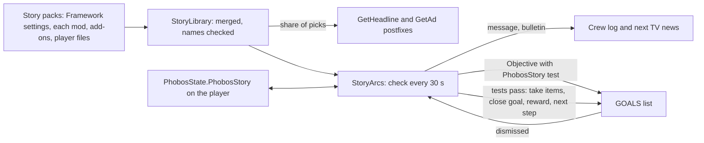

# Story and worldview content: design record

Phase 1: Framework 0.107.0, Agriculture 0.60.0. Phase 2 (small talk, loading tips and
encyclopedia articles): Framework 0.108.0, Agriculture 0.61.0. Round 3 (more tests, story time, branches,
credit rewards): Framework 0.109.0. Round 4 (data files and encyclopedia pictures): Framework 0.110.0,
Agriculture 0.62.0. Owner request, 6 October 2026: Framework code
and a schema so story and worldview content can enter the game through TV broadcasts,
people talking about topics, and goals the player picks up; written easily by ChatGPT
(the creative work) while Claude writes the code. The player guide is
[Writing story content](../writing-story-content.md).

## Owner decisions (6 October 2026)

| Question | Decision |
| --- | --- |
| How goals work | Framework story arcs: ordinary game goals run by Framework, not the game's plots |
| First release | News, adverts and arcs. Crew chatter follows after a code spike |
| Who ships content | Each mod ships its own story pack; Framework holds the code and schema |
| Text | Inline English in the pack, replaceable through a translation key |
| Diagrams | GitHub Mermaid charts |

## What the game offers

Read-only inspection of the game's assembly (Ostranauts 1.0.1.5) and its data folder;
no decompiled source was saved. **Observed** means seen in that inspection.

- **TV news (observed).** `CCTV.Update` builds the TV text by asking
  `DataHandler.GetHeadline()` for one headline at a time (a header "Region News:" when
  the region changes) and `DataHandler.GetAd()` for one advert at a time. Each picks
  uniformly from `dictHeadlines` (43 headlines; regions Shipping & Inner System,
  Tharsis, Outer System and a few topics; up to 652 characters) or `dictAds` (27 adverts,
  up to 374 characters). Nothing about either is saved. `CCTV.Update` is the only caller
  of `GetHeadline`.
- **Plots are saved by name (observed).** Saves keep plot names (`aPlots`), objectives
  that name their plot, player conditions and pledges. `ObjectiveTracker.LoadObjectives`
  looks a saved plot objective up by name, and the GOALS panel
  (`ObjectivePlotPanel.SetData`) reads the plot without a null check, so a removed plot
  throws whenever the panel draws. Added content must never use native plots.
- **Ordinary goals (observed).** `new Objective(co, title, ctName)` and
  `ObjectiveTracker.AddObjective` add a goal; a goal is complete when its completion
  test (`CondTrigger`) passes on its target. A save keeps the goal's title, description
  and test name (`Objective.GetJSON`). On load the test is looked up by name through
  `DataHandler.GetCondTrigger`, which logs "No such CT" for an unknown name and returns a
  copy of the game's always-true `Blank`. `ObjectiveTracker.CheckObjective` then finishes
  the goal through `RemoveObjective(..., REASON_COMPLETED)`.
- **Finished goals stay listed (observed).** `RemoveObjective` marks a goal finished
  and logs "OBJECTIVE_COMPLETE"; nothing removes it from `_allObjectives`, and saves keep
  it with `bFinished`. `AddObjective` refuses a goal equal to one already listed (same
  target, test, plot and title), and `CanShow` refuses one titled like a goal shown in
  the last ten seconds.
- **Dismissal (observed).** The GOALS panel's dismiss button calls `RemoveObjective`
  with `REASON_DISMISSED`, which for a plot goal also cancels its plot.
- **No topic system (observed).** Each small-talk line is a fixed social interaction,
  and character history stores interaction names. A line such as `SOCMentionHeadline`
  mentions "a headline" without saying which.

## How it works

| File | Role |
| --- | --- |
| `Story/StoryPack.cs` | Entry types and `StorySchema.Validate`: ids, lengths, placeholders, test fields |
| `Story/StoryLibrary.cs` | Merges packs in load order; refuses a reused id, unknown items, conditions, arcs and bulletins |
| `Story/StoryRecord.cs` | The player's record, and `StoryRules`: eligibility, tests, weighted picks, step lookup, goal names |
| `Story/StoryContent.cs` | Pack registration, load on `ContentLoaded`, mods by name, translations, F3 commands |
| `Story/StoryArcs.cs` | The runner, game facts, goal tests, rewards, dismissal postfix |
| `Story/StoryNews.cs` | The TV postfixes |

- **Packs.** Framework's own pack holds the settings and no stories. A mod registers
  its pack once in Awake (`StoryContent.Register`); all packs are reread with player
  and add-on files on every game load, after every mod has published its items, so the
  names a pack uses can be checked against the game's tables.
- **News.** A queued bulletin goes out first. Otherwise, with probability
  `broadcastShare` (0.3), a pick comes from the story news eligible at the last check,
  weighted; the rest stay the game's own. Adverts likewise with `advertShare`.
- **Arcs.** Each check finishes the active steps whose tests pass, may start one
  available arc (by its `chance`, while fewer than `maxActiveArcs` are active), and
  rebuilds the news pools. A step's goal is re-offered if the game did not take it.
- **Goal tests.** Each step with a goal gets the test `PhobosStory.<arc>.<step>`,
  registered on every load and requiring the hidden condition `IsPhobosStoryGoalOpen`,
  which nothing ever sets. The goal therefore never finishes by itself; Framework
  finishes it through the game's own `RemoveObjective`, so the game logs and sounds the
  completion as for its own goals. Before showing a goal again (a repeated arc), our
  finished copy is removed from the game's list so the game does not refuse the new one.
- **Rewards.** Items are created with `DataHandler.GetCondOwner`, added to the player's
  inventory and dropped at their feet when they do not fit. Consumed items are taken
  unit by unit, stack members first; if fewer than needed remain at that moment, the
  step waits.

## Save footprint

| Saved | Where | If the pack is removed | If Framework is removed |
| --- | --- | --- | --- |
| Arc progress, once-only news shown, queued bulletins | `PhobosState.PhobosStory`, a property map on the player | Entries are ignored and kept; restored with the pack | The map stays unread on the player |
| A goal's title, description and test name | The game's own goal list | The unknown test reads as `Blank`, so the goal finishes and disappears at the next goal check | The same |
| The hidden condition | Nowhere: it is never set | — | — |

No plots, pledges, social interactions, player conditions or new items enter a save.
The record keeps unknown fields and arcs exactly as read, so an older Framework never
destroys what a newer one wrote.

**Removal sequence (inferred from the observed lookups, not yet seen in play).** With
the pack gone, the game logs "No such CT: PhobosStory..." once per goal on load, and the
goal completes the next time the game checks the player's goals (`CheckObjective` runs
on many events, such as pausing). The player sees an ordinary "complete" line.

## Phase 2: small talk, loading tips and encyclopedia (Framework 0.108.0)

Owner request, 6 October 2026: proceed with the next set. Owner choices:

| Question | Decision |
| --- | --- |
| Scope | Small talk, loading-screen lore tips and encyclopedia articles, in one release |
| Who may voice a line | Anyone the game has chatting; each line may narrow it to the player's crew or to people elsewhere |

Agent choices, open to revision: the shares (40% of matching small talk, 30% of tips),
the nine moments and their lead-ins, and Framework's two shared encyclopedia sections
(Makers and brands; Life between stations).

**What the game offers (observed, same inspection method as above).**

- **Small talk.** Every social interaction becomes text through
  `GrammarUtils.GenerateDescription(Interaction)` or `(Interaction, bool)`, which return
  `GetInflectedString(strDesc, interaction)`; the tokens such as `[us]` and `[mentions]`
  are inflected there. Callers include the social log (`Interaction.ApplyLogging`, which
  logs to people in the room or aboard), the conversation screen
  (`GUISocialCombat2.SetData`), ship comms and tooltips. Character history stores the
  interaction's name, never its text. The social openers suited to carrying a topic
  are SOCMentionHeadline ("mentions a headline ... that [us-subj] recently read"),
  the jokes, complaints, stories, jargon, superstition, worries, a metaphysics
  question and shooting the breeze.
- **Tips.** `DataHandler.GetTip()` picks uniformly from `dictTips` (23 lore tips, up to
  444 characters, each starting with a line break) during the loading-screen fade.
  Nothing about it is saved, and no player exists then.
- **Encyclopedia.** `Info.Init` runs on `DataHandler.LoadComplete` and builds its tree
  from `dictInfoNodes` (`BuildHierarchyFromJSON`). A node with an empty parent hangs
  under the index; any other parent is looked up with the dictionary indexer, which
  throws for an unknown name. An empty `strImage` is drawn with the encyclopedia's logo
  and a blank image colour (`DrawMainWindow`). The game ships 68 nodes in one section.
- **Saves.** The save's `aCustomInfos` holds PDA notes, overlays, timers, presets,
  filters and the quick bar (`CrewSim.CustomInfosString`); nothing records which
  articles were read.

**How it works.**

| Channel | Mechanism | Saved |
| --- | --- | --- |
| Small talk | Postfixes on both `GenerateDescription` overloads (`StoryChatter`). For an interaction in a moment, a share of uses picks an eligible line the speaker may voice and returns `GetInflectedString(lead-in + line, interaction)`. The choice is remembered per interaction instance, checked against its name and speakers, so the log and the conversation screen agree. Lines are eligible by the player's facts at the last 30-second check; the speaker test (aboard one of the player's ships or not) is made at the moment of speech. | Nothing: only text changes |
| News mentions | A broadcast's `mention` is a `headline` line with the broadcast's weight and requirements | Nothing |
| Tips | `GetTip` postfix (`StoryLore.Tip`); entries may require only mods, which are checked against loaded plugins | Nothing |
| Encyclopedia | On each content load our `PhobosStory.` nodes in `dictInfoNodes` are replaced by the current sections and articles; a prefix on `BuildHierarchyFromJSON` applies them again in case the tree is built first. A section is published only with an article to show, and an article's parent is always its section's node | Nothing |

**Lead-ins** (`Story.moment.<moment>` in Framework's catalogue) use only grammar tokens
found in the game's own social lines, so the game inflects them as it does its own: the
native checks compare every token against the loaded interactions.

**Limits.**

- Story lines take the place of the game's line for that use; the game's own topics
  still come up the rest of the time.
- The speaker test reads ship ownership only: a guest aboard the player's ship counts
  as crew, and the player's crew visiting a station count as crew while aboard the
  player's ship.
- A line chosen for an interaction stays with that interaction object; if the game
  reuses one between the same two people with the same opener, the line repeats.
- The encyclopedia tree is built once a session; an article added by a file changed
  mid-session appears after the next game start (unobserved: whether the game rebuilds
  the tree on a later content load).

## Round 3: tests, story time, branches and credits (Framework 0.109.0)

The owner authorised rounds 3 and 4 on 6 October 2026 and asked for decisions needing
input to be held for the morning. Everything below is an agent choice unless stated.

- **Tests.** `credits` (the player's `StatUSD` condition is at least `amount`; with
  `consume` the amount is taken when the step finishes) and `condition` (the player
  has a game condition; skills are conditions such as `SkillHacking`). Both read the
  game's own state. A condition named by a test is checked against the game's
  conditions at load, as requirements are.
- **Story time.** The record gains `began`, the game epoch when it was first written.
  `afterDays` and `beforeDays` compare game days since then. A record written by
  Framework 0.107.0 or 0.108.0 gains `began` the first time it is loaded with 0.109.0,
  so story time starts then, not at the start of that game.
- **Branches and next steps.** A step may name `next` (a step id or `end`) and up to
  four branches, each with tests, an outcome and a `next`. The step's own tests come
  first, then the branches in order. The goal closes as completed either way. Steps
  may jump back; an arc moves at most one step per check, so there is no busy loop.
  Branch messages are translated by `<arc>.<step>.b<n>.doneFrom` and `.done`.
- **Credits.** An outcome may pay up to 50,000 credits (agent ceiling), and a credits
  test may take them. Both change `StatUSD` and add a `LedgerLI` line, as Framework's
  bulk sales do (`Trading/BulkSupplies.cs`); the line names the message sender, or the
  arc's first sender, or "a contact".
- **Saves.** One more field in the story record (`began`). Ledger lines and credits are
  the game's own records of money and stay valid whatever happens to a pack.

**Held for the owner:** faction reputation rewards. The game offers
`JsonFaction.ApplyFactionRep(strFactionDoing, fChange, bPrimary)`, and reputation gates
the faction kiosks' tiers; which factions an arc may move, and by how much, is a
balance decision.

## Round 4: data files and encyclopedia pictures (Framework 0.110.0)

Authorised with round 3; agent choices unless stated.

**What the game offers (observed).** Data is a `DataFile` object (`IsDataItem`, item
definition `DataItem`). The game's own files are overlays on it (`cooverlays_datafiles`)
saved by overlay name. Files live in a `DataStore` (container trigger
`TIsFitContainerDAT`, accepting `IsDataItem`), which the Renbao R014 Data Card
(`ItmDataCard01`) carries through its own loot (`ItmCardDataStorageEmpty`). A computer or
PDA lists them, and `GUIComputer2.RunFile` opens one: it shows the object's
`FriendlyName` and `strDesc` through the generic `TEMPDataGeneric` interaction, and
stamps `Datafile_<definition name>` with the time in the computer's property map. An
object's save keeps its own name (`strFriendlyName`) but not its description.

**How it works.**

- Framework publishes one definition, `PhobosStoryDataFile`, a copy of `DataFile` under
  our name. Each object carries its story file id in a Phobos record (`PhobosStoryFile`).
- An outcome's `files` makes one ordinary data card, puts a story file object for each
  id into the card's data store, sets each file's name, and gives the card like any
  reward item (inventory, else at the player's feet).
- A prefix on `GUIComputer2.RunFile` fills in the opened file's text (and its name, so
  a translation applies) from the loaded packs, records the file as read for
  `filesRead`, and starts its `startsArc` arc when that has not started and its
  requirements hold. An unknown id reads as a corrupted file.
- `image` on a section or article becomes the encyclopedia node's `strImage`. The game
  loads it as a PNG path and draws it at its own size.

**Saves.** Our objects are saved by definition name, as every Framework item is. If
Framework is removed, the game no longer knows `PhobosStoryDataFile`: the same as for
any Framework item. If only a story pack is removed, the file stays and reads as
corrupted. Each computer that opened one keeps a `Datafile_PhobosStoryDataFile` time
stamp, a plain string. The story record gains `read.<file>`.

**Not in the item reference** (agent choice): the story file is data on a card, never
loose cargo, and the card is the game's own item. The guide describes it.

**Held for the owner:**

- Story files found as world loot: where they appear, how often, and on what (the
  game's own cards, or a Phobos card), with loot shares under the AdditiveLoot rules.
- Pictures: the seed has none, because the only Agriculture art is 16 to 64 pixel
  sprites, which the encyclopedia shows at their own small size. Suitable pictures
  need new art, so a PixelLab or Imagegen cost check comes first.

## Round 5: places, people, threads and flags (Framework 0.114.0)

Owner, 6 October 2026: the system worked but was bare-bones; missions, goals and
conversation came "out of nowhere with absolutely no relation to anything or anywhere",
and the threads were not connected. Phobos Spacer Stories was disabled until this was
fixed. The plan and its findings are summarised here; the player guide's section is
[Where things happen](../writing-story-content.md#where-things-happen-places-people-and-threads).

### Owner decisions

| Question | Decision |
| --- | --- |
| What grounds stories | All four offered: places (stations and regions), people (named contacts with a home), the player's ship and crew, faction standing and time |
| How threads connect | Both: flags and arc progress as gates, and threads as first-class entries |
| Spacer Stories | ChatGPT rewrites it from the updated guide; old packs load unchanged |
| Faction standing | Read and change, small: gates first, changes of up to 10 points a step in a later release after an in-play check |
| Far news | A trickle: local news four times as likely as far; a thread is never invisible |

Round 5 delivers places, people, threads, flags, arc-progress gates, placed news and
talk, and the arrival check (Framework 0.114.0). Round 6 (Framework 0.115.0) adds the
standing, crew and clock gates (`standing`, `crewWith`, `crewCount`, `running`,
`months`, `hours`), `speakerFactions` on small talk, `[crew]`, and standing changes
in outcomes.

### Round 6: standing, crew and clock (Framework 0.115.0)

- **Standing** is read exactly as the game's FACTIONS app reads it: for a faction F,
  the sum over `player.GetAllFactions()` of `F.GetFactionScore(playerFaction)`,
  tiered by the thresholds of `JsonFaction.GetReputation` (a native check holds the
  two in agreement at every boundary). Every character has a personal faction named
  by their id (`PersonSpec` creates it and the player's is restored on load), so a
  change goes through `F.ApplyFactionRep(player.strID, change)`, the call the game's
  own debug command makes, with `bPrimary` false so no reciprocal ripple. The
  crew log says who thinks better or worse of you and the tier now.
- **Owner's in-play check before content uses standing changes:** `phobosframework
  story standing OKLGCorp 5`, then open the FACTIONS app; its figure for the
  Ayotimiwa Ship Breaking Co. should have risen by 5. If it did not, the player
  faction name differs from the id and the call must change; gates are unaffected.
- **Crew** facts come from `CrewRoster.Members()` without the player: `crewWith`
  tests a condition on anyone aboard, `crewCount` counts them, `[crew]` names one at
  random. **Running** counts Phobos machines whose Start stands
  (`ResumeAfterLoad.Marked`) in the same sweep as `owns`. **Months** and **hours**
  read `MathUtils.GetMonthFromS` and `StarSystem.nUTCHour`.
- `speakerFactions` on a small-talk line is matched against the speaker's
  `GetAllFactions()` at speech time, so AyoSec lines come from AyoSec people.
- `story where` lists the standing with every faction a loaded place or person names.

### What was found before designing (verified in the game's code, research kept in `.local`)

- The only place gate was `dockedAt` by station id, and every shipped entry said
  `any`; a broadcast's `region` was a label. Content could test an arc done or never
  started, not under way; outcomes set no state; bulletins bypassed gates and
  mentions quoted news never shown.
- **Region.** The game keeps `CollisionManager.strATCClosest`, the registration id of
  the nearest station marked `bIsRegion` (its traffic control), and
  `AIShipManager.strATCLast`, the last such region entered, saved with the game.
  Twelve stations are regional; parts carry the id with a suffix. The vanilla news
  regions are Tharsis, Shipping & Inner System and Outer System.
- **Standing.** The game's FACTIONS app computes a faction's view of the player as the
  sum over the player's own factions of `JsonFaction.GetFactionScore(playerFaction)`,
  tiered by `JsonFaction.GetReputation` (Honored 100, Trusted 75, Friendly 50, Warm 25,
  Neutral above -50, else Dislikes). `CondOwner.GetFactionScore` is the reverse
  direction. Changes go through `ApplyFactionRep` with the player's faction name; the
  debug command uses the player's id, which the owner's in-play check will confirm
  before standing changes ship.
- **Calendar.** `MathUtils.GetYearFromS`, `GetMonthFromS`, `GetDayOfMonthFromS` of
  `StarSystem.fEpoch`; `StarSystem.nUTCHour` for the hour.

### How it works

- **Places** are a Framework data table (`places` in `mods/PhobosFramework/framework/story.json`):
  the twelve regional stations and the parts and neighbours within them, with the
  game's ids, public names, bodies, factions and news regions. `StoryPlaces` turns any
  registration id into a place by the longest station prefix and climbs `within` to
  the region. Add-ons may add places.
- **Facts.** `GameFacts` gains `Region` (the place of `strATCClosest`, else
  `strATCLast`), the docked places, and `Near(place)`: docked at it or, for a
  regional place, in its region.
- **Threads** are entries; members declare `thread` and inherit its place and
  requirements. Thread requirements are evaluated once per check (`Gates`).
- **Selection.** News and advert weights are multiplied by `localWeight` (4) at the
  place, `UnplacedFactor` (2) for unplaced entries and `farWeight` (1) elsewhere.
  Placed small talk is voiced by crew while the player is near and by others only
  when they stand there (`StoryRules.Voices(line, …)`). A placed arc self-starts
  only while the player is near, and local arcs are tried first. Mentions are said for
  `mentionDays` after their news was first shown; a once-only bulletin already shown
  is skipped.
- **Flags** are `flag.<id>` keys on the player's record with the time set;
  `seen.<id>` now holds the time shown (an old `1` still reads as seen). Gates:
  `flags`, `notFlags`, `arcsActive`, `arcsAtStep`, `places`, `regions`, `newsSeen`.
- **Arrival check.** `StoryArcs.Poll` compares the region id each frame (a string
  compare) and runs the check at once when it changes.
- **Placeholders** `[place]`, `[region]`, `[station]`, `[body]`, `[date]` and
  `[person:key]` fill from the entry's place, else the player's whereabouts.
- **F3** `story where`, `story thread`, `story flag`, `story places`, `story people`.

### Save footprint

| Structure | Change | Migration |
| --- | --- | --- |
| `PhobosStory` on the player | `flag.<id>` = time set; `seen.<id>` = time shown | None: unknown keys were always kept; `1` still decodes |
| Story packs | New optional tables and fields | None; an older Framework refuses a newer pack whole (its serializer rejects unknown members), which the add-on's Framework minimum states |

### Deviations from the plan

- Requirement fields are `places` and `regions` (lists), not `place` and `region`,
  to match the other list gates.
- A broadcast must have a region, a place or a thread at file level; a thread with no
  place and no region is refused when the packs merge.

### Checks

`StoryChecks.Round5` (places lookup, thread inheritance, cast refusals, flags and
step gates, weights, voices, the mention window, record round trip with old `seen`
values), `StoryNativeChecks.Places` (every shipped place is a game station with the
game's regional flag, body, public name and factions; every regional station has a
place; the region fields and calendar helpers exist), `test_data_packs.test_story_grounding`
(the Python mirror and the shipped places). Not covered: the arrival check, placed
small talk with live speakers and the TV weighting in play.

### For the owner to try

1. Dock at OKLG and run `phobosframework story where`: region and place should read
   `oklg`. Fly towards Venus and the region should change to `vnca`.
2. Set a flag with `story flag test-x`, then `story where` lists it.
3. With Spacer Stories rewritten: local news on arrival, a stranger saying a `locals`
   line on the station and not aboard, a letter from a named person.

## Round 7: who a goal is from (Framework 0.121.0)

**Owner report and decisions (6 October 2026).** A Spacer Stories goal ("Wait for the
brokers' plant description") looked suspicious: nothing said where it came from, its
portrait was blank, and its description listed what it did not do. The owner chose
game-made faces for story goals and asked that vanilla goals be left alone.

**Observed in the game's code (decompile, `.local`).**
- The GOALS panel loads `strPortraitOverride`, else the focus character's
  `strPortraitImg`, plus ".png". It falls back to the game's "missing" sprite, the black
  silhouette. Our goals named nothing; the vanilla "Replace Broken Transponder" goal names
  nothing either.
- `strPortraitOverride` is not saved.
- The game's face roll (`FaceAnim2.GetRandomFace`) cannot be repeated from a seed: its
  loot roll avoids values close to earlier ones drawn under the same name.

**Design.**
- Each correspondent's face is rolled once by the game's own roll, the first time a goal
  needs it, and its parts are kept in the story record (`face.<person>`).
- The portrait is composed from the game's portrait parts exactly as `FaceAnim2.GetPNG`
  does, and registered in the game's picture cache under a name derived from the parts
  ([Portraits.cs](../../src/PhobosFramework/Social/Portraits.cs)).
- The goal names that picture, and is given it again on every load. A goal from no one
  in particular names the game's own wrist PDA picture, as one vanilla plot does.
- Each goal ends with "From Name, role (home)."
- Authors may set `face` on a person and `person` on an objective.

**Agent choices.**
- The From line's wording.
- Faces are stable per save, not across saves.
- The Spacer Stories goal wording pass (0.3.1): plain next moves, without lists of what a
  goal does not do; ids, tests and letters unchanged.
- The ChatGPT prompt now says so.

**Also in this round:** the small-talk grammar fix
([handoff and resolution](story-chatter-grammar-handoff.md)).

## Round 8: the Letters window and replies (Framework 0.122.0)

**Owner decisions (6 October 2026).** The owner approved ChatGPT's proposal of a
deliberate answer facility, because skill branches are automatic and docking counted as
answering a letter. The owner chose a Letters window, opened by clicking a story goal,
over buttons drawn on the goal itself.

**Design.**
- A step may offer two to four `choices` (replies), each with optional tests that lock it
  until they pass, an outcome and a required next step. Such a step has no tests or
  branches of its own, so no check finishes it.
- `StoryArcs.Answer` sends a reply through the same finish as a test or branch: it takes
  what the reply's tests consume, closes the goal, gives the outcome and moves on.
- The Letters window ([LettersPanel.cs](../../src/PhobosFramework/Story/LettersPanel.cs))
  and F3 `story answer` both call it.
- A prefix on the goal panel's `FocusObjective(CondOwner)` opens Letters for our goals
  only; every other goal keeps the game's click.
- The confirmation is the shared `ChoiceCard`, which the console's unsaved-changes
  question now uses too.

**Saved.** The record gains `letters.<arc>`: each letter's step, kind (opening,
completion, branch or reply with its id) and arrival time, at most 64 an arc. Text is
read from the packs when shown. An arc begun before 0.122.0 shows the letters its
progress implies, without dates. `arc.` keeps exactly five parts, so older versions still
read every arc and keep the new key untouched.

**Agent choices.**
- Finished and set-aside correspondence starts folded.
- A sent reply needs one confirmation and cannot be taken back.
- The crew log says when a letter waits for an answer.
- Existing Spacer Stories steps are not converted: turning a dock-to-answer step into
  replies would change a published step's meaning for saves part-way through it. New
  content uses replies; the ChatGPT prompt says when.

## Round 9: story services for other mods and the game's day (Framework 0.127.0)

Planned in the [PDA apps and banking research](pda-apps-and-banking-research.md) so that
Phobos Banking's lenders can be local, gated and remembered as story content is. Each is
public, documented and usable by any mod:

- `StoryLocation.Region`, `DockedPlace` and `Near(place)`: where the player is, from the
  same facts the arcs read (the runner's `GameFacts`, now internal rather than private).
- `StoryGates.Blocked(requires, thread)`: a story `requires` block checked against the live
  game and the player's story record, with the F3 report's wording.
- `StorySchema.ValidateRequires(requires, where)`: the block's form, for another pack that
  carries one; `StoryLibrary.UnknownReference`, `UnknownPlace` and `UnknownPerson` check
  the entries it names once the library is built.
- `StoryFlags.Has`, `SetAt`, `Set` and `Clear`: the flags arc outcomes set, saved in the
  same record. A change saves at once and brings the next check forward.
- `StoryArcs.TryBegin(arc, out message)`: starts an arc from code only when its
  requirements, thread and place hold and it is not under way (or finished and not
  repeatable). The limit on arcs starting by themselves does not apply. F3
  `story try <arc>` uses it. Since Framework 0.128.1 the F3 form is a test command (owner
  rule, 7 October 2026: the game's `unlockdebug`, a warning, `confirm`, and the save marked
  as test-changed), as are `story start`, `reset`, `news`, `file`, `flag`, `standing` and
  `check`; `StoryArcs.TryBegin` itself, which Phobos Banking calls, is not gated.
- **The game's day.** `afterDays`, `beforeDays` and `mentionDays` counted 86,400-second
  days; they now count the game's own 87,658.125-second day (`GameClock`, shared, checked
  natively against `CrewSim.SEC_PER_DAY` and `MathUtils`). A window of 10 days now opens
  about 3.5 hours of game time later than before (10 times 1,258 seconds). Saved story records are unchanged.
- `GameClock` also numbers shifts as the game does and counts the shift changes between
  two times (`ShiftCount`), including the game year's extra last second, which the game
  treats as the next year's first shift.

## Limits of phase 1

- Goals and news concern the player character. A player who switches to another
  character starts with that character's record.
- `install` and `owns` count objects on the player's loaded ships, installed or lying
  aboard; a ship out of range is not counted.
- Story steps advance at the 30-second check, so a goal can finish up to half a minute
  after its test is met. A time-skip advances `wait` tests by game hours as usual.
- A step whose saved id and position both vanish from its pack is set aside, with a log
  line; `story reset` starts it again.

## Later work

What the owner's request covered but phase 2 does not (small talk, tips and encyclopedia entries were delivered in phase 2). The save-risk column uses
the same test as above: does a name of ours enter saves, and what happens if it goes?

| Item | What it would add | What we know / what it still needs | Save risk |
| --- | --- | --- | --- |
| **A Framework talk opener** | Topics as their own kind of conversation | Phase 2 borrows the game's own small talk. A new opener only if that proves too limited. The crew pick openers by learned weights (`ai_training`), so a new opener may rarely fire. | One Framework-owned name in conversation history (acceptable, like Framework items) |
| **Characters approaching the player** | A contact walks up and hands over a goal | The game does this with pledges, saved by name on characters. A Framework version needs its own approach behaviour. | Pledges refused; a Framework version needs its own design |
| **Data files as world loot** | Story files found in the world | Round 4 delivers files as arc rewards on the game's own data cards. Loot placement and odds are held for the owner. | None beyond round 4 |
| **Reputation rewards** | Changing faction standing | Owner decision (6 October 2026): read and change, small. Gates and changes of up to 10 points a step come in the release after 0.114.0, after an in-play check of the player's faction name. | The game's own faction scores |
| **More tests and gates** | Goals and gates beyond the present kinds | Round 5 added place, region, flag, arc-progress and news gates. Next: `standing`, `crewWith`, `crewCount`, `running`, `months`, `hours` and `[crew]`. Candidates after that: visit a kind of ship, talk to a kind of person. | None (code only) |
| **Choices from a menu** | The player picks the next step from offered options | **Delivered in Framework 0.122.0** as replies in the Letters window (round 8 below). | Our record only |
| **Encounter scenes** | Full-screen story scenes with pictures and choices | The game's encounters are interactions saved in history; ours would need Framework-owned ones and original art. | Names in history; needs design |
| **Translations of story text** | Other languages | The keys exist (`Story.<id>.<field>`); no translation work has started. | None |
| **Other mods' story packs** | Manufacturing, Shipbreaker, Medical, Auto Nav and War Has Been Declared content | Each mod registers its own pack as Agriculture does; only Agriculture ships a seed. | None beyond this release's rules |
| **Encyclopedia pictures (art)** | Pictures for the shipped articles | The `image` field exists since round 4; suitable art is held for a cost check. | None |

## Verification

- `tests/PhobosFramework.Tests/StoryChecks.cs`: schema refusals, the merged library,
  the record round trip (unknown fields kept), eligibility, every test kind, picks,
  step lookup and goal names.
- `tests/PhobosNative.Tests/StoryNativeChecks.cs`: the shipped packs over the game's
  real data (every name exists), goal tests that never pass by themselves, and the game
  members the code relies on. `PatchResolutionChecks` covers the three postfixes.
- `tests/test_data_packs.py`: the Python mirror and the JSON Schema on the shipped
  packs and on broken copies.
- Phase 2: `StoryChecks.Phase2` (refusals, mention lines, moments, pools, speakers,
  encyclopedia nodes) and `StoryNativeChecks` (every mapped interaction exists, every
  lead-in token appears in the game's own lines, the seed's nodes have known parents,
  the tip and encyclopedia methods are where expected).
- **In play (owner, pending), phase 2:** story lines turn up in the social log among
  small talk, aboard and on stations; `phobosframework story chatter <id>` forces one;
  loading screens sometimes show a Verdemorrow tip; the encyclopedia lists Makers and
  brands and Life between stations with Agriculture's articles, and without
  Agriculture neither section shows.
- **In play (owner, pending), phase 1:** the TV shows the seed news among the game's own;
  `phobosframework story start verdemorrow-grain-sample` puts a goal in the GOALS list;
  carrying a portion of wheat grain finishes the first step, docking with it the second,
  with the reward; dismissing a goal sets the arc aside; with Agriculture's pack removed
  the goal finishes on load with only a "No such CT" line in `Player.log`.
