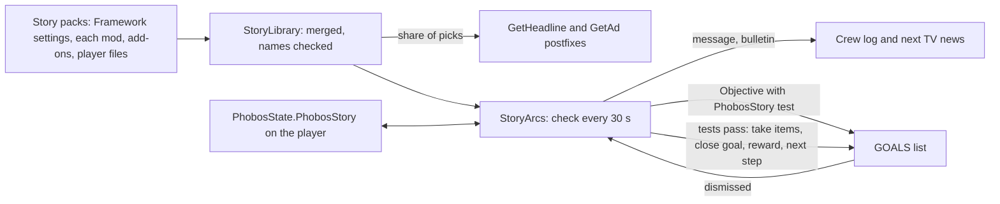

# Story and worldview content: design record

Phase 1: Framework 0.107.0, Agriculture 0.60.0. Phase 2 (small talk, loading tips and
encyclopedia articles): Framework 0.108.0, Agriculture 0.61.0. Round 3 (more tests, story time, branches,
credit rewards): Framework 0.109.0. Round 4 (data files and encyclopedia pictures): Framework 0.110.0,
Agriculture 0.62.0. Owner request, 6 October 2026: Framework code
and a schema so story and worldview content can enter the game through TV broadcasts,
people talking about topics, and goals the player picks up; written easily by ChatGPT
(the creative work) while Claude writes the code. The player guide is
[Writing story content](../writing-story-content.md).

## Owner decisions (6 October 2026)

| Question | Decision |
| --- | --- |
| How goals work | Framework story arcs: ordinary game goals run by Framework, not the game's plots |
| First release | News, adverts and arcs. Crew chatter follows after a code spike |
| Who ships content | Each mod ships its own story pack; Framework holds the code and schema |
| Text | Inline English in the pack, replaceable through a translation key |
| Diagrams | GitHub Mermaid charts |

## What the game offers

Read-only inspection of the game's assembly (Ostranauts 1.0.1.5) and its data folder;
no decompiled source was saved. **Observed** means seen in that inspection.

- **TV news (observed).** `CCTV.Update` builds the TV text by asking
  `DataHandler.GetHeadline()` for one headline at a time (a header "Region News:" when
  the region changes) and `DataHandler.GetAd()` for one advert at a time. Each picks
  uniformly from `dictHeadlines` (43 headlines; regions Shipping & Inner System,
  Tharsis, Outer System and a few topics; up to 652 characters) or `dictAds` (27 adverts,
  up to 374 characters). Nothing about either is saved. `CCTV.Update` is the only caller
  of `GetHeadline`.
- **Plots are saved by name (observed).** Saves keep plot names (`aPlots`), objectives
  that name their plot, player conditions and pledges. `ObjectiveTracker.LoadObjectives`
  looks a saved plot objective up by name, and the GOALS panel
  (`ObjectivePlotPanel.SetData`) reads the plot without a null check, so a removed plot
  throws whenever the panel draws. Added content must never use native plots.
- **Ordinary goals (observed).** `new Objective(co, title, ctName)` and
  `ObjectiveTracker.AddObjective` add a goal; a goal is complete when its completion
  test (`CondTrigger`) passes on its target. A save keeps the goal's title, description
  and test name (`Objective.GetJSON`). On load the test is looked up by name through
  `DataHandler.GetCondTrigger`, which logs "No such CT" for an unknown name and returns a
  copy of the game's always-true `Blank`. `ObjectiveTracker.CheckObjective` then finishes
  the goal through `RemoveObjective(..., REASON_COMPLETED)`.
- **Finished goals stay listed (observed).** `RemoveObjective` marks a goal finished
  and logs "OBJECTIVE_COMPLETE"; nothing removes it from `_allObjectives`, and saves keep
  it with `bFinished`. `AddObjective` refuses a goal equal to one already listed (same
  target, test, plot and title), and `CanShow` refuses one titled like a goal shown in
  the last ten seconds.
- **Dismissal (observed).** The GOALS panel's dismiss button calls `RemoveObjective`
  with `REASON_DISMISSED`, which for a plot goal also cancels its plot.
- **No topic system (observed).** Each small-talk line is a fixed social interaction,
  and character history stores interaction names. A line such as `SOCMentionHeadline`
  mentions "a headline" without saying which.

## How it works

| File | Role |
| --- | --- |
| `Story/StoryPack.cs` | Entry types and `StorySchema.Validate`: ids, lengths, placeholders, test fields |
| `Story/StoryLibrary.cs` | Merges packs in load order; refuses a reused id, unknown items, conditions, arcs and bulletins |
| `Story/StoryRecord.cs` | The player's record, and `StoryRules`: eligibility, tests, weighted picks, step lookup, goal names |
| `Story/StoryContent.cs` | Pack registration, load on `ContentLoaded`, mods by name, translations, F3 commands |
| `Story/StoryArcs.cs` | The runner, game facts, goal tests, rewards, dismissal postfix |
| `Story/StoryNews.cs` | The TV postfixes |

- **Packs.** Framework's own pack holds the settings and no stories. A mod registers
  its pack once in Awake (`StoryContent.Register`); all packs are reread with player
  and add-on files on every game load, after every mod has published its items, so the
  names a pack uses can be checked against the game's tables.
- **News.** A queued bulletin goes out first. Otherwise, with probability
  `broadcastShare` (0.3), a pick comes from the story news eligible at the last check,
  weighted; the rest stay the game's own. Adverts likewise with `advertShare`.
- **Arcs.** Each check finishes the active steps whose tests pass, may start one
  available arc (by its `chance`, while fewer than `maxActiveArcs` are active), and
  rebuilds the news pools. A step's goal is re-offered if the game did not take it.
- **Goal tests.** Each step with a goal gets the test `PhobosStory.<arc>.<step>`,
  registered on every load and requiring the hidden condition `IsPhobosStoryGoalOpen`,
  which nothing ever sets. The goal therefore never finishes by itself; Framework
  finishes it through the game's own `RemoveObjective`, so the game logs and sounds the
  completion as for its own goals. Before showing a goal again (a repeated arc), our
  finished copy is removed from the game's list so the game does not refuse the new one.
- **Rewards.** Items are created with `DataHandler.GetCondOwner`, added to the player's
  inventory and dropped at their feet when they do not fit. Consumed items are taken
  unit by unit, stack members first; if fewer than needed remain at that moment, the
  step waits.

## Save footprint

| Saved | Where | If the pack is removed | If Framework is removed |
| --- | --- | --- | --- |
| Arc progress, once-only news shown, queued bulletins | `PhobosState.PhobosStory`, a property map on the player | Entries are ignored and kept; restored with the pack | The map stays unread on the player |
| A goal's title, description and test name | The game's own goal list | The unknown test reads as `Blank`, so the goal finishes and disappears at the next goal check | The same |
| The hidden condition | Nowhere: it is never set | — | — |

No plots, pledges, social interactions, player conditions or new items enter a save.
The record keeps unknown fields and arcs exactly as read, so an older Framework never
destroys what a newer one wrote.

**Removal sequence (inferred from the observed lookups, not yet seen in play).** With
the pack gone, the game logs "No such CT: PhobosStory..." once per goal on load, and the
goal completes the next time the game checks the player's goals (`CheckObjective` runs
on many events, such as pausing). The player sees an ordinary "complete" line.

## Phase 2: small talk, loading tips and encyclopedia (Framework 0.108.0)

Owner request, 6 October 2026: proceed with the next set. Owner choices:

| Question | Decision |
| --- | --- |
| Scope | Small talk, loading-screen lore tips and encyclopedia articles, in one release |
| Who may voice a line | Anyone the game has chatting; each line may narrow it to the player's crew or to people elsewhere |

Agent choices, open to revision: the shares (40% of matching small talk, 30% of tips),
the nine moments and their lead-ins, and Framework's two shared encyclopedia sections
(Makers and brands; Life between stations).

**What the game offers (observed, same inspection method as above).**

- **Small talk.** Every social interaction becomes text through
  `GrammarUtils.GenerateDescription(Interaction)` or `(Interaction, bool)`, which return
  `GetInflectedString(strDesc, interaction)`; the tokens such as `[us]` and `[mentions]`
  are inflected there. Callers include the social log (`Interaction.ApplyLogging`, which
  logs to people in the room or aboard), the conversation screen
  (`GUISocialCombat2.SetData`), ship comms and tooltips. Character history stores the
  interaction's name, never its text. The social openers suited to carrying a topic
  are SOCMentionHeadline ("mentions a headline ... that [us-subj] recently read"),
  the jokes, complaints, stories, jargon, superstition, worries, a metaphysics
  question and shooting the breeze.
- **Tips.** `DataHandler.GetTip()` picks uniformly from `dictTips` (23 lore tips, up to
  444 characters, each starting with a line break) during the loading-screen fade.
  Nothing about it is saved, and no player exists then.
- **Encyclopedia.** `Info.Init` runs on `DataHandler.LoadComplete` and builds its tree
  from `dictInfoNodes` (`BuildHierarchyFromJSON`). A node with an empty parent hangs
  under the index; any other parent is looked up with the dictionary indexer, which
  throws for an unknown name. An empty `strImage` is drawn with the encyclopedia's logo
  and a blank image colour (`DrawMainWindow`). The game ships 68 nodes in one section.
- **Saves.** The save's `aCustomInfos` holds PDA notes, overlays, timers, presets,
  filters and the quick bar (`CrewSim.CustomInfosString`); nothing records which
  articles were read.

**How it works.**

| Channel | Mechanism | Saved |
| --- | --- | --- |
| Small talk | Postfixes on both `GenerateDescription` overloads (`StoryChatter`). For an interaction in a moment, a share of uses picks an eligible line the speaker may voice and returns `GetInflectedString(lead-in + line, interaction)`. The choice is remembered per interaction instance, checked against its name and speakers, so the log and the conversation screen agree. Lines are eligible by the player's facts at the last 30-second check; the speaker test (aboard one of the player's ships or not) is made at the moment of speech. | Nothing: only text changes |
| News mentions | A broadcast's `mention` is a `headline` line with the broadcast's weight and requirements | Nothing |
| Tips | `GetTip` postfix (`StoryLore.Tip`); entries may require only mods, which are checked against loaded plugins | Nothing |
| Encyclopedia | On each content load our `PhobosStory.` nodes in `dictInfoNodes` are replaced by the current sections and articles; a prefix on `BuildHierarchyFromJSON` applies them again in case the tree is built first. A section is published only with an article to show, and an article's parent is always its section's node | Nothing |

**Lead-ins** (`Story.moment.<moment>` in Framework's catalogue) use only grammar tokens
found in the game's own social lines, so the game inflects them as it does its own: the
native checks compare every token against the loaded interactions.

**Limits.**

- Story lines take the place of the game's line for that use; the game's own topics
  still come up the rest of the time.
- The speaker test reads ship ownership only: a guest aboard the player's ship counts
  as crew, and the player's crew visiting a station count as crew while aboard the
  player's ship.
- A line chosen for an interaction stays with that interaction object; if the game
  reuses one between the same two people with the same opener, the line repeats.
- The encyclopedia tree is built once a session; an article added by a file changed
  mid-session appears after the next game start (unobserved: whether the game rebuilds
  the tree on a later content load).

## Round 3: tests, story time, branches and credits (Framework 0.109.0)

The owner authorised rounds 3 and 4 on 6 October 2026 and asked for decisions needing
input to be held for the morning. Everything below is an agent choice unless stated.

- **Tests.** `credits` (the player's `StatUSD` condition is at least `amount`; with
  `consume` the amount is taken when the step finishes) and `condition` (the player
  has a game condition; skills are conditions such as `SkillHacking`). Both read the
  game's own state. A condition named by a test is checked against the game's
  conditions at load, as requirements are.
- **Story time.** The record gains `began`, the game epoch when it was first written.
  `afterDays` and `beforeDays` compare game days since then. A record written by
  Framework 0.107.0 or 0.108.0 gains `began` the first time it is loaded with 0.109.0,
  so story time starts then, not at the start of that game.
- **Branches and next steps.** A step may name `next` (a step id or `end`) and up to
  four branches, each with tests, an outcome and a `next`. The step's own tests come
  first, then the branches in order. The goal closes as completed either way. Steps
  may jump back; an arc moves at most one step per check, so there is no busy loop.
  Branch messages are translated by `<arc>.<step>.b<n>.doneFrom` and `.done`.
- **Credits.** An outcome may pay up to 50,000 credits (agent ceiling), and a credits
  test may take them. Both change `StatUSD` and add a `LedgerLI` line, as Framework's
  bulk sales do (`Trading/BulkSupplies.cs`); the line names the message sender, or the
  arc's first sender, or "a contact".
- **Saves.** One more field in the story record (`began`). Ledger lines and credits are
  the game's own records of money and stay valid whatever happens to a pack.

**Held for the owner:** faction reputation rewards. The game offers
`JsonFaction.ApplyFactionRep(strFactionDoing, fChange, bPrimary)`, and reputation gates
the faction kiosks' tiers; which factions an arc may move, and by how much, is a
balance decision.

## Round 4: data files and encyclopedia pictures (Framework 0.110.0)

Authorised with round 3; agent choices unless stated.

**What the game offers (observed).** Data is a `DataFile` object (`IsDataItem`, item
definition `DataItem`). The game's own files are overlays on it (`cooverlays_datafiles`)
saved by overlay name. Files live in a `DataStore` (container trigger
`TIsFitContainerDAT`, accepting `IsDataItem`), which the Renbao R014 Data Card
(`ItmDataCard01`) carries through its own loot (`ItmCardDataStorageEmpty`). A computer or
PDA lists them, and `GUIComputer2.RunFile` opens one: it shows the object's
`FriendlyName` and `strDesc` through the generic `TEMPDataGeneric` interaction, and
stamps `Datafile_<definition name>` with the time in the computer's property map. An
object's save keeps its own name (`strFriendlyName`) but not its description.

**How it works.**

- Framework publishes one definition, `PhobosStoryDataFile`, a copy of `DataFile` under
  our name. Each object carries its story file id in a Phobos record (`PhobosStoryFile`).
- An outcome's `files` makes one ordinary data card, puts a story file object for each
  id into the card's data store, sets each file's name, and gives the card like any
  reward item (inventory, else at the player's feet).
- A prefix on `GUIComputer2.RunFile` fills in the opened file's text (and its name, so
  a translation applies) from the loaded packs, records the file as read for
  `filesRead`, and starts its `startsArc` arc when that has not started and its
  requirements hold. An unknown id reads as a corrupted file.
- `image` on a section or article becomes the encyclopedia node's `strImage`. The game
  loads it as a PNG path and draws it at its own size.

**Saves.** Our objects are saved by definition name, as every Framework item is. If
Framework is removed, the game no longer knows `PhobosStoryDataFile`: the same as for
any Framework item. If only a story pack is removed, the file stays and reads as
corrupted. Each computer that opened one keeps a `Datafile_PhobosStoryDataFile` time
stamp, a plain string. The story record gains `read.<file>`.

**Not in the item reference** (agent choice): the story file is data on a card, never
loose cargo, and the card is the game's own item. The guide describes it.

**Held for the owner:**

- Story files found as world loot: where they appear, how often, and on what (the
  game's own cards, or a Phobos card), with loot shares under the AdditiveLoot rules.
- Pictures: the seed has none, because the only Agriculture art is 16 to 64 pixel
  sprites, which the encyclopedia shows at their own small size. Suitable pictures
  need new art, so a PixelLab or Imagegen cost check comes first.

## Limits of phase 1

- Goals and news concern the player character. A player who switches to another
  character starts with that character's record.
- `install` and `owns` count objects on the player's loaded ships, installed or lying
  aboard; a ship out of range is not counted.
- Story steps advance at the 30-second check, so a goal can finish up to half a minute
  after its test is met. A time-skip advances `wait` tests by game hours as usual.
- A step whose saved id and position both vanish from its pack is set aside, with a log
  line; `story reset` starts it again.

## Later work

What the owner's request covered but phase 2 does not (small talk, tips and encyclopedia entries were delivered in phase 2). The save-risk column uses
the same test as above: does a name of ours enter saves, and what happens if it goes?

| Item | What it would add | What we know / what it still needs | Save risk |
| --- | --- | --- | --- |
| **A Framework talk opener** | Topics as their own kind of conversation | Phase 2 borrows the game's own small talk. A new opener only if that proves too limited. The crew pick openers by learned weights (`ai_training`), so a new opener may rarely fire. | One Framework-owned name in conversation history (acceptable, like Framework items) |
| **Characters approaching the player** | A contact walks up and hands over a goal | The game does this with pledges, saved by name on characters. A Framework version needs its own approach behaviour. | Pledges refused; a Framework version needs its own design |
| **Data files as world loot** | Story files found in the world | Round 4 delivers files as arc rewards on the game's own data cards. Loot placement and odds are held for the owner. | None beyond round 4 |
| **Reputation rewards** | Changing faction standing | Credits were delivered in round 3. Faction standing is the game's own saved state and gates the faction kiosks; held for the owner's decision on which factions and how much. | The game's own faction scores |
| **More tests** | Goals beyond the six kinds | Credits and conditions (including skills) were added in round 3. Candidates: visit a kind of ship, own a machine family, talk to a kind of person. Each is code in the fixed vocabulary, added as content needs it. | None (code only) |
| **Choices from a menu** | The player picks the next step from offered options | Round 3 branches are decided by tests. A menu needs a choice screen. | None beyond our record |
| **Encounter scenes** | Full-screen story scenes with pictures and choices | The game's encounters are interactions saved in history; ours would need Framework-owned ones and original art. | Names in history; needs design |
| **Translations of story text** | Other languages | The keys exist (`Story.<id>.<field>`); no translation work has started. | None |
| **Other mods' story packs** | Manufacturing, Shipbreaker, Medical, Auto Nav and War Has Been Declared content | Each mod registers its own pack as Agriculture does; only Agriculture ships a seed. | None beyond this release's rules |
| **Encyclopedia pictures (art)** | Pictures for the shipped articles | The `image` field exists since round 4; suitable art is held for a cost check. | None |

## Verification

- `tests/PhobosFramework.Tests/StoryChecks.cs`: schema refusals, the merged library,
  the record round trip (unknown fields kept), eligibility, every test kind, picks,
  step lookup and goal names.
- `tests/PhobosNative.Tests/StoryNativeChecks.cs`: the shipped packs over the game's
  real data (every name exists), goal tests that never pass by themselves, and the game
  members the code relies on. `PatchResolutionChecks` covers the three postfixes.
- `tests/test_data_packs.py`: the Python mirror and the JSON Schema on the shipped
  packs and on broken copies.
- Phase 2: `StoryChecks.Phase2` (refusals, mention lines, moments, pools, speakers,
  encyclopedia nodes) and `StoryNativeChecks` (every mapped interaction exists, every
  lead-in token appears in the game's own lines, the seed's nodes have known parents,
  the tip and encyclopedia methods are where expected).
- **In play (owner, pending), phase 2:** story lines turn up in the social log among
  small talk, aboard and on stations; `phobosframework story chatter <id>` forces one;
  loading screens sometimes show a Verdemorrow tip; the encyclopedia lists Makers and
  brands and Life between stations with Agriculture's articles, and without
  Agriculture neither section shows.
- **In play (owner, pending), phase 1:** the TV shows the seed news among the game's own;
  `phobosframework story start verdemorrow-grain-sample` puts a goal in the GOALS list;
  carrying a portion of wheat grain finishes the first step, docking with it the second,
  with the reward; dismissing a goal sets the arc aside; with Agriculture's pack removed
  the goal finishes on load with only a "No such CT" line in `Player.log`.
