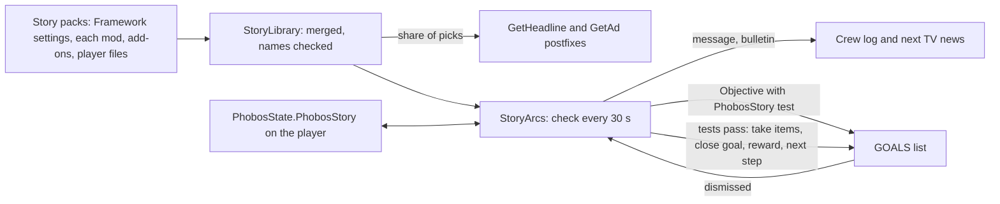

# Story and worldview content: design record

Framework 0.107.0, Agriculture 0.60.0. Owner request, 6 October 2026: Framework code
and a schema so story and worldview content can enter the game through TV broadcasts,
people talking about topics, and goals the player picks up; written easily by ChatGPT
(the creative work) while Claude writes the code. The player guide is
[Writing story content](../writing-story-content.md).

## Owner decisions (6 October 2026)

| Question | Decision |
| --- | --- |
| How goals work | Framework story arcs: ordinary game goals run by Framework, not the game's plots |
| First release | News, adverts and arcs. Crew chatter follows after a code spike |
| Who ships content | Each mod ships its own story pack; Framework holds the code and schema |
| Text | Inline English in the pack, replaceable through a translation key |
| Diagrams | GitHub Mermaid charts |

## What the game offers

Read-only inspection of the game's assembly (Ostranauts 1.0.1.5) and its data folder;
no decompiled source was saved. **Observed** means seen in that inspection.

- **TV news (observed).** `CCTV.Update` builds the TV text by asking
  `DataHandler.GetHeadline()` for one headline at a time (a header "Region News:" when
  the region changes) and `DataHandler.GetAd()` for one advert at a time. Each picks
  uniformly from `dictHeadlines` (43 headlines; regions Shipping & Inner System,
  Tharsis, Outer System and a few topics; up to 652 characters) or `dictAds` (27 adverts,
  up to 374 characters). Nothing about either is saved. `CCTV.Update` is the only caller
  of `GetHeadline`.
- **Plots are saved by name (observed).** Saves keep plot names (`aPlots`), objectives
  that name their plot, player conditions and pledges. `ObjectiveTracker.LoadObjectives`
  looks a saved plot objective up by name, and the GOALS panel
  (`ObjectivePlotPanel.SetData`) reads the plot without a null check, so a removed plot
  throws whenever the panel draws. Added content must never use native plots.
- **Ordinary goals (observed).** `new Objective(co, title, ctName)` and
  `ObjectiveTracker.AddObjective` add a goal; a goal is complete when its completion
  test (`CondTrigger`) passes on its target. A save keeps the goal's title, description
  and test name (`Objective.GetJSON`). On load the test is looked up by name through
  `DataHandler.GetCondTrigger`, which logs "No such CT" for an unknown name and returns a
  copy of the game's always-true `Blank`. `ObjectiveTracker.CheckObjective` then finishes
  the goal through `RemoveObjective(..., REASON_COMPLETED)`.
- **Finished goals stay listed (observed).** `RemoveObjective` marks a goal finished
  and logs "OBJECTIVE_COMPLETE"; nothing removes it from `_allObjectives`, and saves keep
  it with `bFinished`. `AddObjective` refuses a goal equal to one already listed (same
  target, test, plot and title), and `CanShow` refuses one titled like a goal shown in
  the last ten seconds.
- **Dismissal (observed).** The GOALS panel's dismiss button calls `RemoveObjective`
  with `REASON_DISMISSED`, which for a plot goal also cancels its plot.
- **No topic system (observed).** Each small-talk line is a fixed social interaction,
  and character history stores interaction names. A line such as `SOCMentionHeadline`
  mentions "a headline" without saying which.

## How it works

| File | Role |
| --- | --- |
| `Story/StoryPack.cs` | Entry types and `StorySchema.Validate`: ids, lengths, placeholders, test fields |
| `Story/StoryLibrary.cs` | Merges packs in load order; refuses a reused id, unknown items, conditions, arcs and bulletins |
| `Story/StoryRecord.cs` | The player's record, and `StoryRules`: eligibility, tests, weighted picks, step lookup, goal names |
| `Story/StoryContent.cs` | Pack registration, load on `ContentLoaded`, mods by name, translations, F3 commands |
| `Story/StoryArcs.cs` | The runner, game facts, goal tests, rewards, dismissal postfix |
| `Story/StoryNews.cs` | The TV postfixes |

- **Packs.** Framework's own pack holds the settings and no stories. A mod registers
  its pack once in Awake (`StoryContent.Register`); all packs are reread with player
  and add-on files on every game load, after every mod has published its items, so the
  names a pack uses can be checked against the game's tables.
- **News.** A queued bulletin goes out first. Otherwise, with probability
  `broadcastShare` (0.3), a pick comes from the story news eligible at the last check,
  weighted; the rest stay the game's own. Adverts likewise with `advertShare`.
- **Arcs.** Each check finishes the active steps whose tests pass, may start one
  available arc (by its `chance`, while fewer than `maxActiveArcs` are active), and
  rebuilds the news pools. A step's goal is re-offered if the game did not take it.
- **Goal tests.** Each step with a goal gets the test `PhobosStory.<arc>.<step>`,
  registered on every load and requiring the hidden condition `IsPhobosStoryGoalOpen`,
  which nothing ever sets. The goal therefore never finishes by itself; Framework
  finishes it through the game's own `RemoveObjective`, so the game logs and sounds the
  completion as for its own goals. Before showing a goal again (a repeated arc), our
  finished copy is removed from the game's list so the game does not refuse the new one.
- **Rewards.** Items are created with `DataHandler.GetCondOwner`, added to the player's
  inventory and dropped at their feet when they do not fit. Consumed items are taken
  unit by unit, stack members first; if fewer than needed remain at that moment, the
  step waits.

## Save footprint

| Saved | Where | If the pack is removed | If Framework is removed |
| --- | --- | --- | --- |
| Arc progress, once-only news shown, queued bulletins | `PhobosState.PhobosStory`, a property map on the player | Entries are ignored and kept; restored with the pack | The map stays unread on the player |
| A goal's title, description and test name | The game's own goal list | The unknown test reads as `Blank`, so the goal finishes and disappears at the next goal check | The same |
| The hidden condition | Nowhere: it is never set | — | — |

No plots, pledges, social interactions, player conditions or new items enter a save.
The record keeps unknown fields and arcs exactly as read, so an older Framework never
destroys what a newer one wrote.

**Removal sequence (inferred from the observed lookups, not yet seen in play).** With
the pack gone, the game logs "No such CT: PhobosStory..." once per goal on load, and the
goal completes the next time the game checks the player's goals (`CheckObjective` runs
on many events, such as pausing). The player sees an ordinary "complete" line.

## Limits of this release

- Goals and news concern the player character. A player who switches to another
  character starts with that character's record.
- `install` and `owns` count objects on the player's loaded ships, installed or lying
  aboard; a ship out of range is not counted.
- Story steps advance at the 30-second check, so a goal can finish up to half a minute
  after its test is met. A time-skip advances `wait` tests by game hours as usual.
- A step whose saved id and position both vanish from its pack is set aside, with a log
  line; `story reset` starts it again.

## Later work

What the owner's request covered but this release does not. The save-risk column uses
the same test as above: does a name of ours enter saves, and what happens if it goes?

| Item | What it would add | What we know / what it still needs | Save risk |
| --- | --- | --- | --- |
| **Crew chatter** (next phase) | People talking about story topics | No topic system exists. The safe route is to change the *text* of small-talk lines the crew already use (for example `SOCMentionHeadline`), so a character voices an eligible story line. Needs a spike to find where an interaction's text is rendered, so it can be swapped per use. | None if only text changes; new social interactions would put names in history (refused) |
| **A Framework talk opener** | Topics as their own line | Only if borrowing the game's lines proves too limited. The crew pick openers by learned weights (`ai_training`), so a new opener may rarely fire. | One Framework-owned name in conversation history (acceptable, like Framework items) |
| **Characters approaching the player** | A contact walks up and hands over a goal | The game does this with pledges, saved by name on characters. A Framework version needs its own approach behaviour. | Pledges refused; a Framework version needs its own design |
| **Encyclopedia entries** (`dictInfoNodes`) | Lore articles in the game's information pages | They load like headlines. Still to check: whether opened articles are remembered in saves. | Probably none; to confirm |
| **Loading and lore tips** (`dictTips`) | Lore tips | A random pick like headlines; nothing saved found. | None found |
| **Found data files** | Goals and lore found in the world | The game's data files are items saved by definition name. A safe version is one Framework-owned data file item whose text comes from a story pack by an id property; an unknown id reads as a corrupted file. | One Framework item definition (acceptable) |
| **Money and reputation rewards** | Paying out or changing faction standing | Money goes through the game's ledger, and faction scores are saved state of the game's own kinds. Needs a check that an entry left by a removed pack is harmless. | To assess; items only for now |
| **More tests** | Goals beyond the four kinds | Candidates: visit a ship type, reach a skill level, hold credits, own a machine family, talk to a kind of person. Each is code in the fixed vocabulary, added when content needs it. | None (code only) |
| **Time windows** | Content tied to dates or elapsed game time | The game's clock is `StarSystem.fEpoch`, and start dates vary by save; a "days since this game began" window needs the start date in our record. | None beyond our record |
| **Branching arcs** | Choices that lead to different next steps | The runner is linear; branching needs a choice screen or tests that pick the branch. | None beyond our record |
| **Encounter scenes** | Full-screen story scenes with pictures and choices | The game's encounters are interactions saved in history; ours would need Framework-owned ones and original art. | Names in history; needs design |
| **Translations of story text** | Other languages | The keys exist (`Story.<id>.<field>`); no translation work has started. | None |
| **Other mods' story packs** | Manufacturing, Shipbreaker, Medical, Auto Nav and War Has Been Declared content | Each mod registers its own pack as Agriculture does; only Agriculture ships a seed. | None beyond this release's rules |

## Verification

- `tests/PhobosFramework.Tests/StoryChecks.cs`: schema refusals, the merged library,
  the record round trip (unknown fields kept), eligibility, every test kind, picks,
  step lookup and goal names.
- `tests/PhobosNative.Tests/StoryNativeChecks.cs`: the shipped packs over the game's
  real data (every name exists), goal tests that never pass by themselves, and the game
  members the code relies on. `PatchResolutionChecks` covers the three postfixes.
- `tests/test_data_packs.py`: the Python mirror and the JSON Schema on the shipped
  packs and on broken copies.
- **In play (owner, pending):** the TV shows the seed news among the game's own;
  `phobosframework story start verdemorrow-grain-sample` puts a goal in the GOALS list;
  carrying a portion of wheat grain finishes the first step, docking with it the second,
  with the reward; dismissing a goal sets the arc aside; with Agriculture's pack removed
  the goal finishes on load with only a "No such CT" line in `Player.log`.
