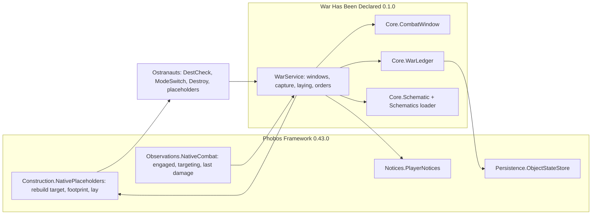
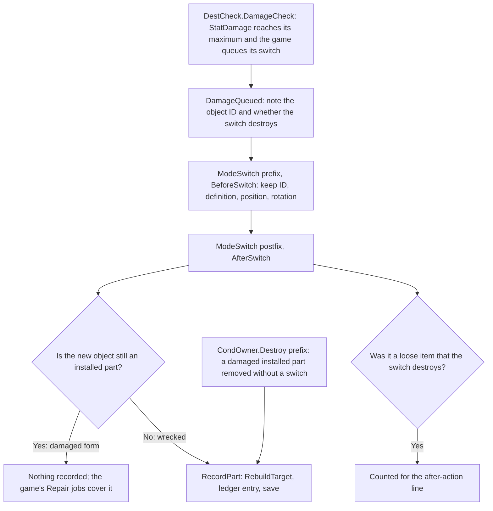
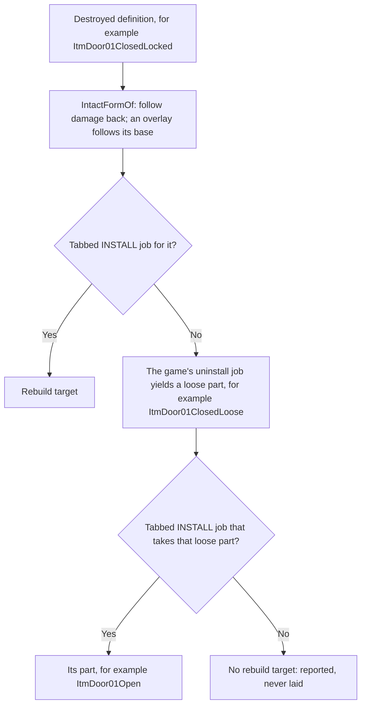
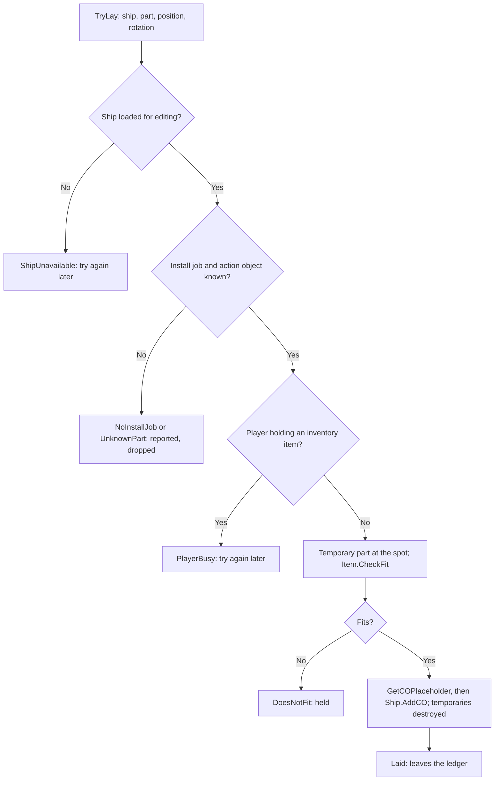

# War Has Been Declared: design and implementation record

Owner request, 29 September 2026: parts destroyed on the player's ship while in
combat should come back as placeholders, vanilla and modded alike, so that
post-battle repair no longer means re-placing the ship tile by tile. Owner
decisions the same day:

- **Combat state:** automatic detection plus a manual Battle stations / Stand down control.
- **Rebuild:** the game's own construction placeholders (native build sites), built
  by the crew with real parts; no free materials.
- **Scope:** placeholders can block pathfinding, so a limited default and a fully
  encompassing mode for players who accept the risk.
- **Follow-up:** what can and cannot be replaced is decided by player-editable
  **schematic files**, so end users can write their own filters.

Player operation is in the [player guide](../war-declared-player-guide.md).

## Engine evidence

Observed in the locally decompiled Ostranauts 1.0.1.5 assembly and its installed
data (not committed; see the repository boundaries). These are engine facts; the
sections after them are our design.

- **No combat mode exists.** The game records `Ship.shipCombatTarget` (saved),
  `Ship.IsInCombatWith(regId)` (the target, or an AI ship's `Combatants` blackboard
  list) and raises `DamageSystem.OnShipTookDamageEvent(regId)` on ray and shallow
  damage. That event is also raised by collisions, explosion shrapnel and personal
  weapons, not only ship weapons. The crew condition `IsInCombat` lasts about half
  a second and is unsuitable as a mode.
- **Destruction runs through a damage-driven mode switch.** `DestCheck.DamageCheck`
  queues the interactions of a definition's `Destructable,StatDamage,<loot>` command
  when `StatDamage` reaches `StatDamageMax`, then subtracts the maximum.
  `Interaction.ApplyEffects` performs `CondOwner.ModeSwitch(coNew, pos)`: intact to
  damaged form, then (for example `ACTDefaultDestroy`) to scrap. The object keeps its
  ID through every switch. Uninstall, dismantle and scrap jobs use other progress
  stats, so they are distinguishable from damage. `ModeSwitch` reads the old
  object's rotation before replacing it; `coNew` carries `IsInstalled` when the part
  still stands.
- **Build sites.** The PDA INSTALL tab uses a `JsonInstallable` (`strInteractionName`,
  `strActionCO`, `strPersistentCO`, `strStartInstall`), checks `Item.CheckFit`, then
  calls `DataHandler.GetCOPlaceholder(part, actionCO, installInteraction)` and
  `Ship.AddCO(placeholder, true)`. When a ship loads, saved `aPlaceholders` records
  are rebuilt from definition names alone through the same call, which is the path
  our code mirrors. `Placeholder.ReTask` offers a Construct task every few seconds.
- **Placeholders block like their part.** `GetCOPlaceholder` gives the placeholder
  the real part's item definition, and adding it to the ship applies that item's
  `aSocketAdds` tile conditions with no placeholder exception. `Tile.IsWalkable`
  refuses wall tiles that are not portals and obstructed fixture tiles, so a wall or
  machine build site blocks walking; a door build site is not a working door.
- **Install coverage.** `Installables.dictJobBuildOptions[tab][strStartInstall]`
  lists INSTALL jobs; `Installables.GetJsonInstallable` searches it. Damaged forms
  have untabbed re-install jobs. Working states (door open/closed/locked, alarm
  colours, switched-on machines) have **no** install job of their own; their
  uninstall job yields a loose part that another state's install job takes
  (`ItmDoor01Closed` uninstalls to `ItmDoor01ClosedLoose`, which `Door01OpenInstall`
  installs as `ItmDoor01Open`). Of 436 native uninstall jobs, 244 act on such a form.
- **Cosmetic overlays.** Many parts (native conduit among them) are `JsonCOOverlay`
  entries over a base definition. `COOverlay.Init` sets the live object's
  `strCODef` to the overlay name; `mapModeSwitches` lists base-form/overlay-form
  pairs used when the base switches.
- **Fit check caveat.** `Item.CheckFit` also measures distance and line of sight
  from the selected inventory item when the player is holding one.

## Framework 0.43.0 services

`Construction.NativePlaceholders` (first consumer this mod; plausible second:
Shipbreaker's reclamation and any future rebuild or blueprint feature):

- `IntactFormOf` builds a reverse damage map from installed definitions whose
  damage switch produces another installed form, preferring the source the damaged
  name extends, otherwise the first by ordinal name; overlays follow their base and
  map back through their own pairs. Scrap and loose products are never traced back.
- `RebuildTarget` returns the tabbed install job's part for a destroyed form: the
  intact form if it has one, otherwise the install job taking the loose part its
  uninstall job yields. Untabbed damaged re-installs are never offered.
- `Footprint` / `TileConditions` classify a part from its item's socket additions
  (`IsWall` or `IsObstruction` anywhere means it blocks).
- `TryLay` mirrors the save-load path: temporary part and action objects, native fit
  check, `GetCOPlaceholder`, `AddCO`, temporaries destroyed. It returns a reason
  (`NoInstallJob`, `DoesNotFit`, `PlayerBusy`, `ShipUnavailable`, …) and never
  throws into the game.

`Observations.NativeCombat` reads `Facts(ship)`: engaged by any ship, own target,
last damage event time this session. It never touches weapons, targets or AI state.

## Content design (War Has Been Declared 0.1.0)

- **Battle window** per player-owned ship (`Core/CombatWindow`): opens on any fact
  or on Battle stations; an automatic window closes after the quiet period
  (default 5 game minutes) from the last activity; a manual window closes only on
  Stand down. After Stand down, a fight the game still lists does not reopen the
  window until that listing clears; fresh damage does.
- **Capture:** a postfix on `DestCheck.DamageCheck` notes IDs whose damage switch
  was queued. A prefix/postfix pair on `ModeSwitch` records an installed part when
  the noted object becomes something no longer installed, with its position,
  rotation and `RebuildTarget`. A prefix on `Destroy` catches damaged installed
  parts removed without a switch, filtered as Framework's bulk-vessel hook is. Loose
  items destroyed by damage are counted for the report. Nothing is blocked.
- **Ledger** (`Core/WarLedger`), saved through Framework `ObjectStateStore` on the
  ship's own `ShipCO` (saved in `JsonShip.shipCO`). A record that cannot be read is
  left untouched and nothing new is saved over it. At most 400 parts per ship.
- **Laying:** when the window closes (or during combat with `LayDuringCombat`),
  pending parts are evaluated by the active schematic in floor-first order: `lay`
  calls `TryLay`, `hold` keeps them for Lay held, `ignore` drops them to the report.
  Not fitting holds; a held inventory item retries; unexpected failures hold after
  three attempts; no install job drops with a report line.
- **Schematics** (`Core/Schematic`): shipped `safe`, `everything` and `hull-only`
  are embedded and also packaged in `mods/PhobosWarDeclared/schematics` as examples;
  player files in `BepInEx/config/PhobosWarDeclared/schematics` override by name.
  First matching rule wins; fields: `parts` (wildcards), `conditions` (starting and
  tile conditions), `menus`, `footprint`. Unknown fields are refused.
- **Controls:** three orders appended in place to every installed navigation-station
  definition (`DefinitionAmendments`), offered only when they would do something;
  F3 `phoboswar` mirrors them. UI code only delegates to `WarService`.

## Diagrams

How the pieces divide, with Framework owning the game-facing lookups and content
owning policy:

The capture pipeline. Nothing here blocks or alters the game's own destruction:

How a destroyed definition becomes a part to lay (`NativePlaceholders.RebuildTarget`):

Laying one build site (`NativePlaceholders.TryLay`), mirroring the game's own
save-load path:

## Deferred: walk-through build sites

A patch could skip obstruction conditions for our own tagged placeholders so they
never block walking. Tile conditions are added and removed as matched counts,
including when placeholders are rebuilt at load through `GetCOPlaceholder`; one
asymmetric path would leave corrupted tile counts in ordinary saves. It needs its
own investigation before any implementation and is not part of 0.1.0.

## Verification and limits

Offline: `tests/PhobosWarDeclared.Tests` (pure rules) and
`tests/PhobosNative.Tests/WarDeclaredNativeChecks.cs` (the game's own
`Installables.Create` over every native install job; at least nine in ten
uninstallable native parts resolve to a tabbed intact install). Neither runs the game.

Pending owner gameplay checks:

- a fight destroying a wall, floor, door and conduit: floor and conduit laid at
  stand-down, wall and door held, Lay held places them, crew build them with loose parts;
- save and reload mid-window keeps held parts;
- crew uninstalling or dismantling during a fight creates no build sites;
- how often non-weapon damage starts battle stations in ordinary play.
