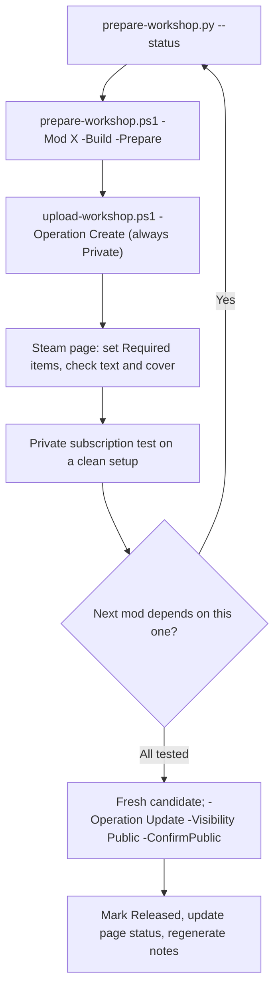

# Preparing and uploading to the Steam Workshop

Two separate steps. **Preparation** (`prepare-workshop.ps1` / `.py`) stages and
checks a candidate offline: no login, no network, safe for agents and CI.
**Upload** (`upload-workshop.ps1`) is run by the owner, who types their Steam
password and Steam Guard code into SteamCMD's own prompt. Uploads are never
part of builds, CI or preparation, and agents do not run them. The owner asked
for an uploader on 29 September 2026; that request is not standing permission
for anyone else to upload, subscribe or change visibility.



## Order and current blockers

Publish dependencies first; `--status` prints the order and each mod's blockers:
Framework, then Agriculture, Auto Nav and Manufacturing, then Shipbreaker. A mod
cannot list a required item that does not exist yet, so its dependencies must be
created first (a private item has an ID and is enough for a private test).

Holds in `config/workshop-publishing.json` as of 29 September 2026:

- **Manufacturing:** first operational release awaiting owner gameplay checks.

Auto Nav's provenance hold was lifted by the owner on 29 September 2026; its
upstream-derived files keep their credit and MIT exclusion (see
[public-release readiness](public-release-readiness.md)). Shipbreaker requires
Auto Nav, so publish Auto Nav before Shipbreaker.

A private upload with `-AcknowledgeHold` may pass a hold or an unpublished
dependency, for the owner's own subscription test; it is recorded in the receipt.
Private items are visible only to their owner. Public or wider visibility never
passes a blocker. A missing cover or a text-limit error cannot be waived.

## Preparation (offline)

```powershell
# Every mod: package freshness, blockers, sizes and order. Read-only.
python scripts/prepare-workshop.py --status

# Build with the saved game path, then stage a candidate.
./scripts/prepare-workshop.ps1 -Mod Framework -Build -Prepare

# Stage an already rebuilt package; re-check a staged candidate.
python scripts/prepare-workshop.py --mod Agriculture --prepare
python scripts/prepare-workshop.py --verify '<candidate directory>'

# Regression tests (no game or Steam account needed).
python -m unittest discover -s tests -p test_workshop_preparation.py
pwsh -File tests/workshop-upload.tests.ps1
```

Each preparation creates a fresh directory under ignored `.local/workshop-staging/`
with `content/`, `manifest.json` and a private `workshop.vdf.draft`. Older
candidates are kept. The manifest records version, title, source commit, dirty-tree
status, operation, required items, blockers, text sizes and SHA-256 hashes of every
file. `uploadEnabled` is always false in preparation output. Exit 1 means validation
failed; exit 2 is invalid arguments. Prepare from a committed tree for anything
beyond a private test: the uploader refuses a dirty candidate for wider visibility.
An uncommitted `config/workshop-publishing.json` alone does not count as dirty:
every upload writes its records there, and the uploader checks the item ID and
uploaded version against the candidate itself.

Checks: native source against the package, required `data/` content, DLLs against
compiled output, translations, permitted payload types, filesystem links, generated
release notes, page title/version, and Steam's text limits. Steamworks accepts a
title under 129 bytes and a description or change note under 8,000 UTF-8 bytes
(`k_cchPublishedDocumentTitleMax`, `k_cchPublishedDocumentDescriptionMax`,
`k_cchPublishedDocumentChangeDescriptionMax` in Valve's
[ISteamUGC documentation](https://partner.steamgames.com/doc/api/ISteamUGC)). The
page check in `workshop-release-notes.py` keeps pages at or below 7,500 bytes so a
small correction does not suddenly block an upload.

Workshop text travels inside a SteamCMD VDF string. Valve does not document its
escape handling, so the tools avoid needing any: text keeps literal line breaks,
paths use forward slashes, and ASCII double quotes and backslashes are refused.
The release-notes generator turns changelog quotes into typographic ones.

## Content layout

The Workshop content root holds native `mod_info.json`, `data/`, artwork and
framework definitions. The mod's plugin folder is `BepInEx/plugins/<ModId>/`;
Framework also carries its pinned Phobos Scope recorder. Package documentation
sits under `documentation/`. The installer ZIP's outer `Mods/<ModId>/` wrapper
must not become the Workshop root.

This follows **EddieSM / EsMM27's BepInEx Workshop bridge**
[documented layout and synchronization](https://github.com/EsMM27/BepInEx_Loader_Ostranauts#readme):
at startup it copies enabled Workshop plugins to
`BepInEx/plugins/Workshop/<item id>/`, and notes that newly copied plugins need a
restart because BepInEx scans plugins before the bridge runs. Our player
instructions therefore say to start the game once and then again after
subscribing or updating. BepInEx itself still needs its normal installation; see
the [author's Workshop page](https://steamcommunity.com/sharedfiles/filedetails/?id=3741030124).

Our plugins find their native folder through the game's own mod list by name
(`DataHandler.dictModInfos`), and translations beside their DLL, so a Workshop
folder under `steamapps/workshop/content/1022980/` should work. That is source
inspection, not a subscription test. Two copies of one Phobos mod (local and
Workshop) must not load together: `scripts/remove-local-mods.ps1` backs up and
removes local copies (see [installing](../installing-mods.md)).

## Uploading (owner only)

One-time setup: install [Valve's SteamCMD](https://developer.valvesoftware.com/wiki/SteamCMD)
yourself (the script never downloads it). The account must own Ostranauts. Pass
`-SteamCmdPath` and `-SteamUser` once; they are remembered in ignored
`.local/workshop-settings.json`. Your password is never an argument.

```powershell
# See the plan without contacting Steam.
./scripts/upload-workshop.ps1 -Mod Framework -Operation Create -SteamUser <account> -SteamCmdPath C:/steamcmd/steamcmd.exe -WhatIf

# Create the item (always Private). SteamCMD asks for password / Steam Guard.
./scripts/upload-workshop.ps1 -Mod Framework -Operation Create

# Later versions of every mod at once: see what is due, then update only those.
./scripts/update-workshop.ps1 -WhatIf
./scripts/update-workshop.ps1 -AcknowledgeHold

# Or one mod: prepare a fresh candidate, then update.
./scripts/upload-workshop.ps1 -Mod Framework -Operation Update

# After a successful private subscription test, from a committed candidate.
./scripts/upload-workshop.ps1 -Mod Framework -Operation Update -Visibility Public -ConfirmPublic
```

### Only real updates

An item is due for an update only when its mod's version differs from the
`uploadedVersion` recorded for it. Every relevant change raises the version
(AGENTS.md), while guide and research edits that leave it alone also change the
packaged documentation; uploading those would only repeat a change note, so they
wait for the mod's next version.

- `update-workshop.ps1` reads the catalogue and every mod's version (`python
  scripts/prepare-workshop.py --pending`) before building anything. It lists each
  mod as up to date, not on the Workshop yet (create those one at a time with
  `-Operation Create`) or due, then builds, prepares and updates only the due mods,
  dependencies first, stopping at the first failure or unrecorded upload. `-Mod`
  limits the check, `-WhatIf` only lists, `-NoBuild` stages packages already in
  `dist/`, and `-AcknowledgeHold` is passed through for held private items.
- `upload-workshop.ps1 -Operation Update` on its own returns without a receipt or
  SteamCMD when that version is already on the item with the same visibility.
  `-Force` sends it again deliberately; a visibility change goes through with a
  warning that Steam will show the same version's change note again.
- An Update keeps the item's recorded `uploadedVisibility` unless `-Visibility` is
  given, so updating a public item never makes it private by accident.
  `-ConfirmPublic` is needed only when an item first becomes public; later updates
  of a public item still need a committed candidate.

What it does, in order:

1. For an Update, stops here if the version is already on the item with the
   chosen visibility (see above).
2. Picks the newest candidate for the mod (or `-Candidate`), re-verifies every
   file hash, and checks it matches the current source version, the catalogue's
   item ID and the requested `-Operation`. A catalogue that already has an ID
   refuses Create; a candidate prepared before an ID was recorded is refused too.
3. Applies the rules above: blockers, Private-only creation, clean tree for any
   wider visibility, `-ConfirmPublic` when an item first becomes Public, and no
   second Create while an earlier one is unresolved.
4. Writes `upload.vdf` (with the chosen visibility) and `receipt.json` under
   `.local/workshop-receipts/<ModId>/<time>-<version>-<operation>/` **before**
   starting SteamCMD. The candidate itself is never modified.
5. Runs `steamcmd +login <account> +workshop_build_item <vdf> +quit` in the same
   console, so SteamCMD's own prompts work. It keeps SteamCMD's fresh log files
   with the receipt.
6. For Create, SteamCMD writes the new item ID back into the VDF (Valve's
   [SteamCMD Workshop guide](https://partner.steamgames.com/doc/features/workshop/implementation#SteamCmd)).
   The script records it in `config/workshop-publishing.json` (commit that). If
   no ID comes back, check your Workshop items on Steam **before** retrying, then:
   `./scripts/upload-workshop.ps1 -Reconcile <receipt dir> -ItemId <id>` or
   `-NotCreated`. A blind retry could create a duplicate.

7. Records the version and visibility it sent as the mod's `uploadedVersion` and
   `uploadedVisibility` in `config/workshop-publishing.json` (commit that): after a Create that returned an
   ID, after an Update whose SteamCMD run exited 0, and on `-Reconcile -ItemId`.
   A failed Update records nothing, so the next change note repeats its versions.

SteamCMD's exit code is not proof of success, so receipts end as
`created-unverified` or `submitted-unverified`. Every upload replaces the Workshop
title, description (from `page.bbcode`), change note and cover with the candidate's;
edit the repository copy, not the Steam page text.

### Change notes

Each upload adds one entry to the item's Change Notes tab. Preparation builds it
from the generated `workshop/<ModId>/releases/<version>.bbcode` of every changelog
version after the item's `uploadedVersion`, up to the current one, newest first,
so versions that were never uploaded on their own still reach players. A first
upload, or one with no recorded version, carries the current version alone (the
page describes the rest). If the combined note would pass Steam's 8,000-byte
limit, the oldest versions are left out and a closing line names them and points
to the CHANGELOG.md packaged with the mod. The manifest lists the versions as
`changeNoteVersions` and `changeNoteOmitted`, and the upload plan prints them. A
candidate prepared before another upload of the same mod was recorded is refused;
prepare a fresh one.

A public upload is the publication itself, so the text it sends says so: the
page's status line, if it starts with Not published, is sent as Public on the
Steam Workshop, and each Draft - not published heading in the change note is sent
as Released with the upload date. A status line already written for a public item
(such as Public since 7 October 2026) is sent as written; private, unlisted and
friends-only uploads send the text unchanged. The candidate and the repository
are untouched; the upload's own `upload.vdf` in the receipt shows exactly what
was sent. Once the item is confirmed live, record it in the repository as below.

### After each upload, on Steam

- Open the item page (the script prints the link). Check the title, description,
  change note, cover and visibility. Accept the Workshop legal agreement if asked.
- **Owner controls → Add/Remove Required Items:** add every item the script
  listed (the BepInEx Mod Loader and the required Phobos items). SteamCMD's VDF
  cannot set these. Never add optional integrations as required.
- Tags and other page fields are set in Steam's editor if wanted.

### Private subscription test

On the owner's machine: close the game, run `remove-local-mods.ps1` for the mods
under test, subscribe to the private items and their dependencies, start the game
twice, then check the MODS screen, `BepInEx/LogOutput.log` and each mod's F3 status
command, and a short gameplay check. Record the result in the changelog's Unreleased
or Draft notes. To return to local builds, unsubscribe and run `install-mods.ps1`.

### Going public

Only after the private test passes and the blockers are resolved: commit, prepare
a fresh candidate, then run the Update with `-Visibility Public -ConfirmPublic`.
Afterwards mark that version **Released** with the real publication date in the
mod's changelog, set the page's Publication status and add the item link, then
regenerate release notes (`python scripts/workshop-release-notes.py --write`) and
commit. See [changelogs and publication records](workshop-publication.md).

### Pulling from Steam

Changes made on Steam itself (a visibility switch or a page edit in Steam's
editor) can be brought back into the repository, the reverse of an upload:

```powershell
# Report each item's live state and what would change; writes nothing.
python scripts/pull-workshop.py --visibility --description --changelog

# Apply, for every item or for chosen mods.
python scripts/pull-workshop.py --visibility --description --changelog --write
python scripts/pull-workshop.py --mod Agriculture --visibility --write
```

- `--visibility` records the item's live visibility as its `uploadedVisibility`,
  so later updates keep it.
- `--description` replaces `workshop/<ModId>/page.bbcode` with the live
  description (line endings normalised). A live page describing a different
  version from the source is not pulled, so it never overwrites a newer page.
- `--changelog` marks the version on a public item (its `uploadedVersion`)
  Released in the mod's changelog, dated by Steam's last update of the item, and
  regenerates its release notes. Other versions are left as they are.

It reads Valve's
[GetPublishedFileDetails](https://partner.steamgames.com/doc/webapi/ISteamRemoteStorage#GetPublishedFileDetails)
Web API method without a key or login, so Steam answers only for items anyone can
see: a private or friends-only item reads as not found and keeps its records. It
also warns when a public item is still held in the catalogue. Pulled pages and
changelogs need their language-ledger rows refreshed before committing. The tool
never uploads, logs in or handles credentials; tests use a stand-in for Steam
(`tests/test_workshop_pull.py`).

## The game's own UPLOAD button (fallback)

Ostranauts 1.0.1.5 has its own uploader (`SteamWorkshopManager`, observed in local
research copies of the game code, which stay out of the repository). A load-order
entry ending in `|edit` shows an **UPLOAD** button on that mod's MODS-screen row.
It uploads the whole folder, takes the title from `strName` and the first
description from `strNotes`, sends `preview.png` and the fixed change note
“Update from game”, writes the new ID into that folder's `mod_info.json`, and sets
no visibility. Pointing an `|edit` entry at a staged `content/` folder would work
but loads a second copy of the mod and gives no receipts, required items or
visibility control. Prefer the script; use this only if SteamCMD is refused for
the account.

## Limits of this tooling

No real upload has been made with it. The fake-SteamCMD tests cover the script's
own rules, receipts and catalogue updates, not Valve's service, account
permissions, BBCode rendering or remote readback. Hashes detect accidental staging
changes, not malicious replacement. A future UGC-based uploader would need a
registered application and is not assumed to be available.
