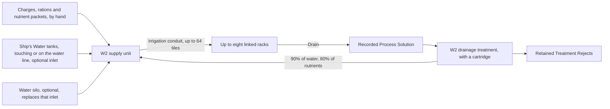

# Fluid networks, treatment and coolant servicing

25 September 2026: Agriculture 0.6.0, Shipbreaker 0.17.0 and Framework 0.20.0.
These are implementation candidates. Automated checks are separate from owner
gameplay evaluation. The versions and installation report identify what was
prepared/delivered; no new Steam publication is implied.

## Multiple racks and retained irrigation lines

Water and nutrients reach the racks through one W2. Drained solution can come
back to the W2 for treatment; nothing returns as drinking water.

**Two different pipes.** Water comes *into* a W2 from a water silo or a Ship's Water
tank through **Process Water Line** (INSTALL), or by the tank touching the W2. Water
and feed go *out* of the W2 to the racks through **Irrigation Conduit**. The two
never join each other: a conduit run from a silo to a W2 does nothing, and the W2's
**Water silo connection** names any conduit lying where the line is needed.

One W2 can explicitly pair with **eight racks** using the existing Pair controls.
An existing saved pair occupies slot zero unchanged. Each rack still accepts one
supplier, chooses its own receiving permission and must match the W2 formulation.
At a rack, Unpair removes that rack's link; at the W2 it removes all links after
the receiving lines are drained and all endpoints are paused. Invalid/future
port records occupy their slots instead of being silently overwritten.

Each connected, receiving branch gets an equal share of the one measured pump
budget. A full/blocked branch cannot consume or delete another branch's cargo;
unused budget remains available for W2 mixing/provider intake. There is still
only one W2 per connected pipe circuit. Use separate circuits for different feeds.

Routes have a 64-tile limit. The authored model uses a 100 kPa rated head and
quadratic resistance: relative flow is `1 / sqrt(1 + tiles / 16)`; modeled
outlet pressure is `100 / (1 + tiles / 16)` kPa. These are **design calculations**,
not measured sensor readings or real pump specifications. Received electricity
and the shared branch budget additionally limit actual work.

Since Agriculture 0.33.0 the conduit **holds what it carries**, about **0.2 kg a
tile** (an authored 16 mm bore of dilute feed at water's density), in each tile's own
record and mass. The W2's pump first fills the pipes of each receiving branch from
its own reservoir, taking water or feed in its own proportions; once the connected
run is full, what the pump pushes in reaches the rack straight away. Filling and
delivery share the same work budget, so filling cannot also fund W2 blending or
refill. A 64-tile run holds about 12.8 kg and takes a few minutes to fill the first
time. Branches that share a trunk share its contents; the trunk fills once.

The pipes keep their contents through damage, route changes and reload; pumping and
receiving still pause after reload, and unloaded time grants no movement. To take
pipe up, right-click it and choose **Drain line into canister** with a Framework drain
canister carried or within two tiles; the run stays closed until **Return line to
service**. A canister of water, or of the W2's own feed, put in the W2's inventory
pours into its reservoir; a canister of any other feed becomes Recorded Process
Solution in the W2's inventory for drainage treatment (Agriculture 0.34.0). After you
change the W2's formulation, the pump flushes the old contents out first when it next
runs a rack: old water back into the W2's reservoir while there is room, old feed (and
water that does not fit) as Recorded Process Solution in its inventory, up to 20 kg an
item; the flush waits if the inventory is full. See
[draining and venting](lines-and-draining.md).

Racks saved by earlier versions may still hold a line parcel from the old model
(0.01 kg a tile, at the rack's service cassette). The W2 delivers it into its rack on
the next powered run, whatever the route now is; until then it counts in the rack's
mass and blocks relinking, as before. Drain at a rack still includes any such
parcel, plus plain water, dry nutrient stock and mixed feed. Clear a living crop
separately when changing crop types. Longer old routes need shortening to the
64-tile limit.

## Recorded drainage treatment

New Drain actions produce **Phobos' Verdemorrow Recorded Process Solution** with
the exact remaining water/nutrient masses in a versioned item record. Older
Process Solution items remain uncharacterized and cannot be treated. Neither
item is potable. Existing residue/reject identities are not reassayed.

1. Pause W2 operation and receiving. Place recorded drainage and one
   **Phobos' Verdemorrow Groundwork Treatment Cartridge** in its Inventory.
2. Queue **drainage treatment** (15 minutes of crew work). The job binds those
   exact two physical supplies. Start the W2 to perform treatment.
3. Treatment suspends distribution and draws up to **0.5 kW**, requiring
   **0.01 kWh per kilogram** of recorded drainage. All electricity heats native
   cabin gas. Power loss pauses progress without creating work credit.
4. Completion recovers **90% of recorded water** into the nonpotable water
   buffer and **80% of recorded nutrients** into dry nutrient stock. Agriculture
   0.7.0 new jobs spend cartridge medium by batch mass, returning unused capacity;
   [treatment economics](development/agriculture-treatment-economy.md) explains the 25 kg rating.
   Older bound jobs still consume their whole 0.05 kg cartridge. Spent medium and
   unrecovered matter become terminal **Retained Treatment Rejects**.
5. If water/nutrient capacity or output space is insufficient, all selected inputs
   remain. Clear space and explicitly restart. A paused job can be cancelled;
   supplies remain physical, and spent electrical work stays heat. After reload,
   restore the exact bound supplies or cancel; substitutes do not inherit work.

These yields, medium, costs and lumped separation/decontamination process are
**authored gameplay abstractions**, not laboratory assays or treatment efficacy
claims. Only the two components our own crop model records are characterized;
unmodeled pathogens, salts and real fertilizer chemistry are not inferred.
There is no potable outlet, no perfect recycling and no conversion of old waste.
Original supply art uses existing native material references at runtime, as the
other agricultural supplies do; no extracted artwork is distributed.

## Optional finite furnace coolant

Existing direct and piped sealed assemblies keep working. While the F6 is cool,
idle and paused in a piped mode, select **Enable finite coolant servicing**.
Place **Phobos' Rivetline Thermal Service Fluid Charges** in Products and load
them locally, one kilogram at a time, up to the furnace's 6 kg reservoir. Since
Shipbreaker 0.58.0 the conduit holds its own coolant, about **0.33 kg a tile**
(an authored 20 mm bore of 1,050 kg/m³ fluid). The pump sends whatever the
reservoir holds above its **5 kg base** into the conduit at 0.1 kg a second until
every conduit tile on the circuit is full; the loop circulates only with a full
circuit and the base charge. Keep loading charges until the status reads *Conduit
full*. No coolant appears when the mode is enabled. Fresh charges are additive
ordinary merchant stock (20 cr each).

This is fictional industrial coolant, not ammonia, drinking water or nutrient
feed. The old hot/cold thermal stores and their heat capacities remain the
authoritative effective assembly model; no second coolant heat store is added or
lost on leaks, and the conduit's coolant carries mass, not heat.

With a full circuit, received pump electricity primes the route over
**0.5 seconds per tile** before circulation. Rated static pressure is modeled as
`200 * min(1, reservoir charge / 5 kg)^2` kPa with a full circuit, 0 otherwise; route flow uses
`1 / sqrt(1 + tiles / 32)`, with actual partial electricity still limiting
circulation. Values are explicitly authored calculations, not new pressure probes.

A broken route or damaged furnace transfers up to **0.001 kg/s** from working
charge into **sealed secondary containment**, bounded by actual remaining fluid.
It resets priming and stops heating when charge/flow is inadequate. Retained
fluid and all existing thermal energy stay accounted for; no fluid is silently
destroyed or injected into the native atmosphere as an invented gas. Restoration
may prime protective cooling, but heating still requires explicit Resume.

Drain a cool idle assembly into retained coolant waste, including its catch tank,
then refill with fresh charges. Local drain remains available on a damaged cool
furnace. Unknown/interrupted service records protect the equipment. Fluid blocks
uninstall, dismantling, unpairing and mode changes; empty it before returning to
legacy sealed mode. Service actions are also available through `phobosfurnace
coolant-managed`, `coolant-fill`, `coolant-drain` and `coolant-sealed`.

The catch tank is a bounded containment abstraction, not an exterior plume,
toxic-atmosphere, fluid boiling or CFD model. No new ammonia species or room
chemistry is introduced. Individual pipe temperature remains outside this
implementation by design.

The conduit's own coolant stays in its tiles through damage, reload and a broken
route. To take conduit up, right-click it and choose **Drain line into canister**
with a Framework drain canister carried or within two tiles; the circuit then
stays closed, and the furnace treats it as a broken route, until **Return line to
service**. A canister of coolant put in the furnace's Products pours into the
reservoir while the furnace is cool, idle and serviceable. See
[draining and venting](lines-and-draining.md).

## Evidence and owner checks

NASA's [2023 water recovery milestone](https://www.nasa.gov/missions/station/iss-research/nasa-achieves-water-recovery-milestone-on-international-space-station/)
describes multistage processing and retained brine. It supports separating
treatment from supply, **not** the W2's selected yields or potable suitability.
Oklahoma State University's [Hydroponics](https://extension.okstate.edu/fact-sheets/hydroponics)
distinguishes open and recirculating culture systems; our recorded remainder
model is much narrower than real solution monitoring and rebalancing.

NASA's [ISS reference guide, November 2010](https://www.nasa.gov/wp-content/uploads/2022/06/508318main_iss_ref_guide_nov2010.pdf)
describes distinct internal/external thermal circuits. NASA's
[Robotic External Leak Locator](https://www.nasa.gov/isam/robotic-external-leak-locator/)
documents the operational significance of coolant leaks. Our fictional fluid,
temperature envelope, pressure law and sealed catch tank are independent
gameplay choices; neither NASA nor Oklahoma State University endorses the mod.
Blue Bottle Games' [Ostranauts](https://bluebottlegames.com/ostranauts) provides the
native placement, power, gas heat, inventory and save mechanisms reused here.

Owner check sequence: two racks sharing one W2; one full rack; a broken route
with a retained parcel; drain and reroute; recorded treatment with/without power,
cartridge and destination space; cancel/reload a bound treatment job; legacy F6
operation; then enable serviced coolant, fill, prime, interrupt the route, inspect
captured leakage, cool, drain and refill. Check mass through damage/repair and
all four rotations. These are gameplay checks to perform, not claimed results.
