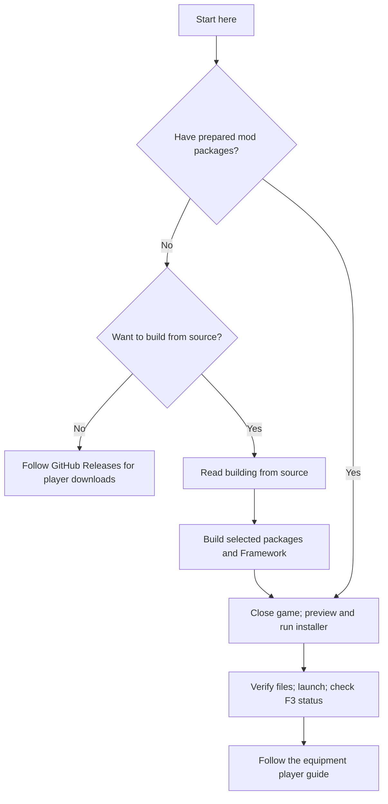

# Getting started

Welcome aboard. Choose individual content mods to suit your ship; Phobos
Framework supplies their shared services.

## Can I download and play today?

**No ready-to-install GitHub release is published as of 25 September 2026.**
The repository contains source and original artwork. Its `dist/` packages are
local build outputs and are not included in GitHub's source ZIP.

For ordinary player downloads, check the
[Releases page](https://github.com/phobos-dthorga/phobos-ostranauts/releases).
An empty page means there is no published package yet. You do not need to learn
to compile mods to follow the project; GitHub's Watch menu can notify you about
releases. There is no Phobos Workshop subscription link supplied here yet.

Comfortable building experimental software? Follow [building from source](building.md).
Clone with submodules: Framework uses the separately maintained Phobos Scope
recorder. Download ZIP omits that dependency.

## What you need

- Your own Ostranauts installation. Current source targets **1.0.1.5**;
  compatibility with other versions has not been established.
- **BepInEx 5**, with **5.4.23.5** as the inspected baseline. Follow the
  [BepInEx Mod Loader author's Ostranauts setup instructions](https://steamcommunity.com/sharedfiles/filedetails/?id=3741030124),
  including one-time setup. Subscription alone does not prove installation.
  The [BepInEx project documentation](https://docs.bepinex.dev/articles/user_guide/installation/index.html)
  explains the loader; do not substitute BepInEx 6 for this build baseline.
- **Windows and PowerShell 7** for the supplied installer and equipment-art
  build workflow. Other operating systems are not supported by these scripts.
- Prepared packages for your selected mods and compatible Phobos Framework.

Then follow [installation and verification](installing-mods.md). Keep your normal
save backups before changing mods. Ordinary saves are supported; there is no
named-test-save requirement for the current suite.

## Choose a first activity

| I want to… | Read this |
| --- | --- |
| Recover materials from detached walls | [Shipbreaker operating sequence](player-guide.md) |
| Process identified residue into metals | [Scrap reclaimer](scrap-reclaimer.md) |
| Manage machines from one workstation | [Industrial console](industrial-console-player-guide.md) |
| Cast aluminium housings | [Electric furnace](furnace-player-guide.md) |
| Approach a target or dock | [Auto Nav](auto-navigate-adaptation.md) and [docking](auto-nav-docking.md) |
| Grow food and cook portions | [Agriculture](agriculture-player-guide.md) |

## What to expect

- **Experimental means unfinished.** Automated checks cover selected rules and
  integrations, not every game situation. Recent machinery, graphics and flight
  features still need gameplay evaluation.
- **Stop / Coast is not emergency braking.** Auto Nav clears thrust; the ship
  keeps moving. Fly stops short; Dock is separate. There is no obstacle avoidance
  or continuous position holding.
- **Processing and receiving are separate permissions.** Both pause after reload.
  Saved links do not grant permission to restart. Auto Nav has a separate
  validated flight-restoration policy; docking suspends.
- **Nothing grants perfect recycling.** Rejects remain, cooling is finite, and
  agriculture consumes inputs. Growth speed, yields and simplified chemistry
  are authored gameplay choices.
- **Manufacturing is not playable machinery yet.** Research pages include ideas;
  prefer current player guides for operating instructions.
- **Updating is not uninstalling.** Do not remove a provider from a save that
  contains its equipment, cargo or jobs. There is no general save-cleanup or
  guaranteed downgrade tool; see [dependency contingencies](dependency-contingencies.md).

## Useful terms

**Framework:** shared mod required by content mods. **BepInEx:** loader for C#
plugins. **Prepared package:** locally built plugin plus native definitions,
artwork and notices. **C1:** industrial console. **F3:** the game's command
console. **Native:** supplied by Ostranauts rather than simulated separately.

Stuck? See [troubleshooting and help](../SUPPORT.md).
