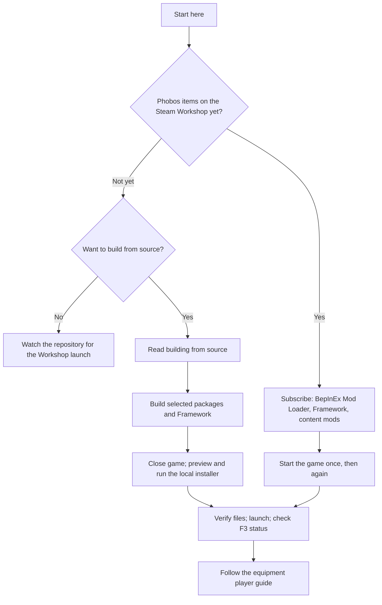

# Getting started

Welcome aboard. Choose individual content mods to suit your ship; Phobos
Framework supplies their shared services.

## Can I download and play today?

**Not as an ordinary download yet.** The mods are being prepared for the Steam
Workshop, which will be the normal way to install them: subscribe, and Steam
keeps them updated. No Phobos Workshop item is published yet; this guide and the
[installation guide](installing-mods.md) will link them when they are.

There is no ready-to-install GitHub release either. The repository contains
source and original artwork; its `dist/` packages are local build outputs and are
not in GitHub's source ZIP. GitHub's Watch menu can notify you about releases.

Comfortable building experimental software? Follow [building from source](development/building.md).
Clone with submodules: Framework uses the separately maintained Phobos Scope
recorder. Download ZIP omits that dependency.

```mermaid
flowchart TD
    Start["Start here"] --> Workshop{"Phobos items on the Steam Workshop yet?"}
    Workshop -->|Yes| Subscribe["Subscribe: BepInEx Mod Loader, Framework, content mods"]
    Subscribe --> Twice["Start the game once, then again"]
    Workshop -->|Not yet| Source{"Want to build from source?"}
    Source -->|No| Wait["Watch the repository for the Workshop launch"]
    Source -->|Yes| Build["Read building from source"]
    Build --> Packages["Build selected packages and Framework"]
    Packages --> Install["Close game; preview and run the local installer"]
    Install --> Verify["Verify files; launch; check F3 status"]
    Twice --> Verify
    Verify --> Play["Follow the equipment player guide"]
```

## What you need

- Your own Ostranauts installation. Current source targets **1.0.1.5**;
  compatibility with other versions has not been established.
- **BepInEx 5**, with **5.4.23.5** as the inspected baseline. Follow the
  [BepInEx Mod Loader author's Ostranauts setup instructions](https://steamcommunity.com/sharedfiles/filedetails/?id=3741030124),
  including one-time setup. Subscription alone does not prove installation.
  The [BepInEx project documentation](https://docs.bepinex.dev/articles/user_guide/installation/index.html)
  explains the loader; do not substitute BepInEx 6 for this build baseline.
- For the local route only: **Windows and PowerShell 7** for the supplied
  installer and build scripts. Other operating systems are not supported by them.
- Your selected mods and a compatible Phobos Framework, from the Workshop or as
  prepared packages. Shipbreaker also requires Auto Nav; its Workshop page lists
  it as a required item, and the local builder/installer include it.

Then follow [installation and verification](installing-mods.md). Keep your normal
save backups before changing mods. Ordinary saves are supported; there is no
named-test-save requirement for the current suite.

## Choose a first activity

| I want to… | Read this |
| --- | --- |
| Recover materials from detached walls | [Shipbreaker operating sequence](player-guide.md) |
| Process identified residue into metals | [Scrap reclaimer](scrap-reclaimer.md) |
| Manage machines from one workstation | [Industrial console](industrial-console-player-guide.md) |
| Cast aluminium housings | [Electric furnace](furnace-player-guide.md) |
| Approach a target or dock | [Auto Nav](development/auto-navigate-adaptation.md) and [docking](auto-nav-docking.md) |
| Grow food and cook portions | [Agriculture](agriculture-player-guide.md) |
| Refine ore, split water into oxygen and hydrogen | [Manufacturing](manufacturing-player-guide.md) |
| Put build sites back where battle damage destroyed parts | [War Has Been Declared](war-declared-player-guide.md) |
| Nurse the injured back to health in a powered sickbay bed | [Medical](medical-player-guide.md) |

## What to expect

- **Experimental means unfinished.** Automated checks cover selected rules and
  integrations, not every game situation. Recent machinery, graphics and flight
  features still need gameplay evaluation.
- **Stop / Coast is not emergency braking.** Auto Nav clears thrust; the ship
  keeps moving. Fly stops short; Dock is separate. There is no obstacle avoidance
  or continuous position holding.
- **Processing and receiving are separate permissions.** Both pause after reload.
  Saved links do not grant permission to restart. Auto Nav has a separate
  validated flight-restoration policy; docking suspends.
- **Nothing grants perfect recycling.** Rejects remain, cooling is finite, and
  agriculture consumes inputs. Growth speed, yields and simplified chemistry
  are gameplay choices made for this mod.
- **Manufacturing is late-game and newly operational.** Its refinery, electrolysis
  cell, Sabatier reactor and stores work, but owner gameplay checks are still
  pending. Research pages include ideas; use the player guides for operation.
- **War Has Been Declared lays build sites, not parts.** The crew still need
  replacement parts and still do the building; unbuilt walls and machines block
  walking, which is why the default schematic holds them. In-game checks are pending.
- **The Ward-3 heals with the game's own medical rest.** It does not dress wounds
  or cure anything by itself yet, and it stops caring when its power or air does.
  Until its own art is made it looks like the vanilla medical bed. In-game checks are pending.
- **Updating is not uninstalling.** Do not remove a provider from a save that
  contains its equipment, cargo or jobs. There is no general save-cleanup or
  guaranteed downgrade tool; see [dependency contingencies](development/dependency-contingencies.md).

## Useful terms

**Framework:** shared mod required by content mods. **BepInEx:** loader for C#
plugins. **Prepared package:** locally built plugin plus native definitions,
artwork and notices. **Workshop:** Steam's mod hosting; subscribing downloads
and updates a mod. **C1:** industrial console. **F3:** the game's command
console. **Native:** supplied by Ostranauts rather than simulated separately.

Stuck? See [troubleshooting and help](../SUPPORT.md).
