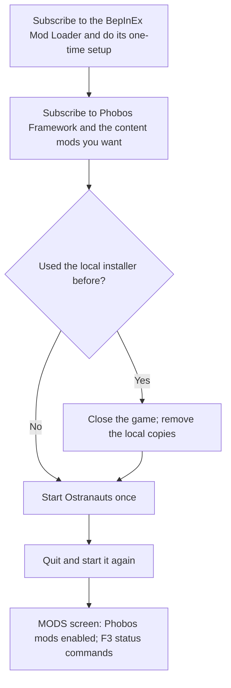

# Installing and updating our mods

Current prepared Shipbreaker requires Auto Nav 0.19.0 and Framework 0.104.0.
Current prepared Agriculture requires Framework 0.110.0 for shared crew work and controls.
Current prepared Manufacturing requires Framework 0.98.0 for room heat, native gas and vessel damage services.
Current prepared War Has Been Declared requires Framework 0.104.0 for the shared build-site and combat-observation services.
Current prepared Phobos Medical requires Framework 0.89.0 for the shared patient services and rectangular equipment.
Current dependency minima come from `config/mod-dependency-minimums.json`,
maintained with the constants updater and runtime requirements. Historical package
compatibility floors remain supported. Build before installation; preview with
`-WhatIf`, then use `-VerifyOnly` to compare installed files; a mismatch names the
differing files relative to the game folder.

**First visit?** Read [getting started](getting-started.md). This installer needs
prepared packages; a GitHub source ZIP does not contain them. No installable
GitHub release is published yet. Developers can [build the packages](development/building.md).

For acquisition and operation after installation, use the
[current player guide](player-guide.md).

There are two ways to install: **Steam Workshop subscriptions** (the route for
ordinary players once the items are published) or the **local installer** below
(for people who build the packages themselves). Use one route per mod, not both.

## From the Steam Workshop

**Not available yet:** no Phobos item has been published on the Workshop. These
steps describe how it will work; the Workshop pages will link the items.



1. Subscribe to EddieSM / EsMM27's
   [BepInEx Mod Loader](https://steamcommunity.com/sharedfiles/filedetails/?id=3741030124)
   and follow its setup instructions, including installing BepInEx 5 if you have
   not already. The loader copies Workshop plugins into place; our mods cannot
   load without it.
2. Subscribe to **Phobos Framework** and each content mod you want. Every Phobos
   Workshop page lists its required items; Shipbreaker also needs Auto Nav.
3. Start Ostranauts once, quit, then start it again. The loader copies new or
   updated plugins while the game starts, after BepInEx has already loaded, so
   they only run from the next start. Do the same after each Phobos update.
4. On the **MODS** screen, check the Phobos mods are enabled. In the F3 console,
   `phobosframework status` and each mod's status command report what loaded.

Steam downloads updates for you. Keep required mods subscribed while a save uses
their equipment, cargo or jobs, and back up saves before changing mods.

### Switching from local copies to the Workshop

Two copies of the same Phobos plugin must not load at once. Close the game, then
remove the locally installed copies of the mods you now subscribe to:

```powershell
./scripts/remove-local-mods.ps1 -Mods Framework,AutoNav,Shipbreaker -WhatIf
./scripts/remove-local-mods.ps1 -Mods Framework,AutoNav,Shipbreaker
```

It removes only `Ostranauts_Data/Mods/Phobos…` and `BepInEx/plugins/Phobos…`
for the named mods, plus their load-order entries. Workshop subscriptions, other
mods, saves and settings stay as they are. Each removed file is first copied to
`.local/installations/<time>-removed/` and checked. To go back to local copies,
unsubscribe on Steam and run the installer below for the same mods.

## From prepared packages (local installer)

Close Ostranauts, then double-click **`Install or Update Mods.cmd`** in the
repository root. It installs or updates the latest **prepared packages** for
Phobos Auto Nav and Phobos Shipbreaker. Use the same launcher for subsequent
updates. PowerShell 7 is required; the launcher leaves its result visible.

Shipbreaker **0.22.0+ also requires Auto Nav 0.16.0+**. Selecting Shipbreaker
includes its Auto Nav package automatically, including `-PackagePath` overrides
(the dependency comes from `PackageRoot`). The installer rejects an older Auto
Nav package before copying anything. `build-shipbreaker.ps1` prepares Auto Nav
and Framework first. Preview-only artwork updates retain their existing scope.
See [selected-G4 capture](development/shipbreaker-capture.md) for controls and current limits.

Shipbreaker **0.1.5+ also selects Phobos Framework automatically**. Its prepared
package must be available beside the content packages. Building Shipbreaker
prepares both packages. Shipbreaker 0.6.1 and Auto Nav 0.2.0 require Framework 0.6.0+ and are
independent of OCF/SWB; see the [migration guide](development/phobos-framework.md).

The installer finds Ostranauts through Steam's library records and remembers
successful installation paths in `.local/install-settings.json` (ignored by Git).
It uses `Ostranauts_Data/Mods/loading_order.json` by default. For a customised
native Mods location, supply the actual load-order file on the first run:

```powershell
./scripts/install-mods.ps1 -OstranautsPath '<game folder>' -LoadOrderPath '<configured Mods folder>/loading_order.json'
```

Explicit paths override saved paths. If Steam has more than one Ostranauts
installation, select one with these arguments. Filesystem links/junctions in our
package or installation destinations are rejected; supply direct paths.

## Using the same script from a terminal or Codex

Run these from the repository root in PowerShell 7. Codex can use these commands
directly without interacting with your mouse or opening a launcher window.

```powershell
# Install/update both current mods.
./scripts/install-mods.ps1

# Install/update just one.
./scripts/install-mods.ps1 -Mods AutoNav
./scripts/install-mods.ps1 -Mods Shipbreaker

# Update Shipbreaker while retaining the existing compatible Framework files.
./scripts/install-mods.ps1 -Mods Shipbreaker -KeepInstalledFramework

# Agriculture is opt-in and automatically includes Framework.
./scripts/install-mods.ps1 -Mods Agriculture

# Manufacturing (refinery, electrolysis cell and hydrogen store) is opt-in and
# includes Framework; add Shipbreaker for its steel charge and water silo.
./scripts/install-mods.ps1 -Mods Manufacturing
./scripts/install-mods.ps1 -Mods Shipbreaker,Manufacturing

# War Has Been Declared (battle-damage build sites) is opt-in and needs only Framework.
./scripts/install-mods.ps1 -Mods WarDeclared

# Phobos Medical (the Halewright Ward-3 medical bed) is opt-in and needs only Framework.
./scripts/install-mods.ps1 -Mods Medical

# Keep an older Manufacturing 0.0.1 scaffold out of the loader without installing 0.1.0.
./scripts/install-mods.ps1 -Mods AutoNav,Shipbreaker,Agriculture -HoldManufacturing

# Explicitly select all five current mods.
./scripts/install-mods.ps1 -Mods Framework,AutoNav,Shipbreaker,Agriculture,Manufacturing -WhatIf
./scripts/install-mods.ps1 -Mods Framework,AutoNav,Shipbreaker,Agriculture,Manufacturing
./scripts/install-mods.ps1 -Mods Framework,AutoNav,Shipbreaker,Agriculture,Manufacturing -VerifyOnly

# The shared library alone, for another consumer or development.
./scripts/install-mods.ps1 -Mods Framework

# Preview without changing anything, even while the game is running.
./scripts/install-mods.ps1 -WhatIf

# Compare installed files and enabled load-order entries with the packages.
./scripts/install-mods.ps1 -VerifyOnly

# Apply just menu/Workshop cover images to already installed mods.
# Defaults still select AutoNav, Shipbreaker and their Framework dependency.
./scripts/install-mods.ps1 -PreviewsOnly -WhatIf
./scripts/install-mods.ps1 -PreviewsOnly
./scripts/install-mods.ps1 -PreviewsOnly -VerifyOnly
```

Approach Assist is retired and no longer offered by the installer. Installing
Auto Nav 0.28.0 or later also archives the old prototype plugin folder
(`BepInEx/plugins/PhobosApproachAssist`) when its only file is the recorded 0.1.2
build: that build was still loading beside Auto Nav and its patches ran every
frame. Any other file in that folder stops the update for inspection; previews and
`-VerifyOnly` report the prototype as still installed.
Manufacturing 0.1.x is an ordinary operational package; see its
[player guide](manufacturing-player-guide.md). Installing it also installs
Framework and refuses a Framework older than the maintained minimum; it checks
that the package carries its explosion definitions, equipment names and every
sprite before copying anything, and adds a reminder when Shipbreaker is not part
of the same run (Shipbreaker is optional and only adds the refinery's steel charge).
If an earlier development install
left the 0.0.1 scaffold plugin behind and you do not want 0.1.0 yet,
`-HoldManufacturing` backs up and removes that DLL from the loader
directory after checking its identity and verifying the backup. Its native entry
must already be disabled or absent; native files and other plugin files remain
untouched. The receipt records the backup. This option rejects other assemblies
or versions and cannot be combined with selecting Manufacturing or `-PreviewsOnly`.
`-KeepInstalledFramework` validates the installed Framework version, assembly,
recorder, required files and enabled load-order entry, then retains its files.
Packages built since the data-pack rounds carry `phobos-package.json` next to
`mod_info.json`; the installer refuses a package whose files do not match it.
It does not compare that dependency with the newly prepared Framework build.
The ordinary default still updates the dependency from its prepared package.
The five suite covers are native `preview.png` files; their
[artwork and integration notes](../assets/workshop/README.md) explain the shared
mod-menu/Workshop path. `-PreviewsOnly` changes only covers, retains installed
versions and disabled/enabled states, and refuses mods not already installed.
It still requires Ostranauts to be closed for writes. Agriculture's and
Manufacturing's prepared packages include their covers, but this option does not
install either mod itself.
Installing AutoNav does not remove that old plugin or enable original Auto
Navigate. AutoNav still enforces its runtime navigation-conflict checks.

## What an update does

- Checks **all selected packages** before copying any of them: required data and
  artwork, readable JSON, matching native/plugin versions and assembly identity.
- Places each own DLL in `BepInEx/plugins/Phobos…/` and its native definitions,
  artwork and included native notices in the configured Mods folder.
- Maintains one shared Phobos Framework provider. Extra copies outside its own
  folder stop the update. A newer installed framework is not automatically
  downgraded: supply an equal or newer prepared framework package before retrying.
  Framework alone has no OCF/SWB requirement. Auto Nav 0.2.0+ also selects it.
- Enables selected native entries in place or appends new entries. Existing
  unrelated entries, disabled mods and other load-order settings stay intact.
- For Shipbreaker 0.6.0+ and Auto Nav 0.2.0+, requires our Framework 0.6.0+ and both current native
  packages. OCF/SWB presence, age or load order do not gate this version. Legacy
  packages before 0.2.0 retain their original dependency checks.
- Backs up and replaces our former OCF recipe file with an empty migration stub;
  active recipes move to `framework/recipes.json`. A nonempty old-format pack in
  the new candidate is rejected before any copy. No other author's pack is changed.
- Skips matching files, checks copied files with SHA-256 and reads back the
  load order. A second identical run changes no game files.
- Before replacement, backs up changed existing files and the original load
  order under `.local/installations/`. Writes a recovery receipt before copying,
  including which destination files are new, then marks it verified on success.

Phobos plugin assemblies and native metadata must have matching versions.
BepInEx enforces the declared minimum provider version; startup checks validate
the native definitions actually used. A successful install is not an in-game
compatibility test.
The installer enforces Framework 0.22.0 or newer for Shipbreaker 0.20.0+ and
Agriculture 0.9.0+, and Framework 0.21.2 or newer for Auto Nav 0.14.1+.
Older package versions retain their historical dependency thresholds.

The installer refuses actual updates while Ostranauts is running. Close it
normally and run again. It never stops the game, launches it, accesses saves,
changes player settings or overwrites original game data. File removal is limited
to the explicitly requested held-scaffold operation described above and to retired
files: when a later package stops shipping a file, list it with its SHA-256 in
`config/retired-installed-files.json`. The installer then backs the matching
installed file up under `.local/installations/`, records it in the receipt as a
retired file and removes it; previews and `-VerifyOnly` report it as still installed.
A file whose content differs from the recorded hash is treated like any other extra.
An entry with a `folder` names the folder of a retired mod that the listed mod
superseded; its listed files are archived when that mod is installed and the
emptied folder is removed.
Unexpected extra files in our destination folders stop an update for inspection,
so obsolete code and user additions are not silently retained or deleted.

If copying fails, **keep the game closed** and retain the reported backup folder.
This is not a transactional installer and does not automatically roll back.
Its receipt records intended targets and prior existence; previous contents and
`loading_order.before.json` support inspection and recovery. Use the receipt to investigate or [ask for help](../SUPPORT.md)
before launching. Do not treat these snapshots as verified gameplay
rollback versions; see [dependency contingencies](development/dependency-contingencies.md).

## Where updates come from

Packages are read from `dist/PhobosAutoNav-P0`, `dist/PhobosShipbreaker-P0` and,
when required or selected, `dist/PhobosFramework-P0`.
Each prepared package includes `player-guide.md` and the equipment/material guides
it links directly, alongside the mod-specific `README.md`. These describe the
prepared versions; the status commands establish what is loaded in the game.
The installer does not rebuild source code, download releases or alter Workshop
subscriptions; `remove-local-mods.ps1` above is the separate way to take local
copies out before subscribing. After code or artwork changes, Codex should run the corresponding
existing build script, then this installer. A missing package reports that step.
`-PackageRoot` selects another prepared-package directory; `-PackagePath` selects
one unpacked package when exactly one mod is selected. These overrides are not
saved. `-NoRememberPaths` suppresses saving machine paths, useful for fixtures.
For a Shipbreaker `-PackagePath` override, the automatically required Framework
package still comes from `-PackageRoot`; the override is not applied to both mods.

## Installer checks

```powershell
./tests/install-mods.tests.ps1
```

The checks use temporary installations under `.local/script-tests/`, prepared
packages, and a read-only copy of the installed Crafting Framework DLL. Supply
`-FrameworkDllPath` to the multi-mod tests if it cannot be found automatically.
They exercise fresh and repeated installs, file repair/backups, complete preflight
before a multi-mod update, artwork preservation, dependency/order failures,
running-game refusal, custom paths and junction refusal. They never write into
the real game installation or perform gameplay tests.
