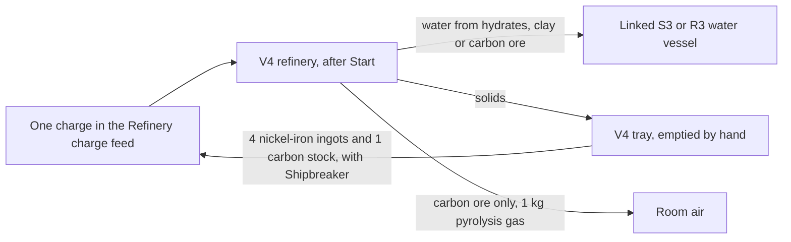
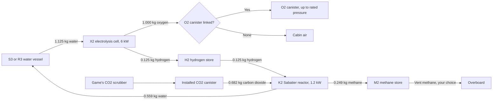
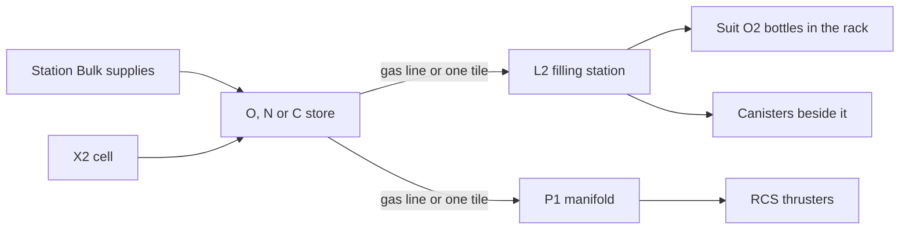

# Refinery, electrolysis, Sabatier reactor, gas stores, canister filling, cabin air and RCS propellant

Use the [current versions and dependency requirements](installing-mods.md);
Phobos Framework is required at the version listed there. Implemented and checked offline; owner
gameplay checks are pending, including how the artwork looks in play.
Shipbreaker 0.38.0 or newer is optional: it adds the steel charge and its S3
water silo.

## Equipment

This is late-game plant: priced alongside the game's own radars, heavy lift
rotors and missile launchers, below a fusion reactor. Save up for it.

| Item | Size and mass | Base price | Where |
| --- | --- | --- | --- |
| Phobos' Fennmark V4 Volatiles Refinery | 4 x 4 tiles; 180 kg; two power points; 24 kW working | 64,000 cr, broken 16,000 cr | K-Leg supply kiosk (broken) and fixer (worn), San Diego Halvorson (new), the Venus scrap kiosk (broken and refurbished) and the regional supply kiosks, in lots of eight; INSTALL > APPS. Purchase only. |
| Phobos' Fennmark X2 Chemical Processor | 2 x 2 tiles; 130 kg; one power point; 6 kW working | 38,000 cr, broken 9,500 cr | The same sellers; INSTALL > APPS. Purchase only. |
| Phobos' Fennmark H2, H3 and H4 Hydrogen Stores | 2 x 2, 3 x 3 and 4 x 4 tiles; 160, 305 and 450 kg empty; hold 24, 59 and 115 kg of hydrogen | 22,000, 35,790 and 50,540 cr | The same sellers; INSTALL > APPS. Purchase only. |
| Phobos' Fennmark K2 Sabatier Reactor | 2 x 2 tiles; 150 kg; one power point; 1.2 kW working | 44,000 cr, broken 11,000 cr | The same sellers; INSTALL > APPS. Purchase only. |
| Phobos' Fennmark M2, M3 and M4 Methane Stores | 2 x 2, 3 x 3 and 4 x 4 tiles; hold 160, 395 and 770 kg of methane | 21,000, 34,160 and 48,250 cr | The same sellers; INSTALL > APPS. Purchase only. |
| Phobos' Fennmark O2, O3 and O4 Oxygen Stores | 2 x 2, 3 x 3 and 4 x 4 tiles; hold 340, 840 and 1,630 kg of oxygen | 21,000, 34,160 and 48,250 cr | The same sellers; INSTALL > APPS. Purchase only. |
| Phobos' Fennmark N2, N3 and N4 Nitrogen Stores | 2 x 2, 3 x 3 and 4 x 4 tiles; hold 300, 745 and 1,440 kg of nitrogen | 20,000, 32,530 and 45,950 cr | The same sellers; INSTALL > APPS. Purchase only. |
| Phobos' Fennmark C2, C3 and C4 Carbon Dioxide Stores | 2 x 2, 3 x 3 and 4 x 4 tiles; hold 470, 1,160 and 2,260 kg of carbon dioxide | 20,000, 32,530 and 45,950 cr | The same sellers; INSTALL > APPS. Purchase only. |
| Phobos' Fennmark L2 Canister Filling Station | 2 x 2 tiles; 120 kg; one power point; 3 kW working | 26,000 cr, broken 6,500 cr | The same sellers; INSTALL > HVAC. Purchase only. |
| Phobos' Fennmark A2 Cabin Air Regulator | 2 x 2 tiles; 60 kg; one power point; 0.1 kW | 23,000 cr, broken 5,750 cr | The same sellers; INSTALL > HVAC. Purchase only. |
| Phobos' Fennmark P1 RCS Propellant Manifold | 1 x 1 tile; 10 kg; passive | 24,000 cr, broken 6,000 cr | The same sellers; INSTALL > HVAC. Purchase only. |
| Phobos' Fennmark Gas Line | 1 tile per segment; 1 kg | 3 cr | K-Leg supply kiosk and fixer, Halvorson and the Venus scrap kiosk, in lots of 128; INSTALL > HVAC. |

Every store's broken price is a quarter of its price. The medium and large
stores are too big to turn up in salvage; buy them.

Selling one back works like the game's other high-value salvage: the K-Leg
fixer buys an intact machine, the Venus scrap kiosk buys intact or broken, and
the K-Leg supplies kiosk does not buy them. About one engineering-salvage find
in twenty is a Fennmark machine, usually broken. Repairs need real components
(motors, mainboards, heat sinks and, for the V4, a screen); see the
[equipment economy](equipment-economy.md#manufacturing-011-late-game-plant).

Ores are mined, never bought. Clay hydrates chunks come from dark rock: C-class
deposits and dark regolith walls give one about as often as one C-class find in
ten, in place of some of the silicates they would otherwise give. Stations sell bulk oxygen, nitrogen and carbon
dioxide through the refuelling kiosk's **Bulk supplies** view, straight into an
installed store of that gas, at the kiosk's own price per kilogram. Nothing
sells back.

## What the refinery makes

Load **one charge** at a time. Every charge conserves mass: what comes out is
what went in, sorted.

| Charge | Gives | Time at 24 kW |
| --- | --- | --- |
| 1 hydrates block (10 kg, mined) | 1 kg of water into the linked vessel; 3 gangue (3 kg each) in the tray | 10 min |
| 1 clay hydrates chunk (10 kg, mined; new) | 2 kg of water; 1 anhydrous residue (8 kg) | 15 min |
| 1 carbon/carbides block (10 kg, mined) | 5 carbon stock (1 kg each); 1 kg of water; 1 gangue; **1 kg of pyrolysis gas breathed into the room** (CO2, CO and smoke) | 30 min |
| 1 meteoric iron block (20 kg, mined) | 4 nickel-iron ingots (4 kg each); 1 gangue; 1 refinery slag (1 kg) | 40 min |
| 4 nickel-iron ingots + 1 carbon stock (Shipbreaker only) | 4 Rivetline steel ingots (4 kg each); 1 steel melt remainder (1 kg) | 33 min |

Every charge sorts into three places: solids to the tray, water to the linked
vessel and, for carbon ore only, gas into the room. Tray products can go back in
as the steel charge.

Refining loses money against selling the ore whole (four ingots are worth 96 cr;
the iron block 450 cr), and carburising loses a little more (four steel ingots
are worth 100 cr; the four nickel-iron ingots and carbon that make them, 106 cr).
Only the machines are late-game priced; ingots, carbon, ore and remainders keep
ordinary raw-material prices.
What you gain is material aboard, away from stations.

## Set up

1. Install the V4 on intact floor and connect both power points. Give it a
   room with a scrubber if you will roast carbon ore.
2. For the water charges, install a water vessel within one tile of the V4:
   a Shipbreaker S3 process water silo or an Agriculture R3 reservoir, touching
   or with one tile between them, diagonal included. Right-click the V4, choose
   **Control Panel**, open **Connections** and pick the vessel under **Water
   vessel**. Apply. The C1 console offers the same field.
3. Right-click the V4 and choose **Inventory**. The tray opens, and the
   **Refinery charge** feed opens as its own window. Put one ore block or clay
   chunk in it (right-click a stack to place one), or four nickel-iron ingots
   and one carbon stock. It holds six units and refuses ice, regolith, gangue,
   scrap and anything stacked, with the reason.
4. On the panel choose **Start**. The refinery binds the exact charge in the
   feed, works for the time above, then puts the solids in its tray and the
   water in the linked vessel, and looks for the next charge. **Pause** keeps
   the bound charge and its progress; **Cancel** leaves the units in the feed
   and forfeits the work.

A water charge waits until the linked vessel can take its whole yield; the
panel says why (no vessel, full, damaged, held, catch chamber, out of reach)
and rechecks every few seconds. The tray must have room for every product or
the charge waits with that reason. Empty the tray by hand.

## The electrolysis cell

Each one-hour cycle at 6 kW splits 1.125 kg of water into 1.000 kg of oxygen
and 0.125 kg of hydrogen.

1. Install the X2 within one tile of a water vessel and of an H2 store, and
   connect its power point.
2. Open its **Control Panel** > **Connections**. Pick the vessel under **Water
   vessel** and the store under **Hydrogen store**. Under **Oxygen to**, pick an
   installed O2 canister within one tile, or leave **None**: the oxygen then
   goes into the cabin air.
3. Choose **Start**. The cell draws a cycle's water into its hold when the
   vessel offers it above its reserve, then runs. At the end of the cycle the
   oxygen goes into the canister (up to its rated pressure) or the room, and
   the hydrogen into the store. It runs only while every output has room: a
   full canister or store makes it wait, with the reason.

**Pause** keeps the held water and the cycle's energy. **Cancel** forfeits the
cycle's energy; the held water stays for the next cycle. A damaged canister is
refused: repair or replace it.

## The Sabatier reactor

The K2 closes the oxygen loop. Each one-hour cycle at 1.2 kW takes 0.125 kg
of hydrogen (exactly one X2 cycle's output) and 0.682 kg of carbon dioxide and
makes 0.559 kg of water and 0.249 kg of methane: CO2 + 4 H2 -> CH4 + 2 H2O.
With the X2, about half the water the cell splits comes back, the rest leaves
as the hydrogen in the methane. That is how NASA's ISS system works too.

Here is the whole loop, per one-hour cycle of each machine. Every vessel,
canister and store is linked on the machine's panel and sits within one tile.

1. Install the K2 within one tile of an H2 store, an installed CO2 canister,
   a water vessel (S3 or R3) and an M2 methane store, and connect its power
   point. One vessel can serve a refinery, an X2 and a K2 at once.
2. Fill the CO2 canister with the game's own CO2 scrubber: that is where the
   crew's breathing CO2 ends up, and nothing else in the game empties it.
3. Open its **Control Panel** > **Connections** and set **Hydrogen from**,
   **CO2 canister**, **Water to** and **Methane to**. Apply, then **Start**.
4. At the start of each cycle it draws the hydrogen and CO2 into its own hold;
   at the end the products go to their vessels, and the next cycle starts only
   when they have. A short input or a full output makes it wait, with the reason.

The reaction gives off heat: with its electricity, about 2.3 kW goes into the
room while it works, and it waits for the room to cool at 40 C. Pause keeps
held gas, made products and progress; Cancel forfeits only the cycle's energy.

## Gas stores

Every gas store comes in three sizes: small (2 x 2), medium (3 x 3) and large
(4 x 4). A bigger store holds more for less per kilogram of capacity. Pick the
gas by colour: olive methane, dark grey hydrogen cylinders, green oxygen, blue
nitrogen and pale grey carbon dioxide, like the game's own canisters.

| Gas | Filled by | Used by |
| --- | --- | --- |
| Hydrogen (H) | an X2 | a K2, the RCS through a P1 |
| Methane (M) | a K2 | the RCS through a P1 |
| Oxygen (O) | an X2 (set the store as its oxygen destination), Bulk supplies | an A2 (cabin air), an L2 (canisters and suit bottles), the RCS |
| Nitrogen (N) | Bulk supplies | an A2 (cabin pressure), an L2 (RCS and air-pump canisters), the RCS |
| Carbon dioxide (C) | Bulk supplies | a K2 (set the store as its CO2 source), an L2, the RCS |

Each store's panel shows the kilograms held and every machine linked to it.

- **Vent overboard** (or `vent <id> <kg>` on the console) discharges gas.
- **Pour into** moves everything that fits into another store of the same gas,
  within one tile or along a gas line (or `transfer <id> <other id>`). Use it
  to move a small store's contents into a large one when you upgrade.

Empty a store before uninstalling or dismantling it; both refuse while it
holds gas.

## Canister filling station

The L2 tops up the game's own gas vessels and stops at a safe **99%** of their
rated pressure, even at fast-forward. The game's air pump has no cut-off, which
is how suit bottles burst.

1. Install the **L2** through INSTALL > HVAC and run conduit to it.
2. Put suit **O2 bottles** in its rack (right-click, **Inventory**; four cells).
3. To fill canisters, install O2, N2 or CO2 canisters on tiles next to it and
   add each under **Add a canister**. They start as **Fill it**.
4. Add **oxygen, nitrogen or carbon dioxide stores** under **Add a store**,
   within one tile or along a gas line, and switch each **On**. A linked
   canister set to **Draw from it** can be the source instead.
5. Choose **Mode**: **Fill**, or **Decant** to empty bottles and canisters back
   into their stores. Press **Start**.

**Keep suit bottles charged** (right-click the installed L2; choose it again to
stop) hands the bottles to your crew. Crew with the Haul duty bring suit O2
bottles below 90% from around the ship (the deck, unlocked containers and other
machines' trays) into the rack and press Start. They never take a bottle from
anyone's suit or hands, from a locked container or from another L2's rack.
Choose a destination store in the Crew panel and they carry charged bottles
there; otherwise charged bottles wait in the rack. Link the stores and keep the
station in Fill mode yourself: the order only loads, unloads and starts it.

It works one vessel at a time, from a store first and a source canister
second, and waits when everything is full (or empty, when decanting). It draws
3 kW while working. Compressing the gas costs about 0.06 kWh per kilogram of
oxygen into a canister, so a full canister takes several hours and a suit
bottle about a minute. All of that electricity ends up as heat in the room.

## Cabin air regulator

The A2 keeps one room breathable from your bulk stores, so oxygen from an X2 or
a station reaches the crew without a canister or an air pump in between.

1. Install the **A2** in the room it should look after, through INSTALL > HVAC,
   and run conduit to it. It reads the room it stands in.
2. Put an **oxygen store** within one tile or lay gas line to it, and choose it
   under **Oxygen store**. For pressure, do the same with a **nitrogen store**.
3. Choose the **Oxygen set point** (19, 21 or 23 kPa; the game counts 20 kPa
   and above as good air) and the **Pressure set point** (80, 90 or 101 kPa, or
   **leave alone**). Press **Switch on**.

Every couple of seconds it adds oxygen until the room reaches its set point,
then nitrogen until the room reaches its pressure: up to 6 kg of oxygen and
12 kg of nitrogen an hour. It only adds gas. It never vents, never scrubs
carbon dioxide and never cools, so keep the game's scrubbers running. It keeps
working after a reload, like the game's own air pumps.

- It stops feeding a room below **10 kPa**: that room is open to space, and
  the crew log says so once. Seal it and the regulator carries on.
- It never lets oxygen pass **30%** of the room's air, because rich air makes
  any fire worse.
- The panel shows the room's oxygen and pressure, both stores and how much it
  has added so far.

## RCS propellant

Your RCS thrusters can burn the gas in your hydrogen and methane stores. The
game's thrusters push the same per kilogram whatever gas they get; Phobos
Framework gives each gas its real cold-gas worth instead:

| Gas | Push per kilogram, nitrogen = 1 | A full store |
| --- | --- | --- |
| Hydrogen (H2 store) | about 3.7 | 24 kg, as good as about 88 kg of nitrogen |
| Methane (M2 store) | about 1.45 | 160 kg, as good as about 232 kg of nitrogen |
| Nitrogen (the game's canister) | 1 | 375 kg |
| Oxygen, carbon dioxide (the game's canisters) | 0.94, 0.90 | slightly less than nitrogen |

1. Install a **P1 RCS Propellant Manifold** where a gas canister would go: on
   one of an RCS Intake Regulator's gas-input tiles. Rotate it so its line port
   (the amber stub) faces away from the regulator.
2. Put a gas store of any size within one tile of it, or lay **gas line** from
   the store's line port to the manifold's. The line is its own family; it
   never joins coolant or irrigation lines.
3. Open the manifold's **Control Panel** > **Connections**: add the store, set
   it **On**, choose **Draw order** (**Manifold first** burns the stores before
   the regulator's canisters; **Canisters first** keeps the stores as a
   reserve), and set **Feed** **On**. Everything starts switched off, so no
   methane or Sabatier hydrogen is burned by surprise.

The panel shows each store's kilograms and their nitrogen-equivalent, and the
total ready for the thrusters. Auto Nav's fuel and delta-v readings, and the
game's own, count every gas in nitrogen-equivalent kilograms, so a methane store
shows as more fuel than its weight. A ship that only uses nitrogen flies exactly
as before. Draws settle into the stores every couple of seconds and before a
save; station refuelling still fills only the game's own nitrogen canisters.

## The hydrogen store

The hydrogen stores are passive: no power, no cargo, no inventory. Hydrogen has
no game gas, so it only ever leaves by the X2, the K2, the P1, a vent or a leak
to space.

## After a reload

The V4, X2, K2 and L2 pause after every reload and keep their bound charge,
holds, links and progress. Press **Start** to continue. The K2 keeps the gas it holds and any
products it has made; it delivers waiting products first and starts a new cycle
only once they have gone to their vessels. A bound steel charge on a ship whose
Shipbreaker has been removed is kept and reported, never overwritten; Cancel
releases it.

## Dangers

- **Roasting carbon ore fouls the air.** The V4 breathes 1 kg of CO2, CO and
  smoke into its room over the charge. The game's own Smoke and CO2 alarms,
  poisoning and scrubbers apply: run a CO/smoke scrubber and a CO2 scrubber in
  that room, or vent it afterwards. The charge waits if the room is below
  10 kPa or above 40 C.
- **Hot machines warm the room.** The V4 puts 3.6 kW into its room while
  working, the X2 about 1.1 kW. Both wait for the room to cool at 40 C. A
  nickel-iron or steel **melt that waits longer than its own run freezes**: the
  charge finishes as slag with the same mass, and the log says so.
- **Oxygen into the cabin raises the fire risk.** With no canister linked, the
  X2 raises the room's oxygen partial pressure; the game's fires spread more
  readily in rich air. Link a canister.
- **Methane leaks into the room.** A damaged M2 leaks about 2 kg an hour of
  the game's own methane gas into its room until repaired; it crowds out the
  air. With oxygen and a fire, a working V4 or a sparking device, the store's
  contents burn instead: 4 kg of the room's oxygen and 2.7 kg of CO2 left behind
  per kilogram of methane, with the game's own explosion.
- **An A2 set high makes the air richer.** At 23 kPa of oxygen in a thin room
  the oxygen share climbs, up to the regulator's 30% cap; fires spread more
  readily. Its nitrogen does the opposite if the oxygen store runs dry: the
  room keeps its pressure while its oxygen falls. Watch the panel.
- **Oxygen, nitrogen and carbon dioxide stores leak into the room.** A damaged
  store leaks about 2, 3 or 4 kg an hour by size until repaired. Oxygen makes
  any fire worse, nitrogen thins the air without warning, and carbon dioxide
  poisons. A destroyed store releases everything it held into the room.
- **A damaged reactor dumps its gas.** The CO2 and methane in a K2's hold go
  into the room; its hydrogen burns by the rule below if it can, otherwise it
  escapes. The water stays in the reactor until you repair it.
- **Hydrogen burns.** A damaged H2 store leaks about 2 kg an hour to space and
  keeps leaking until repaired; the crew log and the nav banner say so. If the
  room holds oxygen (5 kPa or more) and there is a fire, a V4 working in the
  room, or a sparking damaged powered device, the store's contents burn: the
  room loses 8 kg of oxygen per kilogram of hydrogen, its air heats, and the
  game's own explosion follows, with its damage, shrapnel and fire rolls, in a
  size that grows with the hydrogen burned. Destroying a full store does the
  same. Keep the store away from the refinery's room, repair damage at once,
  and vent before you cut into anything nearby.

## Limits

- No crew loading orders for the V4 yet; load its feed by hand or with a crew
  output store on the tray. The L2 has its bottle order.
- No construction recipes: buy the machines.
- Stored gases are kilogram records in their stores; a game gas becomes room
  gas only when it leaks, is released or burns.
- The game has no canister for hydrogen or methane, so the L2 cannot bottle
  them. They stay in their stores for the K2 and the RCS.
- A small gas store holds about as much as one of the game's canisters, which
  are very dense. Bulk gas pays off in the medium and large sizes.
- The A2 adds gas at the room's own temperature and does not use electricity
  to move it; its valves are fed by store pressure. Its flow limits are authored.
- The L2's electricity cost is ideal compression at an authored efficiency;
  line hold-up and pressure drop are neglected.
- The reactor converts all of its hydrogen each cycle; real reactors convert
  most, not all. That is an authored simplification.
- RCS worth is ideal cold-gas physics at one temperature: no hot-gas or
  methane-oxygen thrusters. Distant, unloaded ships keep the game's nitrogen
  model. Up to about two seconds of propellant draws can be lost on a crash.
- The clay hydrates chunk uses the game's hydrate artwork until it has its own.
- Offline checks are not gameplay validation; see the owner checks below.

## Owner checks (game closed, `scripts/install-mods.ps1 -Mods Shipbreaker,Manufacturing`)

Buy and install a V4, X2 and H2 store, link an S3 within one tile; mine a dark
(C-class) deposit and confirm a clay chunk appears about one pull in ten; run each charge and read
the products and vessel levels; carburise four nickel-iron ingots with one
carbon; start the X2 with an installed O2 canister adjacent and watch its
pressure and the hydrogen store rise; vent hydrogen; save and reload mid-cycle
and confirm the pause until Start with progress kept; fill the canister and
the store and confirm the waits; heat wait in a small room; C1 listing with
Shipbreaker; a copy without Shipbreaker keeps a saved steel charge and refuses
a new one. Hazards: roast carbon in a sealed room without scrubbers and watch
the alarms, then with scrubbers; run the X2 without a canister and watch cabin
oxygen; damage the store once with a fire in the room and once without
(deflagration against leak; repair stops the leak); interrupt a casting charge
through a long heat wait and confirm slag instead of ingots.

Sabatier and methane (0.2.0): install a K2 within one tile of an H2 store, an
installed CO2 canister, an S3 and an M2, and link all four. Fill the canister
with the game's CO2 scrubber, run an X2 into the same H2 store, and Start the K2.
Watch the hydrogen fall and, each hour, about 0.56 kg of water and 0.25 kg of
methane arrive. Empty the canister, empty the H2 store, fill the M2 and fill
the vessel in turn, and confirm each wait gives its reason. Save and reload
mid-cycle, then confirm the pause until Start and that the products arrive once.
Watch the room warm by about 2.3 kW while it runs. Vent methane from the M2.
Hazards: damage the M2 once without and once with a fire in the room (methane
rising in the room against a burn that leaves CO2), and damage a running K2
(its CO2 and methane go into the room; its hydrogen burns or escapes).

RCS propellant (0.3.0): fly a nitrogen-only ship and confirm nothing changed.
Install a P1 on a regulator input, link an M2 by propellant line, switch it on,
and watch the methane fall and the RCS fuel and delta-v readings rise by about
1.45 times its mass. Flip the draw order and watch which empties first. Put an
O2 canister on a regulator and confirm slightly less push per kilogram. Save
and reload mid-burn and confirm the store levels carry over.

Gas stores and canister filling (0.4.0): buy an N3 at a station and fill it
through Bulk supplies; lay gas line to an L2, install an N2 canister beside the
L2, add both, switch the store on and press Start. Watch the canister rise and
stop at 99%, even at fast-forward, and the store fall. Put a half-empty suit O2
bottle in the rack with an O2 store linked and confirm it fills and stops.
Switch to Decant and empty a canister back into a store. Pour a small store
into a large one. Link a C2 to a K2 as its CO2 source, and an O2 store to an X2
as its oxygen destination. Damage an O2 store and watch the room's oxygen rise.
Save and reload mid-fill and confirm the pause until Start.

Crew bottle order (0.5.0): leave two half-empty suit bottles in an unlocked
locker, link an O2 store to an L2 and choose Keep suit bottles charged. Confirm
a crew member with the Haul duty carries them to the rack and starts it, that a
bottle in a worn suit is left alone, and, with a destination locker chosen in
the Crew panel, that charged bottles go there. Choose it again to stop.

Cabin air regulator (0.5.0): install an A2 in a sealed room with an O2 store
and an N2 store linked, set 21 kPa and 101 kPa and switch it on. Let the
scrubbers and crew draw the oxygen down and watch the A2 top it up, and the
stores fall. Open a breach and confirm it stops below 10 kPa with one log
line, then resumes once sealed. Set 23 kPa in a thin room and confirm the
oxygen share never passes 30%. Save and reload and confirm it keeps working.

## Sources

The chemistry, energies, hazard rules and their primary sources (NIST, NASA,
the OSIRIS-REx science team, iron-meteorite mineralogy) are in
[the refinery record](development/manufacturing-refinery-and-chemistry.md).
Yields are rounded to item units and labelled as authored; the sources inform
the design and do not endorse it.
