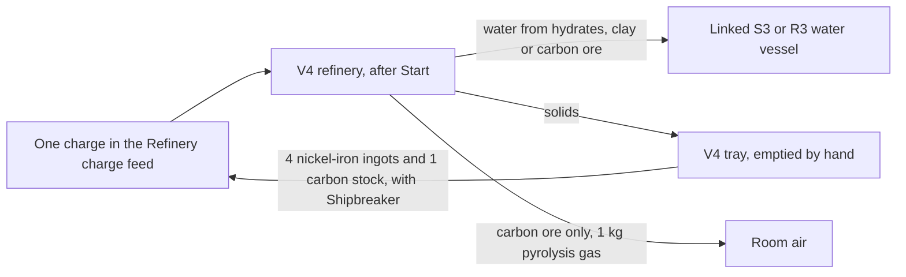
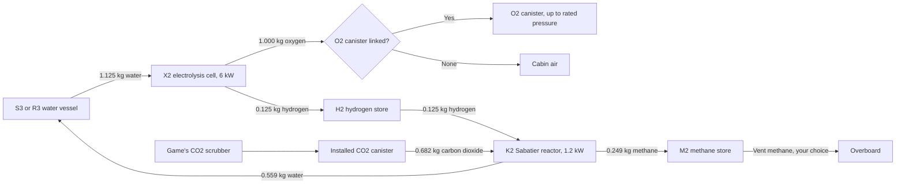

# Refinery, electrolysis, Sabatier reactor and fuel stores

Use the [current versions and dependency requirements](installing-mods.md);
Framework 0.41.0 or newer is required. Implemented and checked offline; owner
gameplay checks are pending, including how the artwork looks in play.
Shipbreaker 0.38.0 or newer is optional: it adds the steel charge and its S3
water silo.

## Equipment

This is late-game plant: priced alongside the game's own radars, heavy lift
rotors and missile launchers, below a fusion reactor. Save up for it.

| Item | Size and mass | Base price | Where |
| --- | --- | --- | --- |
| Phobos' Fennmark V4 Volatiles Refinery | 4 x 4 tiles; 180 kg; two power points; 24 kW working | 64,000 cr, broken 16,000 cr | K-Leg supply kiosk (broken) and fixer (worn), San Diego Halvorson (new), the Venus scrap kiosk (broken and refurbished) and the regional supply kiosks, in lots of eight; INSTALL > APPS. Purchase only. |
| Phobos' Fennmark X2 Chemical Processor | 2 x 2 tiles; 130 kg; one power point; 6 kW working | 38,000 cr, broken 9,500 cr | The same sellers; INSTALL > APPS. Purchase only. |
| Phobos' Fennmark H2 Hydrogen Store | 2 x 2 tiles; 160 kg empty; holds 24 kg of hydrogen | 22,000 cr, broken 5,500 cr | The same sellers; INSTALL > APPS. Purchase only. |
| Phobos' Fennmark K2 Sabatier Reactor | 2 x 2 tiles; 150 kg; one power point; 1.2 kW working | 44,000 cr, broken 11,000 cr | The same sellers; INSTALL > APPS. Purchase only. |
| Phobos' Fennmark M2 Methane Store | 2 x 2 tiles; 160 kg empty; holds 160 kg of methane | 21,000 cr, broken 5,250 cr | The same sellers; INSTALL > APPS. Purchase only. |

Selling one back works like the game's other high-value salvage: the K-Leg
fixer buys an intact machine, the Venus scrap kiosk buys intact or broken, and
the K-Leg supplies kiosk does not buy them. About one engineering-salvage find
in twenty is a Fennmark machine, usually broken. Repairs need real components
(motors, mainboards, heat sinks and, for the V4, a screen); see the
[equipment economy](equipment-economy.md#manufacturing-011-late-game-plant).

Ores are mined, never bought. Nothing this mod makes is sold in shops.

## What the refinery makes

Load **one charge** at a time. Every charge conserves mass: what comes out is
what went in, sorted.

| Charge | Gives | Time at 24 kW |
| --- | --- | --- |
| 1 hydrates block (10 kg, mined) | 1 kg of water into the linked vessel; 3 ice gangue (3 kg each) in the tray | 10 min |
| 1 clay hydrates chunk (10 kg, mined; new) | 2 kg of water; 1 anhydrous residue (8 kg) | 15 min |
| 1 carbon/carbides block (10 kg, mined) | 5 carbon stock (1 kg each); 1 kg of water; 1 gangue; **1 kg of pyrolysis gas breathed into the room** (CO2, CO and smoke) | 30 min |
| 1 meteoric iron block (20 kg, mined) | 4 nickel-iron ingots (4 kg each); 1 gangue; 1 refinery slag (1 kg) | 40 min |
| 4 nickel-iron ingots + 1 carbon stock (Shipbreaker only) | 4 Rivetline steel ingots (4 kg each); 1 steel melt remainder (1 kg) | 33 min |

Every charge sorts into three places: solids to the tray, water to the linked
vessel and, for carbon ore only, gas into the room. Tray products can go back in
as the steel charge.

Refining loses money against selling the ore whole (four ingots are worth 96 cr;
the iron block 450 cr), and carburising loses a little more (four steel ingots
are worth 100 cr; the four nickel-iron ingots and carbon that make them, 106 cr).
Only the machines are late-game priced; ingots, carbon, ore and remainders keep
ordinary raw-material prices.
What you gain is material aboard, away from stations.

## Set up

1. Install the V4 on intact floor and connect both power points. Give it a
   room with a scrubber if you will roast carbon ore.
2. For the water charges, install a water vessel within one tile of the V4:
   a Shipbreaker S3 process water silo or an Agriculture R3 reservoir, touching
   or with one tile between them, diagonal included. Right-click the V4, choose
   **Control Panel**, open **Connections** and pick the vessel under **Water
   vessel**. Apply. The C1 console offers the same field.
3. Right-click the V4 and choose **Inventory**. The tray opens, and the
   **Refinery charge** feed opens as its own window. Put one ore block or clay
   chunk in it (right-click a stack to place one), or four nickel-iron ingots
   and one carbon stock. It holds six units and refuses ice, regolith, gangue,
   scrap and anything stacked, with the reason.
4. On the panel choose **Start**. The refinery binds the exact charge in the
   feed, works for the time above, then puts the solids in its tray and the
   water in the linked vessel, and looks for the next charge. **Pause** keeps
   the bound charge and its progress; **Cancel** leaves the units in the feed
   and forfeits the work.

A water charge waits until the linked vessel can take its whole yield; the
panel says why (no vessel, full, damaged, held, catch chamber, out of reach)
and rechecks every few seconds. The tray must have room for every product or
the charge waits with that reason. Empty the tray by hand.

## The electrolysis cell

Each one-hour cycle at 6 kW splits 1.125 kg of water into 1.000 kg of oxygen
and 0.125 kg of hydrogen.

1. Install the X2 within one tile of a water vessel and of an H2 store, and
   connect its power point.
2. Open its **Control Panel** > **Connections**. Pick the vessel under **Water
   vessel** and the store under **Hydrogen store**. Under **Oxygen to**, pick an
   installed O2 canister within one tile, or leave **None**: the oxygen then
   goes into the cabin air.
3. Choose **Start**. The cell draws a cycle's water into its hold when the
   vessel offers it above its reserve, then runs. At the end of the cycle the
   oxygen goes into the canister (up to its rated pressure) or the room, and
   the hydrogen into the store. It runs only while every output has room: a
   full canister or store makes it wait, with the reason.

**Pause** keeps the held water and the cycle's energy. **Cancel** forfeits the
cycle's energy; the held water stays for the next cycle. A damaged canister is
refused: repair or replace it.

## The Sabatier reactor

The K2 closes the oxygen loop. Each one-hour cycle at 1.2 kW takes 0.125 kg
of hydrogen (exactly one X2 cycle's output) and 0.682 kg of carbon dioxide and
makes 0.559 kg of water and 0.249 kg of methane: CO2 + 4 H2 -> CH4 + 2 H2O.
With the X2, about half the water the cell splits comes back, the rest leaves
as the hydrogen in the methane. That is how NASA's ISS system works too.

Here is the whole loop, per one-hour cycle of each machine. Every vessel,
canister and store is linked on the machine's panel and sits within one tile.

1. Install the K2 within one tile of an H2 store, an installed CO2 canister,
   a water vessel (S3 or R3) and an M2 methane store, and connect its power
   point. One vessel can serve a refinery, an X2 and a K2 at once.
2. Fill the CO2 canister with the game's own CO2 scrubber: that is where the
   crew's breathing CO2 ends up, and nothing else in the game empties it.
3. Open its **Control Panel** > **Connections** and set **Hydrogen from**,
   **CO2 canister**, **Water to** and **Methane to**. Apply, then **Start**.
4. At the start of each cycle it draws the hydrogen and CO2 into its own hold;
   at the end the products go to their vessels, and the next cycle starts only
   when they have. A short input or a full output makes it wait, with the reason.

The reaction gives off heat: with its electricity, about 2.3 kW goes into the
room while it works, and it waits for the room to cool at 40 C. Pause keeps
held gas, made products and progress; Cancel forfeits only the cycle's energy.

## The methane store

The M2 keeps methane for the day something aboard can use it; nothing burns it
as fuel yet. Its panel shows the kilograms held and which reactors fill it.
**Vent methane** (or `vent <id> <kg>` on the console) discharges it overboard.
Vent it before uninstalling or dismantling; both refuse while it holds methane.

## The hydrogen store

The H2 store is passive: no power, no cargo, no inventory. Its panel shows the
kilograms held and which cells feed it. **Vent hydrogen** on the panel (or
`vent <id> <kg>` on the console) discharges a chosen amount overboard and logs
it. Vent it before uninstalling or dismantling: both refuse while it holds
hydrogen.

## After a reload

The V4, X2 and K2 pause after every reload and keep their bound charge, holds
and progress. Press **Start** to continue. The K2 keeps the gas it holds and any
products it has made; it delivers waiting products first and starts a new cycle
only once they have gone to their vessels. A bound steel charge on a ship whose
Shipbreaker has been removed is kept and reported, never overwritten; Cancel
releases it.

## Dangers

- **Roasting carbon ore fouls the air.** The V4 breathes 1 kg of CO2, CO and
  smoke into its room over the charge. The game's own Smoke and CO2 alarms,
  poisoning and scrubbers apply: run a CO/smoke scrubber and a CO2 scrubber in
  that room, or vent it afterwards. The charge waits if the room is below
  10 kPa or above 40 C.
- **Hot machines warm the room.** The V4 puts 3.6 kW into its room while
  working, the X2 about 1.1 kW. Both wait for the room to cool at 40 C. A
  nickel-iron or steel **melt that waits longer than its own run freezes**: the
  charge finishes as slag with the same mass, and the log says so.
- **Oxygen into the cabin raises the fire risk.** With no canister linked, the
  X2 raises the room's oxygen partial pressure; the game's fires spread more
  readily in rich air. Link a canister.
- **Methane leaks into the room.** A damaged M2 leaks about 2 kg an hour of
  the game's own methane gas into its room until repaired; it crowds out the
  air. With oxygen and a fire, a working V4 or a sparking device, the store's
  contents burn instead: 4 kg of the room's oxygen and 2.7 kg of CO2 left behind
  per kilogram of methane, with the game's own explosion.
- **A damaged reactor dumps its gas.** The CO2 and methane in a K2's hold go
  into the room; its hydrogen burns by the rule below if it can, otherwise it
  escapes. The water stays in the reactor until you repair it.
- **Hydrogen burns.** A damaged H2 store leaks about 2 kg an hour to space and
  keeps leaking until repaired; the crew log and the nav banner say so. If the
  room holds oxygen (5 kPa or more) and there is a fire, a V4 working in the
  room, or a sparking damaged powered device, the store's contents burn: the
  room loses 8 kg of oxygen per kilogram of hydrogen, its air heats, and the
  game's own explosion follows, with its damage, shrapnel and fire rolls, in a
  size that grows with the hydrogen burned. Destroying a full store does the
  same. Keep the store away from the refinery's room, repair damage at once,
  and vent before you cut into anything nearby.

## Limits

- No crew loading orders yet; load the feed by hand or with a crew output
  store on the tray.
- No construction recipes: buy the machines.
- Nothing burns the stored methane as fuel yet; vent it when the store fills.
  Hydrogen and methane are kilogram records in their stores; methane becomes the
  game's own gas only when it leaks or burns.
- The reactor converts all of its hydrogen each cycle; real reactors convert
  most, not all. That is an authored simplification.
- The clay hydrates chunk uses the game's hydrate artwork until it has its own.
- Offline checks are not gameplay validation; see the owner checks below.

## Owner checks (game closed, `scripts/install-mods.ps1 -Mods Shipbreaker,Manufacturing`)

Buy and install a V4, X2 and H2 store, link an S3 within one tile; mine dark
regolith and confirm a clay chunk appears sometimes; run each charge and read
the products and vessel levels; carburise four nickel-iron ingots with one
carbon; start the X2 with an installed O2 canister adjacent and watch its
pressure and the hydrogen store rise; vent hydrogen; save and reload mid-cycle
and confirm the pause until Start with progress kept; fill the canister and
the store and confirm the waits; heat wait in a small room; C1 listing with
Shipbreaker; a copy without Shipbreaker keeps a saved steel charge and refuses
a new one. Hazards: roast carbon in a sealed room without scrubbers and watch
the alarms, then with scrubbers; run the X2 without a canister and watch cabin
oxygen; damage the store once with a fire in the room and once without
(deflagration against leak; repair stops the leak); interrupt a casting charge
through a long heat wait and confirm slag instead of ingots.

Sabatier and methane (0.2.0): install a K2 within one tile of an H2 store, an
installed CO2 canister, an S3 and an M2, and link all four. Fill the canister
with the game's CO2 scrubber, run an X2 into the same H2 store, and Start the K2.
Watch the hydrogen fall and, each hour, about 0.56 kg of water and 0.25 kg of
methane arrive. Empty the canister, empty the H2 store, fill the M2 and fill
the vessel in turn, and confirm each wait gives its reason. Save and reload
mid-cycle, then confirm the pause until Start and that the products arrive once.
Watch the room warm by about 2.3 kW while it runs. Vent methane from the M2.
Hazards: damage the M2 once without and once with a fire in the room (methane
rising in the room against a burn that leaves CO2), and damage a running K2
(its CO2 and methane go into the room; its hydrogen burns or escapes).

## Sources

The chemistry, energies, hazard rules and their primary sources (NIST, NASA,
the OSIRIS-REx science team, iron-meteorite mineralogy) are in
[the refinery record](development/manufacturing-refinery-and-chemistry.md).
Yields are rounded to item units and labelled as authored; the sources inform
the design and do not endorse it.
