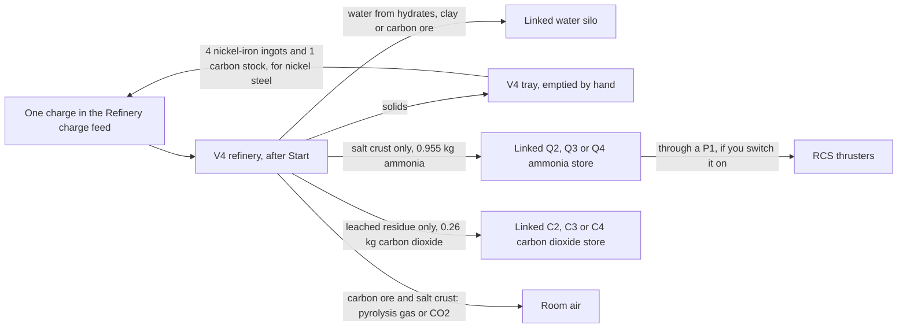
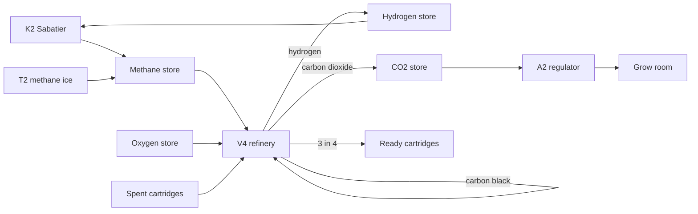
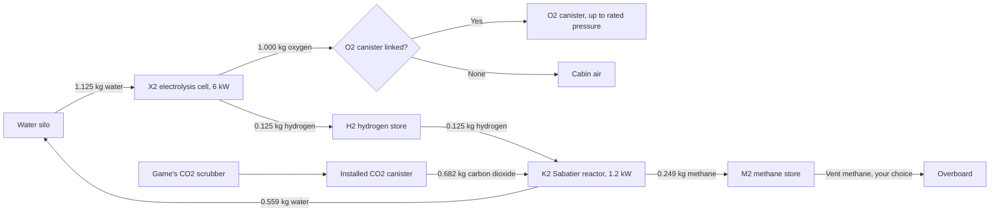
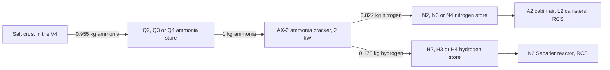
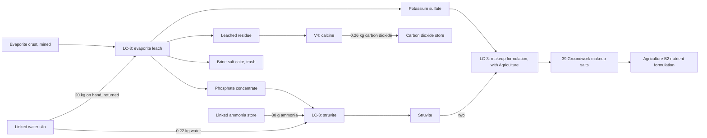
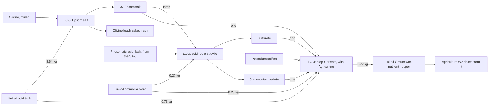
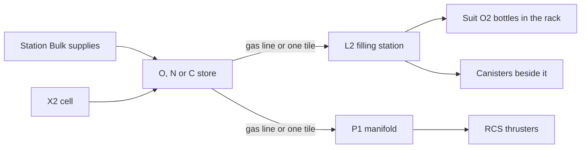

# Refinery, electrolysis, Sabatier reactor, ammonia cracker, leach unit, acid plant, gas and acid stores, canister filling, cabin air and RCS propellant

Use the [current versions and dependency requirements](installing-mods.md);
Phobos Framework is required at the version listed there. Implemented and checked offline; owner
gameplay checks are pending, including how the artwork looks in play.
Shipbreaker is optional; a V4 that was already working a plain steel charge
needs it to finish that charge. Phobos Agriculture is optional too: with it, the leach unit can make
Groundwork makeup salts and, with a nutrient hopper, complete crop nutrients.

## Equipment

This is late-game plant: priced alongside the game's own radars, heavy lift
rotors and missile launchers, below a fusion reactor. Save up for it.

| Item | Size and mass | Base price | Where |
| --- | --- | --- | --- |
| Phobos' Fennmark V4 Volatiles Refinery | 4 x 4 tiles; 180 kg; two power points; 24 kW working | 64,000 cr, broken 16,000 cr | K-Leg supply kiosk (broken) and fixer (worn), San Diego Halvorson (new), the Venus scrap kiosk (broken and refurbished) and the regional supply kiosks, in lots of eight; INSTALL > APPS. Purchase only. |
| Phobos' Fennmark X2 Chemical Processor | 2 x 2 tiles; 130 kg; one power point; 6 kW working | 38,000 cr, broken 9,500 cr | The same sellers; INSTALL > APPS. Purchase only. |
| Phobos' Fennmark H2, H3 and H4 Hydrogen Stores | 2 x 2, 3 x 3 and 4 x 4 tiles; 160, 305 and 450 kg empty; hold 24, 59 and 115 kg of hydrogen | 22,000, 35,790 and 50,540 cr | The same sellers; INSTALL > APPS. Purchase only. |
| Phobos' Fennmark K2 Sabatier Reactor | 2 x 2 tiles; 150 kg; one power point; 1.2 kW working | 44,000 cr, broken 11,000 cr | The same sellers; INSTALL > APPS. Purchase only. |
| Phobos' Tolvane AX-2 Ammonia Cracker | 2 x 2 tiles; 150 kg; one power point; 2 kW working | 42,000 cr, broken 10,500 cr | The same sellers; INSTALL > APPS. Purchase only. |
| Phobos' Lixivar LC-3 Leach and Crystallise Unit | 3 x 3 tiles; 220 kg; one power point; 12 kW working | 48,000 cr, broken 12,000 cr | The same sellers; INSTALL > APPS. Purchase only. |
| Phobos' Lixivar SA-3 Sulfuric Acid Plant | 3 x 3 tiles; 260 kg; one power point; 4 kW working, about 21 kWh of reaction heat a nodule | 56,000 cr, broken 14,000 cr | The same sellers; INSTALL > APPS. Purchase only. |
| Phobos' Lixivar AT-2, AT-3 and AT-4 Sulfuric Acid Tanks | 2 x 2, 3 x 3 and 4 x 4 tiles; hold 1,150, 2,850 and 5,520 kg of acid | 16,000 cr and up the size ladder | The same sellers; INSTALL > APPS. Purchase only. |
| Phobos' Fennmark M2, M3 and M4 Methane Stores | 2 x 2, 3 x 3 and 4 x 4 tiles; hold 160, 395 and 770 kg of methane | 21,000, 34,160 and 48,250 cr | The same sellers; INSTALL > APPS. Purchase only. |
| Phobos' Fennmark O2, O3 and O4 Oxygen Stores | 2 x 2, 3 x 3 and 4 x 4 tiles; hold 340, 840 and 1,630 kg of oxygen | 21,000, 34,160 and 48,250 cr | The same sellers; INSTALL > APPS. Purchase only. |
| Phobos' Fennmark N2, N3 and N4 Nitrogen Stores | 2 x 2, 3 x 3 and 4 x 4 tiles; hold 300, 745 and 1,440 kg of nitrogen | 20,000, 32,530 and 45,950 cr | The same sellers; INSTALL > APPS. Purchase only. |
| Phobos' Fennmark C2, C3 and C4 Carbon Dioxide Stores | 2 x 2, 3 x 3 and 4 x 4 tiles; hold 470, 1,160 and 2,260 kg of carbon dioxide | 20,000, 32,530 and 45,950 cr | The same sellers; INSTALL > APPS. Purchase only. |
| Phobos' Fennmark Q2, Q3 and Q4 Ammonia Stores | 2 x 2, 3 x 3 and 4 x 4 tiles; hold 380, 940 and 1,820 kg of liquefied ammonia | 20,000, 32,530 and 45,950 cr | The same sellers; INSTALL > APPS. Purchase only. |
| Phobos' Fennmark L2 Canister Filling Station | 2 x 2 tiles; 120 kg; one power point; 3 kW working | 26,000 cr, broken 6,500 cr | The same sellers; INSTALL > HVAC. Purchase only. |
| Phobos' Fennmark A2 Cabin Air Regulator | 2 x 2 tiles; 60 kg; one power point; 0.1 kW | 23,000 cr, broken 5,750 cr | The same sellers; INSTALL > HVAC. Purchase only. |
| Phobos' Fennmark P1 RCS Propellant Manifold | 1 x 1 tile; 10 kg; passive | 24,000 cr, broken 6,000 cr | The same sellers; INSTALL > HVAC. Purchase only. |
| Phobos' Fennmark Gas Line (a Framework item since Framework 0.57.0) | 1 tile per segment; 1 kg | 3 cr | K-Leg supply kiosk and fixer, Halvorson and the Venus scrap kiosk, in lots of 128; INSTALL > HVAC. |
| Phobos' Process Water Line (Framework 0.57.0) | 1 tile per segment; 1 kg | 3 cr | The same sellers, in lots of 128; INSTALL > HVAC. |
| Phobos' Lixivar Acid Line | 1 tile per segment; 1 kg | 6 cr | The same sellers, in lots of 128; INSTALL > HVAC. |

Every store's broken price is a quarter of its price. The medium and large
stores are too big to turn up in salvage; buy them.

Selling one back works like the game's other high-value salvage: the K-Leg
fixer buys an intact machine, the Venus scrap kiosk buys intact or broken, and
the K-Leg supplies kiosk does not buy them. About one engineering-salvage find
in twenty is a Fennmark machine, usually broken. Repairs need real components
(motors, mainboards, heat sinks and, for the V4, a screen); see the
[equipment economy](equipment-economy.md#manufacturing-011-late-game-plant).

Ores are mined, never bought. Three chunks come from dark rock, in place of some
of the silicates: each pull from a dark rock (C-class) deposit gives a clay
hydrates chunk about one time in eleven, and an ammonium salt crust or an
evaporite crust each about one time in twenty-one; dark regolith walls give them
far more rarely. Iron-rich deposits give a sulfide nodule in place of some of
their meteoric iron: about one pull in thirty-six from an M-class deposit and one
in sixty-three from an S-class one. A single deposit can run out without giving
one. To see a table as the game rolls it now, open the console (F3) and type
`phobosframework loot ItmRandomMineralCClass` (or `MClass`, `SClass`).
Stations also sell sulfuric acid into an acid tank through **Bulk supplies**, at
the game's own 3.1 cr/kg. Stations sell bulk oxygen, nitrogen and carbon
dioxide through the refuelling kiosk's **Bulk supplies** view, straight into an
installed store of that gas, at the kiosk's own price per kilogram. No station
sells ammonia, hydrogen or methane: you make them. See
[Selling what you make](#selling-what-you-make) for what the station buys back.

## What the refinery makes

Load **one charge** at a time. Every charge conserves mass: what comes out is
what went in, sorted.

| Charge | Gives | Time at 24 kW |
| --- | --- | --- |
| 1 hydrates block (10 kg, mined) | 1 kg of water into the linked vessel; 3 gangue (3 kg each) in the tray | 10 min |
| 1 clay hydrates chunk (10 kg, mined) | 2 kg of water; 1 anhydrous residue (8 kg) | 15 min |
| 1 ammonium salt crust (10 kg, mined; new) | 0.955 kg of ammonia into the linked ammonia store; 0.505 kg of water; 1 spent salt cake (7.305 kg); **1.235 kg of carbon dioxide breathed into the room** | 15 min |
| 1 carbon/carbides block (10 kg, mined) | 5 carbon stock (1 kg each); 1 kg of water; 1 gangue; **1 kg of pyrolysis gas breathed into the room** (CO2, CO and smoke) | 30 min |
| 1 meteoric iron block (20 kg, mined) | 4 nickel-iron ingots (4 kg each); 1 gangue; 1 refinery slag (1 kg) | 40 min |
| 4 nickel-iron ingots + 1 carbon stock | 4 Fennmark nickel steel ingots (4 kg each); 1 refinery slag (1 kg) | 33 min |
| 1 leached residue (6.8 kg, from the LC-3; new) | 0.26 kg of carbon dioxide into the linked carbon dioxide store; 1 calcined residue (6.54 kg) | 7.5 min |
| 1 carbon stock, with a linked methane store (0.27.0) | draws 4.007 kg of methane; 4 carbon black (1 kg each); 1.007 kg of hydrogen into the linked hydrogen store | 30 min |
| 1 carbon black, with a linked oxygen store (0.27.0) | draws 2.664 kg of oxygen; 3.664 kg of carbon dioxide into the linked carbon dioxide store; about 9 kWh of heat into the room | 30 min |
| 4 spent CO2 scrubber cartridges (0.27.0) | 3 ready scrubber cartridges; 1 exhausted sorbent (2.5 kg) | 30 min |
| 4 spent EVA CO2 filters (0.27.0) | 3 ready EVA filters; 1 exhausted sorbent (2.5 kg) | 30 min |

Every charge sorts into up to five places: solids to the tray, water to the
linked vessel, ammonia to the linked ammonia store, the leached residue's carbon
dioxide to the linked carbon dioxide store and, for carbon ore and the salt crust,
gas into the room. Ammonia and the residue's carbon dioxide are never let into the
room on purpose. Tray products can go back in as the nickel steel charge. An L2 filling
station can bottle the stored carbon dioxide into a CO2 canister for the K2.

Refining pays. Four nickel-iron ingots are worth 880 cr against 450 cr for the
iron block; five carbon stock and their water 200 cr against 99 cr for the
carbon ore. Carburising adds a little more: four nickel steel ingots are worth
1,040 cr, the four nickel-iron ingots and carbon that make them 918 cr. Nickel
steel is not Shipbreaker's plain steel ingot, which the F6 casts from scrap.
Hydrates, clay and the salt crust are worth more as ore than as water and gas;
you refine those for what the ship needs.

## Reactors that feed each other

Since 0.27.0 the refinery also works with the gas stores the other machines
fill, so their products have somewhere to go:

- **Cracking methane.** Link a methane store and a hydrogen store to the V4 and
  load one carbon stock. The V4 cracks 4 kg of methane on the carbon into four
  carbon black and 1 kg of hydrogen. With a K2 this closes the loop the ISS
  closes by other means: the Sabatier's methane comes back as hydrogen for the
  next cycle, and the carbon leaves as a solid. Carbon black is worth little.
- **Carbon dioxide for crops.** Link an oxygen store and a carbon dioxide store
  and load one carbon black: the V4 burns it into 3.7 kg of carbon dioxide, and
  an A2 doses a grow room from that store (see [Cabin air regulator](#cabin-air-regulator)).
  Crops stop growing in a room with no carbon dioxide, which a well-scrubbed
  room can be.
- **Reactivating cartridges.** Spent CO2 scrubber cartridges and EVA filters go
  into the V4's feed four at a time; three come back ready and the fourth is an
  exhausted sorbent remainder. They are the ship's largest recurring purchase,
  so this cuts that by three quarters. The game's scrubber pumps the carbon
  dioxide it catches into a canister, so a spent cartridge releases none; the
  reactivation is our simplification, not real lithium chemistry.

A charge that draws a gas is chosen only once that store is linked, so a carbon
stock waiting for a nickel steel charge is never cracked by surprise.

## Selling what you make

Refining is a business (owner decision, 1 October 2026): what you refine from
mined ore sells for roughly 1.5 to 2.5 times the ore it came from.

- **Items** (ingots, carbon, salts, flasks) sell at any general buyer like other
  goods. Ingots, carbon, salts and flasks already aboard took the new prices when
  your save loaded.
- **Bulk** sells at a refuelling kiosk. Open **Bulk supplies**; below the supplies
  are **Sell** lines for every gas store (hydrogen, methane, oxygen, nitrogen,
  carbon dioxide, ammonia), the acid tanks and Framework's water silos. Choose the
  store and a quantity; the station pays 45% of its own price for that gas, and
  only for what actually leaves the store. A store's reserve is never sold.
- Buying bulk and selling it straight back always loses more than half.
- Crop nutrients in a hopper are not bought back; bag them into bulk charges.

| Product | Price |
| --- | --- |
| Nickel-iron ingot (4 kg) | 220 cr |
| Nickel steel ingot (4 kg) | 260 cr |
| Carbon stock (1 kg) | 38 cr |
| Carbon black (1 kg, 0.27.0) | 12 cr |
| Potassium sulfate (0.7 kg) | 190 cr |
| Phosphate concentrate (0.25 kg) | 110 cr |
| Struvite (0.43 kg) | 125 cr |
| Epsom salt (0.432 kg) | 13 cr |
| Ammonium sulfate (0.232 kg) | 20 cr |
| Phosphoric acid flask (0.515 kg) | 300 cr |

The machines are expensive, so they pay for themselves slowly: hundreds of hours
of running for the LC-3 and SA-3. These prices are authored balance, to be
judged in play.

## Linking machines and stores

A machine links to a store (or tank or silo) only when the two
**touch** or share a **line**. Nothing links across open floor. The only
exception is the station refuelling kiosk's Bulk supplies view.

- **Touching** means the footprints meet or have one tile between them,
  diagonal included. Wherever the steps below say *within one tile*, this is it,
  and the matching line works as well. Touching also chains: a tank touching a V4 that touches an X2 serves the X2.
- **Lines** are Framework's process-water line (blue) and gas line (amber),
  and the Lixivar acid line (violet), bought and laid tile by tile through
  INSTALL > HVAC. A line joins a machine, tank or store when it runs **under it
  or right beside it**, on any side (since Framework 0.69.0; a tile that only
  meets a corner does not count). Lay the line until it touches both; everything
  of the right kind that a line touches is on the same network, and so is
  anything touching them. Water line joins what uses water, gas line what uses
  gas, acid line the LC-3, the SA-3 and the acid tanks. Different lines can
  share a tile. One tile under each machine refuses its own kind of line: the
  edge tile where that line's joint is drawn (left side for water, right side
  for gas, one row lower for acid, turning with the equipment). Before
  Framework 0.69.0 a line had to end on the single tile beside that joint;
  such layouts still work.
- **If a store is missing from a list,** open the setting anyway. Under the
  choices, **Aboard, but not offered** names each silo, tank or store that is
  left out and the first thing to fix: loose, damaged, locked, no working line
  touching it, a drained line, or two lines that do not meet. A machine's
  **Details** page names what it is joined to through each line.
- **Sharing:** one store serves up to eight machines of each kind. An H2 store
  filled by an X2 can feed a K2 and a P1 at the same time, and one water tank can
  serve every machine on its line.
- **The link list** on a machine's Control Panel names how each store is reached
  (*touching*, *water line*, *gas line* or *acid line*) and marks a destination that is
  *full* or a source that is *empty*. A store's own panel lists every machine
  linked to it.
- If a link stops being reachable (a segment is damaged, or one of the pair
  moves), the machine reports the store as not ready and waits; nothing is lost.
- The game's own canisters and Agriculture's nutrient hoppers still link by
  touching only.
- **Oxygen and fuel on one gas line.** If an oxygen store and a hydrogen, methane
  or ammonia store end up on the same gas line, their panels say so and the crew
  log gets one note. Nothing is blocked (the P1 and L2 mix gases on purpose), but
  real yards keep them apart: the U.S. Occupational Safety and Health
  Administration's oxygen-cylinder storage rule,
  [29 CFR 1910.253(b)(4)(iii)](https://www.osha.gov/laws-regs/regulations/standardnumber/1910/1910.253),
  asks for 20 feet or a fire-rated barrier between them. In the game the line
  holds only a few grams of gas a tile (since Framework 0.63.0) and nothing here
  models a leak from mixing; the caution is our design choice.

## Set up

1. Install the V4 on intact floor and connect both power points. Give it a
   room with a scrubber if you will roast carbon ore or bake salt crust.
2. For the water charges, install a water vessel within one tile of the V4, or
   lay process-water line so it runs under or beside both: a Shipbreaker S3 to S5
   process water silo (Framework's Rivetline S2 to S5). Right-click the V4, choose
   **Control Panel**, open **Connections** and pick the vessel under **Water
   vessel**. Apply. The C1 console offers the same field.
   For the salt crust, also install an ammonia store (any size) within one
   tile and pick it under **Send ammonia to**; for a leached residue, a carbon
   dioxide store under **Send carbon dioxide to**. Each field appears once a
   store of that gas is aboard; its sheet says why one is not offered.
3. Right-click the V4 and choose **Inventory**. The tray opens, and the
   **Refinery charge** feed opens as its own window. Put one ore block, clay
   chunk, salt crust or leached residue in it (right-click a stack to place one), or four nickel-iron ingots
   and one carbon stock for nickel steel. It holds six units and refuses ice, regolith, gangue,
   scrap and anything stacked, with the reason.
4. On the panel choose **Start**. The refinery binds the exact charge in the
   feed, works for the time above, then puts the solids in its tray and the
   water in the linked vessel, and looks for the next charge. **Pause** keeps
   the bound charge and its progress; **Cancel** leaves the units in the feed
   and forfeits the work.

A water charge waits until the linked vessel can take its whole yield; the
panel says why (no vessel, full, damaged, held, catch chamber, out of reach)
and rechecks every few seconds. The salt crust also waits, with the reason,
until its ammonia store is linked, intact and has room for the ammonia. The tray must have room for every product or
the charge waits with that reason. Empty the tray by hand. Since Manufacturing 0.30.0 the V4, LC-3 and SA-3
trays are 4 x 3 cells and products arrive as stacks (ingots ten to a cell, salts twenty), so a tray holds two
charges of every recipe except the LC-3's evaporite leach, whose two 2 x 2 residues leave room for one.

## The electrolysis cell

Each one-hour cycle at 6 kW splits 1.125 kg of water into 1.000 kg of oxygen
and 0.125 kg of hydrogen.

1. Install the X2 within one tile of a water vessel and of an H2 store, and
   connect its power point.
2. Open its **Control Panel** > **Connections**. Pick the vessel under **Water
   vessel** and the store under **Hydrogen store**. Under **Oxygen to**, pick an
   installed O2 canister within one tile, or leave **None**: the oxygen then
   goes into the cabin air.
3. Choose **Start**. The cell draws a cycle's water into its hold when the
   vessel offers it above its reserve, then runs. At the end of the cycle the
   oxygen goes into the canister (up to its rated pressure) or the room, and
   the hydrogen into the store. It runs only while every output has room: a
   full canister or store makes it wait, with the reason.

**Pause** keeps the held water and the cycle's energy. **Cancel** forfeits the
cycle's energy; the held water stays for the next cycle. A damaged canister is
refused: repair or replace it.

## The Sabatier reactor

The K2 closes the oxygen loop. Each one-hour cycle at 1.2 kW takes 0.125 kg
of hydrogen (exactly one X2 cycle's output) and 0.682 kg of carbon dioxide and
makes 0.559 kg of water and 0.249 kg of methane: CO2 + 4 H2 -> CH4 + 2 H2O.
With the X2, about half the water the cell splits comes back, the rest leaves
as the hydrogen in the methane. That is how NASA's ISS system works too.

Here is the whole loop, per one-hour cycle of each machine. Every vessel,
canister and store is linked on the machine's panel and sits within one tile.

1. Install the K2 within one tile of an H2 store, an installed CO2 canister,
   a water silo (S2 to S5) and an M2 methane store, and connect its power
   point. One vessel can serve a refinery, an X2 and a K2 at once.
2. Fill the CO2 canister with the game's own CO2 scrubber: that is where the
   crew's breathing CO2 ends up, and nothing else in the game empties it.
3. Open its **Control Panel** > **Connections** and set **Hydrogen from**,
   **CO2 canister**, **Water to** and **Methane to**. Apply, then **Start**.
4. At the start of each cycle it draws the hydrogen and CO2 into its own hold;
   at the end the products go to their vessels, and the next cycle starts only
   when they have. A short input or a full output makes it wait, with the reason.

The reaction gives off heat: with its electricity, about 2.3 kW goes into the
room while it works, and it waits for the room to cool at 40 C. Pause keeps
held gas, made products and progress; Cancel forfeits only the cycle's energy.

## The ammonia cracker

The Tolvane AX-2 turns the ammonia from salt crust into the two gases the ship
uses: nitrogen for the cabin air and hydrogen for the K2 or the thrusters. Each
one-hour cycle at 2 kW takes 1 kg of ammonia and makes 0.822 kg of nitrogen and
0.178 kg of hydrogen: 2 NH3 -> N2 + 3 H2. One salt crust charge gives about one
cycle's ammonia.

1. Install the AX-2 within one tile of an ammonia store, a nitrogen store and a
   hydrogen store (any size), and connect its power point. A hydrogen store can
   take from an X2 and a cracker at once.
2. Open its **Control Panel** > **Connections** and set **Ammonia from**,
   **Nitrogen to** and **Hydrogen to**. Apply, then **Start**.
3. At the start of each cycle it draws a cycle's ammonia into its own hold; at
   the end the nitrogen and hydrogen go to their stores, and the next cycle starts
   only when they have. It starts a cycle only when both stores have room for a
   whole cycle; a short ammonia store or a full product store makes it wait, with
   the reason.

Splitting ammonia soaks up about 0.75 kWh of each cycle's 2 kWh, so about 1.25 kW
goes into the room while it works, and it waits for the room to cool at 40 C.
Pause keeps the held ammonia, made products and progress; Cancel forfeits only
the cycle's energy.

Each kilogram of ammonia goes one way: into the RCS through a P1, or into the
cracker. The cracker does not make gas out of nothing: the nitrogen and hydrogen
together weigh exactly the ammonia it took.

## The leach unit

The Lixivar LC-3 dissolves and recrystallises salts. Unlike the refinery, it
works the recipe you choose, one charge at a time, at 12 kW.

| Recipe | Charge | Gives | Time |
| --- | --- | --- | --- |
| Evaporite leach | 1 evaporite crust (10 kg, mined), with 20 kg of water on hand in the linked vessel | 1 potassium sulfate (0.70 kg); 1 phosphate concentrate (0.25 kg); 1 leached residue (6.8 kg) for the refinery; 1 brine salt cake (2.25 kg). The 20 kg of water goes back. | 60 min |
| Struvite | 1 phosphate concentrate; 30 g of ammonia from the linked ammonia store; 0.22 kg of water from the linked vessel | 1 struvite (0.43 kg), a slow-release fertiliser; 1 caustic remainder (70 g) | 5 min |
| Makeup formulation (Agriculture only) | 1 potassium sulfate and 2 struvite | 39 Verdemorrow Groundwork makeup salts packets (40 g each), nothing left over | 2.5 min |
| Epsom salt from olivine | 1 olivine (the game's 10 kg ore chunk); 8.64 kg of sulfuric acid from the linked acid tank; 9.52 kg of water from the linked vessel | 32 Epsom salt (0.432 kg each); 1 olivine leach cake (14.33 kg, trash). About 5.3 kWh of extra heat goes into the room. | 60 min |
| Acid-route struvite | 1 phosphoric acid flask (from the SA-3) and 3 Epsom salt; 0.27 kg of ammonia from the linked ammonia store | 3 struvite; 3 ammonium sulfate (0.232 kg each); 94 g of water back into the linked vessel | 10 min |
| Crop nutrients (Agriculture 0.27.0 or newer) | 1 potassium sulfate, 1 struvite, 1 Epsom salt and 1 ammonium sulfate; 0.25 kg of ammonia and 0.73 kg of sulfuric acid from their links | 2.77 kg of crop nutrients into the linked nutrient hopper | 5 min |

The acid recipes turn the SA-3's acid and flask into a complete feed for a
nutrient hopper:

1. Install the LC-3 within one tile of a water silo (S2 to S5), or on its
   process-water line, and connect its power point. For struvite, also install an
   ammonia store touching it or on its gas line; for the acid recipes an acid tank
   touching it or on its acid line; for crop nutrients a Groundwork nutrient hopper
   within one tile. One vessel can serve a refinery, an X2,
   a K2 and an LC-3 at once.
2. Open its **Control Panel** > **Connections**. Pick the vessel under **Water
   vessel**, the store under **Ammonia from**, the tank under **Acid tank** and the
   hopper under **Nutrient hopper** where you have them, and the recipe under
   **Recipe**. Apply.
3. Right-click the LC-3 and choose **Inventory**. Put the chosen recipe's charge
   in the **Leach unit charge** window. It holds four units and takes only the
   chosen recipe's feed, with the reason when it refuses one.
4. Choose **Start**. It works the charge, puts the products in its tray, then
   binds the next charge of the same recipe if the feed holds one. Change the
   recipe only while no charge is bound; **Cancel** releases a bound charge.

A leach waits until the linked vessel holds 20 kg of water; struvite waits until
the vessel and the ammonia store hold what it takes; the acid recipes wait for
the acid, and crop nutrients wait until the hopper has room. The panel gives the
reason. A charge that needs no vessel (the makeup formulation) runs without one.

Leaching pays: a crust's potassium sulfate and phosphate are worth 300 cr
against 150 cr for the crust, and 32 Epsom salt 416 cr against 180 cr for the
olivine and about 120 cr of acid and water. Makeup
salts made aboard are worth Agriculture's own 30 cr a packet, and crop nutrients
Agriculture's 1,500 cr/kg, well above any other product because fertiliser is
rare out here; bag a hopper's nutrients into bulk charges to sell them. Sodium harms crops, so the
sodium salts leave as the brine salt cake, and nothing recovers it or the other
remainders.

The crop nutrient blend matches Hoagland solution's nitrogen to potassium; it is
sulfate- and ammonium-rich and has no calcium, nitrate or trace elements, so it
is not a real hydroponic recipe. Agriculture counts only its total.

## The acid plant and acid tanks

The Lixivar SA-3 turns a sulfide nodule into acid. Each one-hour charge at 4 kW
roasts one nodule (10 kg: troilite, a nickel-iron phosphide and rock) in 6.28 kg
of oxygen with 1.58 kg of water, and makes 7.81 kg of sulfuric acid, a 0.515 kg
phosphoric acid flask and 9.535 kg of roasted calcine (trash).

1. Install the SA-3 touching an oxygen store, a water silo and an acid tank (any
   sizes), or join each to it with gas, water or acid line, and connect its power
   point.
2. Open its **Control Panel** > **Connections** and set **Oxygen from**, **Water
   vessel** and **Acid tank**. Apply.
3. Put nodules in its **Acid plant charge** window (it holds two) and **Start**.
   It works one at a time, puts the flask and calcine in its tray and the acid in
   the tank, and waits with the reason if a store is short or the tank is full.

**Heat.** Roasting, converting and absorbing release about 21 kWh a nodule on top
of the 4 kW the plant draws, all into its room: over an hour that is like a 21 kW
heater. The plant waits whenever the room would pass 40 C, so give it a large
room with cooling or it will crawl.

### No machines in vacuum

Phobos machines do not work in the vacuum of space. Each one sheds its waste heat
into the air of its room, so it needs a pressurised room: at least 10 kPa of air,
staying under 40 C. In a compartment open to space (or with less than 10 kPa) it
draws nothing and its panel says so, with the room's pressure. A room that is too
warm makes it wait instead, with the room's temperature; it carries on by itself
once the room has cooled.

**Acid tanks** are bunded tanks, not gas stores: they have no gas line and never
feed thrusters, filling stations or cabin air. Fill one from an SA-3 or at a
station; the LC-3 draws from it. To move acid, open a tank's panel and **Pour
acid into** another acid tank it touches or shares an acid line with; the list
says how each is reached. A tank holding acid refuses to be moved or dismantled.

**The acid line** joins the SA-3, the LC-3 and the tanks it runs under or beside, so the
tank room need not sit beside the plant. Since 0.25.0 it holds its acid, about
0.9 kg a tile (a metre of 25 mm bore of 98% acid, our authored figure), filled
from the tanks on it. To take it up, right-click it and choose **Drain line into
canister** with a Framework drain canister carried or within two tiles; each
canister takes 36.7 kg. Draining closes the run until **Return line to service**.
Every acid tank has a four-place canister rack: haul a full canister into it and
the acid pours in, leaving the empty canister there. A damaged segment lets a
ten-thousandth of its acid into the room as mist and keeps the rest until drained.
See [draining and venting](lines-and-draining.md).

## Gas stores

Every gas store comes in three sizes: small (2 x 2), medium (3 x 3) and large
(4 x 4). A bigger store holds more for less per kilogram of capacity. Pick the
gas by colour: olive methane, dark grey hydrogen cylinders, green oxygen, blue
nitrogen and pale grey carbon dioxide, like the game's own canisters, and amber
ammonia.

| Gas | Filled by | Used by |
| --- | --- | --- |
| Hydrogen (H) | an X2, an AX-2, a V4 cracking methane | a K2, the RCS through a P1 |
| Methane (M) | a K2, a Shipbreaker T2 thawing methane ice | a V4 cracking methane, the RCS through a P1 |
| Oxygen (O) | an X2 (set the store as its oxygen destination), Bulk supplies, an L2 decanting canisters | an SA-3 roasting a nodule, a V4 burning carbon black, an A2 (cabin air), an L2 (canisters and suit bottles), the RCS |
| Nitrogen (N) | Bulk supplies, an AX-2, an L2 decanting canisters | an A2 (cabin pressure), an L2 (RCS and air-pump canisters), the RCS |
| Carbon dioxide (C) | Bulk supplies, a V4 calcining leached residue or burning carbon black, an L2 decanting canisters | a K2 (set the store as its CO2 source), an A2 dosing a grow room, an L2, the RCS |
| Ammonia (Q) | a V4 baking salt crust (set the store under Send ammonia to) | an AX-2 (set it as the cracker's ammonia source), an LC-3 making struvite or crop nutrients, the RCS through a P1 |

Each store's panel shows the kilograms held and every machine linked to it.

- **Vent overboard** (or `vent <id> <kg>` on the console) discharges gas.
- **Pour into** moves everything that fits into another store of the same gas,
  within one tile or along a gas line (or `transfer <id> <other id>`). Use it
  to move a small store's contents into a large one when you upgrade.

Empty a store before uninstalling or dismantling it; both refuse while it
holds gas.

## Canister filling station

The L2 tops up the game's own gas vessels and stops at a safe **99%** of their
rated pressure, even at fast-forward. The game's air pump has no cut-off, which
is how suit bottles burst.

1. Install the **L2** through INSTALL > HVAC and run conduit to it.
2. Put suit **O2 bottles** in its rack (right-click, **Inventory**; four cells).
3. To fill canisters, install O2, N2 or CO2 canisters on tiles next to it and
   add each under **Add a canister**. They start as **Fill it**.
4. Add **oxygen, nitrogen or carbon dioxide stores** under **Add a store**,
   within one tile or along a gas line, and switch each **On**. A linked
   canister set to **Draw from it** can be the source instead.
5. Choose **Mode**: **Fill**, or **Decant** to empty bottles and canisters back
   into their stores. Press **Start**.

**Keep suit bottles charged** (right-click the installed L2; choose it again to
stop) hands the bottles to your crew. Crew with the Haul duty bring suit O2
bottles below 90% from around the ship (the deck, unlocked containers and other
machines' trays) into the rack and press Start. They never take a bottle from
anyone's suit or hands, from a locked container or from another L2's rack.
Choose a destination store in the Crew panel and they carry charged bottles
there; otherwise charged bottles wait in the rack. Link the stores and keep the
station in Fill mode yourself: the order only loads, unloads and starts it.

It works one vessel at a time, from a store first and a source canister
second, and waits when everything is full (or empty, when decanting). It draws
3 kW while working. Compressing the gas costs about 0.06 kWh per kilogram of
oxygen into a canister, so a full canister takes several hours and a suit
bottle about a minute. All of that electricity ends up as heat in the room.

## Cabin air regulator

The A2 keeps one room breathable from your bulk stores, so oxygen from an X2 or
a station reaches the crew without a canister or an air pump in between.

1. Install the **A2** in the room it should look after, through INSTALL > HVAC,
   and run conduit to it. It reads the room it stands in.
2. Put an **oxygen store** within one tile or lay gas line to it, and choose it
   under **Oxygen store**. For pressure, do the same with a **nitrogen store**.
3. Choose the **Oxygen set point** (19, 21 or 23 kPa; the game counts 20 kPa
   and above as good air) and the **Pressure set point** (80, 90 or 101 kPa, or
   **leave alone**). Press **Switch on**.
4. For a grow room (0.27.0), also choose a **Carbon dioxide store** and **Carbon
   dioxide for crops**: 0.05, 0.10 or 0.20 kPa, or **leave alone**.

Every couple of seconds it adds oxygen until the room reaches its set point,
then carbon dioxide if asked, then nitrogen until the room reaches its pressure:
up to 6 kg of oxygen, 1 kg of carbon dioxide and 12 kg of nitrogen an hour. It
only adds gas. It never vents, never scrubs carbon dioxide and never cools, so
keep the game's scrubbers running. Its carbon dioxide never passes 0.25 kPa, below
the 0.3 kPa where the game starts to warn the crew; that is plenty for crops,
which only need some. It keeps
working after a reload, like the game's own air pumps.

- It stops feeding a room below **10 kPa**: that room is open to space, and
  the crew log says so once. Seal it and the regulator carries on.
- It never lets oxygen pass **30%** of the room's air, because rich air makes
  any fire worse.
- The panel shows the room's oxygen and pressure, its stores and how much it
  has added so far, and the room's carbon dioxide when it doses it.
- A regulator saved before 0.27.0 loads with carbon dioxide left alone.

## RCS propellant

Your RCS thrusters can burn the gas in any of your gas stores. The
game's thrusters push the same per kilogram whatever gas they get; Phobos
Framework gives each gas its real cold-gas worth instead:

| Gas | Push per kilogram, nitrogen = 1 | A full store |
| --- | --- | --- |
| Hydrogen (H2 store) | about 3.7 | 24 kg, as good as about 88 kg of nitrogen |
| Methane (M2 store) | about 1.45 | 160 kg, as good as about 232 kg of nitrogen |
| Ammonia (Q2 store) | about 1.41 | 380 kg, as good as about 535 kg of nitrogen |
| Nitrogen (the game's canister) | 1 | 375 kg |
| Oxygen, carbon dioxide (the game's canisters) | 0.94, 0.90 | slightly less than nitrogen |

1. Install a **P1 RCS Propellant Manifold** where a gas canister would go: on
   one of an RCS Intake Regulator's gas-input tiles.
2. Put a gas store of any size within one tile of it, or lay **gas line** so it
   runs under or right beside both the store and the manifold. The line is its own family; it
   never joins coolant or irrigation lines, but it can share their tiles: each
   kind of line draws in its own lane. The PDA's Conduits filter selects lines,
   and painting jobs on Equipment leaves them alone.
3. Open the manifold's **Control Panel** > **Connections**: add the store, set
   it **On**, choose **Draw order** (**Manifold first** burns the stores before
   the regulator's canisters; **Canisters first** keeps the stores as a
   reserve), and set **Feed** **On**. Everything starts switched off, so no
   methane or Sabatier hydrogen is burned by surprise.

The panel shows each store's kilograms and their nitrogen-equivalent, and the
total ready for the thrusters. Auto Nav's fuel and delta-v readings, and the
game's own, count every gas in nitrogen-equivalent kilograms, so a methane store
shows as more fuel than its weight. A ship that only uses nitrogen flies exactly
as before. Draws settle into the stores every couple of seconds and before a
save; station refuelling still fills only the game's own nitrogen canisters.

## The hydrogen store

The hydrogen stores are passive: no power, no cargo, no inventory. Hydrogen has
no game gas, so it only ever leaves by the X2, the K2, the P1, a vent or a leak
to space.

## After a reload

The V4, X2, K2, AX-2 and L2 pause after every reload and keep their bound charge,
holds, links and progress. Press **Start** to continue. The K2 keeps the gas it holds and any
products it has made; it delivers waiting products first and starts a new cycle
only once they have gone to their vessels. A plain steel charge bound before
Manufacturing 0.26.0 finishes as steel; on a ship whose Shipbreaker has been
removed it is kept and reported, never overwritten, and Cancel releases it.

## Dangers

- **Roasting carbon ore fouls the air.** The V4 breathes 1 kg of CO2, CO and
  smoke into its room over the charge. The game's own Smoke and CO2 alarms,
  poisoning and scrubbers apply: run a CO/smoke scrubber and a CO2 scrubber in
  that room, or vent it afterwards. The charge waits if the room is below
  10 kPa or above 40 C.
- **Hot machines warm the room.** The V4 puts 3.6 kW into its room while
  working, the X2 about 1.1 kW. Both wait for the room to cool at 40 C. A
  nickel-iron or steel **melt that waits longer than its own run freezes**: the
  charge finishes as slag with the same mass, and the log says so.
- **Oxygen into the cabin raises the fire risk.** With no canister linked, the
  X2 raises the room's oxygen partial pressure; the game's fires spread more
  readily in rich air. Link a canister.
- **Methane leaks into the room.** A damaged M2 leaks about 2 kg an hour of
  the game's own methane gas into its room until repaired; it crowds out the
  air. With oxygen and a fire, a working V4 or a sparking device, the store's
  contents burn instead: 4 kg of the room's oxygen and 2.7 kg of CO2 left behind
  per kilogram of methane, with the game's own explosion.
- **An A2 set high makes the air richer.** At 23 kPa of oxygen in a thin room
  the oxygen share climbs, up to the regulator's 30% cap; fires spread more
  readily. Its nitrogen does the opposite if the oxygen store runs dry: the
  room keeps its pressure while its oxygen falls. Watch the panel.
- **Oxygen, nitrogen and carbon dioxide stores leak into the room.** A damaged
  store leaks about 2, 3 or 4 kg an hour by size until repaired. Oxygen makes
  any fire worse, nitrogen thins the air without warning, and carbon dioxide
  poisons. A destroyed store releases everything it held into the room.
- **Acid mist poisons.** A damaged acid tank's bund holds the acid, but a
  ten-thousandth of it (115 g from a full AT-2) gets into the room as the game's
  own sulfuric acid mist, whose poisoning bands apply; a destroyed tank mists the
  same share and the rest is lost. Get the crew out and ventilate, then repair the
  tank and choose **Recover acid from the bund** to put it back in service.
- **A damaged acid line mists.** A damaged or destroyed segment lets a
  ten-thousandth of the acid it holds, about 0.09 g, into the room as mist. A
  damaged one keeps the rest until drained; a destroyed one loses it. See the acid
  plant section.
- **The acid plant heats its room hard.** See the acid plant section: about 21 kW
  over an hour, beyond the plant's own draw.
- **Ammonia poisons.** A damaged ammonia store leaks about 2, 3 or 4 kg an
  hour by size of the game's own ammonia into its room until repaired, and a
  destroyed one releases everything it held. The game's ammonia poisoning
  applies: repair the store, get the crew clear and vent or scrub the room.
  The V4 never lets its ammonia into the room: the salt crust waits for its
  store instead.
- **A damaged cracker dumps its gas.** The ammonia and nitrogen in an AX-2's
  hold go into the room (the ammonia poisons); its hydrogen burns by the rule
  below if it can, otherwise it escapes. At most about a kilogram is ever held.
- **Baking salt crust breathes carbon dioxide.** Each charge puts 1.235 kg of
  CO2 into the V4's room, as the carbon charge does. Run a CO2 scrubber there;
  its canister can then feed a K2.
- **A damaged reactor dumps its gas.** The CO2 and methane in a K2's hold go
  into the room; its hydrogen burns by the rule below if it can, otherwise it
  escapes. The water stays in the reactor until you repair it.
- **Hydrogen burns.** A damaged H2 store leaks about 2 kg an hour to space and
  keeps leaking until repaired; the crew log and the nav banner say so. If the
  room holds oxygen (5 kPa or more) and there is a fire, a V4 working in the
  room, or a sparking damaged powered device, the store's contents burn: the
  room loses 8 kg of oxygen per kilogram of hydrogen, its air heats, and the
  game's own explosion follows, with its damage, shrapnel and fire rolls, in a
  size that grows with the hydrogen burned. Destroying a full store does the
  same. Keep the store away from the refinery's room, repair damage at once,
  and vent before you cut into anything nearby.

## Limits

- No crew loading orders for the V4 yet; load its feed by hand or with a crew
  output store on the tray. The L2 has its bottle order.
- No construction recipes: buy the machines.
- Stored gases are kilogram records in their stores; a game gas becomes room
  gas only when it leaks, is released or burns.
- The game has no canister for hydrogen or methane, so the L2 cannot bottle
  them. They stay in their stores for the K2 and the RCS.
- A small gas store holds about as much as one of the game's canisters, which
  are very dense. Bulk gas pays off in the medium and large sizes.
- The A2 adds gas at the room's own temperature and does not use electricity
  to move it; its valves are fed by store pressure. Its flow limits are authored.
- The L2's electricity cost is ideal compression at an authored efficiency;
  line hold-up and pressure drop are neglected.
- The reactor converts all of its hydrogen each cycle; real reactors convert
  most, not all. That is an authored simplification.
- RCS worth is ideal cold-gas physics at one temperature: no hot-gas or
  methane-oxygen thrusters. Distant, unloaded ships keep the game's nitrogen
  model. Up to about two seconds of propellant draws can be lost on a crash.
- The clay hydrates chunk uses the game's hydrate artwork until it has its own.
- The salt crust's mix (30% ammonium chloride, 30% sodium carbonate, the rest clay) is
  authored from what NASA's Dawn mission saw on Ceres; no sample has been
  measured. The ammonia store keeps it liquid in the same vessel as the other
  gases; only its capacity treats it as a liquid.
- No station sells ammonia. It becomes RCS propellant, nitrogen and hydrogen
  through the AX-2, or fertiliser through the LC-3 (struvite and crop nutrients).
- The cracker converts all of its ammonia each cycle; a real cracker leaves a
  trace. That is an authored simplification.
- Offline checks are not gameplay validation; see the owner checks below.

## Owner checks (game closed, `scripts/install-mods.ps1 -Mods Shipbreaker,Manufacturing`)

Buy and install a V4, X2 and H2 store, link an S3 within one tile; mine a dark
(C-class) deposit and confirm a clay chunk appears about one pull in eleven; run each charge and read
the products and vessel levels; carburise four nickel-iron ingots with one
carbon into nickel steel, with and without Shipbreaker; sell a store's contents back at
a refuelling kiosk and check the 45% payment and the ledger; start the X2 with an installed O2 canister adjacent and watch its
pressure and the hydrogen store rise; vent hydrogen; save and reload mid-cycle
and confirm the pause until Start with progress kept; fill the canister and
the store and confirm the waits; heat wait in a small room; C1 listing with
Shipbreaker; a save with a plain steel charge already bound finishes it as steel,
and saved ingots and salts show their new prices. Hazards: roast carbon in a sealed room without scrubbers and watch
the alarms, then with scrubbers; run the X2 without a canister and watch cabin
oxygen; damage the store once with a fire in the room and once without
(deflagration against leak; repair stops the leak); interrupt a casting charge
through a long heat wait and confirm slag instead of ingots.

Sabatier and methane (0.2.0): install a K2 within one tile of an H2 store, an
installed CO2 canister, an S3 and an M2, and link all four. Fill the canister
with the game's CO2 scrubber, run an X2 into the same H2 store, and Start the K2.
Watch the hydrogen fall and, each hour, about 0.56 kg of water and 0.25 kg of
methane arrive. Empty the canister, empty the H2 store, fill the M2 and fill
the vessel in turn, and confirm each wait gives its reason. Save and reload
mid-cycle, then confirm the pause until Start and that the products arrive once.
Watch the room warm by about 2.3 kW while it runs. Vent methane from the M2.
Hazards: damage the M2 once without and once with a fire in the room (methane
rising in the room against a burn that leaves CO2), and damage a running K2
(its CO2 and methane go into the room; its hydrogen burns or escapes).

RCS propellant (0.3.0): fly a nitrogen-only ship and confirm nothing changed.
Install a P1 on a regulator input, link an M2 by propellant line, switch it on,
and watch the methane fall and the RCS fuel and delta-v readings rise by about
1.45 times its mass. Flip the draw order and watch which empties first. Put an
O2 canister on a regulator and confirm slightly less push per kilogram. Save
and reload mid-burn and confirm the store levels carry over.

Gas stores and canister filling (0.4.0): buy an N3 at a station and fill it
through Bulk supplies; lay gas line to an L2, install an N2 canister beside the
L2, add both, switch the store on and press Start. Watch the canister rise and
stop at 99%, even at fast-forward, and the store fall. Put a half-empty suit O2
bottle in the rack with an O2 store linked and confirm it fills and stops.
Switch to Decant and empty a canister back into a store. Pour a small store
into a large one. Link a C2 to a K2 as its CO2 source, and an O2 store to an X2
as its oxygen destination. Damage an O2 store and watch the room's oxygen rise.
Save and reload mid-fill and confirm the pause until Start.

Crew bottle order (0.5.0): leave two half-empty suit bottles in an unlocked
locker, link an O2 store to an L2 and choose Keep suit bottles charged. Confirm
a crew member with the Haul duty carries them to the rack and starts it, that a
bottle in a worn suit is left alone, and, with a destination locker chosen in
the Crew panel, that charged bottles go there. Choose it again to stop.

Salt crust and ammonia (0.9.0): mine C-class deposits and confirm a salt crust
turns up about one pull in twenty-one. Install a Q2 within one tile of a V4, link it
under Send ammonia to, load the crust and Start. Confirm it waits with the
reason while no store is linked or the store is full, then that about 0.96 kg
of ammonia, 0.5 kg of water, a spent salt cake and CO2 in the room come out
after 15 minutes. Link the Q2 to a P1 and watch the RCS readings rise by about
1.41 times its mass. Damage the store and watch the room's ammonia and the
crew's poisoning.

Ammonia cracker (0.10.0): install an AX-2 within one tile of a Q2 holding
ammonia, an N2 and an H2, link all three and Start. Each hour, watch about 1 kg
of ammonia leave the Q2, 0.82 kg of nitrogen reach the N2 and 0.18 kg of hydrogen
reach the H2, and the room warm by about 1.25 kW. Empty the Q2, fill the N2 and
fill the H2 in turn, and confirm each wait gives its reason. Save and reload
mid-cycle, then confirm the pause until Start and that the products arrive once.
Damage a running AX-2 and watch the room's ammonia and nitrogen rise and its
hydrogen burn or escape.

Cabin air regulator (0.5.0): install an A2 in a sealed room with an O2 store
and an N2 store linked, set 21 kPa and 101 kPa and switch it on. Let the
scrubbers and crew draw the oxygen down and watch the A2 top it up, and the
stores fall. Open a breach and confirm it stops below 10 kPa with one log
line, then resumes once sealed. Set 23 kPa in a thin room and confirm the
oxygen share never passes 30%. Save and reload and confirm it keeps working.

Leach unit (0.18.0): install an LC-3 beside a water vessel and a Q2, choose
Evaporite leach, load a crust and Start. Confirm the 20 kg of water is needed on
hand and comes back, and the four products land in the tray after an hour. Choose
Struvite, load the concentrate and confirm the ammonia and water drawn. With
Agriculture, choose Makeup formulation and confirm the 39 packets.

Acid plant and tanks (0.19.0): install an SA-3 beside an O2 store, a water vessel
and an AT-2, link all three, load a nodule and Start. Watch the room temperature
climb and confirm the plant waits near 40 C; after the hour confirm the acid in
the tank, the flask and the calcine. Buy acid at a station's Bulk supplies and
pour it into a second tank. Damage a tank holding acid, watch the room's
sulfuric acid and the crew's poisoning, repair it and recover the acid.

Acid line (0.24.0): lay acid line so it runs under or beside both an AT-2 and an LC-3, link
them and run an acid recipe. Confirm the line shares a tile with a gas line in its
own lane, that uninstalling a segment is refused while linked, and that damaging
one puts about a kilogram into the tank's bund, a trace of mist in the room and
one crew-log caution; recover it from the tank's panel.

Acid line contents (0.25.0): after linking, confirm the tank drops by about
0.9 kg per tile of line. Drain the line with a canister and confirm the crew log
amounts, that the LC-3 no longer reaches the tank until Return line to service, and
that uninstalling is refused until the run is empty. Put the full canister in a
tank's rack and confirm the acid pours in. Damage a filled segment and confirm the
trace of mist and one caution.

Acid recipes (0.20.0): link an acid tank to the LC-3, choose Epsom salt from
olivine, load a mined olivine and confirm 32 Epsom salt and the leach cake after
an hour, with the acid and water drawn and the room warming. Choose Acid-route
struvite with a flask and three Epsom salt and confirm three struvite, three
ammonium sulfate and the water returned. With Agriculture 0.27.0, link a
nutrient hopper, choose Crop nutrients, load one of each salt and confirm 2.77 kg
in the hopper, a wait with the reason when the hopper is full, and a W2 dosing
from it. Save and reload mid-charge and confirm the pause until Start.

## Sources

The chemistry, energies, hazard rules and their primary sources (NIST, NASA,
the Dawn, OSIRIS-REx and Hayabusa science teams, iron-meteorite mineralogy,
olivine leaching and Hoagland's nutrient solution) are in
[the refinery record](development/manufacturing-refinery-and-chemistry.md).
Yields are rounded to item units and labelled as authored; the sources inform
the design and do not endorse it.
