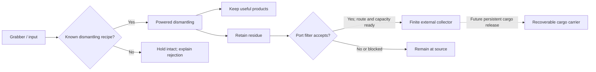

# Hull disposal port and material routing

**Subsequent implementation:** the owner authorised the first stage after this
report. See [Residue Collector](residue-collector.md) for the implemented
scope, revised details and test instructions. Persistent release below remains
research. The original findings are retained for provenance.

24 September 2026. Research authorised by the owner; **proposed behaviour, not an
implemented disposal system**. The Framework/Shipbreaker 0.3.0 connected-intake
candidate remains a separate owner test. This review changed no installed mods
or saves and performed no gameplay tests.

## Recommendation

Keep the separate, placeable hull outlet. It is a useful reusable destination for
Shipbreaker residue and, later, recycler rejects. Begin with powered transport to
a finite external collection chamber. Treat release into space as a subsequent
feature: the native jettison action destroys items, and dropping them outside is
not equivalent to giving them independent orbital motion.

For recoverable ejecta, the best lead found is a **batch of cargo in one persistent
small vessel/container**, using native ship persistence and motion. This needs
further integration work; neither native cargo-pod trading nor the existing
Framework transfer helper implements it. Avoid creating a new orbital entity for
every scrap fragment. An attached collector is a useful first slice, but it does
**not** reduce the ship's carried mass or complete the requested disposal feature.

This corrects the earlier suggestion that we could simply eject the same object
onto an exterior tile and retain it as independently recoverable debris.

## What the installed game actually provides

Baseline: owner screenshots identify Ostranauts **1.0.1.4**. The refreshed local
inventory records **34 known packages: 29 configured enabled, 5 disabled**, with
25 plugin entries in the latest available startup log. Configuration and plugin
log entries are different evidence; they do not prove every package is active in
the current world. Framework and Shipbreaker plugin entries are 0.2.1; their 0.3.0
candidate is prepared separately. Assembly-CSharp SHA-256 for this installation:
`1DC1858A8EDC514EC089F2FD7C55932C7F9B62B0A96201C15E2B2720122A03A7`.

| Finding | Consequence for our design |
| --- | --- |
| Native `JettisonItemAllow` uses `RemoveUs` with destruction enabled. `Interaction` schedules the removed object for destruction. Corpse/robot jettison also schedules destruction. | Do not use these actions for a promise of conserved, recoverable cargo. |
| `CondOwner.FallAway` checks for an EVA tile with gravity. Its coroutine shrinks/rotates the object for about five game seconds, then destroys a non-player object if the fall continues. The tile check excludes grounded ships and gravity below approximately 0.33 g. | Exterior loss is conditional, not instantaneous destruction of every item in vacuum. Nevertheless, a bare exterior drop is not a reliable retained cargo destination. |
| Cargo Web adds flexible-floor conditions. `DestroyAllEVACOs` explicitly skips flexible floors; native webbing also has gas exchange with outside. | Webbing provides a relevant exterior-retention precedent, not a pressure seal or proof of independent debris motion. Do not copy its atmospheric behaviour onto a sealed port. |
| `Ship.DropCO` searches nearby placement locations/containers and removes the current owner before resolving placement. | It is not a precise, transactional ejector. Do not use it without a dedicated placement/rollback adapter. |
| `TileUtils.IsExposedToSpace` checks neighbouring tiles and can succeed near an open docking system. | Exposure alone does not establish that the outlet points outside into clear space. Check direction, footprint and obstructions explicitly. |
| Native ship saves collect owned items through `Ship.SaveCOs`. `StarSystem.SpawnSignalBeacon` creates a separate ship object and starts with the launching ship's position/velocity before additional beacon-specific changes. | A persistent cargo carrier is plausible. A beacon is a precedent for an independent entity, not a ready-made cargo ejection API. |
| Native Cargo Pod is market-backed cargo equipment. Its removal spill code creates a limited/random selection of market items and destroys unplaced results. | Do not adapt that spill operation as a mass-conserving transfer of the player's existing items. |

Ordinary jettison is also absent from the current context-menu branch examined.
The developer's [November 2025 announcement](https://steamcommunity.com/games/1022980/announcements/detail/601921116586378525)
explains its removal for non-corpse objects after the inventory Trash option was
introduced. Its embedded announcement text was readable even though the browser
text extractor returned little content. This historical change explains why a
surviving JSON interaction should not be treated as an available player command.

### Alternatives and their honest limits

| Approach | Material remains available? | Assessment |
| --- | --- | --- |
| Native jettison/delete, with an exported-mass counter | No | Cheap abstraction, but the counter does not preserve physical cargo. Not recommended for our stated design. |
| Drop items on nearby exterior tiles | Not reliably | No independent motion established; native fall-away can destroy them. |
| Fixed external collector with a normal inventory | Yes, subject to normal damage and validated transfer/persistence | Recommended first usable transport endpoint. Still attached ship cargo. |
| Separate persistent cargo carrier containing a batch | Intended; integration not yet verified | Best lead for actual recoverable disposal. Adds cross-ship transfer, spawning, ownership, motion and save/load work. |

Do not globally disable falling/destruction, invent invisible floor islands, or
patch every loose object to keep a new port working. Those approaches would alter
unrelated gameplay and still would not establish correct independent motion.

## Proposed material rules

**Unwanted and unsupported are different.** A supported but unwanted item may
still use a known, mass-balanced dismantling recipe and pay its normal processing
cost. An unsupported item has no justified outputs yet. Hold it intact by default;
later allow deliberate intact export if it fits the whole transport route. Do not
run arbitrary native destruction loot as a universal recycler recipe. New
shredding recipes belong in the [processing expansion](shipbreaking-material-processing-research.md).

The first automatic export filter should match **`PhobosShipbreakerResidue`
exactly**. Each current panel yields 11 kg recovered material plus one 13 kg
residue object from a 24 kg input. Our residue deliberately lacks native trash
category conditions; matching `IsTrash`, zero price or a display name would be
incorrect. Ordinary trash, mining gangue, reusable parts and unknown mod items
must not silently become the same stream.

Later filters can add explicit item IDs, opt-in provider categories and keep/export
choices. A refusal or missing filter provider retains material and reports why.
Recipe eligibility, intake size and transport permission remain separate checks.
Installed objects, crew, occupied/nested containers and oversized items are outside
the first port's accepted payloads; do not strip their contents to make them fit.

## Physical design and player controls

- **Provisional port: two tiles along the hull, one tile deep**, over intact wall
  support, with a clear outward side and an inward underfloor connection. This is
  smaller than the four-wide industrial intake and cannot pass every item the
  grabber can hold. All rotations need the same support/clearance rules.
- Use a recessed static roller throat, a small shutter and a restrained status
  lamp, matching our coarse industrial sprites. Native conduit remains a separate
  entity. Keep the backing walls as the pressure barrier, as in the current chute;
  this is sealed transfer as a machine abstraction, not a simulated airlock.
- An integral external receiving chamber avoids a second adjacent inventory with
  an unclear purpose. Its normal **Inventory** is collected output. Propose a
  **2 x 2 inventory, maximum four unstacked residue objects (52 kg payload)** for
  the first slice. Confirm actual sprite/container fit when implementing; this
  capacity is proposed, not an existing definition. Machine mass and construction
  bill must be fixed and balanced before its usable build.
- A selected sender must have a valid route to the port. “Anywhere on the exterior”
  means any valid mount served by infrastructure, not arbitrary same-ship transfer.
  Start with one explicit source/destination pair and a documented continuous
  structural-floor route. The route graph and hull-separation handling still need
  implementation. Crossing open space or another docked ship is out of scope.
- Show selected source, filter, payload/capacity and a concrete waiting reason.
  Use right-click Control Panel and F3 commands through the same service. Initial
  actions: inspect, enable/pause and choose source. Name the action **Collect**
  until actual release exists; do not show a working-looking Eject control early.
- Settings may expose transfer interval, operating power and automatic collection.
  Fixed physical size, accepted payloads, item masses and construction materials
  should stay stable. Snapshot active-job timing so changing settings does not
  reinterpret work already paid for. Revalidate filters before moving cargo.

Transport power should be modest compared with dismantling: this is moving
material, not melting it. A **provisional** five-second, 2 kW motor cycle, matching
the existing intake's nominal cycle, would cost 10 kJ (0.00278 kWh) per transfer.
This is a gameplay starting point, not a measured requirement. Charge operating
cost only while work advances; paused or blocked jobs must not consume processing
energy. An intact reject pays transport cost, not a fictional dismantling cost.

## Reuse and extension boundary

[Framework 0.3.0 physical transfers](../src/PhobosFramework/Inventory/PhysicalTransfer.cs)
already preserve the same object and provide blocked/delivered/restore semantics.
The [native adapter](../src/PhobosFramework/Inventory/NativeItemTransfer.cs) is for
unstacked objects in finite containers on the same loaded ship. It is a good
starting point for an installed collector. It does **not** handle world drops,
cross-ship ejection, stacks, routes or filter configuration.

Keep shared transfer rules and a small reusable filter matcher in Framework as
the port creates a concrete need. Shipbreaker owns residue recognition and the
first hardware, artwork, construction and balance. Other mods should be able to
register their own payloads without depending on Shipbreaker or importing its
recipes. Do not build a general scheduler/network framework before the one-pair
route works. Keep recipe completion separate: products remain in the processor
when transport is blocked, and a full product tray stops further processing.

Installed [Common Sense Salvage and Storage](https://steamcommunity.com/sharedfiles/filedetails/?id=3790481217)
**0.12.14** is a useful optional companion. Its installed author README describes
physical crew hauling, opt-in AUTO containers, filters and priorities; its
`LICENSE` explicitly grants MIT terms, copyright 2026 LOGUSS. These are useful
interaction precedents. No callable conveyor/filter API was established in this
review. Preserve attribution if code is later reused; no source was incorporated
here. Initially leave collector automation under explicit player control to avoid
crew hauling rejects back into the processing flow. Do not duplicate its crew-job
system or require it as a dependency.

The refreshed inventory includes Crafting Framework and Salvage Workshop 0.8.71,
but establishes no need to restore those dependencies. A separate author's
[FFU Space Engineering listing](https://thunderstore.io/c/ostranauts/p/FFU_Group/FFU_Space_Engineering/)
is marked deprecated; its material refinery is listed as planned. It does not
establish an available solution to our transport/ejection requirement. No suitable
existing conveyor/disposal provider was verified in this bounded review.

## Implementation sequence and meaningful checks

1. Complete the owner test of the prepared grabber/chute/processor candidate.
   Keep that test focused; the disposal port is not needed to demonstrate intake.
2. Implement the one-pair route, residue filter and finite collector as a useful
   end-to-end slice. Reuse the transfer helper; keep the actual item at the source
   during the timer and perform a synchronous checked move at completion.
3. Add release only when a persistent cargo carrier can own the original payload
   across departure, unloading/reloading and save/load. It must inherit launch
   velocity, receive a deliberate outward separation velocity and have meaningful
   collision/clearance handling. Beacon-specific faction claims, orbital locking
   and proximity ignores are not cargo behaviour to copy.

For the collector, verify item ID/conditions/mass preservation, a full destination,
filter changes, competing crew removal, disconnected routes, power interruption
and paused reload. Reuse established electrical/container behaviour without
isolated basic-power tests. Do not remove material to create an in-flight counter.

For later release, specifically verify transfer of ownership out of the source
ship, mass on both sides, save persistence and retrieval after the source departs.
Carrier packaging must have accounted-for mass; an empty spawned template must
not add free hardware or duplicate cargo. Recoil is a separate unresolved motion
integration question, not something the visual pushback proves. Cap carrier
creation with finite batches/backpressure, not silent expiry/deletion of cargo.

Existing residue description text says “jettison as a physical item.” Revise that
claim in the next runtime build to describe only available retain/haul behaviour;
ordinary native jettison is not a demonstrated recovery feature.

## Evidence and reproducibility

All native paths below are relative to the installation's
`Ostranauts_Data/StreamingAssets/data`; inspected engine symbols are in
`Assembly-CSharp.dll`. Local research extracts and inventory details remain in
ignored `.local/research/`, not distributed with the mod.

| Evidence | Location / symbol |
| --- | --- |
| Destroying jettison definitions | `interactions/interactions.json`: `JettisonItem`, `JettisonItemAllow`; `Interaction` removal-contract execution and corpse/robot cases |
| Exposure and fall-away | `CondOwner.FallAway`, `_FallAway`; `Tile.IsEvaTileWithGravitation`; `TileUtils.EVAFallAwayCheck`, `DestroyAllEVACOs`, `IsExposedToSpace`; `Ship` gravity update |
| Webbing and cargo-pod definitions | `condowners/condowners.json`, `items/items.json`: `ItmCargoWeb01`, `ItmCargoPod01`; `loot/loot.json`: `TILFloorExtFlexAdds`; `Ship.DropCargoPodContent` |
| Placement and persistence leads | `Ship.DropCO`, `Ship.SaveCOs`, `StarSystem.SpawnSignalBeacon` |
| Existing Phobos behaviour | `src/PhobosFramework/Inventory/`; `src/PhobosShipbreaker/IntakeDefinitions.cs`, `IntakeService.cs`, `Content.cs`, `Core/ProcessRules.cs` |
| Installed mod snapshot | Existing `scripts/inventory-mods.py`; ignored output `mod-inventory-disposal.json`; CSSS package README/LICENSE |

This establishes native precedents and concrete limitations, not tested
compatibility for the proposed port. No further screenshots or in-game actions
are needed from the owner for this research stage.
