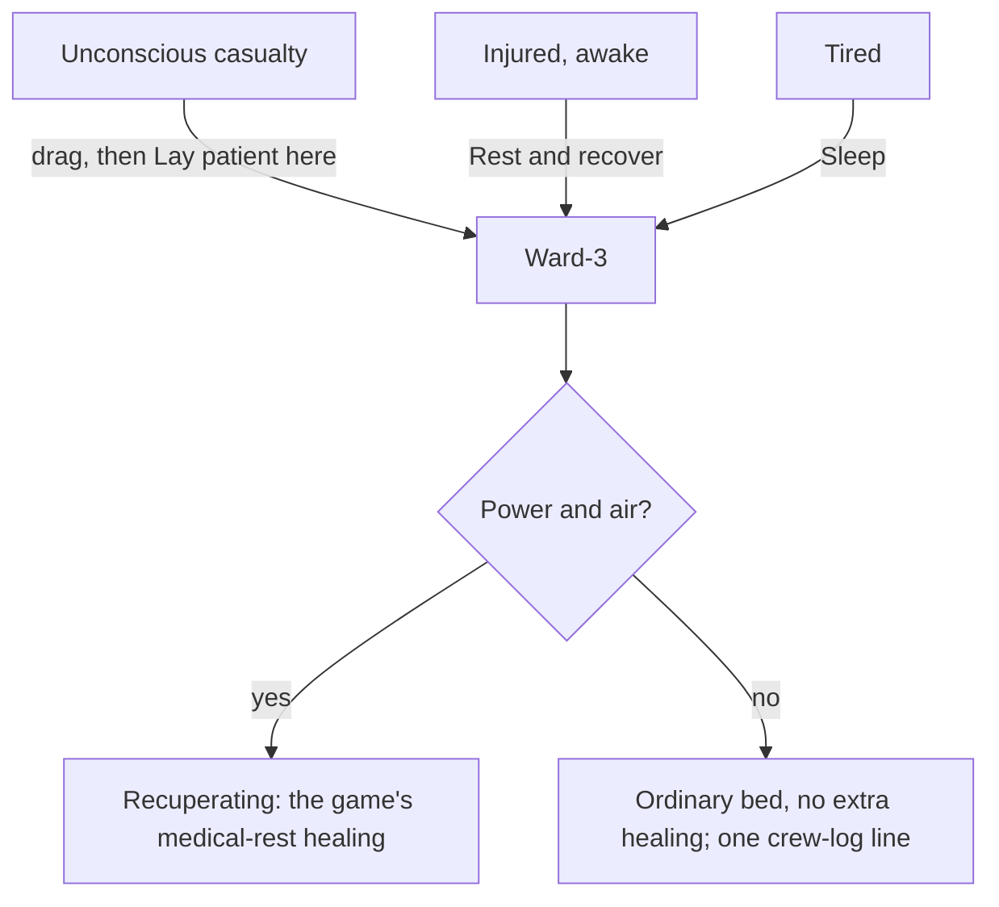

# Phobos Medical: the Halewright Ward-3 medical bed

The Phobos' Halewright Ward-3 Medical Bed is a powered sickbay bed. The game's own
medical bed only helps someone tired enough to climb in and sleep; the Ward-3 also
takes an unconscious casualty and lets the injured lie down awake, and keeps them
mending while its power holds.

Phobos Medical requires Phobos Framework (see [installing](installing-mods.md)
for the current minimum). Automated checks pass; in-game checks are still pending.

## Getting it running

1. Buy a Ward-3: new at the K-Leg furnishings kiosk, worn from the K-Leg fixer,
   broken at the K-Leg supply kiosk, refurbished at the Venus scrap kiosk, at the
   regional supply kiosks, or for scrip at the CCRE and GalCon faction kiosks
   (Friendly standing). It is 3 tiles across and 5 deep, like the game's own bed.
2. Install it through **INSTALL, FURN** with a Mortorq. Put its head against a
   wall that carries power: it draws from the tile row behind its head. Leave the
   floor at its foot clear: crew open the drawer and work on the patient from there.
3. Right-click it. You will see **Rest and recover**, **Sleep**, **Lay patient
   here**, **Send injured crew here**, **Keep patient treated** and **Control Panel**.
4. Put clean scrap cloth and a splint or two in its drawer, then switch on **Keep
   patient treated** so the crew look after whoever lies in it.

The Ward-3 is the off-white bed with capped cartridges at its head and two folded
treatment arms. Those are styling for a 2075 sickbay: its healing is the game's own
medical rest, not nanomachine surgery.

## Three ways into the bed

| Who | What to do | What happens |
| --- | --- | --- |
| An unconscious crew member or passenger | Drag them to the bed, then right-click the bed and choose **Lay patient here** | They lie in the bed and recuperate while they are out. When they come round they get up as usual. |
| An injured crew member who is awake | Right-click the bed with them selected and choose **Rest and recover** | They lie down awake and recuperate. If they get sleepy they fall asleep where they lie. Once their injuries have eased they get up. Hunger, thirst and the toilet still get them up. |
| Anyone tired | **Sleep**, as in any bed | Sleep in a powered Ward-3 is the game's own medical rest, the same as the vanilla medical bed. |

Only one person at a time. The bed refuses anyone else while it has a patient.
**Rest and recover** is for the injured only: someone in good health is told to
sleep instead.

## What the care does

While the bed is installed, intact, powered and in a room with air, its patient
**recuperates**: the game's own medical-rest healing, which is what the vanilla
medical bed gives a sleeper. Wounds close noticeably faster (from about a 9-hour
half-life asleep anywhere to about 4 hours), blood, infection and pain recover a
little faster, and in a time skip a sleeping or unconscious patient gets the game's
own medical hour, which also clears a little poison and radiation.

- **No power, no care.** If the power or the room's air fails, the care stops at
  once and the crew log says so; it starts again when they return. An unpowered
  Ward-3 is an ordinary bed.
- **Weightless care.** The game cuts wound healing to a twentieth for anyone
  weightless. A patient under the Ward-3's care heals at the normal rate instead, and
  the panel shows it. If a game update changes the game's wound code, the bed cannot
  do this and its panel says so.
- **It does not treat wounds.** Dress bleeding wounds with clean cloth and splint
  fractures yourself from the paper doll, as before. Keep dressings and splints in
  the bed's drawer.

## The Control Panel

Right-click the bed and choose **Control Panel**:

- **Operation** shows the patient, how they came to be in the bed (resting awake,
  asleep or unconscious), how long they have been under care, a short reading of
  blood lost, infection, pain, the worst wound and any bleeding wounds or unsplinted
  fractures, the room's pressure and the power.
- **Settings** has two choices. **Use**: *Anyone* (the default; anyone tired may
  sleep here, and the injured may also rest) or *Injured only* (sleep is offered
  only to the injured). **Send injured crew here**: *Off* (the default) or *On*.

## Sending injured crew to bed

Right-click the bed and choose **Send injured crew here**, or switch it on in
**Settings**. While the bed is free, powered and in air, it calls the worst-off
injured crew member to **Rest and recover**, one person at a time, and the crew log
says who is coming.

- The order joins the end of what they are already doing; nothing is cancelled.
- It never sends the crew member you are controlling, anyone asleep, unconscious or
  fighting, or someone already on the way to a bed.
- Who counts as injured is the same rule as for **Rest and recover**.

## The Vigil-2 patient monitor

The Phobos' Halewright Vigil-2 Patient Monitor is a two-by-two cart you stand beside a
Ward-3, touching it or one tile away. Install it through **INSTALL, APPS** with its back
against a wall carrying power. Its **Control Panel** shows:

- the patient, awake or unconscious;
- blood lost, infection, pain and the worst wound, each with its change over the last
  hour (the trend starts after ten minutes and again after a reload);
- every open wound by place: cut and blunt damage, and whether it is bleeding,
  dressed, fractured, splinted or infected.

When blood loss, infection or pain rises to its alert level, or a wound starts
bleeding, it posts one caution to the crew log (and the navigation screen if open).
It warns again only once the figure has eased and risen again.

| Setting | Choices |
| --- | --- |
| **Watch** | *Whichever bed touches it* (the default), or one touching bed by name when two touch it |
| **Alerts** | *On* (the default) or *Off* |

It only watches: it never treats, heals or moves anyone. With no bed touching, no
power or a damaged monitor, its panel says so instead of showing readings.

## Keeping the patient treated

Right-click the bed and choose **Keep patient treated**; choose it again to stop.
While someone lies in the bed, a crew member on shift with the **Operate** duty
comes to the bed and works through what the patient needs, worst first:

| Need | What the crew do | Uses |
| --- | --- | --- |
| A bleeding wound with nothing on it | Dress it | One clean scrap cloth |
| A broken arm or leg, not splinted | Splint it | One splint |
| A dressing gone dirty | Take it off and put a clean one on | One clean scrap cloth |

The item goes on the wound just as if you had dropped it there yourself, so the
game's own effects do the healing: a clean dressing stops bleeding, a splint sets
the bone, and a dirty dressing stops spreading infection once it is off. Bleeding
comes first, vital parts before limbs. The old dressing is left on the deck beside
the bed.

- **Supplies.** The crew take from the bed's drawer. When it is out, crew with the
  **Haul** duty fetch cloth or splints from the deck, unlocked containers or other
  machines' trays anywhere aboard. They never take from someone's hands, a locked
  container or a wound. If there is none aboard, the Crew panel says what is missing.
- **Who treats.** Crew with the game's trauma skill (dressing and splinting) or
  nursing skill (changing dressings) are asked first and work faster. The patient
  never treats themselves. Each crew member's **Medical care** role in the Crew panel
  is on by default; switch it off to keep someone away from this work.
- It is one order per bed, and it only treats the person in that bed.

## The drawer

A three-by-two drawer at the head takes dressings (clean or dirty scrap cloth),
splints and medicines. **Keep patient treated** takes its cloth and splints from here.

## Tuning it

The bed's power, the thresholds that decide who counts as injured and the
treatments the crew give (what each uses, how long it takes, which skill speeds it)
are in the **care** data file. You can add a treatment of your own, such as dressing
with a dirty cloth when clean cloth runs out. See [editing the data files](editing-data-files.md#tuning-the-medical-bed).
The healing itself is the game's own and is not in that file.

## Upkeep

- Damage: repair with a Mortorq and a soldering tool, a motor, a mainboard, six
  clean scrap cloth, small parts and scrap, as the vanilla medical bed.
- Uninstalling or dismantling is refused while someone is in the bed.
- F3 console: `phobosmedical list` names the beds on your ship; `phobosmedical
  status <id>` shows one; `phobosmedical use <id> anyone` or `injured` sets the
  Use choice; `phobosmedical send <id> on` or `off` sets Send injured crew here;
  `phobosmedical alerts <id> on` or `off` and `phobosmedical bed <id> <bed id>` or
  `auto` set a monitor.

## Saves

Each bed remembers its patient and its setting. Loading a save picks the patient up
again on the bed's first check. If a bed's saved record cannot be read, its panel
says so and offers **Accept** to start it afresh.

## Troubleshooting

| What you see | Why | What to do |
| --- | --- | --- |
| No **Lay patient here** | You are not dragging anyone, or the person is awake or dead | Drag an unconscious person first. An awake one can rest or sleep. |
| **Rest and recover** is refused | That crew member is not injured enough | Let them sleep instead, or tune the thresholds. |
| **Inventory** says the crew cannot get there | The floor at the foot of the bed is blocked | Clear the tile past the foot of the bed, or move the bed. The drawer opens from the foot. |
| The patient is not recuperating | No power, no air, or the bed is damaged | Check the panel: it names the reason. |
| Healing is very slow | The patient is weightless but not under care (no power, no air), or the panel says this game version's wound code has changed | Restore power and air; otherwise spin up the ship. |
| The monitor says no Ward-3 is touching | It stands more than one tile from the bed, or the bed is loose | Move it beside the installed bed. |
| Nobody comes to treat the patient | Nobody on shift has the Operate duty or the Medical care role, the drawer is empty and nothing usable lies aboard, or the patient needs nothing the crew can do | Open the bed's Crew panel: it names the reason. |
| Nobody comes when Send injured crew here is on | Nobody aboard counts as injured, everyone injured is under your control or busy fighting, or the bed has no power or air | Check the panel; order someone to Rest and recover yourself. |

More: [design record](development/medical-bed-design.md),
[what the vanilla bed does](development/medical-bed-research.md).
