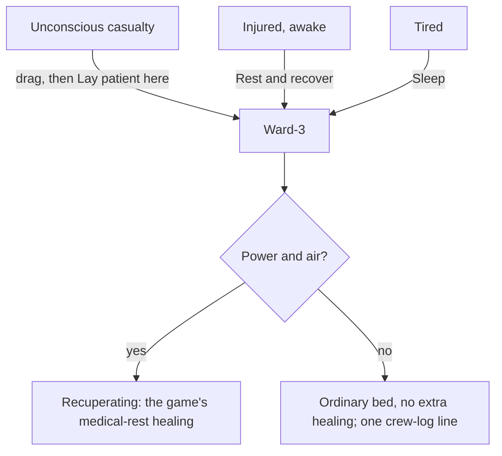

# Phobos Medical: the Halewright Ward-3 medical bed

The Phobos' Halewright Ward-3 Medical Bed is a powered sickbay bed. The game's own
medical bed only helps someone tired enough to climb in and sleep; the Ward-3 also
takes an unconscious casualty and lets the injured lie down awake, and keeps them
mending while its power holds.

Phobos Medical 0.1.0 requires Phobos Framework (see [installing](installing-mods.md)
for the current minimum). Automated checks pass; in-game checks are still pending.

## Getting it running

1. Buy a Ward-3: new at the K-Leg furnishings kiosk, worn from the K-Leg fixer,
   broken at the K-Leg supply kiosk, refurbished at the Venus scrap kiosk, at the
   regional supply kiosks, or for scrip at the CCRE and GalCon faction kiosks
   (Friendly standing). It is 3 tiles across and 5 deep, like the game's own bed.
2. Install it through **INSTALL, FURN** with a Mortorq. Put its head against a
   wall that carries power: it draws from the tile row behind its head.
3. Right-click it. You will see **Rest and recover**, **Sleep**, **Lay patient
   here** and **Control Panel**.

The Ward-3 is the off-white bed with capped cartridges at its head and two folded
treatment arms. Those are styling for a 2075 sickbay: its healing is the game's own
medical rest, not nanomachine surgery.

## Three ways into the bed

| Who | What to do | What happens |
| --- | --- | --- |
| An unconscious crew member or passenger | Drag them to the bed, then right-click the bed and choose **Lay patient here** | They lie in the bed and recuperate while they are out. When they come round they get up as usual. |
| An injured crew member who is awake | Right-click the bed with them selected and choose **Rest and recover** | They lie down awake and recuperate. If they get sleepy they fall asleep where they lie. Once their injuries have eased they get up. Hunger, thirst and the toilet still get them up. |
| Anyone tired | **Sleep**, as in any bed | Sleep in a powered Ward-3 is the game's own medical rest, the same as the vanilla medical bed. |

Only one person at a time. The bed refuses anyone else while it has a patient.
**Rest and recover** is for the injured only: someone in good health is told to
sleep instead.

## What the care does

While the bed is installed, intact, powered and in a room with air, its patient
**recuperates**: the game's own medical-rest healing, which is what the vanilla
medical bed gives a sleeper. Wounds close noticeably faster (from about a 9-hour
half-life asleep anywhere to about 4 hours), blood, infection and pain recover a
little faster, and in a time skip a sleeping or unconscious patient gets the game's
own medical hour, which also clears a little poison and radiation.

- **No power, no care.** If the power or the room's air fails, the care stops at
  once and the crew log says so; it starts again when they return. An unpowered
  Ward-3 is an ordinary bed.
- **Weightlessness still slows healing.** The game cuts wound healing to a
  twentieth in microgravity, in this bed as anywhere. A fix is planned.
- **It does not treat wounds.** Dress bleeding wounds with clean cloth and splint
  fractures yourself from the paper doll, as before. Keep dressings and splints in
  the bed's drawer.

## The Control Panel

Right-click the bed and choose **Control Panel**:

- **Operation** shows the patient, how they came to be in the bed (resting awake,
  asleep or unconscious), how long they have been under care, a short reading of
  blood lost, infection, pain, the worst wound and any bleeding wounds or unsplinted
  fractures, the room's pressure and the power.
- **Settings** has one choice, **Use**: *Anyone* (the default; anyone tired may
  sleep here, and the injured may also rest) or *Injured only* (sleep is offered
  only to the injured).

## The drawer

A three-by-two drawer at the head takes dressings (clean or dirty scrap cloth),
splints and medicines. It is ordinary storage for now; later releases use it.

## Tuning it

The bed's power and the thresholds that decide who counts as injured are in the
**care** data file. See [editing the data files](editing-data-files.md#tuning-the-medical-bed).
The healing itself is the game's own and is not in that file.

## Upkeep

- Damage: repair with a Mortorq and a soldering tool, a motor, a mainboard, six
  clean scrap cloth, small parts and scrap, as the vanilla medical bed.
- Uninstalling or dismantling is refused while someone is in the bed.
- F3 console: `phobosmedical list` names the beds on your ship; `phobosmedical
  status <id>` shows one; `phobosmedical use <id> anyone` or `injured` sets the
  Use choice.

## Saves

Each bed remembers its patient and its setting. Loading a save picks the patient up
again on the bed's first check. If a bed's saved record cannot be read, its panel
says so and offers **Accept** to start it afresh.

## Troubleshooting

| What you see | Why | What to do |
| --- | --- | --- |
| No **Lay patient here** | You are not dragging anyone, or the person is awake or dead | Drag an unconscious person first. An awake one can rest or sleep. |
| **Rest and recover** is refused | That crew member is not injured enough | Let them sleep instead, or tune the thresholds. |
| The patient is not recuperating | No power, no air, or the bed is damaged | Check the panel: it names the reason. |
| Healing is very slow | The ship is weightless | The game slows wound healing in microgravity; spin up or wait for the planned fix. |

More: [design record](development/medical-bed-design.md),
[what the vanilla bed does](development/medical-bed-research.md).
