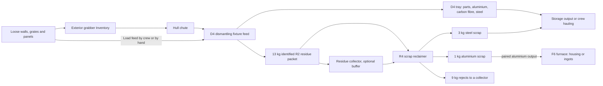

# Current player guide

Keep the ship moving, turn salvage into useful stock, and grow something worth
eating. This guide starts with installation and the basic shipbreaking loop.

- [Navigation and flight controls](development/auto-nav-instruments.md): fit a Polaris module,
  select a sensor contact and choose Approach or Dock. Disengage leaves you coasting.
- [Cultivation and cooking](agriculture-player-guide.md): grow potatoes or lettuce,
  cook portions and add irrigation when you need it.
- [Electric furnace](furnace-player-guide.md): cast aluminium housings or aluminium
  and steel ingots with power, cooling and room for the products.
- [Crew orders](crew-automation.md): choose work and approved stores, then enable it.
- [Battle damage](war-declared-player-guide.md): stand down after a fight and the game's own build sites go back where destroyed parts stood.
- [Control panels](control-panel-guide.md): Apply/Discard, storage selection and training.
- [Equipment references](item-references.md): what each item does, where to find it,
  installation, service bills and prices.
- [Markets](solar-system-economy.md) and [stock quantities](development/merchant-stock.md):
  availability depends on ordinary merchant restocking.

**Prepared versions:** Phobos Framework **0.52.0**, Shipbreaker **0.49.0**, Auto Nav
**0.30.0**, built against Ostranauts **1.0.1.5** / BepInEx **5.4.23.5**.
These are development packages. Automated checks do not establish in-game
compatibility or tell you which version is installed locally. Ordinary saves are
supported; keep required content installed. [Getting started](getting-started.md)
explains availability and prerequisites; [support](../SUPPORT.md) explains bug reports.
Version history and past validation reports remain in the individual changelogs.

## Install or update

Close Ostranauts and double-click **Install or Update Mods.cmd** in the repository
root. It installs the prepared Auto Nav and Shipbreaker packages and automatically
includes their required Phobos Framework. BepInEx 5 must already be installed.
See [installation and recovery](installing-mods.md) for individual-mod selection,
verification and build instructions. Building is separate from installing.

Crafting Framework, Salvage Workshop and Auto Navigate are not dependencies.
Retain other providers when your save or other mods use their content. Original
Auto Navigate must be disabled for our Auto Nav to engage; installing ours does
not disable it automatically. Shipbreaker requires Auto Nav; see the
[current dependency minima](installing-mods.md). [Selected-G4 capture](development/shipbreaker-capture.md) uses existing N1/N2 hardware.

After launch, these F3 commands report the actual loaded versions and readiness:

```text
phobosframework status
phobosshipbreaker dependencies
phobosnav status
```

## Obtain the equipment

Buy equipment at its normal merchants, or make sections and smaller equipment at an installed **Bar Table or Dining Table** (supported workbenches are optional). Final D4/R4/F6 assembly takes place at a **construction site**: choose **Install** on a section or the machine in **INSTALL > APPS**. Crew can deliver the bulky sections one at a time. Mortorq and soldering tools are reusable requirements. See [assembly and maintenance](section-assembly-and-maintenance.md).

| Equipment | Unmodified assembly work | Ordinary acquisition |
| --- | ---: | --- |
| Dismantling fixture | Two sections at 60 min each, then 48 min site assembly including mounting | Broken stock at K-Leg/VORB scrap suppliers; occasional usable stock at K-Leg's fixer; new at San Diego's Halvorson |
| Scrap reclaimer | Two sections at 75 min each, then 66.6 min site assembly including mounting | K-Leg/VORB scrap, K-Leg fixer, San Diego Halvorson; [reclaimer guide](scrap-reclaimer.md) |
| Exterior grabber | 60 min | K-Leg/VORB scrap, K-Leg fixer, San Diego Halvorson |
| Hull chute | 30 min | Same industrial suppliers |
| Residue collector | 40 min | Same industrial suppliers |
| N2 Pursuit module | 30 min | Polaris pristine merchant offer or table construction; same electronics bill as N1 |
| N3 Fire Control System | 30 min | Polaris pristine merchant offer or table construction; same electronics bill as N2 |
| Auto Nav module | 30 min | Navigation offers in the economy guide; native N1/N2/N3 module salvage |

Stock is probabilistic and appears through normal merchant restocking. Restarting
does not force new inventory. Broken equipment needs **Repair**; functional worn
equipment uses **Restore**. Fetching, skills and interruptions affect elapsed
work. [Prices, bills, stock conditions and maintenance times](equipment-economy.md)
are the authoritative balance reference.

Equipment now uses **Phobos' Asterel** electronics and **Phobos' Rivetline**
industrial model names. See the [equipment name directory](development/equipment-branding.md)
for the names to look for in shops and construction menus. The role names below
remain shorthand; commands and saved IDs are unchanged.

## Install the connected Shipbreaker

Arrange the equipment flush together, with matching four-tile widths:

```text
SPACE       [ exterior grabber, 4 wide x 3 deep, arms outward ]
HULL        [ chute, 4 wide x 1 deep, OVER four intact walls  ]
INTERIOR    [ processor, 4 x 4, loading mouth toward chute   ]
```

**Keep the four walls.** They provide the pressure seal. The processor needs
interior floor and accessible space alongside it. The grabber needs clear space
outside. There must be no gap or sideways offset between the three pieces.
Build the electrical conduit separately and power the grabber and
processor. See [mounting and rotation](shipbreaker-hull-intake.md).

The collector is optional: the processor works with its own product tray. Stand
it on **two structural floor tiles**, keeping both tiles along its service side
clear for pedestrians. Alternatively, mount it over **two intact exterior walls**,
with its service panel inward and receiving pocket outward, clear exterior space
and structural floor inside. For Agriculture's optional Recycler attachment,
align the collector's full two-tile pocket against a Recycler edge, with the
service face away; see the [attachment guide](agriculture-nutrient-production.md).
It requires its own electrical connection and a structural-floor route from
the processor. It does not cross gaps, cargo webbing or a docked ship.

## Load, run and unload

Here is where salvage goes, from loose parts to finished stock. The collector,
reclaimer and furnace are optional steps; the D4 works on its own.



1. With crew able to reach the exterior grabber, right-click it and choose
   **Inventory**. Load detached structural parts: an **ordinary wall** of any
   make (14 to 48 kg), a floor grate, a DuraWal, Whipple or aero panel or a
   window. Use separate, empty, uninstalled parts; separate stacks before
   loading. The grabber can hold other solids, but that
   does not make them valid processing inputs.
2. Select awake crew beside the processor, press **F9**, and choose
   **Start / resume pipeline**. At defaults, intake takes 5 powered seconds and
   processing takes 60 powered seconds per panel. Four panels fit in the feed;
   processing handles one at a time.
3. Right-click the processor and choose **Inventory** to collect its products:
   two small mechanical parts, two aluminium scraps, two carbon-fibre scraps,
   six steel scraps and one 13 kg identified R2 residue packet from a plain 24 kg
   wall. A lighter or heavier make gives fewer or more steel scraps; the total
   always equals the wall's own mass. Floor grates, DuraWal, Whipple and aero
   panels and windows return native scrap and parts plus one terminal reject
   packet each; every budget is in [feed families](development/feed-families.md).
   Started revision-1 jobs still yield the old unclassified mixed residue.
4. To collect residue automatically, right-click the collector → **Control Panel**,
   select the processor with **Link**, then **Start transfers**. Alternatively
   choose the collector through F9 → **Output routing**, then start
   collection at the collector. Linking alone does not start it.
5. Empty the collector through its **Inventory**. Four packets fill it (52 kg).
   Collected residue remains aboard and counts toward ship mass. Link the fixture
   directly to the [scrap reclaimer](scrap-reclaimer.md), or link the collector
   output to its feed. Start input transfers and processing separately at the
   reclaimer. Each identified R2 packet returns 3 kg steel, 1 kg aluminium and
   9 kg rejects; link its output to a collector with the rejects filter. See
   [automatic routing](automatic-material-routing.md) for the controls. Legacy
   packets remain unclassified storage cargo; collection never ejects material.
6. To keep the product trays clear without hauling, choose a D4 or R4
   [storage output](automatic-material-routing.md#storage-outputs-for-ordinary-products):
   one unlocked storage container joined by structural floor, then **Start unloading
   to storage**. For repeated F6 casting, see
   [Repeat batches](furnace-player-guide.md#repeat-batches).

**The processor's normal Inventory is output.** The feed is a separate window;
a wall cannot be fed through the processor's ordinary Inventory, and the chute
has no inventory.

## Hand-fed operation without the grabber

Ships that cannot fit the grabber and chute still run every machine. Take the
wreck apart with the game's own **Uninstall** on its walls (a structure cutter,
undamaged walls only), carry the loose panels aboard and leave them on the deck
or in any unlocked store. Then either:

- Right-click the D4 and choose **Load feed by crew (on/off)**. Crew with
  AutoTask on and the Haul duty keep bringing accepted parts from anywhere
  aboard (the deck, unlocked stores and other machines' product trays, nearest
  first). The D4 processes them as they arrive, and the order stays on through
  time-skips and reloads until you switch it off. The same order appears under
  [Crew standing orders](crew-automation.md), where you can pin one input store
  instead.
- Or open the feed window yourself: right-click the D4, choose **Control Panel**,
  then **Open feed inventory** (or F3 `phobosshipbreaker feed`), drop the panels
  in and choose **Start / resume processing** once. The queue then waits for
  more panels from any source.

Any of the game's ordinary wall makes is accepted, 14 to 48 kg. Each panel
yields the 13 kg identified residue packet plus parts, aluminium, carbon fibre
and steel for the rest: a plain 24 kg wall gives exactly the products above,
a light Aero-series wall gives the packet and the parts, and a heavy
Glory-series wall gives more steel. A heavy wall needs room for all its pieces
in the tray; the queue waits while the tray is full.

Since 0.36.0 the feed also takes floor grates (3 to 13 kg, by half kilograms),
DuraWal interior walls, Whipple shielding panels, aero panels and windows.
Those return native scrap and parts plus one terminal reject packet, which
leaves through the storage output or by hand. Doors, hatches, conduit,
furniture and machinery are refused with the reason; a few floor makes weigh
nothing in the game's own data or fall between half kilograms and are refused
too.

The R4 and the F6 work the same way. **Load feed by crew** on the R4 brings
identified residue packets from anywhere aboard, including the D4's product
tray when the two are not paired. On the F6 it brings single pieces of the
metal the selected recipe takes (aluminium, or steel for steel ingots since
0.38.0) until the charge is full; sealing, heating and release still need the
hazardous permission or a repeat run. To load the F6 by hand, pick the
aluminium stack up in the inventory window and right-click on the charge bin
to place one piece at a time; the bin takes single pieces only.

Since 0.37.0 the chain also stores water: the S3 process water silo holds
1,000 kg (the S4 and S5 sizes 1,960 and 3,330 kg), the T2 ice thaw unit turns the game's water ice into silo water and
gangue, station Bulk supplies sell process water, and Ship's Water tanks can
be drawn from or returned to through their waste tanks. See the
[process water silo and ice thaw unit](shipbreaker-bulk-silos.md).

Since 0.43.0 the Y2, Y3 and Y4 [material bins](shipbreaker-material-bins.md)
store what the crew mine (ore, regolith, gangue, ice and mined chunks) in an
ordinary inventory grid that crew orders can fetch from and fill.

## Interruptions and settings

Pause retains panel work. Cancel resets work on panels already inside the
processor without deleting them. On reload, panel recipe, progress and duration remain,
and the collector keeps its selected partner, but both systems wait for you to
start them. Short transfer timers reset; their physical cargo stays at the sender.
Full output waits with cargo retained. Nothing processes while its ship is unloaded.

Change settings with the game closed, then restart. Shipbreaker uses
`BepInEx/config/phobosgekko.ostranauts.shipbreaker.cfg`; available controls include
cycle time, electrical demand, queue continuation, transfer time and the F9 key.
An already-started panel keeps its duration and recipe outputs. Unknown saved
recipes stop with the panel retained; status explains the next action.
[Job compatibility](development/processing-job-compatibility.md) and
[complete settings and commands](development/shipbreaker-first-build.md).

| Symptom | Next useful check |
| --- | --- |
| Wall rejected or inventory grey | The processor's own Inventory is the product tray: use the grabber's Inventory, the feed window in the controls or Load feed by crew; check crew reach, that it is a part the fixture takes (ordinary walls of any make, floor grates, DuraWal, Whipple and aero panels, windows), stacks and contents |
| Pipeline not connected | Check flush placement, facing, intact supporting walls and clear exterior cells |
| Processor waiting | Read F9/status for power, feed eligibility or space for a complete output batch |
| Collector waiting | Check pair, Collect state, floor route, clear mouth and its four-packet capacity |
| No equipment in a shop | Allow normal restocking; stock is not guaranteed on every refresh |

For a concrete failure, send the relevant status text and a screenshot:

```text
phobosshipbreaker status
phoboscollector status
phobosshipbreaker dependencies
```

There is no prerequisite isolated test of ordinary power draw. Focus on the
connected workflow, retained materials and any actual failure you encounter.

## Auto Nav and current limits

The [Polaris flight hub](development/auto-nav-instruments.md) is one tall instrument shared by
N1, N2 and N3. Use native **Edit** to place its new 25%-wide, 80%-high footprint in a
clear column. Existing compact placements do not expand automatically or move
other instruments. Keep the native map, sensors, warnings and Comms available.

- **Navigation:** Approach, Dock, explicit Approach & Dock, propulsion preference,
  cruise speed, arrival speed and separation. Range, signed closing speed and
  relative speed are separate readings. Active docking shows clearance, captured
  ports, alignment and progress directly on this page.
- **Pursuit:** working [N2](auto-nav-pursuit.md) adds Rendezvous and continuous
  Follow with separation and cruise controls.
- **Fire:** [N3 Fire Control System](auto-nav-fire-control.md) adds independent
  observations, 1–9 volleys, group ownership, guarded Engage and optional RCS
  aiming. N2 no longer grants firing permission. Navigation/offensive targets are
  separate; Cease Fire retains Follow and offensive hold until Return to Native.
- **Systems:** essential propulsion readings and native torch controls. Manual
  propulsion actions relinquish automation and retain native restrictions.
- **Details:** diagnostics/help only. Routine controls never require scrolling.

Resume, Disengage and Cease Fire remain on every page. **Disengage clears thrust
and allows coasting; it is not emergency braking.** Native clearance and compatible
assigned ports are required for docking. Approach & Dock stages 1 km beyond
protected hull clearance, matches motion, then checks the RCS terminal handoff.
A failed handoff suspends with its reason and requires Resume. Ordinary Approach
does not dock. See [docking operation](auto-nav-docking.md).

Pursuit and both docking phases suspend after loading. No fire permission or live
thrust is saved; page changes and display refresh cannot authorize actions.
[Qualified sensor contact](auto-nav-sensors.md) is required throughout. Missing
measurements are unavailable, not zero. Saved flights keep their exact hardware,
target and profile; stop before replacing them. Every switched-on sensor counts;
Details and `phobosnav sensors` show each sensor's signal and any that are off.
When the target or a nearby hazard is too faint, Auto Nav switches on the fewest
sensors that fix it, non-emitting first, warns you and later switches off only its
own; see [automatic sensor engagement](auto-nav-sensors.md#automatic-sensor-engagement-0240).
Approach also works on a sensed asteroid within 1,000 km, stopping inside native
tether reach for mining.

N1/N2 acquisition, repair and salvage remain in the [economy guide](auto-nav-economy.md)
and [N2 guide](auto-nav-pursuit.md). Either working module supplies navigation and
docking. N3 alone supplies Fire and Systems; all combinations share one hub.
Acquire N3 through the Polaris merchant or the same two-electronics/30-minute
construction route as N2. Native spawning: `spawn PhobosNavModFireControl`.

Short-range approaches below **5,000 km** remain the immediate goal. No general
obstacle avoidance, guaranteed pursuit or intact boarding guarantee is supplied.
Use a clear route and keep specialist native instruments accessible. Numerical
checks and offline layout proofs are not gameplay validation; see the
[validation record](development/auto-nav-hub-validation.md). No installation or
publication is implied by this prepared redesign.

## Industrial controls (0.10.0)

[Console and equipment panel guide](industrial-console-player-guide.md): a 3 x 3 ship-bound workstation, local Control Panels, automatic grouping, search, Attention and routing. The current Shipbreaker 0.49.0 requires Framework 0.52.0 and Auto Nav 0.19.0 and includes [shared observations](development/shared-console-observations.md) and optional [shared completion cues](shared-completion-cues.md). Prepared for owner testing; no in-game validation claimed.

Agriculture now supports [finite potato and lettuce nutrient-solution piping](agriculture-nutrient-solutions.md) through its W2 supply and irrigation conduits.

## Crew standing orders

See [crew automation, specialities and time-skips](crew-automation.md) for default-disabled orders, native duty/AutoTask rules, approved stores, training, saved stops and supported onboard work. Industrial batches, exterior missions and crew-launched flight require explicit Resume. Gameplay and UI checks remain owner-run.

### Coordinated combat flight

Auto Nav 0.22.0 adds [N2 + N3 Combat](auto-nav-combat.md) on Track. Select the fire
target and aim-reference weapon first. Enter Combat starts movement and aiming;
Engage grants firing separately. Cease Fire retains range matching. Leave Combat
and Resume the previous flight explicitly. Docking, braking and traffic safety
retain priority. Live handling still needs owner playtesting.

Secured two-ship towing is supported for ordinary flight, FCS and Combat; see [towing controls and limits](auto-nav-towing.md). Release the tow before terminal docking or industrial close work.

### Moving equipment and assembly sections

Loose machines and bulky assembly sections use the native drag slot. The game may label the action Pick Up; this does not mean the item fits in a hand or ordinary container. Installed equipment must be uninstalled first. D4-S, R4-S and F6-S are unfinished sections. Choose Assembly information for instructions, then Install on a section or the completed machine in INSTALL > APPS to place a construction site. Deliver two D4-S, two R4-S or three F6-S separately; final assembly no longer happens at a table. Sections have no operating-machine controls. Existing saved cargo stays in place; put any previously held heavy section down once to use corrected handling. See the [item handling audit](development/item-handling-audit.md).
