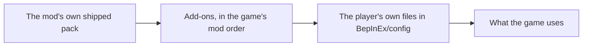

# Publishing a Phobos add-on

An add-on is your own changes to the Phobos mods, packed as an ordinary Ostranauts
mod that other players can subscribe to on Steam Workshop. It is data only: text
files, and no code. If you can [edit the data files](editing-data-files.md) for
yourself, you can publish them.

What an add-on can do today (Phobos Framework 0.90.0):

- Retune anything a local file can: prices, power, work, odds, thresholds.
- Add recipes, outcome tables and crops, under your own id prefix.
- Add War Has Been Declared rebuild schematics.

Names for the things you add, translations, and new items with their own artwork
are being added next; this page will say when they work.

## 1. Get it working for yourself first

Write your files in `BepInEx/config/<Mod>/<schema>/` as the
[editing guide](editing-data-files.md) describes, and play with them. Type
`phobosframework addons` in the F3 console to see what was applied and what was
skipped, with the reason.

## 2. Make the add-on folder

Copy [the template](../examples/addons/PhobosAddOnTemplate) and rename it. A worked
example sits beside it: [Richer Gangue](../examples/addons/PhobosExampleRicherGangue).

```text
MyAddon/
  mod_info.json          the game's own file: name, author, version, notes
  phobos-addon.json      the Phobos manifest (below)
  preview.png            optional: the picture Steam shows
  phobos/
    PhobosManufacturing/
      outcomes/my-odds.json
      process-recipes/my-recipes.json
    PhobosWarDeclared/
      schematics/my-schematic.json
```

Your files go under `phobos/<Mod>/<schema>/`, exactly as they sat under
`BepInEx/config/<Mod>/<schema>/`. The file format is the same.

## 3. Write the manifest

`phobos-addon.json`:

```json
{
  "schemaVersion": 1,
  "id": "my-add-on",
  "name": "My Phobos Add-on",
  "author": "your name",
  "version": "1.0.0",
  "idPrefix": "myaddon",
  "requires": { "PhobosFramework": "0.90.0", "PhobosManufacturing": "0.44.0" }
}
```

| Field | What it is |
| --- | --- |
| `id` | Your add-on's short id: 3 to 48 lower-case letters, digits or hyphens. Two add-ons with one id cannot both load. |
| `name`, `author`, `version` | Shown in the console list. The version reads like `1.0.0`. |
| `idPrefix` | The start of every id you **add**: 3 to 24 letters and digits, starting with a letter. It may not start with `Phobos`, `Itm`, `Sys`, `Stat` or `Is`. |
| `requires` | Each Phobos mod your files are for, and the lowest version they work with. Your files for a mod are skipped, with a message, when the player has an older version. |

## 4. The rules your files follow

- **Tune anything, add under your prefix.** You may change the fields of any shipped
  entry. Anything you add (a recipe, an outcome table, a crop) must have an id that
  starts with your `idPrefix`, so two add-ons never collide and nothing of yours is
  mistaken for ours.
- **Never rename or remove a shipped entry.** Switch an outcome off with a weight
  of 0 instead.
- **Leave `revision` out of recipes you add.** Framework gives each one a number
  made from its id, the same on every machine, so two add-ons adding recipes to the
  same machine never clash.
- **The checks that apply to our own data apply to yours:** every recipe conserves
  mass, only the game's own gases enter a room, unknown fields are refused, and a
  file is at most 1 MiB.
- **A bad file is skipped, never fatal.** The player sees a notice in the crew log
  and the reason under `phobosframework addons`; your other files still apply.

## 5. The order files apply in



A later file's values replace an earlier one's, so by default a player's own file
has the last word over any add-on.

Any file may carry a `priority` at the top, a whole number from -100 to 100
(0 when left out). Files apply lowest first, whatever folder they come from:

```json
{ "priority": 10, "tables": { "gangue-wash": { "outcomes": { "gangue-wash": 20 } } } }
```

Use it sparingly: a fix that must win over other add-ons, or over a player's old
local tweak, raises its priority. A player who wants the last word back raises
theirs higher.

## 6. Check it

With Python installed and a copy of the Phobos repository:

```text
python scripts/validate-data-packs.py --addon path/to/MyAddon
```

It applies your files over the shipped packs and reports the first problem. The
game's own loader has the final say, so then test in the game:

1. Put your folder in `Ostranauts_Data/Mods`.
2. Enable it in the MODS screen, below the Phobos mods, and restart.
3. Type `phobosframework addons` in the F3 console. Your add-on should be listed
   and none of its files skipped.

For editor help while you write, point your editor at the schema files in the
repository's [schemas folder](../schemas), including `addon.schema.json` for the
manifest.

## 7. Publish it

The game uploads a mod folder itself.

1. Close the game. In `Ostranauts_Data/Mods/loading_order.json`, add `|edit` to the
   end of your folder's entry, for example `"MyAddon|edit"`.
2. Start the game and open the MODS screen. Your add-on's row has an **UPLOAD**
   button. It sends the whole folder, taking the title from `strName` and the
   description from `strNotes` in `mod_info.json`, and `preview.png` as the picture.
3. On your new item's Steam page, set the visibility, and add **Phobos Framework**
   and each Phobos mod you change as **Required Items**, so subscribers get them.
4. To update, change your files, raise the versions in `mod_info.json` and
   `phobos-addon.json`, and press UPLOAD again.

We have read how this button works in the game's code but have not published with
it ourselves; if it behaves differently for you, please
[tell us](../SUPPORT.md).

## What it does to saved games

- **Retuned numbers** apply to work started after the change. A charge already
  bound keeps the recipe and result it saved.
- **A recipe you add** is saved by its derived number. If a player removes your
  add-on with a charge of that recipe in progress, the charge waits, unfinished,
  until the add-on returns or the player cancels it; nothing is lost.
- **Renaming an id** after publishing breaks saves that use it. Add a new id and
  keep the old one.

## Whose it is

Your add-on is your own work, under whatever terms you choose. The Phobos mods stay
under [their own licence](../LICENSE). An add-on carries only your files: do not
re-upload the Phobos plugins, artwork or shipped packs inside it. A credit such as
"An add-on for Phobos Ostranauts by Phobos A. D'thorga" is welcome and not required.
