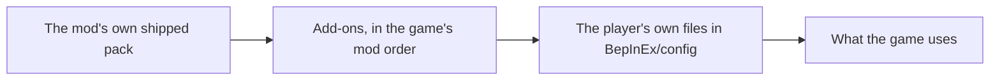

# Publishing a Phobos add-on

An add-on is your own changes to the Phobos mods, packed as an ordinary Ostranauts
mod that other players can subscribe to on Steam Workshop. It is data only: text
files, and no code. If you can [edit the data files](editing-data-files.md) for
yourself, you can publish them.

What an add-on can do today (Phobos Framework 0.92.0):

- Retune anything a local file can: prices, power, work, odds, thresholds.
- Add recipes, outcome tables and crops, under your own id prefix.
- Add new items with your own pictures: stock for Phobos Manufacturing's recipes,
  castings for Phobos Shipbreaker's F6 furnace, and seed, produce and meals for
  Phobos Agriculture.
- Name the things it adds, and translate the Phobos mods into another language.
- Add War Has Been Declared rebuild schematics.
- List new companies and sectors on Phobos Exchange, with story news that moves their price,
  letters that answer the exchange's own events, and a history from before the game that
  shapes their price chart.

## 1. Get it working for yourself first

Write your files in `BepInEx/config/<Mod>/<schema>/` as the
[editing guide](editing-data-files.md) describes, and play with them. Type
`phobosframework addons` in the F3 console to see what was applied and what was
skipped, with the reason.

## 2. Make the add-on folder

Copy [the template](../examples/addons/PhobosAddOnTemplate) and rename it. Two worked
examples sit beside it: [Richer Gangue](../examples/addons/PhobosExampleRicherGangue)
for Phobos Manufacturing, and
[Dockside Extras](../examples/addons/PhobosExampleDocksideExtras) for Phobos
Shipbreaker and Phobos Agriculture, and
[Keelhaul Listing](../examples/addons/PhobosExampleKeelhaulListing) for Phobos Exchange: a
company of your own on the exchange, with a story that moves its share price and a history
from before the game.

```text
MyAddon/
  mod_info.json          the game's own file: name, author, version, notes
  phobos-addon.json      the Phobos manifest (below)
  preview.png            optional: the picture Steam shows
  data/README.md         the game needs a data folder in every mod; keep any small file in it
  phobos/
    PhobosManufacturing/
      outcomes/my-odds.json
      process-recipes/my-recipes.json
    PhobosWarDeclared/
      schematics/my-schematic.json
    translations/
      PhobosManufacturing/en.json
      PhobosManufacturing/fr.json
  images/
    myaddon/SteelNugget.png
    myaddon/SteelNuggetNormal.png
```

Your files go under `phobos/<Mod>/<schema>/`, exactly as they sat under
`BepInEx/config/<Mod>/<schema>/`. The file format is the same.

## 3. Write the manifest

`phobos-addon.json`:

```json
{
  "schemaVersion": 1,
  "id": "my-add-on",
  "name": "My Phobos Add-on",
  "author": "your name",
  "version": "1.0.0",
  "idPrefix": "myaddon",
  "requires": { "PhobosFramework": "0.90.0", "PhobosManufacturing": "0.44.0" }
}
```

| Field | What it is |
| --- | --- |
| `id` | Your add-on's short id: 3 to 48 lower-case letters, digits or hyphens. Two add-ons with one id cannot both load. |
| `name`, `author`, `version` | Shown in the console list. The version reads like `1.0.0`. |
| `idPrefix` | The start of every id you **add**: 3 to 24 letters and digits, starting with a letter. It may not start with `Phobos`, `Itm`, `Sys`, `Stat` or `Is`. |
| `requires` | Each Phobos mod your files are for, and the lowest version they work with. Your files for a mod are skipped, with a message, when the player has an older version. |

## 4. The rules your files follow

- **Tune anything, add under your prefix.** You may change the fields of any shipped
  entry. Anything you add (a recipe, an outcome table, a crop) must have an id that
  starts with your `idPrefix`, so two add-ons never collide and nothing of yours is
  mistaken for ours.
- **Your own events too** (Framework 0.129.0). Some mods name story content after the entry
  it concerns: Phobos Exchange starts the arc `exchange-<company>-bought` when a player first
  buys a company, and the same for `surge`, `slump`, `major-holder` and `sold-out`. Those mods
  register their namespace (`exchange`), and then an id that starts with the namespace, a
  dash and your prefix is yours as well: an add-on with prefix `keelhaul` may add
  `exchange-keelhaul-freight-bought` for its own company `keelhaul-freight`, and never
  another company's. The rule covers every entry you add in any table of any pack (arcs,
  threads, people, news, adverts, small talk). Story flags are not entries, so nothing
  checks them, but give them your prefix (or the namespace and your prefix) all the same.
  Phobos Banking does not register `bank` yet, so an added lender's letters cannot be named
  `bank-<lender>-…` until it does.
- **History entries under your prefix too** (Phobos Exchange 0.3.0). A company's, a sector's
  and the exchange's `history` are tables of entries by id. Give every entry you add your
  prefix, also on a shipped company or the exchange itself (`keelhaul-ceres-route`), so its
  translations are yours and no two add-ons collide. An entry with a move on the exchange's
  own history shapes every company's drawn past, so keep those for events that truly moved
  the whole market.
- **Never rename or remove a shipped entry.** Switch an outcome off with a weight
  of 0 instead.
- **Leave `revision` out of recipes you add.** Framework gives each one a number
  made from its id, the same on every machine, so two add-ons adding recipes to the
  same machine never clash.
- **The checks that apply to our own data apply to yours:** every recipe conserves
  mass, only the game's own gases enter a room, unknown fields are refused, and a
  file is at most 1 MiB.
- **A bad file is skipped, never fatal.** The player sees a notice in the crew log
  and the reason under `phobosframework addons`; your other files still apply.

## 5. Names and translations

Text lives in `phobos/translations/<Mod>/<language>.json`, one flat object of text
by key, named after the language (`en.json`, `fr.json`, `pt-BR.json`).

- **Name what you add.** A recipe you add shows its name from the key
  `Recipe.<your recipe id>`. Put it in `en.json`, so every player has it, and in
  any language you can write:

  ```json
  { "Recipe.myaddon-rich-seam": "Gangue wash, rich seam" }
  ```

  A file may add only keys that carry your `idPrefix` in one of their parts.
- **Translate the Phobos mods.** Copy keys from the mod's own
  `translations/<Mod>/en.json` and translate the values. Keep the numbered
  placeholders such as `{0}` and `{1:F1}`; you may reorder them. The rules are the
  same as for a player's own translation file.
- A player's own file in `BepInEx/config/PhobosTranslations` still has the last
  word. Text has no `priority`.

## 6. New items with your own pictures

Phobos Manufacturing 0.45.0, Phobos Shipbreaker 0.75.0 and Phobos Agriculture 0.48.0
take added items. Put them in the `materials` folder of the mod whose machines will
make or use them, for example `phobos/PhobosManufacturing/materials/`:

```json
{
  "schema": "materials",
  "materials": {
    "MyaddonSteelNugget": {
      "kind": "stock",
      "kg": 2,
      "price": 6,
      "stack": 8,
      "side": 1,
      "category": "IsCategoryMetals",
      "name": "Steel Nugget",
      "description": "Two kilograms of steel, ready for the furnace.",
      "image": "myaddon/SteelNugget"
    }
  }
}
```

| Field | What it is |
| --- | --- |
| the key | The item's id: letters and digits, starting with your `idPrefix`. Keep it for ever; saves name it. |
| `kind` | What sort of item it is. Each mod has its own short list, below. |
| `kg`, `price`, `stack` | One unit's mass, its base price, and how many stack in a cell. |
| `side` | Its size in the world, in tiles (1 for a 16 x 16 picture). |
| `category` | The game's market category: `IsCategoryMetals`, `IsCategoryOre`, `IsCategoryIndustrialProducts` or `IsCategoryTrash`. |
| `name`, `description` | Shown in the game. A translation file may replace them with `Material.<id>` and `Material.<id>_description`. |
| `image` | The picture, as a path under your `images` folder without `.png`. |
| `terminal` | `true` for a leftover no recipe takes. |

- **Pictures.** Draw each item from straight above, 16 pixels for each tile of
  `side`, on a transparent background. The game also wants a normal map beside it,
  named `<picture>Normal.png`; the checker makes a flat one for you:
  `python scripts/validate-data-packs.py --addon MyAddon --write-normals`.
- **Give every item a use.** A recipe makes it and a recipe uses it, or it sells.
  Your recipes name it by its id, like any other item, and the machines admit it.
- **No rubbish without a consumer.** An item in the trash category must say
  `"terminal": true`. That marks it as a remainder, and the RM-1 reaction mass
  feeder grinds it into thrust. A trash item without it is refused.
- **Not sold by merchants.** Added items come from your recipes.

What each mod takes:

| Mod | `kind` | What makes or uses it |
| --- | --- | --- |
| Phobos Manufacturing | `stock` for an ordinary solid, `mined` for something that behaves like ore | Any recipe of its machines, as feed or as product. |
| Phobos Shipbreaker | `stock` only | A product of an F6 furnace recipe you add. The furnace still melts the game's aluminium or steel scrap, twenty at a time. |
| Phobos Agriculture | `stock` for seed and produce, `food` for something the crew eat, `waste` for a leftover | A crop you add (its seed and its produce), or a Hearth-2 recipe (what it cooks and what comes out). |

**A furnace recipe** goes in `phobos/PhobosShipbreaker/process-recipes/`. Copy the
`thermal` figures of a shipped recipe for the same metal, keep the charge at twenty
1 kg scraps, and make the products weigh 20 kg in all. Name it for the furnace's
panel with a `Recipe.<your recipe id>` line in
`phobos/translations/PhobosShipbreaker/en.json`.

**Food** needs one more entry, in `phobos/PhobosAgriculture/crops/`, saying what
eating one gives (each from 1 to 20). Leave `text` out: the item is named in your
materials file.

```json
{
  "schema": "crops",
  "items": {
    "MyaddonStew": { "hunger": 2, "satiety": 2 }
  }
}
```

**A crop** you add names its seed in `stock` and its harvest in `produce`. Both may
be items you add, and both need an entry under `items` as above (an empty one,
`{}`, for an item nobody eats). Growth pictures are still borrowed from a shipped
crop through `art`. The Hearth-2 holds one recipe for each item it cooks, so cook
something the shipped recipes do not.

The Dockside Extras example does the furnace recipe and the meal.

## 7. The order files apply in



A later file's values replace an earlier one's, so by default a player's own file
has the last word over any add-on.

Any file may carry a `priority` at the top, a whole number from -100 to 100
(0 when left out). Files apply lowest first, whatever folder they come from:

```json
{ "priority": 10, "tables": { "gangue-wash": { "outcomes": { "gangue-wash": 20 } } } }
```

Use it sparingly: a fix that must win over other add-ons, or over a player's old
local tweak, raises its priority. A player who wants the last word back raises
theirs higher.

## 8. Check it

With Python installed and a copy of the Phobos repository:

```text
python scripts/validate-data-packs.py --addon path/to/MyAddon
```

It applies your files over the shipped packs and reports the first problem. The
game's own loader has the final say, so then test in the game:

1. Put your folder in `Ostranauts_Data/Mods`.
2. Enable it in the MODS screen, below the Phobos mods, and restart.
3. Type `phobosframework addons` in the F3 console. Your add-on should be listed
   and none of its files skipped.

For editor help while you write, point your editor at the schema files in the
repository's [schemas folder](../schemas), including `addon.schema.json` for the
manifest.

## 9. Publish it

The game uploads a mod folder itself.

1. Close the game. In `Ostranauts_Data/Mods/loading_order.json`, add `|edit` to the
   end of your folder's entry, for example `"MyAddon|edit"`.
2. Start the game and open the MODS screen. Your add-on's row has an **UPLOAD**
   button. It sends the whole folder, taking the title from `strName` and the
   description from `strNotes` in `mod_info.json`, and `preview.png` as the picture.
3. On your new item's Steam page, set the visibility, and add **Phobos Framework**
   and each Phobos mod you change as **Required Items**, so subscribers get them.
4. To update, change your files, raise the versions in `mod_info.json` and
   `phobos-addon.json`, and press UPLOAD again.

We have read how this button works in the game's code but have not published with
it ourselves; if it behaves differently for you, please
[tell us](../SUPPORT.md).

## What it does to saved games

- **Retuned numbers** apply to work started after the change. A charge already
  bound keeps the recipe and result it saved.
- **A recipe you add** is saved by its derived number. If a player removes your
  add-on with a charge of that recipe in progress, the charge waits, unfinished,
  until the add-on returns or the player cancels it; nothing is lost.
- **An item you add** exists only while your add-on is enabled. If a player saves
  with your items aboard and then removes the add-on, the game finds items it has
  no definition for; what it does with them is the game's own behaviour, which we
  have not tested. Say so on your Workshop page.
- **Renaming an id** after publishing breaks saves that use it. Add a new id and
  keep the old one.

## Whose it is

Your add-on is your own work, under whatever terms you choose. The Phobos mods stay
under [their own licence](../LICENSE). An add-on carries only your files: do not
re-upload the Phobos plugins, artwork or shipped packs inside it. A credit such as
"An add-on for Phobos Ostranauts by Phobos A. D'thorga" is welcome and not required.
