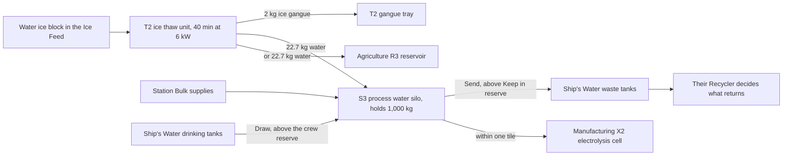

# Process water silo and ice thaw unit

Shipbreaker 0.37.0 with Framework 0.39.0 (Agriculture 0.18.0 shares the same
water vessels). Implemented and checked offline; owner gameplay checks are
pending, including how the machines' artwork looks in play. Use the
[current dependency requirements](installing-mods.md).

## Equipment

| Item | Size and mass | Base price | Where |
| --- | --- | --- | --- |
| Phobos' Rivetline S3 Process Water Silo | 3 x 3 tiles; 240 kg empty; holds 1,000 kg of water (1,240 kg full) | 4,800 cr, broken 1,200 cr | K-Leg supply kiosk and fixer, San Diego Halvorson, the Venus scrap kiosk and regional markets, in lots of eight; INSTALL > APPS. Purchase only: no fabrication recipe. |
| Phobos' Rivetline S4 Process Water Silo | 4 x 4 tiles; 365 kg empty; holds 1,960 kg of water | 6,780 cr, broken 1,695 cr | The same sellers; INSTALL > APPS. Purchase only; too big to turn up in salvage. |
| Phobos' Rivetline S5 Process Water Silo | 5 x 5 tiles; 465 kg empty; holds 3,330 kg of water | 8,860 cr, broken 2,215 cr | The same sellers; INSTALL > APPS. Purchase only; too big to turn up in salvage. |
| Phobos' Rivetline T2 Ice Thaw Unit | 2 x 2 tiles; 120 kg; one native power point | 3,200 cr, broken 800 cr | The same sellers; INSTALL > APPS. Purchase only: no fabrication recipe. |

The S4 and S5 work exactly like the S3 and hold more water for less per
kilogram of capacity. Everything below applies to every size. The silo stores **process water** only. It is not a drinking-water tank and
never joins Ship's Water's potable tanks. The water is a saved record on the
silo, not a native stat, so the station's fuel kiosk and the reactor never read
it as fuel. A full silo weighs what it holds: the ship's mass readouts include it.

## Set up

1. Install the S3 on intact floor. It needs no electricity and has no inventory.
2. Install the T2 within one tile of the silo: touching or with one tile between
   them, on any side; diagonal placement counts. Connect its power point.
3. Right-click the T2, choose **Control Panel**, then **Deliver water to** and
   pick the silo (or an Agriculture R3 reservoir within one tile). Apply. The C1
   console offers the same choice. Pause the T2 before changing the link.
4. Right-click the T2 and choose **Inventory**. The gangue tray opens, and the
   **Ice Feed** opens as its own window. Put one block of water ice in at a
   time (right-click a stack to place one); the feed holds two. Methane ice,
   gangue and stacked blocks are refused with the reason.
5. Choose **Start / resume thawing**. The unit waits for ice, then thaws each
   block for 40 minutes at 6 kW: 22.7 kg of water goes into the linked vessel
   and 2 kg of ice gangue drops into the tray, which holds two. Empty the tray
   by hand or with a crew output store.

Nothing warms until the linked vessel can take a whole block's water. If the
vessel is full, damaged, locked, protected or too far away, the T2 says why and
keeps checking every few seconds; the queue stays armed.

Right-click **Load feed by crew (on/off)** keeps the ice feed loaded from
anywhere aboard, through time-skips and reloads, until you switch it off; the
same order appears under [crew standing orders](crew-automation.md), where you
can pin an input store and an output store for the gangue. A
[material bin](shipbreaker-material-bins.md) makes a good store for both.

## Where to find water ice

Water ice comes from mining. Since Shipbreaker 0.44.0:

- **Ice asteroids.** The game has its own ice asteroids (ice walls over ice
  floors with a stony rim) but never places them. Shipbreaker lets them appear
  in C- and S-class asteroid fields, about one asteroid in twenty. Break an ice
  wall for water ice, sometimes methane ice, and ice gangue. Only asteroids
  generated for a new game are affected; a save keeps the asteroids it already
  has.
- **Dark (C-class) deposits.** Mining a C-class ore deposit gives water ice about
  one pull in seven, in place of some silicates. This works in existing saves
  too.

Both are settings (`Mining/SpawnIceFields` and `Mining/ExtraDepositIce` in the
Shipbreaker configuration), on by default. Switching one off restores the game's
own odds for new rolls.

## Fill and use the silo

Water reaches the silo three ways and leaves it by the links you choose. Ice
gives water and a little gangue; nothing else is made or lost on the way.

- **At a station:** open the refuelling terminal, then **Bulk supplies**, then
  **Process water (Rivetline S-series silos)**. Water costs 10 cr/kg in 10 kg
  steps; one quote can fill any empty silo. The usual quote, destination and payment checks apply
  (see [R3 agricultural water](agriculture-bulk-storage.md#station-purchasing)).
- **From Ship's Water (optional, 0.16.1 only):** the silo's panel and the C1 offer
  **Draw from the drinking-water tanks** (50, 100, 250 or 500 kg) and **Send to
  the waste tanks**. Drawing leaves the crew reserve in the tanks (setting
  `Silo/CrewWaterReserveKg`, default 50 kg). Sending fills installed waste tanks
  up to the capacity Ship's Water itself configures for them; its Recycler then
  decides what returns as drinking water, with its own loss. Nothing is ever
  put into the potable tanks.
- **Keep in reserve** (none, a tenth, a quarter, half or all of the silo):
  water below the reserve is never sent
  to the waste tanks; a T2 still fills above it.
- **Consumers:** a linked Agriculture R3 reservoir takes thaw water for
  irrigation. With [Phobos Manufacturing](manufacturing-player-guide.md), an X2
  electrolysis cell within one tile draws its water from the silo, and a V4
  refinery within one tile delivers the water from its ore charges into it;
  pick the silo on that machine's panel. Filter regeneration and other process
  fluids are recorded as later work in
  [asteroid resources for life support](development/asteroid-life-support-research.md)
  and [chemical storage](development/chemical-storage-and-process-fluids.md).

## Damage, records and recovery

Damage traps the silo's water in a catch chamber. Repair, then choose
**Recover trapped water** from the panel or the C1. A silo whose saved records
cannot be checked (a mass that no longer matches them, or an interrupted
transfer) is protected: choose **Accept contents as they are** to trust the
readable records, or repair if they are unreadable. Uninstalling carries the
water with the loose silo, which then weighs 240 kg plus its contents. A silo
holding water refuses **Dismantle** when the work is offered, and a protected
silo refuses uninstalling too; send the water away or accept the records first.
A silo destroyed with water inside loses that water; the log records it.

The T2 keeps each block's progress on the block itself. Reload pauses the
unit; Start, the C1 or a crew loading order resumes it. Cancel leaves the ice
in the feed and forgets its progress.

## Heat and power

The T2 draws 0.1 kW idle and 6 kW while thawing. About 0.9 kW of that warms the
room's air (the same rule as the R4: at least 10 kPa of atmosphere and a room
that stays below 40 C this step); the rest goes into the ice. When the room
cannot take the heat, no power is drawn and the block waits, then continues by
itself. Vacuum is not free cooling.

## Limits

Water is the only Shipbreaker silo commodity. Bulk gases live in
[Phobos Manufacturing's gas stores](manufacturing-player-guide.md#gas-stores),
which also come in three sizes. No custom gas species are created, and nothing
is vented. Methane ice has no recipe until something
consumes methane. Ship's Water support is pinned to version 0.16.1; other
versions get no draw or deposit and the silo still works through station
purchase and the T2.

## Research credit

The thaw unit's energy budget uses 525 kJ per kilogram of ice. The enthalpy of
fusion of water, 6.01 kJ/mol (333.6 kJ/kg), is from the
[NIST Chemistry WebBook, water phase change data](https://webbook.nist.gov/cgi/cbook.cgi?ID=C7732185&Mask=4)
(National Institute of Standards and Technology). The allowance above that for
warming a block from cold storage, the 40-minute cycle, the 15% room-heat share
and the 2 kg gangue remainder are authored gameplay choices, not measured
properties of the game's ice. No institutional endorsement is implied.
