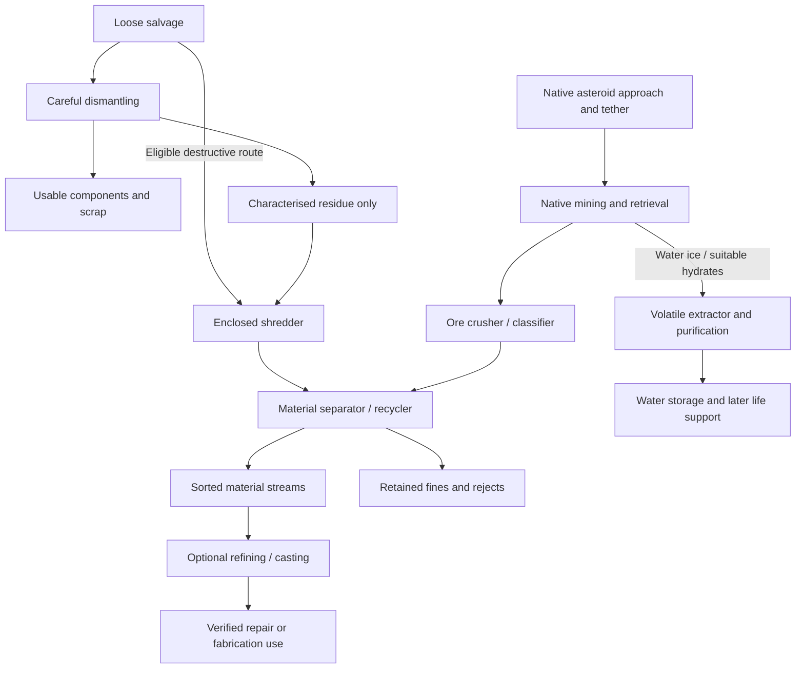

# Shipbreaker expansion: shredding, recycling and asteroid feedstocks

Research date: **2026-09-24**. This is a design and source review, not newly
implemented machinery or an in-game compatibility result. It incorporates the
owner's asteroid/tethering clarification and subsequent request for mineral
sources that replenish life support. See the companion
[asteroid resources and endurance plan](asteroid-life-support-research.md).

## Recommendation

Keep careful dismantling as the preferred route for usable components. Add a
destructive shredder only for material that benefits from size reduction, followed
by a material separator/recycler. Ore should enter through the game's existing
asteroid mining activities, with a crusher suited to rock rather than assuming
the scrap shredder accepts everything. These branches can share inventory,
transport, batch accounting and selected downstream equipment.

For the endurance branch, **native water ice to purified water is a better first
target than an all-purpose ore refinery**. Meteoric iron remains the first metal
candidate. Neither needs a new mining system or autonomous tethering before
onboard processing can be useful.

Edges describe proposed compatible recipes, not universal item acceptance. Useful
scrap already produced by Shipbreaker does not need to be shredded again.

## Inventory snapshot from the original research

The inventory and versions below are **historical observations from this research
pass**, not today's installation status. Current prepared Framework/Shipbreaker
0.6.0 include direct intake and one paired residue route; the
[player guide](player-guide.md) describes that implemented scope. The
[residue contract](residue-material-contract.md) now selects a future characterised
feed and one combined reclaimer, preserving existing unclassified packets.

The fresh inventory found **33 known native packages: 29 configured enabled and
4 disabled**. OCF and Salvage Workshop are both 0.8.71; Common Sense Salvage and
Storage is 0.12.14; Cargo Manifest 0.12.10; Ship's Water 0.16.1; Testudo Safe Pump
0.3.3. These are installed/configured observations, not new gameplay tests.
Native enablement and plugin loading are different: the startup log lists 24
plugins, while the saved native load order marks the three Phobos prototypes and
Auto Navigate disabled. Nothing was toggled during this review.

The installed Shipbreaker package is 0.1.4. The repository's **Framework and
Shipbreaker 0.2.0 candidate** removes our OCF/SWB requirement and is separately
prepared for owner testing. It does not implement conveyors, ore processing or
new shredders. Refer to [the current framework status](phobos-framework.md), not
the dependency assumptions in older research.

| Existing system | Reuse or extension decision |
| --- | --- |
| Shipbreaker panel processing | Reuse its progress, interruption, saved-job and staged delivery lessons. The current recipe returns 11 kg useful material plus 13 kg residue from one 24 kg wall. |
| Phobos Framework | Use current construction registration, native definition publication and inventory/delivery helpers. Extract further common processing behaviour when a second real machine needs it. |
| Native mining tools/deposits | Retain extraction and acquisition. No new autonomous miner or mandatory Auto Nav integration for onboard recipes. |
| Salvage Workshop 0.8.71 | Keep its optional existing broken-electronics/machinery recovery routes; do not duplicate its component lottery or make it required again. |
| Common Sense hauling + Cargo Manifest | Existing hauling and cargo visibility remain useful. Their presence does not establish a public conveyor API. |
| Ship's Water 0.16.1 | Existing water tanks, plumbing and wastewater reclamation are worth an optional product-water adapter. Raw mineral condensate is not automatically potable. |
| Testudo Safe Pump 0.3.3 | Investigate a narrow clean-gas/container handoff when oxygen production is developed; no public adapter contract verified here. |

The installed metadata, selected definitions and recipe review found no dedicated
solids shredder/ore refinery to adopt. This is a bounded local finding, not a claim
that no such Workshop project exists. Preserve attribution and verified licences
if an implementation is later adapted. No third-party code was copied this round.

## Native asteroid acquisition and feedstock

The developer's [Fire in the Hold announcement](https://store.steampowered.com/news/app/1022980/view/493848518157403055)
introduces asteroid mining near Ceres, mining-related trade/standing uses, mooring
and tethering, and asteroid-analysis navigation modules. Local definitions include
the Gott mining tool, Halvorson mining laser, deposit extraction interactions and
the Dyonn Ultra High Resolution Tomographer overlay (`ItmNavModDuhrt`).

Use the owner's **tethered asteroid mining** route as our acquisition baseline.
Exact tether distance/speed conditions and navigation callbacks were not newly
verified here; do not invent them or advertise automatic tethering. Extraction
stays a native activity, followed by retrieval of actual loose objects. Once
onboard, stored ore can be processed after untethering. It would make little sense
to impose an asteroid-proximity condition on an already loaded batch.

`ACTMineDeposit`, the drill-specific interactions and `CTACTMineDepositM` connect
native mining to mineral loot. Separate S/C/M mineral tables exist. They establish
different candidate outputs, **not ore assays or a conservative geological mass
model**. Do not use their probability weights as elemental percentages.

Fixed starting masses from native `condowners_mining.json`:

| Object ID | Feedstock | kg per object | Research treatment |
| --- | --- | ---: | --- |
| `ItmMineralStone01` | Loose regolith | 20 | Characterisation/tailings candidate; not a bag of pure useful elements. |
| `ItmMineral01` | Meteoric iron ore | 20 | Native description identifies iron-nickel material and oxide. First metal candidate, not ready-made steel. |
| `ItmMineral02` | Olivine ore | 10 | Bound silicate minerals; later chemical processing. |
| `ItmMineral03` | Carbon/carbides ore | 10 | Carbon-bearing chemistry feed, not finished carbon fibre or food. |
| `ItmMineral04` | Silicates ore | 10 | Later mineral/oxygen route; composition unspecified. |
| `ItmMineral05`–`ItmMineral10` | Platinum, iridium, palladium, cobalt, gold, wolfram ores | 10 each | Preserve existing trade value; no initial precious-metal refinery. Names do not specify purity. |
| `ItmMineral11` | Hydrates | 10 | Water-bearing candidate with unspecified water fraction. |
| `ItmMineral79` | Void opal | 10 | Exclude from routine processing. No defensible life-support recipe. |
| `ItmIce01` | Water ice | 24.7 | Preferred first replenishment feed. |
| `ItmIce02` | Methane ice | 24.84 | Separate volatile chemistry; never accept as water solely because it has `IsIce`. |
| `ItmMiningTrash` | Gangue | 3 | Retain as unknown waste until a specific recovery route is justified. |
| `ItmIceTrash01` | Ice gangue | 2 | Not assumed pure water; native damage can produce this from either ice type. |

The 50 kg generic `ItmCargoOre01` is a separate cargo item with no assay; exclude
it from initial processing. Its lore also mentions rocky moons. That is not
evidence of a currently usable player mining route there, nor reason to replace
our asteroid baseline with purchased cargo or planetary extraction.

## Machinery and useful boundaries

### Enclosed shredder

Real two-shaft shear shredders use low-speed, high-torque cutters for metals and
mixed materials; output size is not automatically uniform. This supports a
mechanical preparation stage rather than a machine that directly produces pure
commodities. [SSI equipment description](https://www.ssiworld.com/en/product-category/two-shaft-shredders).

Proposed gameplay: deliberately sacrifice eligible unrecoverable assemblies or
characterised residue to make contained mixed shred. Preserve material identity
and mass; retain captured dust. Empty/disconnect equipment before acceptance.
Start with a narrow whitelist, not every object carrying a metal/trash condition.
Intact components, live batteries, fuel/pressure contents and unknown cargo stay
outside the first recipe set. Jam/reversal and cutter maintenance are candidates
only if they add a useful operating choice.

In microgravity, the proposed mechanism needs captive feed rollers, an enclosed
cutting chamber and positive transfer into an output cassette. A terrestrial
gravity hopper or open discharge chute is not a sufficient space design.

### Material recycler / separator

Use “recycler” for staged material recovery: sizing, magnetic separation and
appropriate further sorting. Magnetic recovery and eddy-current separation serve
different streams. Further sensor sorting can distinguish fractions within mixed
non-ferrous material; an eddy-current stage alone does not certify pure aluminium.
[STEINERT magnetic drums](https://steinertglobal.com/sorting-systems/magnetic-separation/magnetic-drums/steinert-mte/),
[aluminium recovery process](https://steinertglobal.com/applications/metal-recycling/aluminium-recycling/).

Combine these stages into one understandable appliance at first. Return sorted
streams plus retained rejects, not random electronics, pristine composites or
missing elements. Adapt material movement for microgravity; Earth equipment is
precedent for the process, not a vacuum-qualified design. A known homogeneous
stream can bypass irrelevant stages. If a standalone shredder only adds a queue
with no meaningful choice, combine shredding and separation into one machine
instead of imposing two mandatory boxes.

### Ore crusher / classifier

Hard-rock crushing prepares ore to a useful size before subsequent treatment.
[Metso's crushing overview](https://www.metso.com/mining/crushing/).
Use distinct jaw/roll tooling and a contained classifier for rock-rich feed.
A ductile metallic piece may instead need shearing: route by characterised feed,
not by the broad word “ore.” A crusher never performs chemical reduction.

For meteoric iron, investigate a metal-bearing concentrate and a real downstream
consumer together. Melting an iron-nickel mixture does not remove nickel or make
specified steel; adding carbon ore is not automatically controlled alloying.
Do not ship purposeless concentrate/ingot clutter while that consumer is missing.

### Later equipment

| Component | Useful role | Condition for proceeding |
| --- | --- | --- |
| Batch identification and weighing | Show accepted feed family, mass and selected recipe. | Integrate into machine controls initially; no mandatory extra analysis bench. |
| Intake/output cassettes and underfloor ports | Move real objects between stages. | Finite storage, reservations, structural route validity and blocked-output handling; see [transport design](underfloor-material-transport.md). |
| Dust/reject cassette | Retain otherwise “lost” mass and stop a full machine. | Integral first; expand only when gameplay warrants another item. |
| Remelter and casting station | Turn an appropriate sorted stream into useful stock. | A consumer, alloy rules, consumables and credible cooling must exist. |
| Volatile extractor, condenser and purifier | Obtain water from eligible asteroid material. | First endurance target, detailed in [the companion plan](asteroid-life-support-research.md). |
| Mineral electrolysis | Later oxygen and metal-bearing products from oxides. | High-temperature chamber, gas capture, electrode/lining maintenance and heat rejection. |

NASA demonstrated oxygen and metal production from molten lunar simulant under
vacuum at about 1,700 C. That supports a later process family; it does not establish
asteroid yields or a compact ship appliance. [NASA experiment](https://www.nasa.gov/centers-and-facilities/kennedy/nasa-kennedy-breathes-life-into-moon-soil-testing/).

## Mass, energy, capacity and shared code

The current 13 kg wall residue has **no saved constituent assay**. Leave existing
jobs and objects unchanged. Before recovering anything from it, publish a
deliberate recipe/composition model, distinguish that assumption from native
evidence, and decide how old residue is handled. Do not silently assign it the
newest richer composition. A versioned new residue definition is preferable to
changing saved meaning. Unknown residue can remain stored while this is resolved.

For every proposed batch:

`feed + consumed reagents = useful products + retained rejects + captured gases/liquids + explicit discharge`

Check constituent budgets as well as gross mass where chemistry is involved.
Lower recovery moves material into residue; it does not erase mass. Account for
rounding, retained fractions and repeated processing without allowing unlimited
rerolls. Snapshot recipe revision and relevant balance settings when work starts.
Do not promise conservation in upstream native mining or optional recipes we do
not own; the [existing material-use audit](shipbreaker-material-uses.md) documents
known mismatches.

Use electricity first. Direct high-temperature reactor coupling remains a
separate interface proposal. Specify energy per batch and a power limit, with
duration following from them. For comparison, the current 30 kW, 60-second panel
recipe consumes 0.5 kWh; this is our balance baseline, not a measured shredder or
furnace requirement. Heat must be stored, transferred or rejected; vacuum does
not provide free convective cooling. [NASA thermal-control reference](https://www.nasa.gov/smallsat-institute/sst-soa/thermal-control/).

**Planning envelope, not final item definitions:** investigate 4 x 4 processing
modules with a service edge, one active feed object up to 25 kg, at most four
waiting objects and a 100 kg feed limit. That accommodates a 24 kg panel, 20 kg
ore or 24.7 kg water-ice object without pretending all have the same geometry.
Check actual inventory fit as well as mass. Consider the existing separate 8 x 8
output-inventory pattern; those are inventory cells, not an 8 x 8 floor footprint.
Thermal attachments and gas/liquid tanks need their own space. Final dimensions,
machine mass and construction bill must be settled before a usable implementation
and remain stable once saved objects exist. Keep electrical conduits separate.

The framework should own reusable registration, eligibility, reservation,
accounting and delivery mechanisms as concrete machines need them. Content mods
own recipes, sprites, physical dimensions and balance. There is currently no
generic chemical process engine, shared heat network or general conveyor network.
One paired processor-to-collector structural-floor route is now implemented.
Build one useful process rather than pre-implementing all of those systems.

## Next work and validation

**Later owner direction, 2026-09-24:** the
[fusion furnace and instrument-panel report](fusion-smelter-research.md) now
develops the downstream melting/casting stage as the intended centrepiece.
It preserves this report's separation of dismantling, sorting, remelting and
ore chemistry. A useful casting consumer, accounted reactor coupling and finite
cooling must accompany the furnace; existing scrap recipes remain usable.

1. Complete the existing Framework/Shipbreaker candidate's owner-run integration
   check when convenient. This research does not require another basic power test.
2. Use the implemented intake and paired collector route; extend shared transport
   only when another concrete machine needs a new endpoint.
3. Implement the [selected residue/reclaimer contract](residue-material-contract.md)
   with a useful consumer before enabling its new feed. Version-aware jobs are
   implemented in Shipbreaker 0.6.1. The [combined reclaimer](scrap-reclaimer.md) and
   its operating budget are implemented in 0.8.0; preserve legacy jobs and residue.
   Owner gameplay evaluation is now the next evidence needed.
4. In parallel design terms, take native water ice through a single useful water
   recovery batch. Confirm a supported storage handoff before implementing it.
5. Add meteoric-iron processing, nitrogen-bearing feed or further refining when
   the relevant shortage and acquisition loop are available for owner testing.

New tests should target accounting, invalid feed, duplicate delivery, full output,
interruption, save/reload and changed recipe/settings semantics. Test acceleration
and power transitions where our new timed or thermal behaviour creates a concrete
risk. UI and F3 commands must delegate to the same services. No changes to the
running game, installed mods, saves or test results were made by this research.

No screenshot is needed to continue design. When the owner naturally reaches
mining, a selected loose mineral's tooltip and the asteroid/tether view would help
confirm handling and acquisition in their playthrough. Do not require a special
expedition solely to prove native mining exists.

## Local evidence and reproducibility

Reused `scripts/inventory-mods.py`, the tolerant JSON reader and
`load_definitions`/`inspect_item` from `scripts/inspect-salvage.py`. Ignored reports:
`.local/research/mod-inventory-industrial-chain.json`,
`.local/research/industrial-feedstocks-discovery.json` and
`.local/research/industrial-feedstocks.json`. The last resolves all 18 selected
feedstock IDs. Its 11 duplicate-name warnings concern unrelated native loot;
static inspection does not simulate overlays or plugin patches.

Primary local sources are native `data/condowners/condowners_mining.json`,
`data/loot/loot_mining.json`, `data/interactions/interactions_mining.json`,
`data/cooverlays/cooverlays_navmods.json` and the generic cargo definition in
`data/condowners/condowners.json`. SHA-256 snapshots:

- Mining objects: `9dbeadc02a07a30cff7b9b3b1a189f59749281573531338b5c38fe1e9d57a203`.
- Mining loot: `3f50a381ea90eb203fbf9ce1c9fbd733aa86c99c9e9c63e0d0529f9b3870bcf8`.
- Mining interactions: `9b6b0dc7f6c2ae65fdf4d1adc3a2fe47bbea56ed5cb74e0d132c3ca5acb8a8e4`.
- Inspected game assembly: `1dc1858a8edc514ec089f2fd7c55932c7f9b62b0a96201c15e2b2720122a03a7`.

The owner's supplied screenshots identify build 1.0.1.4. Hashes identify the local
files inspected this round; no new gameplay version was tested. Raw game/mod
definitions and decompiled material remain outside Git and distributable packages.
