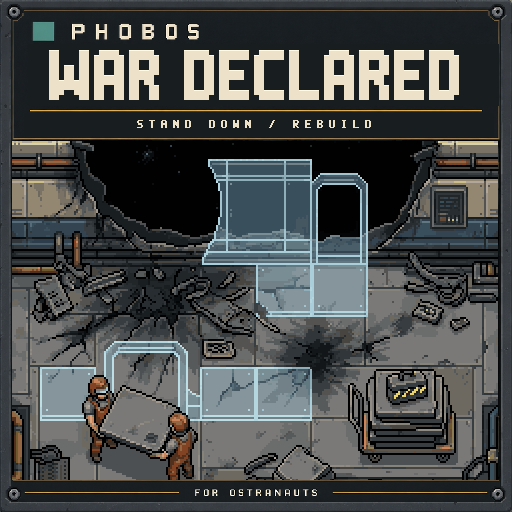
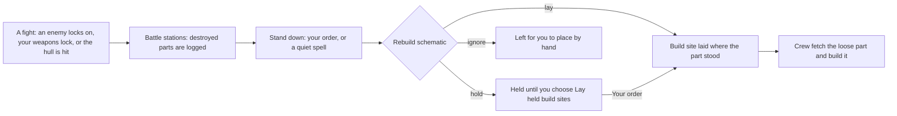
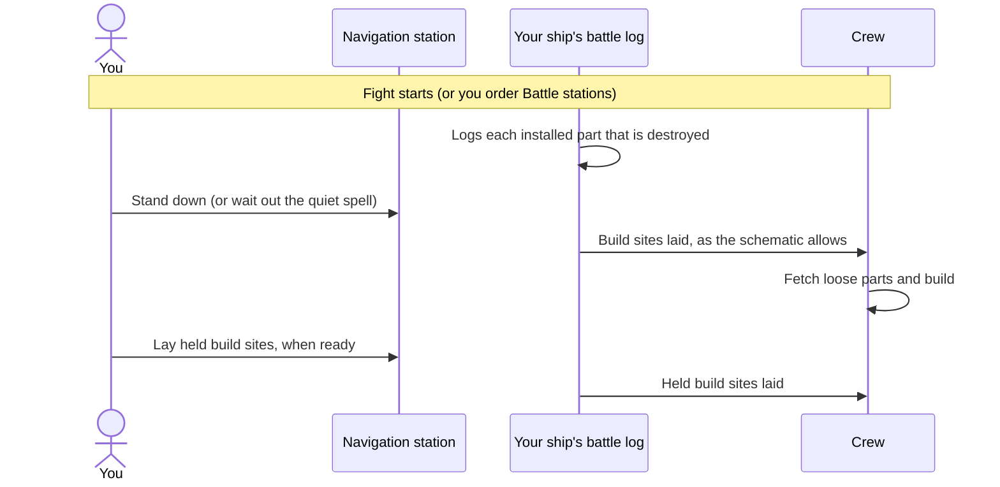
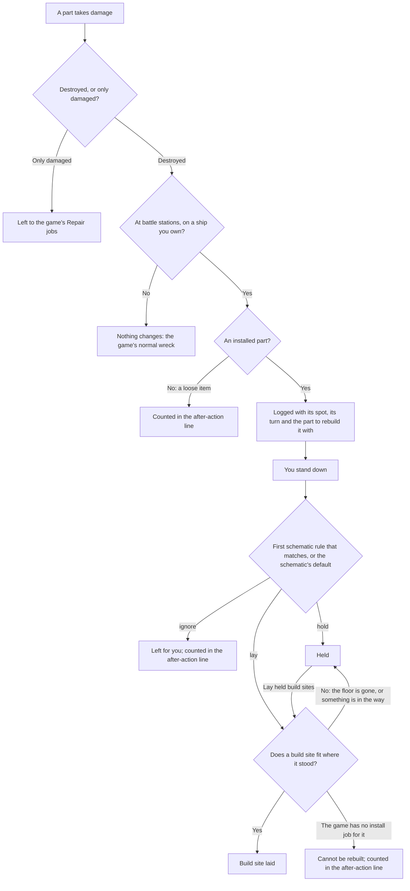
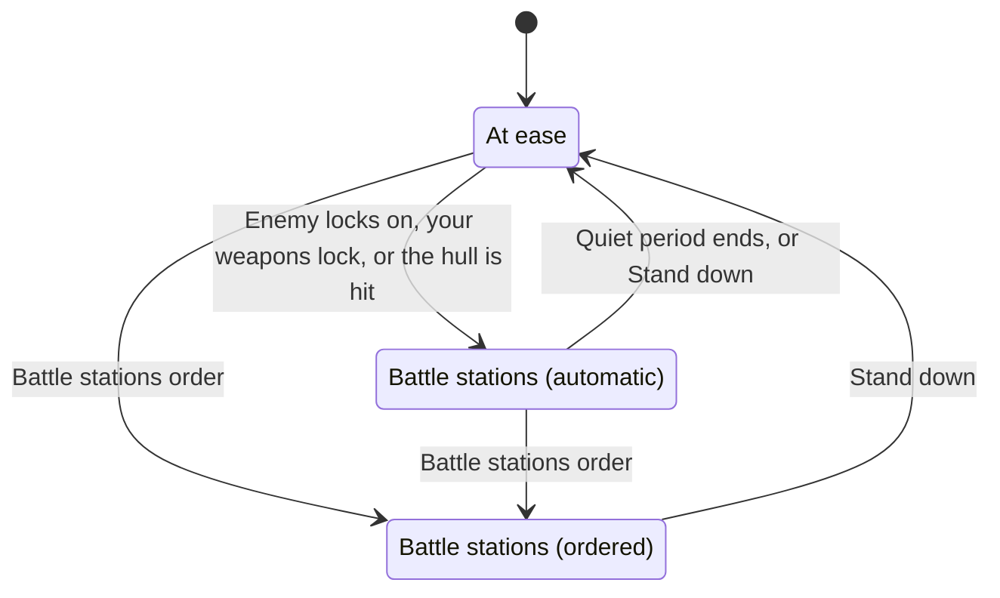
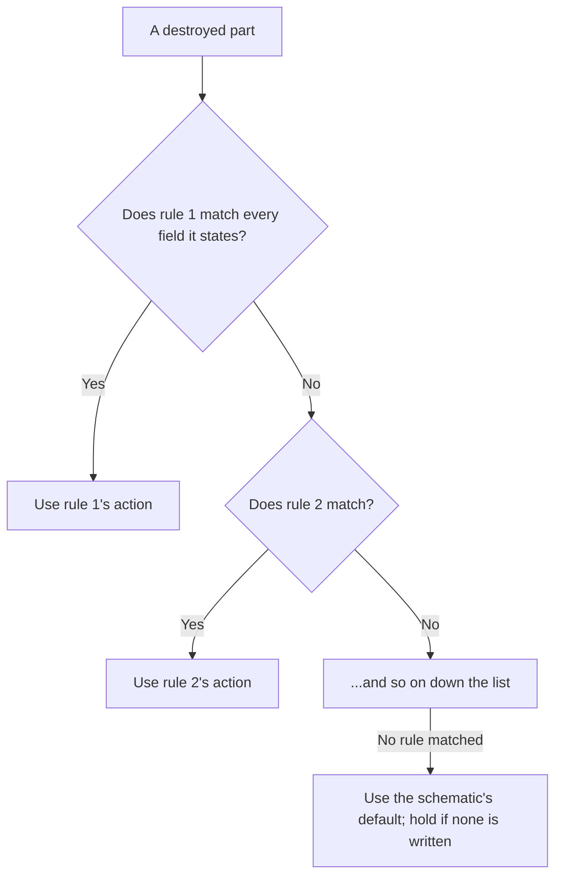

# Phobos' War Has Been Declared: player guide



*Illustration, not a screenshot: the pale-blue outlines stand for the game's own build sites.*

After a fight, stand down and the ship's own build sites go back where your walls,
floors, doors and machines stood. The crew still need real replacement parts and
still do the building; this mod only saves you re-placing every tile by hand.



## In a fight

1. **Battle stations start on their own** when the game has an enemy engaged with
   your ship, your weapons lock on to a target, or your hull takes damage. The crew
   log says so. To start them before the first shot, right-click an intact
   navigation station on a ship you own and choose **Battle stations**; they then
   hold until you stand down.
2. **Take the hits.** Every installed part destroyed on that ship is logged where it
   stood. Parts that are only damaged are left alone: the game's own Repair jobs
   already cover them.
3. **Stand down.** Choose **Stand down** at the navigation station, or wait:
   automatic battle stations end after 5 quiet minutes of game time with no hits and
   no weapons locks.
4. **Build sites appear**, floors first. The crew pick them up through the game's
   usual Construct duty once they have the matching loose part (a loose wall for a
   wall, a door for a door). Stock spares before a fight.
5. **Read the after-action line** in the crew log: build sites laid, parts held,
   parts left for you, parts the game cannot rebuild, and loose items destroyed.
6. **Lay the held ones** when the corridors are clear: right-click the navigation
   station and choose **Lay held build sites**.

Doors, alarms and machines come back in the state a normal install gives them: a
door you lost while shut and locked is rebuilt as the ordinary door the INSTALL tab
places.



## What happens to each destroyed part



## Battle stations at a glance



- **Automatic** battle stations end on their own after the quiet period.
- **Ordered** battle stations hold until you stand down, however quiet it gets.
- After you stand down, a fight the game still lists does not restart battle stations
  until that listing clears. Fresh hull damage does restart them.

## Why some parts are held

A build site carries its part's whole footprint. An unbuilt wall, door or machine
blocks walking exactly as the finished part would, so laying them all at once can
cut off a corridor or shut crew in a room they cannot leave to fetch parts. The
default **Safe** schematic therefore lays only build sites crew can walk through
(floors, conduit and other parts crew walk over) and holds the rest for you.

## Rebuild schematics

A schematic decides, for each destroyed part, whether its build site is laid when
you stand down, held for Lay held, or left for you to place by hand.

| Schematic | What it does |
| --- | --- |
| `safe` (default) | Lays walk-through build sites; holds walls, doors and bulky machinery. |
| `everything` | Lays every build site at once. Corridors may be blocked until the crew finish. |
| `hull-only` | An example: lays floors, holds the rest of the HULL tab, leaves everything else to you. |

What each shipped schematic does with a destroyed part:

| Destroyed part | `safe` | `everything` | `hull-only` |
| --- | --- | --- | --- |
| Floor plate | Laid | Laid | Laid |
| Conduit or another part crew can walk over | Laid | Laid | Left to you |
| Wall | Held | Laid | Held |
| Door | Held | Laid | Held |
| Machine or furniture that blocks walking | Held | Laid | Left to you |
| A part the mod cannot classify | Held | Laid | Left to you |

Choose one in the F3 console with `phoboswar schematic everything`, or set
`Schematic` under `[Rebuild]` in `BepInEx/config/phobosgekko.ostranauts.wardeclared.cfg`.
Switching schematic also changes what happens to parts still waiting to be laid.
**Lay held build sites** always lays every held part, whatever the schematic says.

### Writing your own

Put a `.json` file in `BepInEx/config/PhobosWarDeclared/schematics` (the folder is
created the first time the game runs with the mod). The file name, in lower case,
is the schematic's name: `my-ship.json` is selected with `phoboswar schematic my-ship`.
A file with the same name as a shipped schematic replaces it. After editing, type
`phoboswar reload`; a file with a mistake is skipped and the reason shown.

```json
{
  "title": "Combat engineer",
  "description": "Floors and power first; hold walls; leave furniture to me.",
  "default": "hold",
  "rules": [
    { "note": "Never rebuild the reactor automatically.", "action": "ignore", "parts": [ "ItmFusion*" ] },
    { "action": "lay", "conditions": [ "IsFloor" ] },
    { "action": "lay", "menus": [ "POWR" ], "footprint": "walkable" },
    { "action": "ignore", "menus": [ "FURN" ] }
  ]
}
```

- `default`: what happens to a part no rule matches: `lay`, `hold` or `ignore`
  (optional; `hold` if left out).
- `rules`: checked in order; **the first rule that matches decides**.
- Each rule needs an `action` and may state any of these; every field it states
  must match, and a list matches when any of its entries does:
  - `parts`: part IDs, with `*` as a wildcard (`ItmWall*`). The ID is the part's
    intact, buildable form, as shown by `phoboswar status`.
  - `conditions`: game conditions on the part or on the tiles it covers, such as
    `IsFloor`, `IsWall`, `IsObstruction`, `IsNavStation`.
  - `menus`: INSTALL tabs: `HULL`, `HVAC`, `POWR`, `SENS`, `CTRL`, `FURN`, `APPS`, `MISC`.
  - `footprint`: `walkable` (crew can walk through the build site), `blocks`, or
    `unknown` (the mod could not tell).
  - `note`: your own comment; ignored.
- Misspelt fields are refused rather than silently ignored.



Examples of what a rule can say:

| You want to… | Rule |
| --- | --- |
| Never rebuild one kind of part | `{ "action": "ignore", "parts": [ "ItmFusion*" ] }` |
| Lay every floor | `{ "action": "lay", "conditions": [ "IsFloor" ] }` |
| Hold every wall and door | `{ "action": "hold", "menus": [ "HULL" ], "footprint": "blocks" }` |
| Lay power parts crew can walk over | `{ "action": "lay", "menus": [ "POWR" ], "footprint": "walkable" }` |
| Leave furniture to yourself | `{ "action": "ignore", "menus": [ "FURN" ] }` |

## Orders and console commands

| Where | What it does |
| --- | --- |
| Navigation station, **Battle stations** | Start battle stations now; they hold until you stand down. |
| Navigation station, **Stand down** | End battle stations now and lay build sites as the schematic allows. |
| Navigation station, **Lay held build sites** | Lay every held part now, walls and doors included. |
| `phoboswar status` | Battle state, schematic and the parts waiting or held for the selected crew member's ship. |
| `phoboswar battle` / `phoboswar standdown` / `phoboswar lay` | The same three orders. |
| `phoboswar schematics` | List schematics, the folder for your own and any file problems. |
| `phoboswar schematic <name>` | Choose a schematic (remembered in the settings file). |
| `phoboswar reload` | Re-read schematic files after editing. |

The orders appear only where they would do something: Stand down only at battle
stations, Lay held only when parts are held, and only on an intact station of a
ship you own.

## Settings

In `BepInEx/config/phobosgekko.ostranauts.wardeclared.cfg` (restart the game after editing):

| Setting | Default | Meaning |
| --- | --- | --- |
| `General.Enabled` | true | Log losses and lay build sites. |
| `Battle.QuietPeriodMinutes` | 5 | Game minutes without a hit or weapons lock before automatic battle stations end (1 to 60). |
| `Battle.DamageStartsBattle` | true | Hull damage from any cause (weapons, collisions, a burst canister) starts battle stations. |
| `Rebuild.LayDuringCombat` | false | Lay build sites while the fight is on. Off keeps crew out of open breaches under fire. |
| `Rebuild.Schematic` | safe | The schematic in use. |

## If something looks wrong

| What you see | Likely reason | What to do |
| --- | --- | --- |
| Nothing was laid after the fight | Battle stations are still on, or the schematic held or ignored everything. | Type `phoboswar status`. Choose Stand down if you are still at battle stations; use Lay held build sites for held parts. |
| The held list keeps growing | The schematic holds parts that would block walking. | Lay them with Lay held build sites once the corridors are clear, or pick a schematic that lays them. |
| A build site sits there and nobody builds it | Build sites wait for the crew to fetch the matching loose part and have the Construct duty. | Stock the loose part aboard, and check the crew's duties. |
| A crew member cannot reach a room | An unbuilt wall, door or machine blocks walking. | Cancel that build site the game's usual way, or finish it. `safe` avoids this by holding them. |
| Battle stations start when nothing is shooting at you | Any hull damage counts, including a collision or a burst canister. | Set `Battle.DamageStartsBattle` to false. |
| A part you lost is not in the list | It was a loose item, it was not installed, it was on a ship you do not own, or battle stations were not on when it broke. | Loose items are only counted in the after-action line. |
| The orders say the battle log could not be read | The saved log on that ship could not be read safely, so it is left untouched. | See the BepInEx log. Other ships are not affected. |

## Saves and limits

- Ordinary saves are supported. The battle state and parts not yet laid are saved
  with each ship; build sites already laid are saved by the game itself. If a
  saved log cannot be read safely, it is left untouched and the orders on that ship
  say so; see the BepInEx log.
- Only ships you own, and only installed parts. Loose cargo destroyed in a fight is
  listed, not replaced. The loose-item list covers the current session only.
- A few unique fixtures have no install job in the game and cannot get a build site;
  they are listed. A build site that cannot fit where its part stood (for example
  with the floor beneath it gone) is held and tried again by Lay held.
- The log holds up to 400 parts per ship; further losses are counted and reported.
- Hull damage from any cause starts battle stations while `DamageStartsBattle` is on.
- Offline checks against the game's own definitions pass; in-game testing is still
  pending. The design record is [War Has Been Declared design](development/war-declared-design.md).
