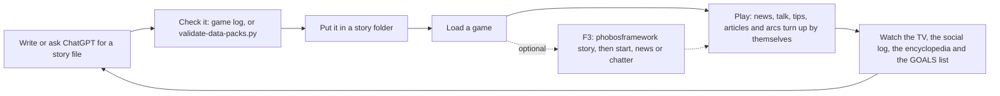

# Writing story content

Phobos Framework lets anyone add to the world's story with a data file:

- **News** that plays on the game's TVs, among the game's own headlines.
- **Adverts** that play in the TVs' commercial breaks.
- **Arcs**: a short chain of goals in the GOALS list, with messages from someone in
  the world, items to bring or install, places to dock, credits to pay or hold, and
  rewards in items or credits. A step can branch: what the player does decides what
  comes next.
- **Small talk** (since Framework 0.108.0): lines people say in the game's own chatter,
  so crews and station folk talk about your news and topics.
- **Loading tips**: lore shown on loading screens among the game's own.
- **Encyclopedia articles**: pages in the game's encyclopedia, under shared sections,
  with an optional picture.
- **Data files** (since Framework 0.110.0): files on a data card, read on any computer
  or PDA like the game's own; opening one can start an arc.

You need no programming. One JSON file holds the lot, and the game checks it as it
loads. This page explains the file, then gives a [prompt for ChatGPT](#writing-with-chatgpt)
that writes one for you. For a complete collection to learn from, see Phobos Spacer
Stories in `mods/PhobosSpacerStories`: nine files covering every kind of entry, packaged
as its own data-only add-on.

**Not available yet:** new kinds of conversation (lines ride on the game's existing
small talk), characters approaching the player, faction reputation rewards, choices
picked from a menu (branches are decided by tests), data files found as loot in the
world (for now they come as arc rewards) and full-screen encounters. Do not write content that needs
them. The [design record](development/story-system-design.md#later-work) says where
each stands.

## How it fits together

Story content needs nothing from you once the file is in place. Every story file is
read each time the game loads its content: the mods' own packs, add-ons and your
files. Change a file during a session and the change applies from the next load.
From then on:

- news and adverts appear on the TVs among the game's own, whenever the player meets
  their requirements;
- people use your small-talk lines in some of the game's own chatter, whenever the
  player meets the line's requirements;
- loading screens sometimes show your tips, and the encyclopedia lists your articles;
- an arc starts by itself: every 30 seconds, each arc whose requirements hold has its
  `chance` of starting (an arc with no chance starts only from the console);
- a goal finishes by itself within 30 seconds of its tests passing.

The F3 console commands in [Checking and testing](#checking-and-testing) are an
optional shortcut for writers who want to see their content at once instead of
waiting for it.



## Where the file goes

| Who you are | Folder |
| --- | --- |
| A player adding your own stories | `BepInEx/config/PhobosFramework/story/` (any name ending `.json`) |
| An add-on author | `phobos/PhobosFramework/story/` inside your add-on; see [publishing an add-on](publishing-an-add-on.md) |
| A Phobos mod | the mod's own `framework/story.json`, registered by the mod |

Files in a mod's own folder (for example `BepInEx/config/PhobosAgriculture/story/`)
work too, and can change that mod's shipped entries. An add-on may add only entries
whose ids start with its id prefix, written in lower case (prefix `Kestrel` gives
`kestrel-first-news`).

Every id is shared by all packs and all tables: if two files use the same id, the
first one loaded keeps it and the other is left out with a message in the log. Pick ids
that say who wrote them.

## The file

```json
{
  "schemaVersion": 1,
  "schema": "story",
  "broadcasts": {
    "kestrel-ice-prices": {
      "region": "Outer System",
      "text": "Water ice prices fell again at the outer stations, where haulers report the best season in years.",
      "weight": 2,
      "mention": "Ice is cheap at the outer stations again. Best season in years, they reckon."
    }
  },
  "adverts": {
    "kestrel-tug-advert": {
      "text": "Kestrel Towing\nStuck? We have been, too. Call Kestrel."
    }
  },
  "chatter": {
    "kestrel-tow-joke": {
      "moment": "joke",
      "line": "How many Kestrel tugs does it take to move a station? Just the one, if you're patient."
    }
  },
  "tips": {
    "kestrel-founding": {
      "text": "Kestrel Towing began with one tug and a debt the size of a moon."
    }
  },
  "articles": {
    "kestrel-towing": {
      "section": "phobos-makers",
      "label": "Kestrel Towing",
      "title": "Kestrel Towing",
      "body": "A towing outfit working the outer stations.\n\nIts tugs are old, slow and very hard to break."
    }
  },
  "arcs": {
    "kestrel-first-job": {
      "title": "Kestrel's first job",
      "chance": 0.05,
      "requires": { "dockedAt": [ "any" ] },
      "steps": [
        {
          "id": "ask",
          "delivery": { "message": { "from": "Kestrel Towing", "text": "Hello, [player-first]. Fancy some easy work?" } },
          "objective": { "title": "Wait for a call from Kestrel", "description": "Kestrel will be in touch within a few hours." },
          "tests": [ { "kind": "wait", "hours": 4 } ]
        }
      ]
    }
  }
}
```

Keep `schemaVersion` and `schema` as shown. Any table may be left out.

### News items (`broadcasts`)

| Field | Needed | What it does |
| --- | --- | --- |
| `region` | yes | Shown above the item as "Region News:". The game's own regions are Shipping & Inner System, Tharsis and Outer System. Up to 40 characters. |
| `text` | yes | The news item, up to 700 characters. The game's own run to about 650. |
| `weight` | no | 1 to 100 (default 1): how often it is picked against other story news. |
| `once` | no | `true` shows it once in a save, then never again. |
| `mention` | no | What people say when they bring the news up in small talk (up to 200 characters), while the news item's requirements hold. |
| `requires` | no | When it may show; see [requirements](#requirements). |
| `title`, `notes` | no | For you; the game never shows them. |

About a third of TV news picks come from story news when any is available; the rest
stay the game's own (this share is a setting, below).

### Adverts (`adverts`)

`text` (up to 400 characters; a line break can separate a heading), and `weight`,
`once`, `requires`, `title` and `notes` as for news.

### Small talk (`chatter`)

The game's characters already chat: they mention headlines, crack jokes, complain
about the authorities. A chatter line rides on one of those moments. When a moment
comes up and one of your lines fits, the game sometimes (40% of the time by default)
says your line instead, after a short lead-in:

| `moment` | The game's own small talk | How your line is introduced |
| --- | --- | --- |
| `headline` | Mention a headline | Sam mentions a headline to Ada: "…" |
| `joke` | A mild or dark joke | Sam tells a joke to Ada: "…" |
| `complaint` | Complain about the authorities | Sam complains to Ada: "…" |
| `story` | Reminisce, share a story | Sam tells Ada a story: "…" |
| `jargon` | Recite technical jargon | Sam recites some jargon to Ada: "…" |
| `superstition` | Warn about a spacer superstition | Sam cautions Ada about a spacer superstition: "…" |
| `worry` | Admit worries | Sam opens up to Ada: "…" |
| `question` | A metaphysics question | Sam asks Ada: "…" |
| `small-talk` | Shoot the breeze | Sam shoots the breeze with Ada: "…" |

| Field | Needed | What it does |
| --- | --- | --- |
| `moment` | yes | One of the moments above. |
| `line` | yes | What the speaker says, up to 200 characters. Write it as speech. |
| `speakers` | no | `anyone` (default); `crew`, only someone aboard one of the player's ships (the player too); or `others`, only someone who is not, such as station folk. |
| `weight` | no | 1 to 100 (default 1): how often it is picked against other lines for the same moment. |
| `requires` | no | When it may be said; checked against the player, as for news. |
| `title`, `notes` | no | For you. |

A news item's `mention` is a `headline` line for anyone, with the news item's weight
and requirements. Lines are heard in the social log when the player is near the
people talking, and in conversations the player takes part in.

### Loading tips (`tips`)

`text` (up to 450 characters), `weight`, and `requires`, which may list only `mods`:
no player exists while the game loads. About a third of tips come from story tips when
any is available (a setting, below). Tips cannot use placeholders.

### Encyclopedia (`sections` and `articles`)

Articles appear in the game's encyclopedia, each under a section. Framework provides
two shared sections, and any pack can add more:

| Section id | Shown as |
| --- | --- |
| `phobos-makers` | Makers and brands |
| `phobos-spacer-life` | Life between stations |

An article has `section` (a section id from any loaded pack), `label` (its name in the
list, up to 40 characters), `title` (up to 60), `body` (up to 4,000; separate
paragraphs with a blank line, `\n\n` in JSON), an optional `image` and `requires`,
which may list only `mods`. A new section has `label`, `title`, and an optional `body`
and `image`. `image` is the path of a picture under a mod's `images` folder, without
`.png`, such as `phobos/agriculture/Counter`; the encyclopedia shows it at its own size,
so a small item sprite stays small. A section shows
only while at least one of its articles does. Articles cannot use placeholders.

### Data files (`files`)

A data file sits on a data card (the game's own Renbao R014 Data Card) and is opened on
any computer or PDA, as the game's own files are. An arc gives one by listing its id in
an outcome's `files`; the player receives a data card holding those files.

| Field | Needed | What it does |
| --- | --- | --- |
| `name` | yes | The file name the computer lists, such as `TRIAL_NOTES.TXT`: letters, digits, dots, hyphens and underscores, up to 32 characters. |
| `text` | yes | What the file says when opened, up to 3,000 characters. Placeholders work here. |
| `startsArc` | no | An arc that starts the first time the file is opened, if it has not started and its requirements hold. |
| `notes` | no | For you. |

An arc can wait for a file with the requirement `filesRead`. If a file's story pack is
removed, the file stays on its card and reads as corrupted.

### Arcs (`arcs`)

| Field | Needed | What it does |
| --- | --- | --- |
| `title` | yes | For you and the F3 list; the player sees each step's goal title instead. |
| `chance` | no | 0 to 1 (default 0): the chance, at each story check (every 30 seconds), that an available arc starts by itself. 0.05 starts it after about ten minutes of play. 0 means it starts only from F3. |
| `requires` | no | When it may start. Once started, it carries on whatever happens. |
| `repeatable` | no | `true` lets it start again after it is finished. |
| `steps` | yes | 1 to 12 steps, done in order. |

Each step:

| Field | Needed | What it does |
| --- | --- | --- |
| `id` | yes | Lower case and hyphens, unique in the arc. It is saved with the player's goal, so do not rename it after people play it. |
| `delivery` | no | What the player is told as the step begins: a `message` (`from` and `text`, shown in the crew log) and/or a `bulletin`, the id of a news item the next TV news shows. |
| `objective` | no | A goal in the GOALS list: `title` (up to 60 characters) and `description` (up to 300). A step without one waits unseen. |
| `tests` | yes | 1 to 4 tests; all must pass to finish the step. |
| `onComplete` | no | A `message`; `items` (up to five kinds, 1 to 20 of each) given to the player, or put at their feet when they cannot carry them; `credits` (up to 50,000) paid to the player with a line in the game's ledger; and `files` (up to five data file ids) on one data card. |
| `next` | no | The step that follows: another step's `id`, or `end`. By default the next step in order, or the end after the last. |
| `branches` | no | Up to four other ways the step can finish; see [branches](#branches). |

Two steps in a row should not have the same goal title: the game does not show a goal
titled like one it showed in the last ten seconds (the story check offers it again).

### Branches

A branch is another way out of a step: its own `tests` (1 to 4), its own `onComplete`
and a `next` step (another step's `id`, or `end`), which every branch must name. At each
story check the step's own tests are tried first; if they do not all pass, the first
branch whose tests all pass decides. The goal closes as completed either way. For
example, a step can pay off a debt with credits, finish early for a crew member with a
skill, or give up after 48 hours:

```json
{ "id": "offer",
  "objective": { "title": "Settle the dock fees" },
  "tests": [ { "kind": "credits", "amount": 500, "consume": true } ],
  "next": "thanks",
  "branches": [
    { "tests": [ { "kind": "condition", "condition": "SkillHacking" } ], "next": "hacked" },
    { "tests": [ { "kind": "wait", "hours": 48 } ], "next": "end" } ] }
```

Steps may also jump back to an earlier step; each check moves an arc at most one step.

### Tests

| `kind` | Fields | Passes when |
| --- | --- | --- |
| `dock-at` | `station` | The player is aboard, or docked at, that station or one of its parts (`VORB` covers `VORB_HAB`). `any` means any station. |
| `have-item` | `item`, `count` (default 1), `consume` | The player carries that many, bags included. With `"consume": true` they are taken when the step finishes. |
| `install` | `item`, `count` (default 1) | That many are on the player's ships nearby (installed, or lying aboard). |
| `wait` | `hours` | That many game hours have passed since the step began (up to 720). |
| `credits` | `amount`, `consume` | The player holds at least that many credits. With `"consume": true` they are paid when the step finishes, with a line in the game's ledger. |
| `condition` | `condition` | The player has that game condition, such as a skill (`SkillHacking`, `SkillEngMechanical`). |

`item` is an item definition id, such as `PhobosVerdemorrowWheatGrain`. To find one,
type `phobosframework story items wheat` in the F3 console: it lists every id whose
name contains the words. Installed machines usually end in `Installed`. A station id is
the one the game uses, such as `OKLG`; type `phobosframework story` in the F3 console
while docked to see the ids where you are.

### Requirements

Every part is optional, and every part given must hold. Tips and the encyclopedia
take only `mods`.

| Field | Holds when |
| --- | --- |
| `mods` | Every mod listed is installed: a Phobos mod by folder name (`PhobosManufacturing`) or any BepInEx plugin id. An entry for a mod that is not installed never shows. |
| `playerConditions` | The player has every game condition listed. |
| `forbidConditions` | The player has none of them. |
| `owns` | Each item listed is on one of the player's ships. |
| `dockedAt` | The player is docked at any one of these stations (`any` for any). |
| `arcsDone` | Each arc listed has been finished. |
| `arcsNotStarted` | No arc listed has ever been started. |
| `filesRead` | Each story data file listed has been opened. |
| `afterDays`, `beforeDays` | Story time is at least `afterDays`, and less than `beforeDays`, game days. Story time starts when the player's story record begins: at the start of a new game, or for a game started before Framework 0.109.0 the first time it is loaded with it. |

### Text

- Plain text only. A line break (`\n` in JSON) is fine; angle brackets are not.
- Square brackets are kept for placeholders: `[player]` (full name), `[player-first]`
  and `[ship]` (the ship the player is aboard). Any other bracketed word is refused.
  Tips and encyclopedia text cannot use them.
- Text is English in the file. A translation can replace it by the key
  `Story.<id>.<field>` in the owning mod's translation file: for news `text`, `region`
  and `mention`; for small talk `line`; for tips `text`; for sections and articles
  `label`, `title` and `body`; for data files `name` and `text`; for arc steps `<arc>.<step>.title`, `.description`,
  `.from`, `.message`, `.doneFrom` and `.done`; for a branch's message
  `<arc>.<step>.b<n>.doneFrom` and `.done`, counting branches from 0.

### Settings

Framework's own file (`mods/PhobosFramework/framework/story.json`) holds the settings;
override them in `BepInEx/config/PhobosFramework/story/`:

| Setting | Shipped | What it does |
| --- | ---: | --- |
| `broadcastShare` | 0.3 | Share of TV news picks given to story news. |
| `advertShare` | 0.3 | Share of advert picks given to story adverts. |
| `chatterShare` | 0.4 | Share of matching small talk that uses a story line when one fits. |
| `tipShare` | 0.3 | Share of loading-screen tips taken from story tips. |
| `checkSeconds` | 30 | Real seconds between story checks. |
| `maxActiveArcs` | 2 | How many arcs may start by themselves at once. |

## Checking and testing

- **Before the game:** with the repository, `python scripts/validate-data-packs.py yourfile.json`
  checks a file that carries the `schema` header. Editors that read JSON Schema can use
  `schemas/story.schema.json` for completion and inline errors.
- **In the game:** a file with a mistake is skipped and the reason goes to
  `BepInEx/LogOutput.log`. An entry naming an item, condition, arc or section the game
  does not have is left out on its own, with a message.
- **F3 console (optional):** nothing here is needed for story content to work. These
  commands only save waiting while you write and test:
  - `phobosframework story` lists the packs, anything left out and why, where you are
    docked, each arc (under way with each test's progress, finished, set aside, or why
    it cannot start yet), and how much small talk, tips and articles are in play.
  - `phobosframework story news <id>` shows a news item on the next TV news.
  - `phobosframework story chatter` lists the small-talk lines each moment can use now;
    `phobosframework story chatter <id>` makes the next small talk of that line's moment
    say it.
  - `phobosframework story start <arc>` starts an arc now, whatever its chance and requirements.
  - `phobosframework story check` runs the story check at once.
  - `phobosframework story reset <arc>` forgets an arc in this game so it can start again.
  - `phobosframework story items <words>` lists the item ids whose names contain the words.
  - `phobosframework story file <id>` gives you a data card with that story file.

## What stays in a save

- The player carries one Phobos record: where each arc is, which once-only news has
  been shown, news waiting for a TV, and when story time began.
- Credits paid or taken by an arc are ordinary credits, with a line in the game's ledger.
- A data file is a Framework data object on an ordinary data card; it keeps its file
  name and the id of its story file, and the record remembers which files were opened.
- Each goal keeps its title, description and the name `PhobosStory.<arc>.<step>`.
- Nothing else. TV news, small talk, tips and articles leave nothing in the save.
- **Removing a story file is safe.** Its goals finish and disappear on the next load,
  its talk, tips and articles simply stop appearing, and its record entries are
  ignored; put the file back and they are picked up again.
- **Dismissing a story goal** in the GOALS list sets that arc aside for good in that game.

## Writing well

**The setting, in our own words.** Ostranauts is set in the Solar System of the
near future; the game's own loading tips give its year. People live and work on
stations and ships from the inner system to the outer moons, and most crews scrape a
living from salvage, hauling and odd jobs, with fuel, air, food and debt never far from
mind. Companies and governments own the stations and the rules. The tone is
blue-collar and lived-in: worn ships, small victories, dry humour. Read the game's own
news, tips and encyclopedia before naming its places, factions or history, and do not
contradict them.

**Our companies** are invented for these mods and can appear in news, adverts, talk
and articles. Use them as companies in the world, never as claims about real firms:

| Company | Makes |
| --- | --- |
| Verdemorrow Agronomics | Grow racks (Firstlight), galley cookers (Hearth), seed (Continuance), nutrients (Groundwork). Hopeful and practical; its line is "Where we go, life grows." |
| Rivetline | Salvage machinery, furnaces, silos, bins and belts |
| Asterel | Navigation and control electronics (the Polaris modules) |
| Fennmark | Refineries, chemical processors and gas stores |
| Tolvane, Lixivar, Oxsmith | Ammonia, leaching and acid, and oxygen from rock |
| Ablatine | Mining lasers |
| Alembrine | Ethanol tanks and spirits |
| Slingwright | The reaction mass feeder |
| Halewright | Medical beds and patient monitors |

**Voice.** Practical, worn-in and occasionally dry, as in the
[player language guide](development/player-language.md). Goals say plainly what to do;
messages and small talk may have character. No forced slang, no gratuitous swearing.

**Do not:**

- name or imitate real people, real companies or real-world politics;
- copy the game's own text, or anyone else's;
- promise something the game does not do (a goal must be possible with the tests above,
  and a news item or line should not describe a mechanic that does not exist, such as
  a crop disease);
- ask for items players cannot get. Check the item reference for where each is bought
  or found;
- shorten a full equipment name: it always starts with `Phobos'` (for example
  Phobos' Verdemorrow Firstlight-4 Cultivation Rack); a short name such as
  "the Firstlight-4" is fine in passing.

## Writing with ChatGPT

Paste the prompt below into ChatGPT, then describe what you want at the end. Check
what comes back with the steps above before you use it.

```text
You write story content for the Ostranauts mod suite "Phobos". Reply with one JSON
file only, no commentary, following these rules exactly.

Format:
{ "schemaVersion": 1, "schema": "story",
  "broadcasts": { "<id>": { "region": "...", "text": "...", "weight": 1, "once": false, "mention": "..." } },
  "adverts":    { "<id>": { "text": "..." } },
  "chatter":    { "<id>": { "moment": "...", "line": "...", "speakers": "anyone" } },
  "tips":       { "<id>": { "text": "..." } },
  "articles":   { "<id>": { "section": "phobos-makers", "label": "...", "title": "...", "body": "..." } },
  "files":      { "<id>": { "name": "FILE_NAME.TXT", "text": "...", "startsArc": "<arc id, optional>" } },
  "arcs":       { "<id>": { "title": "...", "chance": 0.05, "requires": { ... },
                  "steps": [ { "id": "...",
                    "delivery": { "message": { "from": "...", "text": "..." }, "bulletin": "<broadcast id>" },
                    "objective": { "title": "...", "description": "..." },
                    "tests": [ { "kind": "...", ... } ],
                    "onComplete": { "message": { "from": "...", "text": "..." },
                                    "items": [ { "item": "...", "count": 1 } ], "credits": 0, "files": [ "<file id>" ] },
                    "next": "<step id or end>",
                    "branches": [ { "tests": [ ... ], "next": "<step id or end>", "onComplete": { ... } } ] } ] } } }

Rules:
- Ids: lower-case letters and digits joined by single hyphens, starting with MYPREFIX-.
  Step ids likewise, unique within their arc.
- Broadcast region: one of Shipping & Inner System, Tharsis, Outer System (or a short
  topic such as Economics). Broadcast text at most 700 characters; mention at most
  200; advert text at most 400; message text at most 400 and "from" at most 40; goal
  title at most 60 and description at most 300.
- Small talk: moment is one of headline, joke, complaint, story, jargon, superstition,
  worry, question, small-talk. The line is what the speaker says, at most 200
  characters, written as speech. speakers is anyone, crew (aboard the player's ships)
  or others (anyone else).
- Tips: at most 450 characters of lore. Articles: section phobos-makers (companies)
  or phobos-spacer-life (how crews live), label at most 40, title at most 60, body at
  most 4000 with paragraphs separated by \n\n. Tips and articles may require only mods
  and use no placeholders.
- Data files: a file name of letters, digits, dots, hyphens and underscores (at most 32,
  such as LOG_0412.TXT) and text of at most 3000 characters, written as the document
  itself (a log, a memo, a letter). An arc outcome gives them with "files".
- Plain text only: no angle brackets, no square brackets except [player],
  [player-first] and [ship]. Use \n for a line break.
- Tests, all of which must pass to finish a step:
  {"kind":"dock-at","station":"any"} (or a station id I give you);
  {"kind":"have-item","item":"<item id>","count":N,"consume":true or false};
  {"kind":"install","item":"<item id>","count":N};
  {"kind":"wait","hours":H};
  {"kind":"credits","amount":N,"consume":true or false};
  {"kind":"condition","condition":"<game condition, such as SkillHacking>"}.
- A step may name its next step ("next": a step id or "end") and have up to four
  branches, each with its own tests, onComplete and next; the first branch whose
  tests pass decides when the step's own tests do not.
- Requirements (all optional): mods, playerConditions, forbidConditions, owns,
  dockedAt, arcsDone, arcsNotStarted, filesRead, afterDays, beforeDays (game days of
  story time).
- Use only item ids I list below. Rewards: at most five kinds of item, at most 20 of
  each, and at most 50000 credits, modest in value.
- Nothing else is available: no reputation rewards, no menus of choices, no new kinds
  of conversation, no new items or places.
- Setting: Ostranauts, the Solar System of the near future; blue-collar spacers living
  by salvage, hauling and odd jobs. Practical, worn-in voice with occasional dry
  humour. No real people, companies or politics; do not copy the game's text; never
  describe a game mechanic that does not exist.
- Companies you may use: Verdemorrow Agronomics (grow racks, cookers, seed,
  nutrients; "Where we go, life grows."), Rivetline (salvage machinery), Asterel
  (navigation electronics), Fennmark (refineries and gas stores), Halewright
  (medical equipment). Full equipment names start with Phobos', for example
  Phobos' Verdemorrow Firstlight-4 Cultivation Rack.

Item ids you may use: <paste ids from the item reference>
What I want: <describe the news, small talk, tips, articles or arc>
```

Replace `MYPREFIX` with your add-on's prefix (or a word of your own for a personal
file), and paste the item ids you want used, found with `phobosframework story items`
in the F3 console. The [item references](item-references.md) say where each item is
bought or found.
