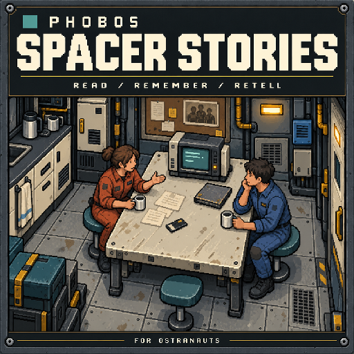

# Phobos Spacer Stories

An original collection of life around Ostranauts' vanilla world and the Phobos
equipment makers: station neighbours, freight work, families, corporate pressure,
company histories, TV news and adverts, small talk and loading lore. Its 22 chains
and 23 archive files have home stations and named correspondents.

All stories live in the JSON files under `phobos/PhobosFramework/story/`. The
collection uses the existing add-on loader; its [manifest](phobos-addon.json)
carries the current Framework minimum.
Entries about other Phobos equipment require the relevant mods individually.
It adds no plugin or equipment definition.

The [authoring record](../../docs/development/spacer-stories-authoring.md) links
every file and explains the story connections, setting evidence, goal actions,
saved records and offline checks. The [vanilla expansion record](../../docs/development/spacer-stories-vanilla-expansion.md)
documents the literary influences and suggestions for fairer gigs. The
[draft changelog](CHANGELOG.md) records the collections; the repository's licence
covers the original Phobos writing, and every package carries a copy as LICENSE.

New local correspondence has no expiry. One optional letter waits for a convenient
journey to Titan. Two once-only fees total 900 credits; no new chain takes money or
goods. Vanilla gigs are unchanged. The normal build remains held at an old fixed
inventory check awaiting Claude's code update; gameplay review is still pending.

It is a first-party, data-only Phobos mod: players subscribe to it separately, and
it changes nothing unless installed. Build it with `scripts/build-spacer-stories.ps1`
and install it with `scripts/install-mods.ps1 -Mods SpacerStories`. It is held from
Workshop publication until the owner has reviewed its appearance and pacing in the
game.

For the supported data-file format and review commands, see
[Writing story content](../../docs/writing-story-content.md). Packaging guidance
is in [Publishing a Phobos add-on](../../docs/publishing-an-add-on.md).
